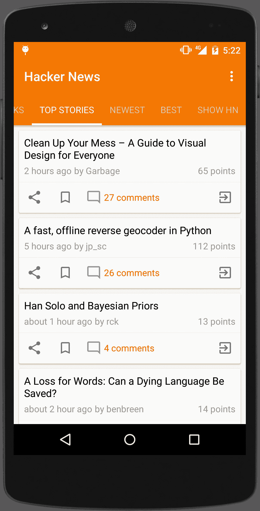
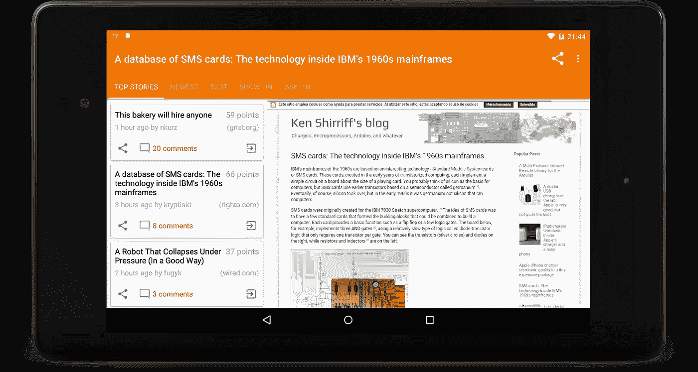
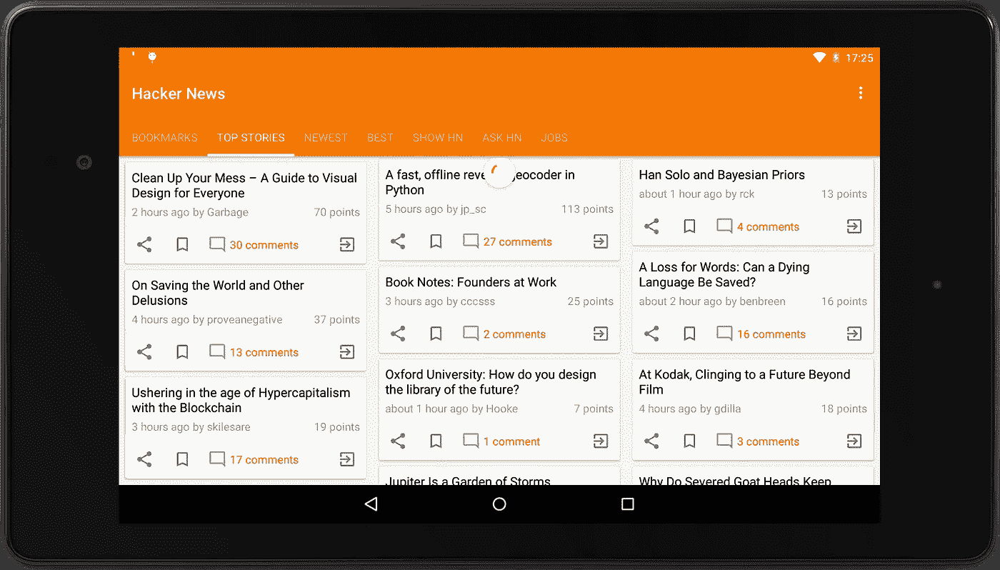
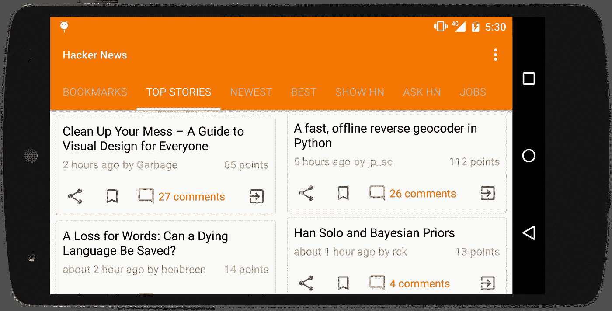
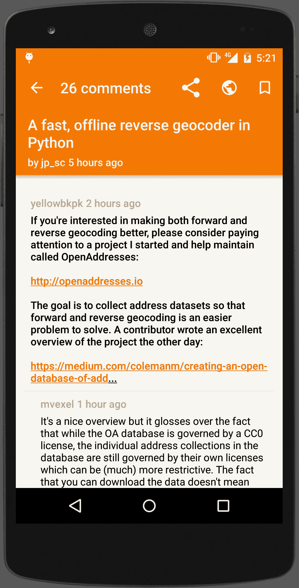

# Yahnac 简介:RxJava 与 Firebase 和内容提供商的相遇

> 原文：<https://medium.com/google-developer-experts/introducing-yahnac-where-rxjava-meets-firebase-and-content-providers-49c424f51487?source=collection_archive---------0----------------------->

你可能会问什么？又一个[黑客新闻](https://news.ycombinator.com/)客户端，因为那里永远没有足够的黑客新闻客户端！

对于那些不知道的人来说，[黑客新闻](https://news.ycombinator.com/)是一个专注于计算机科学和创业的社会新闻网站，由创业孵化器 [Y Combinator](https://www.ycombinator.com/) 运营。一般来说，可以提交的内容被定义为“满足一个人的求知欲的任何东西”。

不久前，Y Combinator [发布了期待已久的黑客新闻](http://blog.ycombinator.com/hacker-news-api)API。虽然它非常基本和简单，但对我来说最令人兴奋的消息是该 API 是使用 [Firebase](https://www.firebase.com/) 构建的。

功能方面， **Yahnac 允许你阅读从头条到乔布斯**的所有黑客新闻内容。最重要的是，**你可以添加书签**，并且想保留多久就保留多久。

如果你有兴趣知道 Yahnac 是如何建造的，请继续读下去！

# 坦白一件事

医生，我必须坦白。我喜欢[加载者](http://developer.android.com/guide/components/loaders.html)、[内容提供者](http://developer.android.com/guide/topics/providers/content-providers.html)和他们的样板文件。争论它们是否是所有事情的最佳解决方案是没有意义的，它们不是。

几个月前，RxJava 开始在 Novoda 中流行起来。像[数字音乐厅](https://play.google.com/store/apps/details?id=com.novoda.dch)和[太阳](https://play.google.com/store/apps/details?id=uk.co.thesun.mobile)这样的应用都是用反应式方法开发的，结果是惊人的。

此外，我很幸运在办公室里有像本杰明·奥古斯丁、T2、沃克·莱克和 T4 这样的人，他们坚信反应式编程的好处以及它在 Android 上的应用。

遵循这些原则，我开始了一段旅程，将所有这些特定于框架的解决方案与 Rx 和 Firebase 包装在一起，这是一种非常不同于传统 Rest APIs 的方法。

# 体系结构

原理非常简单，如何从网络中检索数据并不重要，因为我真正关心的是以一种有意义的方式将数据存储到数据库中，并尽可能快地显示出来。这些截然不同的职责可以由网络层的 Rx、[数据库层的 SQlite](https://www.sqlite.org/) 和 UI 层的 Loaders 来处理。

将所有网络和数据操作与 Firebase 一起利用到 Rx 上是非常有意义的。Firebase 数据是通过将异步监听器附加到 Firebase 引用来检索的[。侦听器将为数据的初始状态触发一次，并在数据发生变化时再次触发。](https://www.firebase.com/docs/android/guide/retrieving-data.html)

基于 API 的当前实现，需要检索到 501 个 Firebase 实例，以便显示一个列表 [500 个热门故事](https://github.com/HackerNews/API#new-and-top-stories)。一个调用将检索 Top Stories 页面中所有条目的 id，然后需要对每个 id 再调用一次，并从 news 条目中检索数据。

Rx 似乎是解决这一切的完美候选，它的反应式方法允许无缝地处理所有递归调用和线程。它还允许操作该数据，并提供数据库层所需的输出。这样的输出将是 [ContentValues](http://developer.android.com/reference/android/content/ContentValues.html) ，这是 ContentProvider 所需要的。

在 UI 层，一旦我们使用了 ContentProvider，就很容易决定如何显示内容。 [CursorLoader](http://developer.android.com/reference/android/content/CursorLoader.html) 允许你用想要的数据检索一个[光标](http://developer.android.com/reference/android/database/Cursor.html)，这一切都有意义！

还有一步要走，那就是解决[recycle view](https://developer.android.com/reference/android/support/v7/widget/RecyclerView.html)和 Cursor 的不兼容性，在接下来的帖子中，我将深入探讨实际的实现细节和问题，如果你感兴趣，请继续关注。

# 支持不同的外形规格

我对用户界面以及它在不同外形下的外观有几个疑问。一开始我想用一个[多窗格](http://developer.android.com/design/patterns/multi-pane-layouts.html)，但是用了一段时间后，感觉有些不对劲。

在风景上导航不是很清楚，所以我决定使用交错的网格，就像当年非常流行的 [Etsy](https://codeascraft.com/) 那样。

智能手机也是如此，用户界面将从一栏调整为两栏。

# 我们生活在一个物质世界

如今，没有哪款像样的应用会在没有[材料设计原则](http://www.google.com/design/spec/material-design/introduction.html)的情况下发布，在[谈论过](https://speakerdeck.com/malmstein/what-material-design-means-to-android)和[向](https://speakerdeck.com/malmstein/material-animations)展示过之后，我也不会有所不同。

大多数文章都在网络视图中显示，这并没有为过渡和花哨的动画留下太多空间。该应用程序没有图片，所以美丽的[调色板](https://developer.android.com/reference/android/support/v7/graphics/Palette.html)不能被添加，不是最好的情况是吗？

然而，材质不仅仅是动画和颜色。像**图形**、**间距**和**波纹**这样的几个方面可以很容易地应用，产生很大的不同。

这些天所有材料应用程序显示的另一个特征是**快速返回模式**。这是一个伟大的想法，让用户在滚动的同时享受更多的内容。

# 对，我怎么得到它？

# 接下来还有更多

该应用程序尚未完成，有几个功能，我想补充说，像能够发布新闻或回复评论。你想做贡献吗？请做！GitHub 中提供了[源代码，欢迎所有 pr。](https://github.com/malmstein/yahnac)

*原载于 2015 年 3 月 28 日*[*【www.malmstein.com】*](http://www.malmstein.com/blog/2015/03/28/introducing-yahnac-where-rxjava-meets-content-providers/)*。*