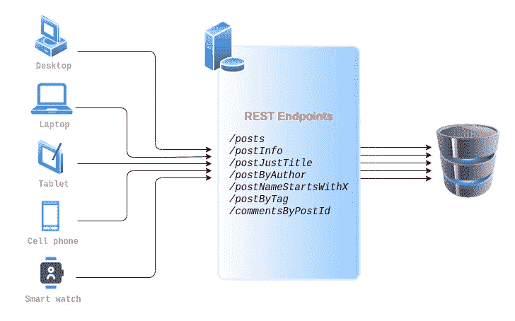
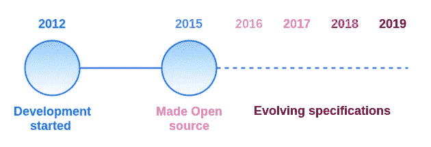
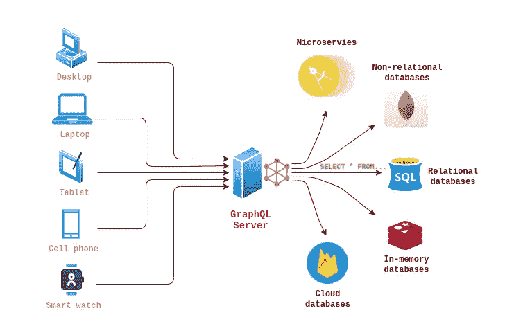
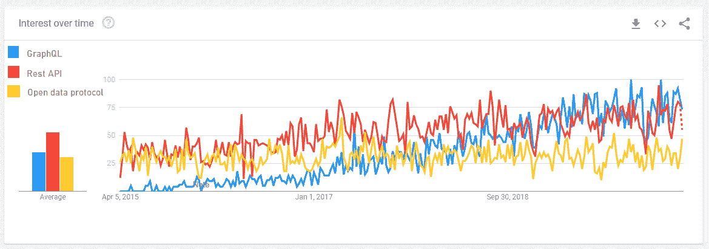
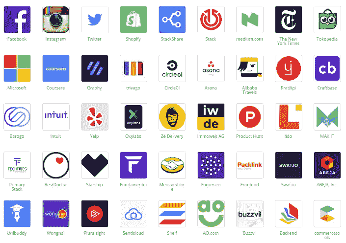

# 简介:GraphQL 概述

> 原文：<https://medium.com/globant/introduction-overview-of-graphql-56ac0285077b?source=collection_archive---------1----------------------->

GraphQL 是一种 API 查询语言，也是一种用现有数据完成这些查询的运行时语言。作为 REST 的替代方案，GraphQL 作为构建 API 的工具正迅速流行起来。本文向您介绍了 GraphQL 概念，如 GraphQL 类型系统和模式，并演示了如何使用 JavaScript 构建连接到数据库的 GraphQL 服务。为了更清楚和理解，我们将探索 GraphQL 的整个旅程分成了 3 篇文章。

**第一篇:** [**简介:GraphQL 概述**](/@sagar.barawade/introduction-overview-of-graphql-56ac0285077b)在这里你会得到什么是 GraphQL 的基本概念，以及为什么你需要尝试一下。

**第二条:** [**GraphQL:查询语言**](/@kaustubh.vyas/graphql-the-query-language-3d1b1807a1d1)在这里，你将能够详细了解并实践 GitHub 接口上被称为 **GraphQLHub** 的 GraphQL 查询机制。

**第三篇:** [**按自己的方式玩:POC on graph QL**](/@rahul.pawar_25862/play-it-your-way-poc-on-graphql-590d2f0e830e)现在，您已经获得了足够多的关于查询语言的信息，是时候开始构建自己的项目了。我们将向您展示如何使用 Javascript 中的 GraphQL 创建一个连接两个数据库的项目，即 **MySQL** 和 **MongoDB** 。

# **现有数据获取系统**

首先，让我们看看现有的基于 RESTful 服务的数据获取系统。下面是一个简单的基于 REST API 的请求和响应流程。这个流程涉及多个 API 调用来获取帖子及其相关的数据和元数据。



Existing data fetching system based on RESTful Services

*   为了获取不同的数据集，我们需要在任何需要的时候设计多个/不同的 API 端点。
*   有时，我们只需要一些特定的字段，但我们最终仍然会获取完整的响应，而不是这些特定的字段，这增加了不必要的网络开销，影响了低带宽用户。
*   如果我们希望能够灵活地选择字段，我们需要制定一种方法来投影我们希望 API 返回的字段。
*   当我们处理多个数据库时，管理它们之间的关系变得很有挑战性，当其中任何一个是非关系数据库时，这就变得有点令人头疼。

这些是我们当前驻留在服务器端的系统所面临的一些挑战，现在让我们看看作为应用程序端的开发人员所面临的挑战。

# **应用数据挑战**

**数据需求因设备而异:** 在当今时代，一个产品有多个客户端是很常见的。所有这些客户端(WebUI、Android、iOS、可穿戴操作系统)可能会使用相同的后端 API。并且所有客户端可能并不都在使用后端响应中返回的所有字段。这导致应用程序的过度抓取、网络开销和速度变慢，进而导致用户体验不佳。

**用户希望即时访问数据:** 在这个快节奏的世界里，用户变得非常不稳定。让我们以亚马逊、Flipkart 等电子商务应用为例。如果用户想要购买一部手机，打开亚马逊应用程序，然后输入搜索文本，当用户输入搜索时，应用程序会显示一个微调按钮，让用户等待，直到在商店中找到匹配的产品。用户可能会有不得不等待相当长时间的沮丧经历。通过这个例子，我们可以理解，即使是一秒钟的延迟也可能给企业带来巨大损失，随着应用程序复杂性的增加，保持与以前相同的用户体验成为一项挑战。

**在没有深入了解分布式系统的情况下构建可扩展的数据驱动型应用:** 当今的应用程序是高度数据驱动的，在前端和后端实现可扩展性并保持相同的用户体验是至关重要的事情，并且由于对分布式系统的理解不清楚，随着时间的推移，管理不断变化的需求变得很困难。

不过不用担心，GraphQL 确实可以用更简单的方式在一定程度上解决这个问题。让我们进一步探讨这个问题。

# **关于 GraphQL**

根据定义，GraphQL 是一种 API 查询语言&运行时语言，用于使用现有数据完成这些查询。GraphQL 为 API 中的数据提供了一个完整且易于理解的描述，让客户能够准确地了解他们的需求，使 API 更容易随时间发展，并支持强大的开发工具。

*   GraphQL 的核心是一种从客户端应用程序查询数据库的语言。
*   另一方面，后端 GraphQL 运行时解析查询并决定如何将数据呈现给客户端。



Evolution of GraphQL

我们来看看 GraphQL 的起源。脸书概念化并发展了 GraphQL。他们最初开发它是作为他们优化计划的一部分，后来，他们在 2015 年将其开源。从那时起，它开始在商业案例场景和市场需求方面发展。GraphQL 很快在科技界引起了关注，并被几家知名公司采用，包括 Github、Yelp、Coursera 和 Shopify，取代了现有的 REST APIs。

**类型系统** GraphQL 有一个类型系统，定义了它使用的各种数据类型。

*   标量(单值)
*   目标
*   接口
*   联合
*   列举
*   列表

标量
这些数据类型有助于定义模式。有了模式和数据类型，GraphQL 就成为了一种强类型语言。

*   线
*   浮动
*   （同 Internationalorganizations）国际组织
*   布尔代数学体系的
*   身份证明
*   自定义标量(日期等)

我们将在下一篇文章**(第 2 篇)**中用例子详细讨论这些带有标量的类型系统

# **GraphQL 架构**

GraphQL 是描述 GraphQL 服务器行为的规范。它是一组关于如何处理请求和响应的指导原则，如支持的协议、服务器可以接受的数据格式、服务器返回的响应格式等。GraphQL 可以与任何数据库或数据层一起工作，允许单个 GraphQL 服务在由组合 API 服务的单个请求中从多个源获取数据。



GraphQL Architecture

在上面的体系结构图中，具有数据需求和规范的各种客户端可以连接到 GraphQL 服务器，当相关数据库需要数据时，服务器将使用所请求的数据进行响应。GraphQL 不仅可以从 **SQL、No-SQL** & **内存 DB** 中获取数据，还拥有连接**微服务** & **云数据库**的能力。这种能力使得 GraphQL 成为一个数据库**中立&友好**的接口。

# **GraphQL 的市场**人气

下面是 GraphQL 的市场人气图表。正如您在图表中看到的，随着时间的推移，开发人员对 GraphQL 的兴趣大大增加了。我们可以从图表中观察到，GraphQL 正在让直接竞争停止。



Google search results for Developer interests over time (Worldwide)

您可以随时在此获得最新图表

# **GraphQL 操作**

GraphQL 支持所有操作，如创建、读取、更新和删除，就像 RESTful APIs 一样，但方式略有不同。相关术语非常容易理解。

让我们以一个销售书籍的电子商务网站为例。我们将看到在电子商务活动的范围内所有的操作是如何工作的。

**1。读取数据:查询** graph QL 中的第一个操作就是读取数据。在 GraphQL 中，我们称之为查询&在 REST 中，它是 **R** 即 Read，( **GET** 操作)
让我们来看一个你正在搜索一本书的场景。查询将是这样的:

```
Query {    
    search(title: ”name”)
        {
           title
           author
        }
}
```

它将获取标题与提供的标题匹配的所有书籍。这是读操作

**2。写数据:突变** graph QL 中的下一个操作是添加数据。在 GraphQL 中，我们称之为**突变**。RESTful APIs 中的其余操作，比如 Create、Update & Delete，在 GraphQL 术语中称为突变。同样，POST/PUT/DELETE 操作只不过是突变。

```
Mutation {
  create(title: ”book”)
     {
        id    
     }
}
```

上面的代码片段将创建一个标题为 **'book'** 的图书的新记录，并在响应中返回新创建记录的 **`id`** 。您也可以非常灵活地返回自定义响应。

**3。监听数据:订阅** 最后一个操作是订阅**。**像查询一样，订阅使您能够获取数据。*与*查询不同，订阅保持与 GraphQL 服务器的活动连接(最常见的是通过 WebSocket)。订阅对于低延迟、实时更新场景非常有用，在这些场景中，前端将定期轮询增量更新。例如，在订阅的帮助下，添加到库存中的图书可以立即在在线平台上购买。

```
Subscription {  
   onCreate   
      { 
         id 
         title  
      }
}
```

# **GraphQL 操作[cntd..】**

既然我们已经在高层看到了 GraphQL 支持的所有操作，那么让我们来理解执行各种操作所需的底层实现。

**定义模式:** 我们要做的第一件事就是定义模式。

```
{
 type Country 
   {  
      id:ID! 
      name:String!  
      code:String!  
   }
}
```

语法以**类型**键开始，然后是模式名。这个模式是 object 类型的，所以它以花括号开始。在这种情况下，我们将添加标量元素及其各自的数据类型。Id 是默认的 GraphQL id，名称是字符串，代码是字符串。标量类型旁边的标记意味着当您查询这个字段时，GraphQL 将向您提供值。该字段不可为空。

**写一个查询:**

```
{
  countries(name:’united’)  
     {    
        name  
     }
}
```

在写查询中，我们需要用所需的细节定义操作，并点击查询。结果会是这样的。尽管还有其他一些事情要做，我们将在用例演示中看到。

得到你想要的东西

```
{
  "data":{ 
    "Countries":[
                 {
                  "name":"United Kingdom"
                 }
                ]
         }
}
```

# **graph QL 的优势**

强类型:graph QL 服务器定义了一个特定的类型系统，查询在这个上下文中执行。GraphQL 需要使用严格类型系统构建的用户定义模式。这个模式充当 API 处理的数据的蓝图，允许开发人员确切地知道什么类型的数据可用以及以什么格式可用。开发人员工具可以通过使用自省、启用文档、查询自动完成和模仿工具来利用该模式。

**精确获取:**由于 GraphQL 查询可以定义查询时到底需要什么数据，所以呈现应用程序视图所需的所有数据都可以在单个请求中请求，从而减少了往返网络请求的数量，并因此减少了应用程序延迟。因此，访问数据的单个端点、一个请求、仅被询问的字段

**API 文档:** GraphQL 提供自动生成的&内置 API 文档，始终与 API 变化保持同步。由于 GraphQL API 与代码紧密耦合，一旦字段、类型或查询发生变化，文档也会随之变化。这直接有利于开发人员，因为他们必须花更少的时间编写 API。

**独立团队:**使用 GraphQL 及其严格类型化的模式，前端和后端团队可以并行和独立地工作。前端团队可以轻松利用 GraphQL 后端生成的模式来创建查询。同时，前端团队可以继续使用 API 的模拟版本。他们也可以用它来测试代码。通过这种方式，GraphQL 可以确保开发人员在不中断开发工作的情况下获得满意的体验。

**快速应用原型:**如果你曾经计划开发一个原型，你会体验到 CRUD 操作是非常耗时的。GraphQL 通过提供一个 API 端点来加速这个过程，这个端点充当 UI 和数据存储之间的数据代理。开发速度与 GraphQL 提供的改进的开发人员体验密切相关。

**版本自由:**API 的版本控制是一个常见的问题，一般来说，通过在前面添加一个 *v2* 来添加相同 API 的新版本，可以很容易地解决这个问题。对于 GraphQL，情况就不同了，文档清楚地说明您应该改进您的 API，这意味着向现有端点添加更多字段不会破坏您的 API。前端仍然可以使用相同的 API 进行查询，并且如果需要的话可以请求新的字段。

# **生产中的 graph QL**

在这里你可以看到，这些都是在其生产环境中支持和使用 GraphQL 的巨头。



Source of Information: [https://stackshare.io/graphql](https://stackshare.io/graphql)

毫无疑问，您可以考虑在与您的项目相关的用例中使用它。这肯定会增加价值。

# 摘要

在本文中，我们学习了 GraphQL，它的架构，它是如何工作的，以及如何使用它。在下一篇文章中，我们将详细介绍 GraphQL 类型系统及其在 [GraphQLHub](http://www.graphqlhub.com/) 上的实际演示。GraphQLHub 是 Github 提供的一个平台，您可以通过在线练习来熟悉 GraphQL 模式和类型系统。

想了解更多关于 GraphQL 查询语言的知识，可以参考下面这篇文章[**《graph QL:查询语言**](/@kaustubh.vyas/graphql-the-query-language-3d1b1807a1d1) **》。**