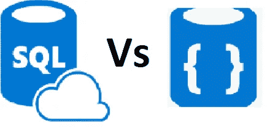
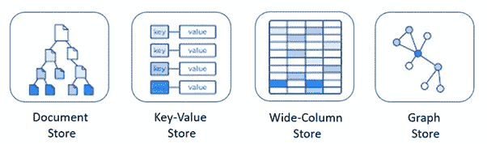
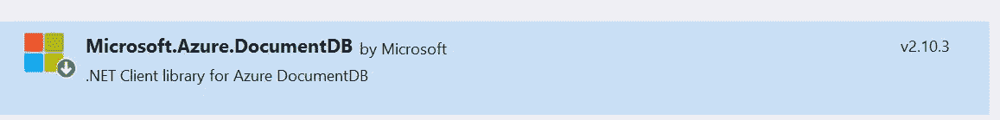

# Cosmos DB 简介

> 原文：<https://medium.com/globant/introduction-to-cosmos-db-8d106bb7207?source=collection_archive---------1----------------------->

在转移到 Cosmos DB 之前，让我们检查一下什么是 NoSQL 数据库，这将有助于我们理解 Cosmos DB，为什么使用以及何时使用。

我们来讨论一下什么是 **SQL 和 NoSQL 数据库**

● SQL 数据库是关系型的，NoSQL 是非关系型的

● SQL 数据库使用结构化查询语言并具有预定义的模式，而 NoSQL 数据库具有用于非结构化数据的动态模式。

● SQL 数据库可垂直扩展，NoSQL 数据库可水平扩展

● SQL 数据库是基于表的，而 NoSQL 数据库是文档、键值、图形或宽列存储

● SQL 数据库更适合多行事务，NoSQL 更适合文档或 JSON 等非结构化数据

***为什么要配 Cosmos DB？***

1.  高吞吐量
2.  低延迟
3.  全球分销
4.  多重一致性模型
5.  支持不同种类的 API

# **宇宙数据库**

Cosmos database 是一个 Paas(平台即服务)和基于云的 NoSQL 数据库，是微软 Azure 中一个完全托管的、全球分布的、多模式的 NoSQL 数据库服务。它提供了极低的延迟、高可用性和一致性。

Cosmos 数据库支持多区域(Geo)复制。它还提供了弹性横向扩展存储和全面服务级别协议的功能。

## Cosmos 数据库支持多种模型，例如

*图片提供:微软*

1.SQL API:它支持 JSON 文档和基于 SQL 的查询。

2.Mongo DB API:支持 Mongo DB API 和 JSON 文档。

3.Gremlin API:用基于图形的节点和边数据表示支持 Gremlin API。

4.Cassandra API:支持用于宽列数据表示的 Cassandra API。

***如何创建 Cosmos 数据库***

 [## 快速入门——从 Azure 门户创建 Azure Cosmos DB 资源

### 适用于:SQL API Azure Cosmos DB 是微软的全球分布式多模型数据库服务。你可以用 Azure…

docs.microsoft.com](https://docs.microsoft.com/en-us/azure/cosmos-db/create-cosmosdb-resources-portal) 

**Cosmos DB Collections**

*   集合是包含合并的 *JSON* 文档和相关 javascript 逻辑的容器，用于编写存储过程、触发器和用户定义的函数。
*   在创建容器时，我们有缩放设置，其中我们可以提到吞吐量(请求单元或 RU)请求单元，它可以是*自动缩放*或*手动*
*   生存时间选项，有助于从集合中自动删除项目
*   Cosmos 条目可以是集合中的文档、表中的行、图中的节点或边。

**将 Cosmos DB 集成到。网络应用**

添加**微软。azure . document db**nu 获取应用程序中的包

使用 documentclient 与 cosmos 数据库进行交互，这需要

1.  URI:Cosmos DB 端点 Url[https://{ UniqueCosmosDbName } . documents . azure . com:443/](https://{UniqueCosmosDbName}.documents.azure.com:443/)
2.  授权密钥:授权密钥将用于读写目的。
3.  收集策略

创建文档客户端实例的示例。

我们可以对文档执行基本的 CRUD 操作

*   创建一个文档: [*DocumentClient。*创建文档同步](https://docs.microsoft.com/en-us/dotnet/api/microsoft.azure.documents.client.documentclient.createdocumentasync)
*   通过 Id 读取文档: [*DocumentClient。readdocumentsync*](https://docs.microsoft.com/en-us/dotnet/api/microsoft.azure.documents.client.documentclient.readdocumentasync)
*   读取收藏中的所有文档: [*DocumentClient。readdocumentfeedsync*](https://docs.microsoft.com/en-us/dotnet/api/microsoft.azure.documents.client.documentclient.readdocumentfeedasync)
*   向上插入一个文档: [*文档客户端。UpsertDocumentAsync*](https://docs.microsoft.com/en-us/dotnet/api/microsoft.azure.documents.client.documentclient.upsertdocumentasync)
*   删除一个文档:[document client。删除文档同步](https://docs.microsoft.com/en-us/dotnet/api/microsoft.azure.documents.client.documentclient.deletedocumentasync)

**结论:**

为了构建高可扩展性、地理复制、低延迟、高吞吐量、多一致性模型，可以使用 Microsoft Azure Cosmos 数据库来实现。