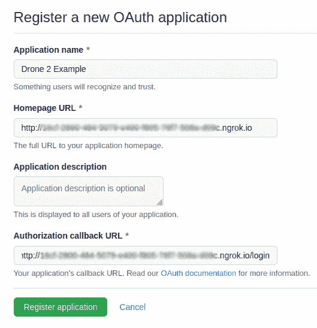

# drone.io CI/CD 平台简介

> 原文：<https://medium.com/globant/introduction-to-drone-io-ci-cd-platform-1d43f8bc1728?source=collection_archive---------0----------------------->

# 介绍

在一个充斥着 CI/CD 产品的世界里，谁会认为还有空间给另一个呢？这篇文章介绍了另一个在 CI/CD 领域的玩家 [Drone.io](https://www.drone.io/) ，由于一系列独特的功能，它在该领域的其他玩家中脱颖而出，近年来获得了很大的人气。无人机是一个开源的持续集成和交付平台，完全建立在 docker 之上。这是真正的码头本地；所有组件都是 docker 容器，应用程序中所有管道步骤的执行也是作为容器进行的。Docker 是一种用于隔离构建和部署的封装方法。

无人机拥有超过 5 万名用户，并被一些知名公司使用，如易贝、[、纽约时报](https://open.blogs.nytimes.com/2017/01/12/continuous-deployment-to-google-cloud-platform-with-drone/)、[思科](https://devnetsandbox.cisco.com/sandbox-instructions/CICD_Pipeline/helloworld.html)和 VMWare 等。他们最近被 [Harness](https://harness.io/) 收购，从那以后他们发布了第二版，也就是我们将在本文中回顾的版本。

我们将在本地设置无人机，因此您可以测试无人机并试用它来了解它的多种功能。使用 helm charts 在 Kubernetes 上部署也非常容易，但这超出了本文的范围，我们的想法是专注于学习 Drone 的特性，而不是如何在生产环境中正确部署它。我们将在后面的文章中讨论这个问题。

本文将回顾以下部分:

*   特征
*   体系结构
*   装置
*   使用
*   结论

# 特征

以下是无人机的主要功能列表:

*   Drone 是非常轻量级的，因为它是用 Go 编写的，所有组件都作为 docker 容器运行。这使得在几分钟内就可以在许多平台或云提供商中轻松部署无人机。默认情况下，每个管道步骤都在运行时自动下载的独立 docker 容器中执行。此外，与 Jenkins 等其他 CI/CD 产品相比，Drone 的学习曲线非常低。
*   Runners 可用于多种操作系统和架构，包括 Linux amd64、Linux arm/arm64、Windows 和 Mac 服务器。有了如此广泛的平台支持，单个产品可以用于多种用例场景:从传统的云部署到物联网，再到本机 Windows 或 Mac 版本。
*   可扩展的架构:Drone 为不同的云提供商提供自动缩放器，这些云提供商将根据需求启动 runners，通过避免为他们分配专用资源的需要，帮助开发人员节省他们的云账单。
*   它可以在内部安装，也可以作为具有附加功能的 SaaS 产品，因此您可以选择最适合您需求的产品。
*   功能可以通过插件和扩展来扩展。插件为管道增加功能，为无人机核心本身增加扩展。插件非常容易开发，因为它们可以用任何语言编写，并且在容器中独立运行。
*   管道以 YAML 格式定义，具有简单且定义明确的语法。
*   不同的数据库后端选项。默认情况下，它使用 SQLite，开箱即用，但对于生产部署，它可以使用外部 PostgreSQL 或 MySQL 数据库。
*   而且越到最后越好，是开源！

但是无人机也有一些缺点，到目前为止我注意到了以下几点:

*   无人机服务器必须可以通过互联网访问，这样 SCM 平台才能访问无人机服务器上的 webhooks。
*   虽然 Drone 有大约 100 个插件，但这并不像 Jenkins 等其他产品的插件数量那么多。
*   它只支持 git SCM 平台，但是对于任何现代项目来说，这都不是问题。
*   一个无人机服务器实例一次只能访问一个 git SCM 平台，如果您使用多个平台，那么您将需要实例化多个无人机服务器，每个 SCM 一个。

# 体系结构

Drone 有一个非常简单的基于客户端和服务器的架构，它由三个部分组成:

*   无人机服务器
*   无人机特工(称为奔跑者)
*   无人机管道配置文件(在每个 git 存储库上)

下图更详细地描述了其体系结构:


Drone architecture diagram

## 服务器

无人机服务器是主要组件。它是一个 go 二进制文件，被打包成一个 docker 映像，可以作为 docker 容器在 Linux、Mac、Windows 机器上或在 Kubernetes 集群中运行。还有一个 SaaS 版本，但这不是我们在这篇文章中要谈论的。

服务器负责监控 SCM 平台(如 GitHub、Bitbucket、Gitea 等)中的 git 存储库的变化，然后根据存储在存储库中的配置文件指示运行程序做什么。这个文件就是通常所说的管道定义。服务器使用 OAuth 向 git 存储库认证，使用共享秘密向运行者认证。

当 Drone 服务器在服务器上被激活时，它会自动在 git 存储库上创建一个 webhook。然后，当一个事件发生时，例如一个开发人员将一些代码推送到一个分支，webhook 被触发，无人机服务器被通知这个事件。当这种情况发生时，无人机服务器从 git 存储库中提取无人机配置文件，解析它，并在适当的运行器上对其上的指定任务(管道步骤)进行排队。

## 赛跑运动员

运行者执行存储库的无人机配置文件中指定的步骤。与服务器一样，运行程序被打包成 docker 映像，也可以作为 docker 容器在 Linux、Mac、Windows 机器上、Kubernetes 集群上或直接在 VM 上运行。有几种类型的跑步者:

*   *Docker runner:* 这个 runner 是一个守护进程，它在短暂的 Docker 容器中执行管道步骤。它在 Linux、Mac 或 Windows 机器上作为容器运行。它可以作为单个 docker runner 安装，或者安装在多台机器上以创建一个构建集群。
*   *Kubernetes runner:* 这个 runner 是一个独立的服务，在 pod 内部执行管道。
*   *本地执行运行器:*这个运行器是一个守护进程，它使用默认的 shell 直接在主机上执行构建管道，而不需要隔离。对于不能在容器内执行的工作负载，或者不容易适应基于容器的管道的工作负载，建议使用该方法。这个运行器对于不支持容器的操作系统和架构特别有用。
*   *SSH 运行程序:*该运行程序使用 SSH 协议在远程服务器上执行管道命令。管道命令直接在远程服务器上执行，没有隔离，使用默认的 shell。
*   *适用于 DigitalOcean、AWS 和 Macstadium 的云运行器:*这种类型的运行器推荐用于需要特权访问完整虚拟机的管道，不适合在容器内执行。这些运行器在专用的短暂虚拟机中执行管道，并为不受信任的工作负载提供安全隔离。

运行程序一次运行一个任务，因此为了能够并行运行多个任务，必须使用多个运行程序。

## 配置文件

配置文件定义了一组步骤，这些步骤定义了 git 存储库的管道。这是一个位于 git 存储库中的 YAML 文件，命名为 *.drone.yml* 。在最近的 Drone 版本中，已经引入了一些定义该配置文件的其他格式，如 [Jsonet](https://jsonnet.org/) 和 [Starlark](https://docs.bazel.build/versions/main/skylark/language.html) 为更复杂的管道带来了模板和脚本功能，但为了简单起见，我们将使用默认的 YAML 格式。

## 插件和扩展

无人机的功能可以用[插件](http://plugins.drone.io/)和[扩展](https://docs.drone.io/extensions/overview/)来扩展。插件为应用程序管道增加了新的功能，这些动作可以作为管道的一部分来执行。目前，无人机已经有数百个不同类型任务的插件。比如通知插件(slack，telegram，email)，部署(ECS，EKS)，发布(docker，ECR，GCR，npm，scp，rsync)监控(Datadog)等。Drone 没有 Jenkins 等其他 CI/CD 平台那么多插件，但由于插件可以用任何语言编写，并封装在 docker 容器中，因此创建新的插件非常容易。因此，如果你错过了其他 CI/CD 系统中的任何功能，它可以很容易地作为一个插件添加到 Drone。

另一端的扩展扩展了 Drone 的核心功能，例如，添加新的 ACL 控件、流水线处理规则、secrets 后端、配置文件林挺等。

# 装置

一般来说，由于 Drone 作为 docker 容器运行，它的设置非常简单。在本实验中，我们将使用本地 docker 容器，用于部署在您计算机中的服务器和运行程序。但如前所述，由于无人机需要通过互联网公开访问，我们需要使用一个隧道工具，如 [ngrok](https://ngrok.com/) 来使服务器可以被本地计算机上的 SCM 平台访问。如果您可以访问云提供商上的虚拟机，您可以跳过这一步，使用虚拟机的主机名，只需确保 HTTP 和 HTTPS 端口可以公开访问。

Ngrok 设置说明不在本文讨论范围之内(为了避免不必要的冗长)，但基本上你需要做的是在[ngrok.com](https://ngrok.com/)和[注册，然后按照这些说明](https://dashboard.ngrok.com/get-started/setup)进行设置。记下通道配置中的主机名，因为我们以后会用到它。

## 先决条件:

*   Docker 和 docker-compose 安装在您的计算机上。
*   指向无人机服务器的可公开访问的主机名。因为本实验是本地安装，所以我们将使用 ngrok 主机名。
*   SCM 平台 OAuth ID 和令牌。在这篇文章中，我们将使用 GitHub，参考[官方文档](https://docs.drone.io/server/overview/)中关于如何设置其他 SCM 平台的说明。
*   为服务器和运行程序之间的通信定义一个密码。这只是一串文本，将用作它们之间的密码。
*   GitHub 和 Docker Hub 帐户。

满足所有先决条件后，启动和运行无人机需要以下步骤:

**在 SCM 平台中创建 OAuth 认证。**

进入你的 GitHub 账户，导航到[开发者设置](https://github.com/settings/developers)，从左侧菜单中选择 OAuth 应用。单击“新建 OAuth 应用程序”按钮并填写字段。在这里，您需要部署无人机的主机名。回拨网址*必须*以“/登录”结尾:



单击“注册应用程序”按钮。在下一个屏幕上，单击“生成新的客户端密码”按钮，然后在要求生成新的访问密码时输入您的密码:


记下客户端 ID 和密码。

**配置无人机服务器和运行器。**

服务器配置是使用环境变量完成的。为了简化设置，我们将使用 *docker-compose* 。创建一个名为*的文本文件。env* 为了存储配置服务器和运行程序的环境变量，请参考[官方文档](https://docs.drone.io/server/reference/)以获得对它们的更深入的解释。

添加以下变量:

```
# Server configuration
DRONE_SERVER_HOST=<ngrok hostname>
DRONE_SERVER_PROTO=http
DRONE_GITHUB_CLIENT_ID=<github client ID>
DRONE_GITHUB_CLIENT_SECRET=<github secret>
DRONE_RPC_SECRET=<Drone secret>
DRONE_TLS_AUTOCERT=false
DRONE_USER_CREATE=username:<github_username>,admin:true# Runners configuration
DRONE_RPC_HOST=<ngrok hostname>
DRONE_RPC_PROTO=http
DRONE_RUNNER_NAME="Drone.io_runner" # It CANNOT contain spaces!
```

现在我们需要为 docker-compose 创建配置文件来启动服务器和运行器容器。创建一个名为 *docker-compose.yml* 的文件，内容如下:

```
version: '3.8'services:
  drone:
    image: 'drone/drone:2'
    volumes:
      - "/var/run/docker.sock:/var/run/docker.sock"
      - "./volumes/drone:/data"
      - '/etc/localtime:/etc/localtime:ro'
    restart: always
    ports:
      - 80:80
    env_file:
    - .env drone-agent:
    image: drone/drone-runner-docker:1
    command: agent
    restart: always
    depends_on:
      - drone
    volumes:
      - /var/run/docker.sock:/var/run/docker.sock
      - '/etc/localtime:/etc/localtime:ro'
    env_file:
      - .env
```

我们需要为 HTTP 使用端口 80，因为我们没有 SSL 证书。Drone 内置了[让我们用 Drone_TLS_AUTOCERT 变量加密](https://letsencrypt.org/)支持，但是要使用它，我们需要拥有 DRONE 可用的 DNS 域，因为 DRONE 使用 ACME HTTP 挑战进行域验证。

现在你可以启动无人机了:

```
$ docker-compose up
```

等待容器启动几秒钟，然后在浏览器中打开 ngrok 主机名，如果 Drone 启动成功，您应该会看到如下屏幕:


点击“继续”。接下来将要求您注册，如果您不想订阅，请将字段留空，然后单击“提交”:


GitHub 会要求你授权无人机，点击“授权”:


现在，您将看到无人机仪表板，其中列出了您的所有存储库:


恭喜，你的无人机服务器已经启动并运行了！！

# 使用

设置好无人机服务器和运行器后，必须配置应用程序的管道。为此，我们需要创建一个名为 *.drone.yml* 的文件，并将其放在应用程序的根文件夹中。这个文件将告诉 Drone 要执行的任务，比如构建、测试和部署应用程序。例如，使用适当的 docker 映像构建代码，将其打包(在 docker 容器中或作为 npm 包)，并将其部署到某个地方，如 docker 或 npm 注册表。

在本实验中，我们将使用这张 [hello world docker 图片](https://github.com/juanluisbaptiste/docker-hello-world)。该应用程序的管道将构建图像并将其推送到 docker hub。这是一个非常基本的例子，将有助于我们展示无人机的工作流程和基本功能。在下一篇文章中，我们将做一个更完整的例子，也在远程系统中部署应用程序。

首先，请派生示例存储库。这是您将在该应用程序中找到的 *.drone.yml* 文件:

```
---
kind: pipeline
type: docker
name: hello-world
steps:
- name: docker
 image: plugins/docker
 settings:
   repo:<dockerhub_username>/docker-hello-world
   username:
     from_secret: docker_username
   password:
     from_secret: docker_password
   tags:
     - latest
```

用你的 dockerhub 用户替换*<Docker Hub _ username>*。在设置部分，我们将为 docker hub 的用户名和密码设置密码，稍后会详细介绍。完成这些更改后，提交并推动它们。

转到您的 docker hub 帐户，创建一个新的存储库。


给它一个名称，将其可见性设置为 Public，并选择 *GitHub* 作为源代码存储库，这样您就可以选择这个实验室的存储库。如果您还没有链接您的 GitHub 帐户，那么请先[这样做](https://hub.docker.com/settings/linked-accounts)以便能够选择实验室存储库:


保留其他字段的默认值，然后单击“Create”创建 docker hub 存储库。接下来，我们需要同步无人机服务器中的 GutHub 存储库。因为我们添加了一个新的 GitHub 存储库，所以我们需要让 Drone 知道它。转到无人机仪表盘，点击屏幕右上方的“同步”按钮:


搜索 *docker-hello-world* 存储库并点击它。由于这是一个新的存储库，您将进入*设置*页面。点击“+激活存储库”按钮:


现在添加 docker hub 凭证作为机密。单击左侧的“秘密”菜单项，然后单击“+新秘密”按钮创建新的秘密:


创建两个密码，“docker_username”和“docker_password ”,并为您的帐户设置相应的值:


现在我们已经准备好启动测试构建了！单击“Builds”选项卡，然后单击“+NEW BUILD”按钮手动启动一个构建:


通常，将提交推送到存储库时将启动构建(并且根据 *.drone.yml* 文件中的规则)。将出现一个窗口来定制构建，保留默认设置，然后单击“Create”按钮:


管道执行现在将开始，您可以看到正在执行的步骤及其输出和执行状态:


还有一个管道步骤的图形视图，可以帮助理解管道的工作流程:


几分钟后，管道执行应该已经完成。看看最后一次执行的结果:


去 docker hub 看看有没有新图像！

# 结论

这是一个非常简单的设置，并不反映为生产使用而构建和部署的应用程序需要什么，但它可以展示无人机的基本功能、设置的简易性以及管道配置的简单性。

无人机是为云时代打造的现代 CI/CD 产品。它可能没有 Jenkins、CircleCI 或“在此插入您首选的 CI/CD 产品”等其他更成熟(和更老)的产品的所有功能，但作为容器原生产品，它具有云更需要的许多其他功能。

首先，它易于部署，作为 docker 的原生版本，可以在几分钟内非常容易和快速地启动和运行无人机，甚至在 Kubernetes 集群上，我们将在未来的文章中介绍这一点。

其次，Arm 硬件架构的支持使其可以用于不同于云的各种其他行业，如物联网和嵌入式系统。


在[https://www.globant.com/studio/cloud-ops](https://www.globant.com/studio/cloud-ops)拜访我们