# Drone.io CI/CD 平台简介第 3 部分

> 原文：<https://medium.com/globant/introduction-to-drone-io-ci-cd-platform-part-3-15a3831cabf2?source=collection_archive---------3----------------------->


# 介绍

这是这个“Drone.io CI/CD 简介”系列的第三部分，也是最后一部分。在这最后一篇文章中，我们将讨论一些最后的重要主题来完成无人机概述，例如:

*   无人机命令行界面
*   库伯内特的秘密整合
*   构建促销和回滚
*   如何进行调试

与前几篇文章一样，我们将演示所有这些功能，并提供如何设置它们的详细说明和动手实验。

# 先决条件

在继续之前，请记住浏览之前的文章(第[部分第一篇](/globant/introduction-to-drone-io-ci-cd-platform-1d43f8bc1728)和第[两篇](/globant/introduction-to-drone-io-ci-cd-platform-part-2-fa9fdc6a3659))，设置并运行实验室，以便能够执行本文中的任务。简单回顾一下，如果您一直在笔记本电脑上阅读这些文章系列，并且已经完成了所有必要的设置，并且想要让它运行起来以阅读本文，您需要:

*   启动 *ngrok* 并记下分配的主机名。
*   转到 GitHub OAuth 应用程序设置页面，用新的 ngrok 主机名更新*主页 URL* 和*应用程序回调 URL* 。
*   转到存储库 *webhook 设置*并使用新的 ngrok 主机名更新主机名。
*   启动 minikube 集群(如果您已经完成了前面的实验，您应该已经安装和配置了 Drone，并且部署了示例留言簿应用程序)。

让我们回顾一下让实验准备好继续本文的实验所需的命令。首先，运行下面的 *kubectl* 命令，使用端口转发来公开无人机服务器:

```
$ sudo kubectl — namespace drone port-forward svc/drone 80:80
```

访问 [http://localhost](http://localhost) ，应该可以访问无人机 web 界面。 *.drone.yaml* 文件位于[*kubernetes-engine-samples*](https://github.com/juanluisbaptiste/kubernetes-engine-samples)库的根目录下。在这个存储库中，我们在这个实验中使用了[留言簿](https://github.com/juanluisbaptiste/kubernetes-engine-samples/tree/main/guestbook)应用程序。Kubernetes 清单在那个文件夹里面，前端代码在 [*php-redis*](https://github.com/juanluisbaptiste/kubernetes-engine-samples/tree/main/guestbook/php-redis) 文件夹里面。要访问前端应用程序，您可以使用 *minikube 服务*命令:

```
$ minikube service frontend -n guestbook-demo
```

现在我们准备继续！

# 无人机命令行界面(CLI)

Drone [提供命令行界面](https://docs.drone.io/quickstart/cli/)程序，与 Drone 服务器远程交互。该 CLI 可用于在服务器上执行管理任务，如查看日志、管理用户、机密和[管道模板](https://docs.drone.io/template/)。它还可以用来管理存储库、构建作业、cronjobs 或[执行本地构建](https://docs.drone.io/cli/drone-exec/)。在本节中，我们将回顾其中的一些任务。

## 安装和配置

CLI 程序的安装相当简单，基本上，将平台的二进制文件下载到用户路径下的一个目录中，并赋予它执行权限。例如，对于 Linux，您可以使用以下命令:

```
$ curl -L [https://github.com/harness/drone-cli/releases/latest/download/drone_linux_amd64.tar.gz](https://github.com/harness/drone-cli/releases/latest/download/drone_linux_amd64.tar.gz) | tar zx$ sudo install -t /usr/local/bin drone
```

其他平台看官方[安装说明](https://docs.drone.io/cli/install/)。

## 使用

安装二进制文件后，需要使用环境变量对其进行[配置](https://docs.drone.io/cli/configure/)以连接到无人机服务器。首先，导出无人机服务器地址:

```
$ export DRONE_SERVER=http://drone.mycompany.com
```

对于本实验，服务器地址将是 ngrok 主机名。然后，导出无人机个人令牌:

```
$ export DRONE_TOKEN=eyJhbGciOiJIUzI1NiIsInR5cCI6IkpXVCJ9…
```

请记住，个人令牌是从无人机服务器 web 界面中的用户配置文件页面获得的。导出前面的变量后，可以执行 CLI 命令。要测试 CLI 命令，请运行以下命令:

```
$ drone info
User: yourgithubusername
Email: juan@youremaildomain.com
```

# Kubernetes 秘密集成

Drone.io 可以[与许多外部秘密存储工具](https://docs.drone.io/secret/external/)集成，并允许存储在那些工具中的秘密在一个管道中使用。有了这个功能，就可以用 Kubernetes 的秘密代替无人机秘密了。为了让无人机能够获取 Kubernetes 的秘密，需要做三件事:

*   安装[无人机 Kubernetes secrets 扩展](https://docs.drone.io/runner/extensions/kube/)
*   创造 Kubernetes 的秘密
*   将秘密资源添加到无人机管道中，以访问 Kubernetes 秘密。

## 扩展安装

使用舵图也可以安装延伸件[。首先，扩展需要配置一个 Helm *values.yaml* 文件，如下所示:](https://github.com/drone/charts/blob/498bf298c0000acafa47b43308f4d06c6ab40e66/charts/drone-kubernetes-secrets/README.md)

Example Drone.io Kubernetes secrets extension config file

用自己的秘密替换 SECRET_KEY 的值。您可以使用 *openssl* 命令创建一个随机的:

```
$ openssl rand -hex 16
a6ca63b531427e3165224112e02b1697
```

此外，正如您在前面的示例中看到的，扩展将在默认名称空间中查找秘密，因此如果您想要使用不同的名称空间，那么必须用要使用的名称空间更新 *secretNamespace* 和 *KUBERNETES_NAMESPACE* 的值。查看[文档](https://docs.drone.io/runner/extensions/kube/),了解设置共享秘密之外的其他变量。

将该文件另存为*drone-kubernetes-secrets . YAML*，然后使用以下 Helm 命令安装扩展:

```
$ helm install — namespace drone drone-kubernetes-secrets drone/drone-kubernetes-secrets -f drone-kubernetes-secrets-values.yamlNAME: drone-kubernetes-secrets
LAST DEPLOYED: Wed Jul 20 15:22:50 2022
NAMESPACE: drone
STATUS: deployed
REVISION: 1
TEST SUITE: None
```

要检查扩展是否已成功安装，请检查 pod 日志:

```
$ kubectl — namespace drone logs \
-l ‘app.kubernetes.io/name=drone-kubernetes-secrets’ \
-l ‘app.kubernetes.io/component=drone-kubernetes-secrets’time=”2020–01–29T00:02:18Z” level=info msg=”server listening on address :3000"
```

如果您在最后一行看到一条消息说“服务器监听地址:3000”，那么这个扩展正在按预期工作。下一步是更新运行程序，并配置它们使用 Kubernetes secrets 扩展。为此，需要更新跑步者的舵值文件，在文件的 *env:* 部分添加以下配置变量:

```
DRONE_SECRET_PLUGIN_ENDPOINT: [http://drone-kubernetes-secrets:3000](http://drone-kubernetes-secrets:3000)
DRONE_SECRET_PLUGIN_TOKEN: your-shared-secret-value-here
```

将*DRONE _ SECRET _ PLUGIN _ TOKEN*变量的值替换为先前在 Kubernetes secrets 安装期间配置的密码值。保持*DRONE _ SECRET _ PLUGIN _ ENDPOINT*的值不变。然后，使用 Helm 更新跑步者的安装:

```
$ helm upgrade — namespace drone drone-runner-kube drone/drone-runner-kube -f drone-runner-kube-values.yamlRelease “drone-runner-kube” has been upgraded. Happy Helming!
NAME: drone-runner-kube
LAST DEPLOYED: Wed Jul 20 15:26:32 2022
NAMESPACE: drone
STATUS: deployed
REVISION: 2
TEST SUITE: None
```

## 库伯内特的秘密创作

现在，使用 *kubectl* 创建 Kubernetes 秘密。我们将创建在前一篇文章中使用的留言簿示例应用程序管道中使用的所有秘密:

*   Docker Hub 凭据
*   minikube 参数(CA 证书、服务器地址和令牌)

该清单文件可用作创建机密的模板:

Kubernetes example secrets manifest file

所有值都需要进行 base 64 编码。要对简单值进行编码，可以使用以下命令:

```
$ echo -n value | base64
```

举个例子，

```
$ echo -n juanluisbaptiste | base64
anVhbmx1aXNiYXB0aXN0ZQ==
```

使用该命令对 docker hub 用户名和密码以及 minikube 服务器地址进行编码。注意使用-n 参数来避免添加行尾，这是至关重要的。

对于 minikube CA 证书，我们可以参考上一篇文章，因为我们之前已经用以下命令对其进行了编码:

```
$ cd ~/.minikube
$ cat ca.crt|base64 -w 0
```

请注意-w 0 参数的使用，它用于禁用换行，因此我们在一行中获得编码值，这是因为证书值的长度而需要的。

为了对 minikube 令牌进行编码，我们还可以使用上一篇文章中给出的命令来获取它的值，但是要做一个小的修改。之前，令牌值已经进行了 base 64 编码，并在提取时被解码，因此将修改命令以避免 base64 解码:

```
$ kubectl get secret `kubectl get secret -n kube-system|grep default|awk ‘{print $1}’|grep -v NAME` -o go-template=’{{ .data.token }}’ -n kube-system
S0tLS1CRUdJTiBDRVJUSUZJQ0FURS0tLS0tCk1JSURCakNDQWU2Z0F3SUJBZ0lCQVRBTkJna3Foa2lHOXcwQkFR
[…]
```

所有值编码后，将它们复制粘贴到之前的秘密清单文件中，并保存为*kubernetes-secrets . YAML*。然后，在默认名称空间中使用以下命令创建机密:

```
$ kubectl apply -f kubernetes-secrets.yaml -n default
secret/docker configured
secret/k8s configured
```

## 将机密资源添加到管道

最后要做的是将新的秘密资源添加到新的 Kubernetes 秘密的无人机管道中。在 *.drone.yml* 文件的开头添加以下秘密定义:

Secret resource definitions added to .drone.yaml

有了这些秘密资源定义，管道使用的秘密值将从先前创建的 Kubernetes 秘密中获取。

# 管道促销

管道提升是一个非常酷的特性，可以用来将构建输出移动或“提升”到目标环境。提升允许将已经构建在管道中的代码部署到不同的环境中(开发、测试、试运行、生产等)。)，通过运行一个只执行部署步骤的新管道。这些环境是应该部署应用程序的基础设施，例如 Kubernetes 集群。这些形象促销有许多优点:

*   创建可重复的部署:确信每次一个构建被提升到不同的环境，它将总是被部署的相同的代码。
*   缩短新版本的发布时间:使用促销时，带有新应用程序代码的映像只构建一次，然后在不同环境之间移动，直到它最终出现在开发和运营团队之间摩擦最少的理想环境中。
*   创建正在部署的版本的审计跟踪:随时了解每个环境中部署了哪些映像版本。
*   职责分离:让 QA 团队在他们的质量测试通过后在环境之间推广新版本，而不是在 QA 需要时让运营团队去做。通过这种方式，开发团队可以以版本化的方式提供新的应用程序版本，QA 和发布经理可以在他们有信心的时候，按照他们自己的步调测试和发布这些新版本。
*   轻松地将升级后的映像版本回滚到以前的版本。

## 促销如何运作

当提升一个构建时，Drone 启动应用程序管道的新构建。这个新的内部版本有自己的内部版本号，并从正在升级的内部版本中继承所有的内部版本参数。新的构建将把它的事件类型设置为 *promote* ，通过在管道中的触发条件中使用它，可以将它用于基础设施中的部署环境。

无人机管道应该定义在某处部署应用程序所需的步骤，然后，可以使用*触发器*(在管道级别)或 *when* 条件(在步骤级别)中的 *promote* 事件类型，结合任何其他所需的条件来选择部署目标。

在[的上一篇文章](/globant/introduction-to-drone-io-ci-cd-platform-part-2-fa9fdc6a3659)中，我们已经定义了一个部署到本地 minikube 集群的管道，所以我们将从那里继续演示这个特性。

## 推广管道

继续上一篇文章中的实验，要使用管道提升功能，需要完成两项任务。首先，我们必须修改无人机管道，并将其分成两个不同的管道:一个用于构建和标记图像，另一个用于将其部署到特定的环境。其次，必须修改应用程序的前端清单文件，以部署在构建管道中构建并使用 git 标签标记的图像标签。这也将允许我们从以前的部署管道中回滚到特定的版本。

要拆分管道，请添加一个新的管道定义，为其命名，并将部署步骤移到其中。这是文件外观的一个例子，但是你可以在这里看到完成的文件:

```
[ … *secrets definitions here* … ]
---
kind: pipeline
type: kubernetes
name: buildsteps:
  - name: Build docker image
    image: plugins/docker
    settings:
      repo: juanluisbaptiste/guestbook-demo
      dockerfile: guestbook/php-redis/Dockerfile
      context: guestbook/php-redis
      username:
        from_secret: docker_username
      password:
        from_secret: docker_password
    tags:
      - latest
      - ${DRONE_BUILD_NUMBER}
    when:
      event:
        - push
        - pull_request
        - custom
  **- name: Tag docker image
    image: plugins/docker
    settings:
      repo: juanluisbaptiste/guestbook-demo
      dockerfile: guestbook/php-redis/Dockerfile
      context: guestbook/php-redis
      username:
        from_secret: docker_username
      password:
        from_secret: docker_password
    tags:
      - latest
      - ${DRONE_TAG}
    when:
      event:
        - tag
---
kind: pipeline
type: kubernetes
name: deploy****steps:** - name: Deploy frontend deployment
  image: danielgormly/drone-plugin-kube:0.2.0
  settings:
    **image_tag: ${DRONE_TAG}** template: guestbook/frontend-deployment.yaml
    namespace: guestbook-demo
    ca:
      from_secret: k8s_crt
    server:
      from_secret: k8s_server
    token:
      from_secret: k8s_token
  **trigger:
    event:
      - promote
      - rollback
    target:
      - production**[ … *rest of deployment steps* … ]
```

我用粗体突出显示了新的部分。请注意，我们添加了另一个步骤来标记构建管道中的图像。如何定义它并不是最佳的方法，因为映像被构建了两次(映像应该只在构建步骤中构建，但这足以演示这个特性)。还要注意，这个新步骤的条件被定义为用*标签*事件触发，在标签部分，有一个标签使用了 *${DRONE_TAG}* 变量。该变量包含触发构建的 git 标记的值。

现在，进入部署流程。为了简单起见，我们将只有一个部署示例应用程序的环境。通常，一个项目至少有一个试运行和生产环境，但是对于本演示，只有生产环境就足够了。

在*部署*管道中，注意在第一个部署步骤，即部署前端应用程序的步骤中，我们定义了一个名为 *image_tag* 的变量，该变量接收 *${DRONE_TAG}* 变量。该变量被传递给前端应用程序清单，并用作模板变量。该管道的触发器定义了两个事件: *promote* 和 *rollback* ，并添加了另一个名为 *target* 的触发器。此目标触发器用于定义执行管道(或步骤，如果在步骤级别定义的话)的环境。在他的例子中，目标是*生产*环境。

现在，必须修改前端应用程序清单文件以使用该变量:

Kubernetes 部署插件可以将清单文件解析为模板，并用它们的值替换像 *image_tag* 这样的变量。这意味着要部署的前端映像是标记有 *${DRONE_TAG}* 变量值的映像。这些修改完成后，我们就准备做管道推广了！

首先将这些更改提交到您的回购中。现在，编辑[留言簿/php-redis/index.html](https://github.com/juanluisbaptiste/kubernetes-engine-samples/blob/main/guestbook/php-redis/index.html) 文件，并在某处添加一些文本来模拟创建新版本前端应用程序的更改。例如，将文本“v2.0.0”添加到 h2 标题，并提交和推送更改:

```
[…]<h2>Guestbook v2.0.0</h2>[…]
```

构建管道中的构建映像步骤将触发并构建映像。请注意，现在部署步骤不会触发，因为它们现在位于单独的管道中:

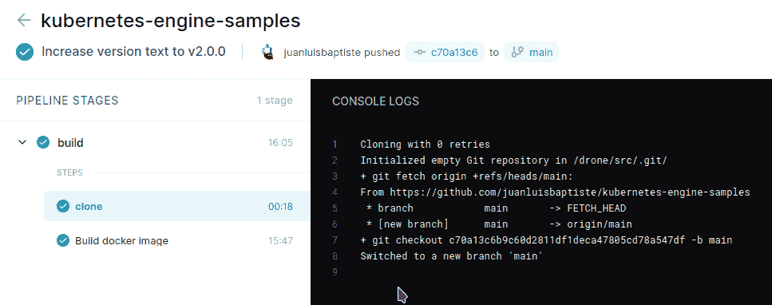

等到构建完成，创建一个值为“v2.0.0”的 git 标记:

```
$ git tag v.2.0.0
```

按下标签，现在来自构建管道的*标签*步骤将被触发。

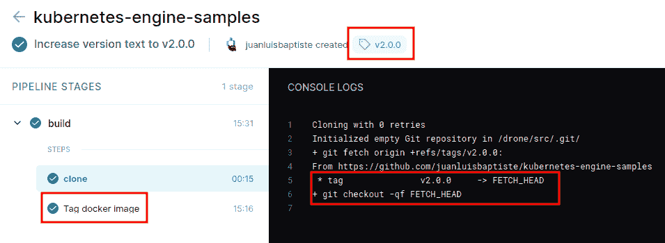

完成后，您可以在 docker hub 存储库中检查您是否有一个用该标签标记的图像。现在我们已经准备好提升构建了。在 git 标签触发的构建中，点击右上角的三点菜单并选择 *Promote* :

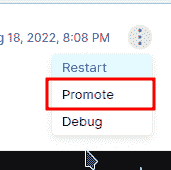

在*目标*字段中，写入*生产*(这是我们在部署管道中触发器的*目标*字段中定义的环境的名称)，保留其余字段不变，然后单击“部署”。

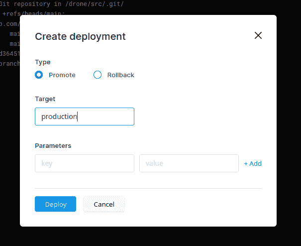

现在*部署*管道将开始在*生产*目标环境中部署带有 git 标签的前端应用程序映像:

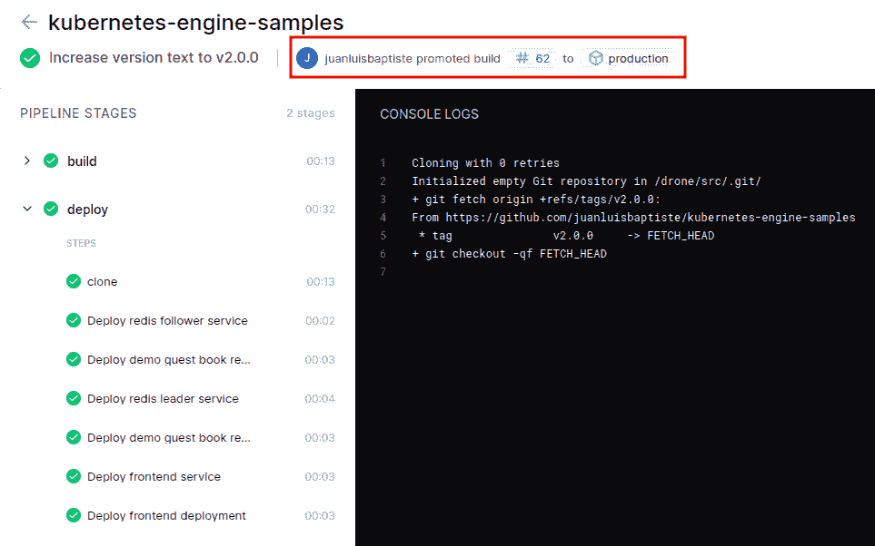

转到前端应用程序 URL，我们刚才对*index.html*文件所做的更改应该是可见的:

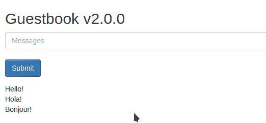

构建按预期得到了提升和部署。您可以检查窗格，并看到它们是重新创建的:

```
$ kubectl -n drone get pods
NAME                             READY STATUS  RESTARTS AGE
frontend-56d74fbb4b-crj9t        1/1   Running 0        36s
frontend-56d74fbb4b-qcfz5        1/1   Running 0        48s
frontend-56d74fbb4b-zw9tt        1/1   Running 0        30s
redis-follower-594666cdcd-dbd4f  1/1   Running 6        2d
redis-follower-594666cdcd-l6s8c  1/1   Running 6        2d
redis-leader-fb76b4755-bhfzh     1/1   Running 6        2d
```

还要检查使用的图像标签:

```
$ kubectl describe pod/frontend-56d74fbb4b-crj9t[...]
Containers:
  php-redis:
    Container ID: docker://426fb895586bd1415faaba8cb84b6a7edc475a5a7a82162132e2415f3270c86a
    Image: **juanluisbaptiste/guestbook-demo:v2.0.0** [...]
```

现在，让我们对前端应用程序做另一个修改。再次编辑*index.html*文件，并将版本文本更改为“v2.1.0”:

```
[…]<h2>Guestbook v2.1.0</h2>[…]
```

提交并推送更改，等待构建完成，并创建一个值为“v2.1.0”的 git 标记:

```
$ git tag v.2.1.0
```

按下标签以触发部署，等待它完成，然后再次升级这个新的构建(版本 2.1.0):

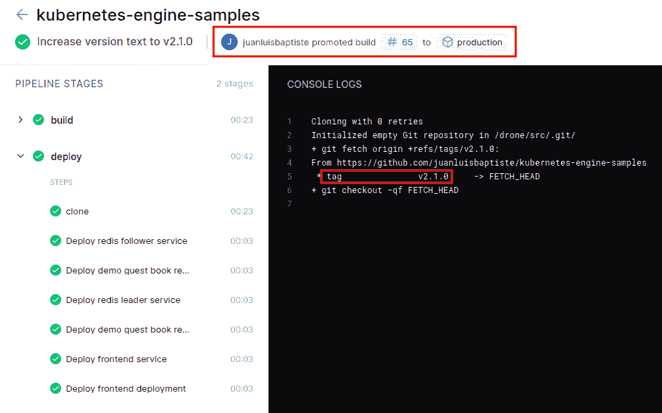

管道完成后，返回前端应用程序并重新加载页面，您应该会看到新的变化:

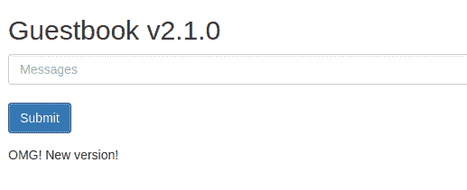

如您所见，升级构建是跨环境移动应用程序新版本的一种简单而方便的方式。也可以使用 CLI 界面执行促销。这个例子也可以这样做:

```
$ drone build promote juanluisbaptiste/kubernetes-engine-samples 68 productionNumber: 70
Status: pending
Event: promote
Commit: 1fbf81df2adf8753df698fc9ae1546127d54aa6e
Branch:
Ref: refs/tags/v2.1.0
Author: juanluisbaptiste <juan@xxxxxx.tech>
Message: Increase version text to v2.1.0
```

在一组成功的测试完成后，您可以使用 cli 以编程方式进行管道升级。现在我们可以检查如何回滚到以前的版本。

## 回滚管道

一个*回滚*是在一个环境中部署一个以前的应用程序版本，例如因为在升级完成后，出现了一些错误，不幸的是在测试期间没有被发现。继续这个示例，我们将从 2.1.0 版回滚到 2.0.0 版。

转到 v2.0.0 的升级版本:

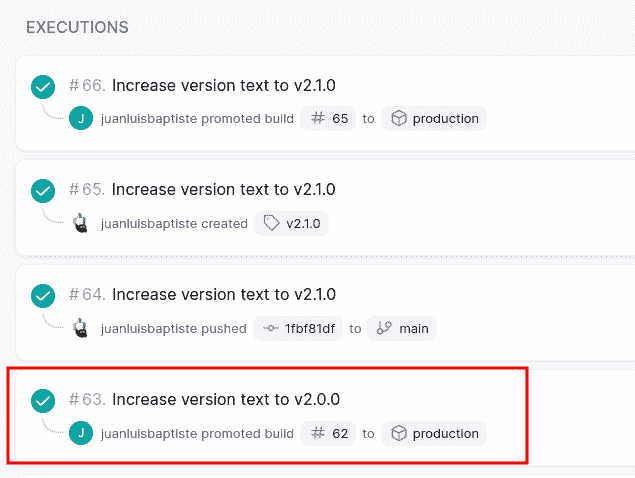

再次点击右上角的三点菜单，但这次点击*回滚*选择框(我知道，在推广窗口中有回滚选项很奇怪！)，再次在目标上放置*生产*，并点击“部署”:


部署管道将启动。单击*克隆*作业，注意它签出的 git ref:

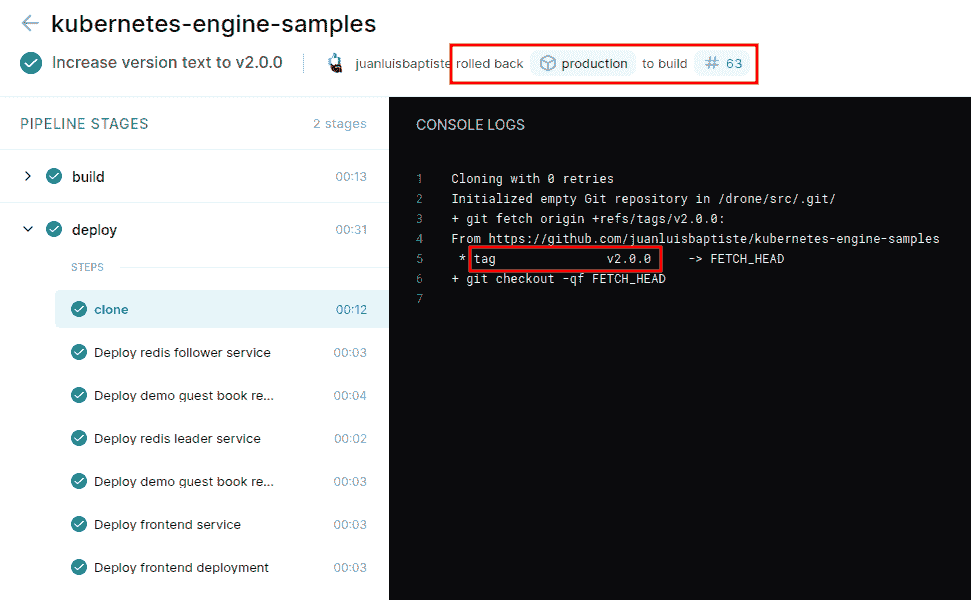

如您所见，是 v2.0.0 标记，管道正在使用回滚部署的正确版本。管道完成后，回到前端应用程序和刷新，你应该会再次看到旧的 2.0.0 版本！

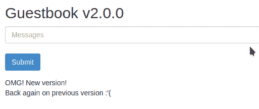

# 排除故障

如果您的无人机设置有问题，无论是服务器设置还是在执行构建管道时，都有一些工具可以帮助您调试问题并找出发生了什么。调试问题时要做的第一件事是查看[日志](https://docs.drone.io/cli/drone-log/)。无人机有两种类型的日志:

*   服务器和代理日志
*   管道构建日志

要查看服务器或代理日志，使用 *kubectl* 命令，例如:

```
$ kubectl -n drone get podsNAME                                READY STATUS  RESTARTS AGE
drone-6c4c8dd65c-7rxdn              1/1   Running 2        4d
drone-runner-kube-7f79d87b75-fffn5  1/1   Running 2        4d$ kubectl -n drone logs drone-6c4c8dd65c-7rxdn — tail 10{“arch”:””,”kernel”:””,”kind”:”pipeline”,”level”:”debug”,”msg”:”manager: request queue item”,”os”:””,”time”:”2022–07-20T02:36:55Z”,”type”:”kubernetes”,”variant”:””}{“arch”:””,”kernel”:””,”kind”:”pipeline”,”level”:”debug”,”msg”:”manager: context canceled”,”os”:””,”time”:”2022–07–20T02:37:25Z”,”type”:”kubernetes”,”variant”:””}{“arch”:””,”kernel”:””,”kind”:”pipeline”,”level”:”debug”,”msg”:”manager: request queue item”,”os”:””,”time”:”2022–07-20T02:37:35Z”,”type”:”kubernetes”,”variant”:””}{“arch”:””,”kernel”:””,”kind”:”pipeline”,”level”:”debug”,”msg”:”manager: context canceled”,”os”:””,”time”:”2022–07–20T02:38:05Z”,”type”:”kubernetes”,”variant”:””}{“arch”:””,”kernel”:””,”kind”:”pipeline”,”level”:”debug”,”msg”:”manager: request queue item”,”os”:””,”time”:”2022–07-20T02:38:15Z”,”type”:”kubernetes”,”variant”:””}{“arch”:””,”kernel”:””,”kind”:”pipeline”,”level”:”debug”,”msg”:”manager: context canceled”,”os”:””,”time”:”2022–07–20T02:38:45Z”,”type”:”kubernetes”,”variant”:””}{“arch”:””,”kernel”:””,”kind”:”pipeline”,”level”:”debug”,”msg”:”manager: request queue item”,”os”:””,”time”:”2022–07-20T02:38:55Z”,”type”:”kubernetes”,”variant”:””}{“arch”:””,”kernel”:””,”kind”:”pipeline”,”level”:”debug”,”msg”:”manager: context canceled”,”os”:””,”time”:”2022–07–20T02:39:25Z”,”type”:”kubernetes”,”variant”:””}{“arch”:””,”kernel”:””,”kind”:”pipeline”,”level”:”debug”,”msg”:”manager: request queue item”,”os”:””,”time”:”2022–07-20T02:39:35Z”,”type”:”kubernetes”,”variant”:””}{“arch”:””,”kernel”:””,”kind”:”pipeline”,”level”:”debug”,”msg”:”manager: context canceled”,”os”:””,”time”:”2022–07–20T02:40:05Z”,”type”:”kubernetes”,”variant”:””}
```

要查看代理日志，请运行相同的命令，但使用代理窗格。如果需要，可以使用 [*DRONE_DEBUG*](https://docs.drone.io/runner/nomad/configuration/reference/drone-debug/) 和 [*DRONE_TRACE*](https://docs.drone.io/runner/nomad/configuration/reference/drone-trace/) 环境变量增加日志的详细程度。要设置这些变量，请将它们添加到服务器或代理 Helm 配置文件中(本实验中的*drone-server-values . YAML*和*drone-runner-kube-values . YAML*)，并重新部署服务器和代理。要查看无人机存储库的日志，请使用以下命令:

```
drone log view <repo/name> <build> <stage> <step>
```

例如:

```
$ drone log view kubernetes-engine-samples 23 1 1Initialized empty Git repository in /drone/src/.git/
+ git fetch origin +refs/heads/main:
From [https://github.com/juanluisbaptiste/kubernetes-engine-samples](https://github.com/juanluisbaptiste/kubernetes-engine-samples)
* branch main -> FETCH_HEAD
* [new branch] main -> origin/main
+ git checkout dd284331e3d24b5c9ab1b29cf5a0c00c18afbb10 -b main
```

说实话，不得不一步一步地查看构建的日志，而不是能够在一次调用中获取管道的整个日志，这有点奇怪。

当然，CLI 也可用于触发回滚:

```
$ drone build rollback juanluisbaptiste/kubernetes-engine-samples 63 production
```

# 结论

自从我们开始探索 Drone.io 持续集成和交付平台的旅程以来，我们已经走了很多路。我们从[简单的 docker 部署到测试无人机的一些核心功能](/globant/introduction-to-drone-io-ci-cd-platform-1d43f8bc1728)，到[使用 minikube](/globant/introduction-to-drone-io-ci-cd-platform-part-2-fa9fdc6a3659) 在本地 Kubernetes 集群中部署无人机，在那里我们测试了其他更高级的功能，如与 Kubernetes secrets 的集成、管道提升和回滚，以及其多功能 CLI 工具的使用。还有许多特性需要探索，但是我们到目前为止所介绍的内容可以让您很好地掌握它的一些主要特性。

从很多年前开始使用到 0.5 版本左右，我看到了 Drone.io 突飞猛进的进步。可用的插件很少，这几年来发生了巨大的变化，尽管 Jenkins 等其他更传统的 CI/CD 平台更广泛地支持与第三方工具的集成，但 drone 已经有超过 100 个可用的插件，涵盖了最流行的工具。但 Drone.io 的亮点在于其管道的简单性、占地面积小以及安装和运行起来有多简单。作为一个用 docker 容器构建的云原生工具，由于 Helm charts，它的安装变得很简单，即使在 Kubernetes 中也是如此。此外，由于插件是作为 docker 映像构建的，因此可以用任何语言编写，使用环境变量来公开其配置，这使得根据需要扩展其功能变得相当容易。

我认为，仍然缺少的一个特性是赋予 Kubernetes 部署一些爱。目前，部署到 Kubernetes 集群的唯一方法是使用开源插件，这些插件不是由 Drone.io 开发的，而是由第三方贡献者开发的。不幸的是，我认为这不会得到改善，因为 Drone.io 的母公司 Harness 提供了自己的持续交付解决方案，作为持续集成工具来补充 Drone.io。我明白这一点，但我希望 Drone.io 能够为基本用例提供一个功能正常的 Kubernetes 部署插件。

我希望你喜欢阅读这一系列关于 Drone.io 的文章，就像我喜欢写它们一样，发现它们很有用，也很有见地。