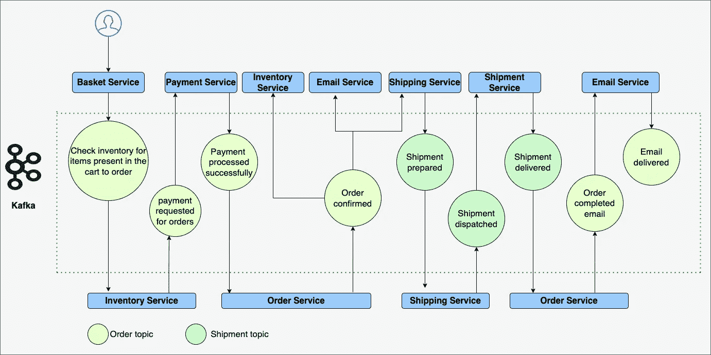

# 事件驱动架构简介

> 原文：<https://medium.com/walmartglobaltech/introduction-to-event-driven-architecture-84cec03047f?source=collection_archive---------3----------------------->

Photo by [Matthew Henry](https://burst.shopify.com/@matthew_henry?utm_campaign=photo_credit&utm_content=Free+Stock+Photo+of+Man+Signing+For+Shipping+Box+%E2%80%94+HD+Images&utm_medium=referral&utm_source=credit) from [Burst](https://burst.shopify.com/product?utm_campaign=photo_credit&utm_content=Free+Stock+Photo+of+Man+Signing+For+Shipping+Box+%E2%80%94+HD+Images&utm_medium=referral&utm_source=credit)

在探讨事件驱动架构(EDA)在电子商务世界中的优势之前，让我们花些时间来理解 EDA 是什么。

**事件驱动架构(EDA)**

事件驱动架构(EDA)结合了称为生产者和消费者的分离组件，能够通过称为代理的中介异步处理事件。

**事件驱动架构的核心概念**

*   **事件**

作为事件驱动架构的一部分，一切都集中在事件上。事件是 EDA 的核心单元。任何像用户创建帐户、HTTP 请求限速或查询数据库这样的过程都可以称为事件。

*   **事件记录**

需要捕获每个事件的事件记录，包括请求 ID、报头、原始 IP 地址、查询语句、时间戳、事件类型等信息。事件的数据有几种格式，比如 JSON、string 等。

*   **生产者和消费者**

在事件驱动架构中，将有几个服务。生产者和消费者就像处理事件的两个主要角色。生产者在事件发生时工作，准备事件记录并将其发送给托管的持久捕获器。另一方面，消费者不断轮询标准类型的事件，以便对这些事件进行所需的处理。

*   **流**

上面，我们提到了生产者将事件发送到一个受管理的持久捕获器。流是有组织的持久的和顺序的事件记录。每当事件发生时，生成器都会将事件记录生成到流中。消费者在流上投票以观察是否存在这样的事件。

*   **消息代理**

虽然生产者和消费者是事件驱动架构不可或缺的一部分，但我们还需要一个中介来帮助事件流的持久性和可用性。消息代理负责存储事件并将其交付给客户。

**基于事件架构的优势和权衡**

**好处**

*   微服务可以独立部署和维护，因为生产者服务不知道它的消费者服务，反之亦然。这是开发松散耦合服务的首要要求。
*   多个服务可以使用同一个事件。因此，生产者只需要将正确的事件发布到事件流中，而不需要打扰消费者。
*   异步性有助于不同的服务根据它们的处理能力来消费事件。
*   如果一个服务在记录被生产者发布的时候关闭，一旦服务启动，它可以返回并指向尚未消费的事件。

**权衡**

*   人们无法正确理解事件的连续发展
*   管理基于事件的分布式系统可能很复杂。如果一个服务出现异常，回滚该流程可能会很困难。

Apache Kafka 是需求量很大的开源消息代理之一，它使应用程序能够响应事件。

**电子商务和事件驱动架构(EDA)的世界**

为了满足电子商务应用程序在线订购的高需求，实时响应性和高度可伸缩性需要现代化和创新。

假设有人订购了一些商品，现在正等着送到他们的地址。不耐烦的顾客在等待送货的时候会一直看着门或者窗户。顾客会一直这样做，直到铃响。我们可以将这个例子转换成一个事件驱动的系统，在这个系统中，客户或服务将持续轮询交付状态。

**理解事件驱动架构需求的用例**

考虑一位顾客，他在购物篮中添加了多件商品，然后进入结账页面，填写了他的地址和付款信息，以便在网站上下单。一旦完成订购商品的付款，订单就会得到确认，并开始发货服务。

为了理解事件驱动架构是如何工作的，让我们深入了解从从购物车中订购商品到送货上门的流程。

**从商品结账到商品交付的步骤**

*   当顾客结帐时，第一件事就是检查库存中是否有商品。
*   当项目被确认时，客户被转发以输入地址和支付细节来开始支付。
*   一旦支付成功，订单服务将通知库存，触发订单的确认电子邮件，并模仿运输服务开始运输过程。
*   装运过程包括几个阶段，如准备装运、发送装运和将装运交付到地址。
*   货物交付后，会向订单服务传递一个事件来确认交付。然后，订单服务调用电子邮件服务向用户发送一封关于交货的确认邮件。

在上面的电子商务应用程序的图表中，我们可以理解通过不同的服务和事件发生作用的工作流。一些服务将创建事件，而其他服务使用事件记录。在某些场景中，服务使用一个事件，然后在执行某个操作后产生一个单独的事件。事件与主题相关联。

没有一个微服务拥有事件的过程。事件驱动系统中的每个服务负责事件上的特定任务。服务只处理它们消费的事件，然后产生动作结果。由于服务的松散耦合，您可以轻松地更新或替换服务来处理更多的事件，而不会干扰工作流。

**结论**

在本文中，我们概述了事件驱动系统是如何工作的，以及是什么使事件驱动架构如此有希望通过其异步处理和高度解耦的系统来满足事件的高实时处理。事件驱动的系统可以帮助满足用户和实时分析的高需求。

除了电子商务，事件驱动系统还广泛应用于金融、医疗、供应链、物联网等领域。