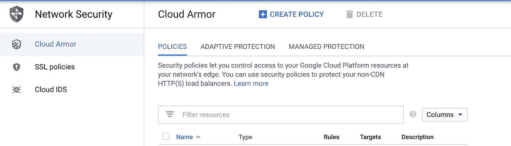
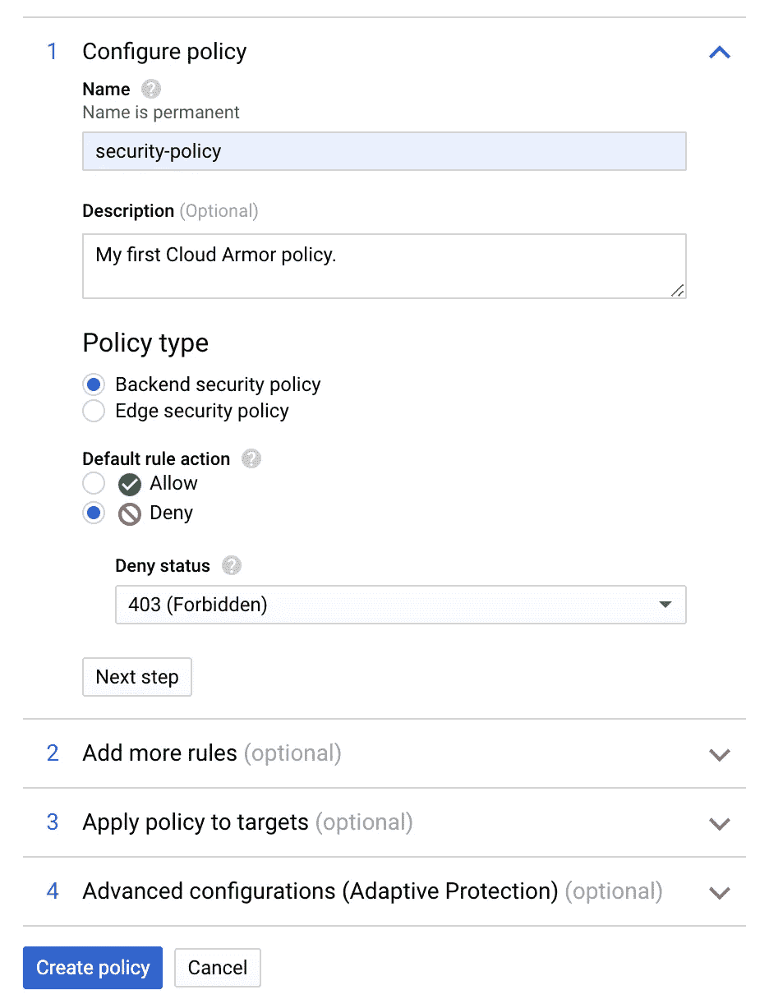
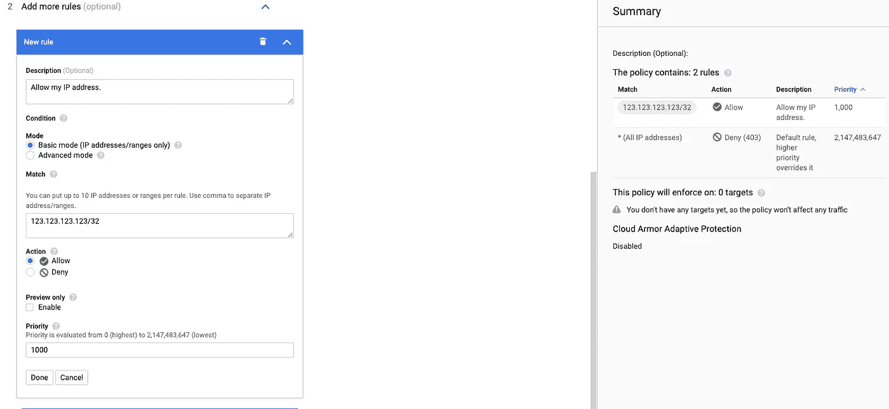

# 谷歌云装甲介绍-第 1 部分

> 原文：<https://medium.com/globant/introduction-to-google-cloud-armor-part-1-ddd76c7b9085?source=collection_archive---------2----------------------->

## WAF 和 DDoS 保护的政策和规则


> 这篇文章分为两部分。在第一篇文章中，你将了解 Google Cloud Armor，它是什么，以及它如何使用策略和规则来保护你的应用程序。在第二场中，你将看到如何在 GKE 应用 it 目标和使用它。我们还将探究它生成的日志。

为了更好地了解它的功能，请查看谷歌的[官方概述](https://cloud.google.com/armor)。同样，当你开始使用它并且对实现细节感到好奇时，请阅读[文档](https://cloud.google.com/armor/docs/security-policy-overview)，因为它提供了关于这个工具提供的所有功能的细节。

我的目标是让这个指南介于这两者之间，提供足够的细节来开始使用云甲，但不要让你厌烦那些不必要的信息。

# 介绍

Cloud Armor 是 GCP 的 DDoS 保护解决方案，这意味着它可以提供自动 L3 和 L4 DDoS 保护，而且能够提供第 7 层保护。前者是每一个主要的云提供商和 web 托管平台都具备的一种通用能力。但后者包括一些非常创新的功能，如速率限制、bot 管理和自适应保护。

云甲也是一个 Web 应用防火墙，这意味着它可以识别和阻止常见的攻击类型(想想 [OWASP top 10](https://owasp.org/www-project-top-ten/) )。它包含[预配置的规则](https://cloud.google.com/armor/docs/rule-tuning)，可以微调为子规则。因此，如果您愿意，您可以保护您的应用程序免受所有 SQL 注入攻击、常见的 XSS 入侵和一些会话固定攻击。

您将创建适用于负载平衡器的策略。每个策略可以包含多个规则，您可以在其中指定要阻止的实际内容。
您可以在这里[查看最新的价格方案](https://cloud.google.com/armor/pricing)关于政策、规则等影响因素。

# 设置云甲



Cloud Armor dashboard

创建策略有多种方式:GCP 仪表盘、gcloud 甚至是 Terraform。我们现在将集中讨论前两个。

首先打开 GCP，在搜索栏中输入*云甲*。如果您以前从未使用过它，您将必须激活 API(这不需要任何成本)。
完成后，就该创建您的第一份保单了。

## 创建策略

按下顶部的*创建策略*按钮，您将进入一个新屏幕:



Create new policy from the UI

这里选择一个适合的名字(这是最难的部分)，因为你以后不能改变它。对于策略类型，您可以保留*后端安全策略*，因为它有更多的保护功能。
默认规则指定默认情况下允许或阻止所有请求。这是很好的品味和具体情况。对于公共应用程序，我只想阻止几个 IP 或国家，我通常让*默认允许*。对于私人应用，我一般选择*拒绝。*

您也可以选择*拒绝*动作的响应代码。同样，这是具体情况，但如果你想让用户知道该动作被禁止，你可以使用 **403** 。如果你想给人留下他们寻找的资源并不存在的印象，你可以选择 **404** 。还有 502，我不用。

这些是必填字段，您可以按下*创建策略*按钮，它就准备好了。但是您可以选择在这个屏幕中创建规则，也可以将其附加到负载平衡器。

自适应保护是一项高级功能，但您仍可以将其作为预览打开。它会学习访问您站点的请求模式，并根据异常流量发出警报/建议补救措施。

也可以使用 *gcloud* 命令行实用程序创建策略:

```
gcloud compute security-policies create my-security-policy \
--description "My awesome policy"
```

# 创建规则

规则还有一个*允许*或*拒绝*动作，类似于策略基础规则，在基本场景中，如果基础规则是*允许*，那么其他规则将是*拒绝*，反之亦然。但是还有更复杂的情况，我们将在后面讨论一些细节。

现在，您可以单击 add rule 在该策略中创建您的第一个规则。基本模式很简单，你可以允许或阻止 IP 范围。因此，如果我想只允许我的 IP 地址，我会将基本规则设置为 deny，并创建一个规则来允许我的 IP 地址(您可以通过调用`curl ifconfig.me`来获得)。

如果*仅预览*被启用，则规则操作将仅被记录，而不会被实际执行。



Creating a new rule (overview on the right side)

在高级模式下，您可以通过使用逻辑运算符、基于标题值的过滤或引用预配置的规则(WAF)来创建更复杂的规则。在[文档](https://cloud.google.com/armor/docs/rules-language-reference)中有很多例子。
您还可以使用逻辑运算符，通过在一个规则中包含多个条件来降低一些成本。

比方说，如果我们想要阻止来自中国和俄罗斯的所有请求(无意冒犯)以及用户代理包含`curl`的请求，我们将创建如下内容:

```
'[CN, RU]'.contains(origin.region_code) || request.headers['user-agent'].contains('curl')
```

## WAF 规则

检查[该页面](https://cloud.google.com/armor/docs/rule-tuning)以查看关于可以过滤掉的漏洞类型的所有可能性。

为了阻止所有的 SQL 注入和跨站脚本攻击，我们将设置这个规则:`evaluatePreconfiguredExpr('xss-stable') || evaluatePreconfiguredExpr('sqli-stable')`。

我不建议在生产环境中马上这样做。这是其中一种情况，您可以打开*预览模式，*这样所有被这些规则阻止的请求都会被记录下来。之后，进行一些广泛的测试，如果您发现一些请求被阻止了，而这些请求通常是不应该被阻止的，那么您可以进行一些例外处理。

假设你注意到`owasp-crs-v030001-id942460-sqli`在测试中出现了很多次。如果您在这里查看表格[，您会注意到这是一个 3 级灵敏度规则，表示更高的假阳性几率。所以我们想排除它。在这种情况下，我们可以这样使用规则:](https://cloud.google.com/armor/docs/rule-tuning#sql_injection_sqli)

```
evaluatePreconfiguredExpr('sqli-stable', ['owasp-crs-v030001-id942460-sqli']) 
```

函数的第二部分可以包含一个由逗号分隔的一个或多个元素组成的数组，在这里您可以指定您希望从一般规则中排除的所有签名。

在本系列的第二部分，我将向您展示一个脚本，它可以用来过滤日志中出现的唯一签名。

## Log4j

2021 年 12 月，非常常用的 *log4j* Java 库中出现了一个重大漏洞。它是如此关键(*CVSS*10 分)并且容易被利用，以至于云装甲团队引入了一种新的表达方式来防止它。您可以通过添加以下规则来实现这一点:

```
evaluatePreconfiguredExpr('cve-canary')
```

在他们的博客文章中找到更多关于这条规则和漏洞的信息。

## 限速

这是一个非常有用的 L7 保护功能，在撰写本文时仍在预览中(但工作得相当好)。目前这些规则只能从命令行创建，但是将来可能会得到 UI 支持。

这里有一个例子:

```
gcloud beta compute security-policies rules create 700 \
--security-policy my-security-policy  \
--src-ip-ranges="100.0.0.0/24"     \
--action=throttle                \
--rate-limit-threshold-count=100 \
--rate-limit-threshold-interval-sec=60 \
--conform-action=allow           \
--exceed-action=deny-404         \
--enforce-on-key=IP
```

您通过规则的优先级(在上面的例子中是 700)和它所应用的安全策略( *my-security-policy* )来识别规则。

动作可以是*油门*或*限速禁止*。该规则将计算来自每个特定 IP 地址(由`enforce-on-key`定义)的请求数量，如果这些请求在最后的`rate-limit-threshold-interval-sec` (60)秒内超过了由`rate-limit-threshold-count` (100)指定的限制，那么下面的请求将被拒绝，并显示 404 状态代码(`exceed-action`)。
在**节流**的情况下，当请求数量再次低于时间间隔内允许的限制时，用户可以继续发出新的请求并得到响应。然而，使用**基于费率的禁令**、**、**您可以阻止他们在设定的时间内(例如 10 分钟)发出新的请求。

如果我们希望在预览中阻止来自美国的所有请求，如果它们在过去 10 分钟内超过 100 个请求，我们可以创建此规则:

```
gcloud beta compute security-policies rules create 825 \
--security-policy my-security-policy \
--expression "origin.region_code == 'US'" \
--action=rate-based-ban \
--ban-duration-sec=300 \
--ban-threshold-count=100 \
--ban-threshold-interval-sec=600 \
--conform-action=allow \
--exceed-action=deny-403 \
--enforce-on-key=IP \
--description "Ban US requests" \
--preview
```

禁令可以与限制结合起来创建复杂的规则。

要查看可以指定的所有可用选项，请在此处查看文档。

## 其他功能

你可以使用[机器人管理](https://cloud.google.com/armor/docs/bot-management)向非人类访客提供 reCAPTCHA 挑战来阻止他们。如果你怀疑你的网站可能是网络抓取的对象，这是很有用的，常见的例子包括电子商务、新闻网站、工作论坛等。

[自适应保护](https://cloud.google.com/armor/docs/adaptive-protection-overview)使用机器学习来检测流量中的异常。如果没有托管保护 plus，您只会在发生异常情况时收到警报，而没有攻击签名或现成的规则可供快速部署。

您可以使用[命名的 IP 列表](https://cloud.google.com/armor/docs/armor-named-ip#ip-list-providers)轻松允许来自几个 CDN 提供商的所有流量:`evaluatePreconfiguredExpr(‘sourceiplist-cloudflare’)`

在第一篇文章中，我们熟悉了云装甲，介绍了策略和规则，并探索了现有的不同类型的规则和用例。

在下一部分的[中，我们将从 UI 和 Kubernetes 配置中将这些规则应用于目标负载平衡器。之后，我们将探索日志记录，并使用脚本来过滤日志。](/globant/introduction-to-google-cloud-armor-part-2-c3ff50739aa9)