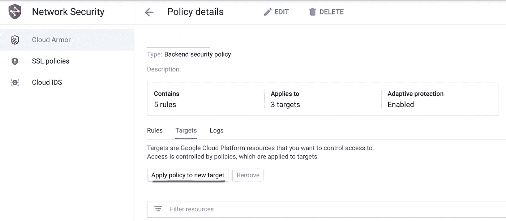
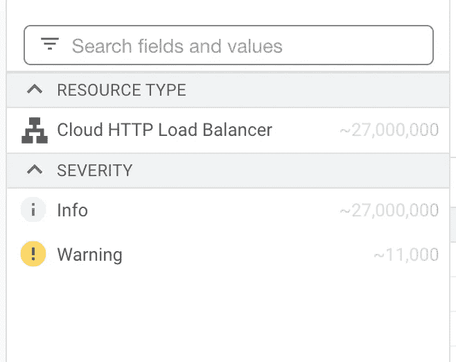
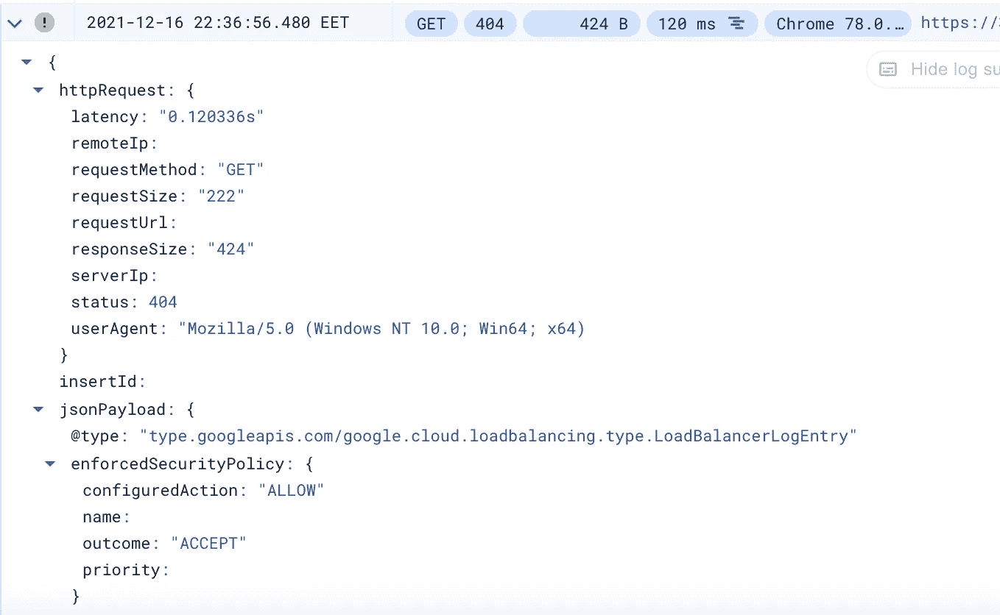

# Google Cloud Armor 介绍-第 2 部分

> 原文：<https://medium.com/globant/introduction-to-google-cloud-armor-part-2-c3ff50739aa9?source=collection_archive---------3----------------------->

## 云甲和 GKE 一起过滤日志


Photo by [Christopher Gower](https://unsplash.com/@cgower?utm_source=unsplash&utm_medium=referral&utm_content=creditCopyText) on [Unsplash](https://unsplash.com/collections/i1PHWGMk-uE/data-security?utm_source=unsplash&utm_medium=referral&utm_content=creditCopyText)

在[的第一篇文章](/globant/introduction-to-google-cloud-armor-part-1-ddd76c7b9085)中，我们探讨了什么是云装甲，如何建立政策和不同种类的规则。在这一篇中，我们将把这些策略分配给目标，并详细介绍 Kubernetes 资源。最后，我们将看到如何通过监控和过滤生成的日志来处理第二天的操作。

# 目标

目标是负载平衡器，或者更正式的说法是:“非 CDN HTTP(S)负载平衡器后端服务”。基本上后端服务处理负载平衡器中大多数重要的事情，你可以在这里阅读更多关于它们的[。](https://cloud.google.com/load-balancing/docs/backend-service)

将策略分配给目标的最简单方法是通过 web 界面，转到 *Cloud Armor* ，选择*策略*(我们在上一篇文章中创建的)，单击*目标*和*将策略应用到新目标。*



Assigning the policy to a new target

在这里，您将获得一个列表，其中列出了您可以选择的所有可用且有效的负载平衡器。如果它不在列表中，则说明有问题(检查它的类型以及是否启用了 CDN)。添加它们后，您就差不多完成了，策略将处于活动状态，并且基于预览标志，它将根据您在规则中指定的情况采取操作，或者只记录它将执行的操作。

# GKE

如果您的应用程序运行在 Kubernetes 集群中(在 Google Kubernetes 引擎上)，那么您可以以编程的方式分配策略，而不需要点击 UI。

如果您在 Kubernetes 中使用负载平衡器类型的入口或服务，那么将在 GCP 创建一个负载平衡器资源，通过它传入的请求将到达您的集群。您可以通过 BackendConfig 操作负载平衡器的特性，backend config 是 Kubernetes 中的一个 CRD。

## BackendConfig

有很多关于这个资源的[文档](https://cloud.google.com/kubernetes-engine/docs/how-to/ingress-features#configuring_ingress_features)，但是足以说明你可以用它来配置健康检查、云装甲安全策略、超时、CDN、日志记录等等。我们将看到前两者的一个例子。

该资源如下所示:

```
apiVersion: cloud.google.com/v1
kind: BackendConfig
metadata:
  name: my-backend-config
spec:
  healthCheck:
    checkIntervalSec: 15
    port: 80
    type: HTTP
    requestPath: /health 
  securityPolicy:
    name: "my-security-policy"
```

在 spec 部分中，您定义了您想要操作的负载平衡器的元素。如您所见，我们创建了一个运行状况检查，它每 15 秒运行一次，并尝试访问端口 80 上的`/health`路径。此外，我们指定使用名为`my-security-policy`的安全策略，它应该已经存在。

BackendConfig 应用于**服务**和**而不是入口。**

这是通过注释完成的，因此将以下内容添加到服务中:

```
annotations:
  cloud.google.com/backend-config: '{"ports": {"80":"my-backend-config"}}'
```

上述示例适用于服务使用端口 80 的情况。如果它有多个端口，并且您想要[将 BackendConfig 应用到所有的端口](https://cloud.google.com/kubernetes-engine/docs/how-to/ingress-features#same_backendconfig_for_all_service_ports)，您可以使用`default`而不是`80`。

很好，到目前为止，我们创建了自己的安全策略，为它定义了规则，并将其应用于负载平衡器，甚至通过 Kubernetes 的定义。接下来，我们想看看 Cloud Armor 发现了什么，所以如果需要的话可以调整规则——我们不想让它在生产中搞得一团糟，阻止合法用户。

# 记录

你可以在日志部分访问 Cloud Armor 采取的所有行动。只需转到策略并点击*日志*(在*目标*旁边)。这将带您进入*操作*中心的*日志*部分，其中有一个预定义的查询，如下所示:

```
resource.type:(http_load_balancer) AND jsonPayload.enforcedSecurityPolicy.name:(my-security-policy)
```

很基本的东西。这将在右上角显示在过去~指定时间内发生的所有请求，通常是 1 小时。



27 million logs in the last 7 days

这很容易变成一个巨大的数字，所以你需要一种方法来过滤它们。首先，您可以只检查警告消息，因为合法的请求并不那么有趣。点击其中一个日志，并使用*扩展嵌套字段*按钮查看与其相关的所有详细信息。

这里最重要的是 *remoteIp* (用户的 Ip 地址)、 *userAgent、status、enforcedSecurityPolicy* 和 *previewSecurityPolicy。*



Example log entry — with some fields removed

*enforcedSecurityPolicy* 给你云装甲采取的实际行动，在这种情况下，它被允许通过。 *previewSecurityPolicy* 显示了如果预览模式未启用时的操作。例如，动作可以是*拒绝或*基于费率的禁止。

因此，要获取所有可能被阻止的日志，可以使用以下查询:

```
resource.type:(http_load_balancer) AND jsonPayload.enforcedSecurityPolicy.name:(my-security-policy) AND jsonPayload.previewSecurityPolicy.configuredAction!=Accept AND severity=WARNING
```

AND 运算符不是必需的，因为这是默认行为。严重性不一定是警告类型，正常请求也可以被抑制。

这种方法有助于了解系统中发生了什么。但是如果有大量的日志(数千或数百万)，您不能一个一个地查看它们，但是您仍然想知道哪些类型的请求被阻塞了，尤其是在使用 WAF 功能时。
为此，您可以创建一个脚本来自动解析日志条目。

## 被阻止漏洞的脚本

您需要安装 *gcloud* 实用程序，以及用于解析 JSON 的 *jq* 。

示例脚本如下所示，当然需要根据您的具体需求进行微调:

```
gcloud logging read 'resource.type:(http_load_balancer) AND severity=WARNING AND jsonPayload.previewSecurityPolicy.configuredAction="DENY"' --format json --limit 1000 --freshness='7d' --project=$myproject > cloud-armor-logs.jsonjq -r ".[] | .jsonPayload.previewSecurityPolicy.preconfiguredExprIds" cloud-armor-logs.json > vulnerabilitiessed -i '' -e 's/[][]//g' vulnerabilities
sort log-result | uniq > unique_vulnerabilitiesrm vulnerabilities
rm cloud-armor-logs.json
```

这将获得过去 7 天中所有被拒绝的请求(从预览中)，最多 1000 个日志，并将它们保存到一个 JSON 文件中。然后我们解析这个文件，只从中提取漏洞，然后进行排序。从结果来看，我们只保留了独特的漏洞类型，可能如下所示:

```
 "owasp-crs-v030001-id913101-scannerdetection"
  "owasp-crs-v030001-id941130-xss"
  "owasp-crs-v030001-id942200-sqli"
  "owasp-crs-v030001-id942260-sqli"
  "owasp-crs-v030001-id942410-sqli"
  "owasp-crs-v030001-id942430-sqli"
```

由此，我们可以看到，多个 SQL 注入尝试将被阻止，以及一些 XSS 和 scannerdetection。基于这些，我们可以对我们的规则做出一些适当的决定。

这个脚本当然可以改进，比如添加请求的数量、来源国、提供过滤选项作为参数等。我会留给好奇的读者，但是如果你创造了一些好的东西，你可以在评论中与我们分享。

# 摘要

感谢您坚持通过这两篇文章来了解更多关于云甲的知识。现在，您可以开始自己探索，为您的应用程序创建策略和规则，将其分配给目标，并通过日志监控发生的事情。

这些是我的第一篇媒体文章，所以如果你喜欢它们，你可以给我一个掌声，并在评论中留下一些建设性的批评。

下次见！