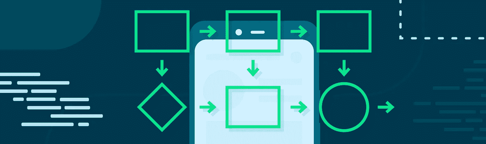
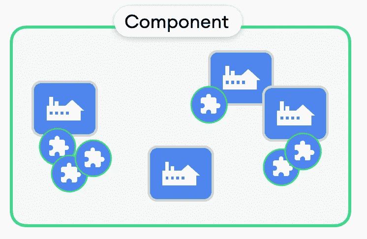
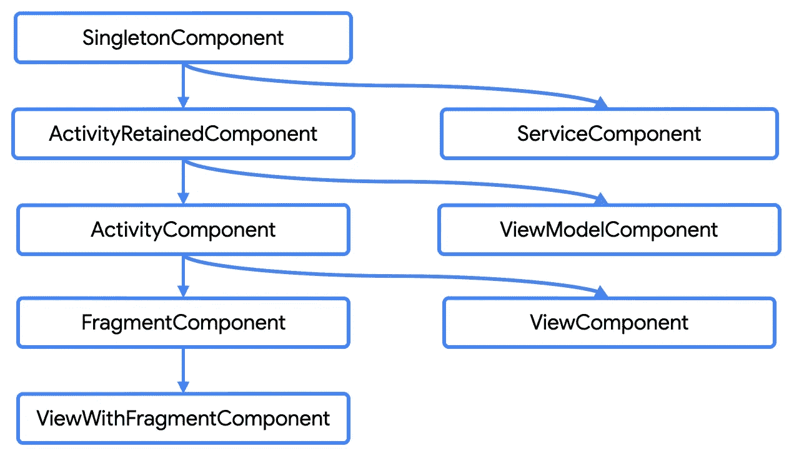
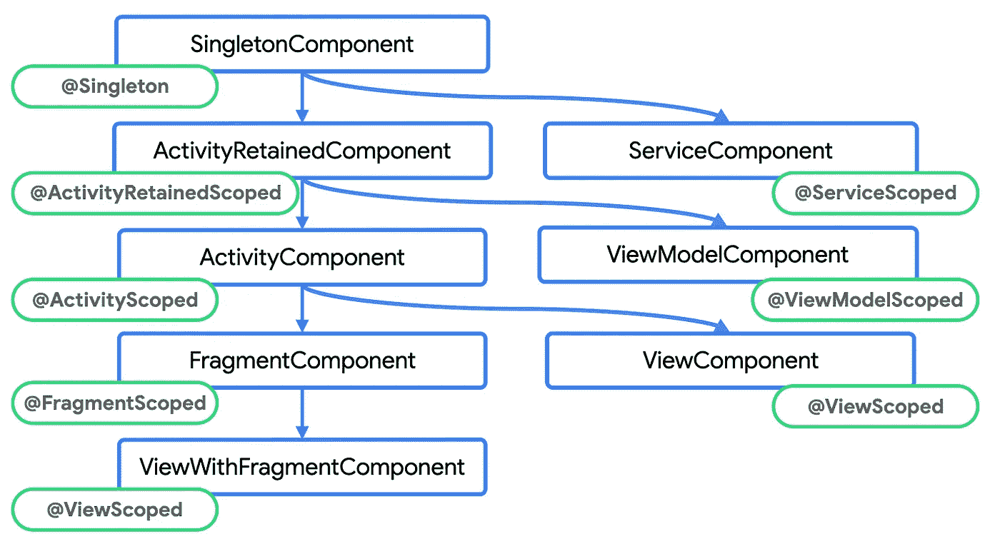

# 疯狂技能系列之剑柄介绍

> 原文：<https://medium.com/androiddevelopers/introduction-to-hilt-in-the-mad-skills-series-40f0908f2fc0?source=collection_archive---------0----------------------->

## 剑柄狂技能系列第一集

**这是剑柄上的狂技能篇系列！**在这篇文章中，我们将了解为什么依赖注入(DI)对你的应用和 Hilt 很重要，这是 Jetpack 推荐的 Android 上的依赖注入解决方案。

如果您喜欢以视频格式观看这些内容，请点击此处查看:

通过在你的 Android 应用中遵循依赖注入的原则，你为一个好的应用架构打下了基础。它有助于代码的可重用性、易于重构和易于测试！点击了解更多关于 DI 福利[的信息。](http://d.android.com/dependency-injection)

当在您的项目中创建类的实例时，您可以通过满足类所需的依赖关系和传递依赖关系来手动练习依赖图。

但是每次手动这样做都会涉及一些样板代码，并且容易出错。例如，我们在开源 Google I/O 应用程序[中的一个视图模型。您能想象创建一个](https://github.com/google/iosched)`[FeedViewModel](https://github.com/google/iosched/blob/main/mobile/src/main/java/com/google/samples/apps/iosched/ui/feed/FeedViewModel.kt)`及其依赖项和可传递依赖项需要多少代码吗？

这很难，重复，而且我们很容易弄错依赖关系。通过使用依赖注入库，我们可以获得 DI 的好处，而不必手动提供依赖，因为该库会为您生成所有必要的代码。这就是希尔特发挥作用的地方。

# 柄

[Hilt](http://d.android.com/hilt) 是一个由 Google 开发的依赖注入库，通过努力工作并生成所有你需要编写的样板文件，帮助你在你的应用程序中充分利用 DI 最佳实践。

通过使用注释，Hilt 在编译时为您生成代码，使它在运行时非常快。这是通过使用 [Dagger](https://developer.android.com/training/dependency-injection/dagger-basics) 的能力完成的，它是在其上构建的 JVM DI 库。

> Hilt 是 Jetpack 推荐的用于 Android 应用的 DI 解决方案，它带有工具和其他 Jetpack 库支持。

# 快速启动

所有使用 Hilt 的应用程序都必须包含一个用`@HiltAndroidApp`标注的应用程序类，因为它会在编译时触发 Hilt 的代码生成。为了让 Hilt 能够将依赖注入到活动中，活动需要用`@AndroidEntryPoint`进行注释。

要注入一个依赖项，用`@Inject`来注释你希望 Hilt 注入的变量。当`super.onCreate`被调用时，所有注入的变量都将可用。

在这个例子中，我们将一个`MusicPlayer`注入到`PlayActivity`中。但是 Hilt 怎么知道如何提供类型`MusicPlayer`的实例呢？嗯，目前没有！我们需要让希尔特知道如何做…使用注释！当然了。

用`@Inject`注释一个类的构造函数告诉 Hilt 如何创建该类的实例。

这就是将依赖注入到活动中所需要的一切！那很容易！我们从一个简单的例子开始，因为 MusicPlayer 不依赖于任何其他类型。但是如果我们有其他依赖项作为参数传递，当提供一个 MusicPlayer 实例时，Hilt 会处理这些依赖项并满足它们。

事实上，这是一个非常简单和天真的例子。但是，如果您必须手动完成我们到目前为止所做的工作，您会如何做呢？

# 手动操作

当手动执行 DI 时，您可以让*依赖容器*类负责提供类型，并管理它所提供的实例的生命周期。这里有点过于简单了，这就是希尔特在引擎盖下做的事情！

当您用`@AndroidEntryPoint`注释活动时，会自动创建、管理一个依赖容器，并将其关联到`PlayActivity`。姑且称我们的手动实现为`PlayActivityContainer`。通过用`@Inject`注释`MusicPlayer`，我们基本上是在告诉容器如何提供类型`MusicPlayer`的实例。

在活动中，我们需要创建容器的实例，并使用它填充活动的依赖项。在用`@AndroidEntryPoint`注释活动时，这也是由 Hilt 完成的。

# 注释摘要

到目前为止，我们已经看到当`**@Inject**`被用来注释一个类的构造函数时，它告诉 Hilt 如何提供那个类的实例。当它在一个`@AndroidEntryPoint`注释类中注释一个变量时，Hilt 会将该类型的一个实例注入到该类中。

`**@AndroidEntryPoint**`可以注释大多数 Android 框架类，而不仅仅是活动，它为该类创建一个依赖容器实例，并填充所有`@Inject`注释变量。

`**@HiltAndroidApp**`注释了`Application`类，除了触发 Hilt 的代码生成，它还创建了一个与 Application 类关联的依赖容器。

# 手柄模块

既然我们已经了解了刀柄的基本知识，让我们把例子复杂化。现在，`MusicPlayer`在其构造函数`MusicDatabase`中获取一个依赖项。

因此，我们需要告诉 Hilt 如何提供`MusicDatabase`的实例。例如，当类型是一个接口或者你不拥有这个类，因为它来自一个库，你不能用`@Inject`注释它的构造函数！

假设我们在应用程序中使用 Room 作为持久性库。回到我们的手动实现`PlayActivityContainer`，当提供`MusicDatabase`时，这将是一个抽象类，我们希望在提供依赖时运行一些代码。然后，在提供`MusicPlayer`的实例时，我们需要调用提供或者满足`MusicDatabase`依赖的方法。

我们不需要担心 Hilt 中的传递依赖，因为它会自动连接所有的传递依赖。然而，我们需要让它知道如何提供类型`MusicDatabase`的实例。为此，我们使用刀柄模块。

一个句柄模块是一个用`@Module`标注的类。在类中，我们可以有一些函数告诉 Hilt 如何提供某些类型的实例。刀柄所知道的这些信息在刀柄行话中也被称为*绑定*。

用`@Provides`标注的函数告诉 Hilt 如何提供`MusicDatabase`类型的实例。主体包含了 Hilt 需要执行的代码块，这和我们手动实现它的时候完全一样。

返回类型`MusicDatabase`，通知 Hilt 这个函数提供什么类型。而函数参数告诉 Hilt 对应类型的依赖关系，在本例中，是在 Hilt 中已经可用的`ApplicationContext`。这段代码告诉 Hilt 如何提供`MusicDatabase`类型的实例，或者换句话说，我们有一个`MusicDatabase`的*绑定*。

希尔特模块也用`@InstallIn`注释进行了注释，该注释指出在哪些依赖容器或组件中可以获得该信息。但是什么是组件呢？让我们更详细地讨论这个问题。

# 刀柄组件

组件是 Hilt 生成的一个类，负责提供类型的实例，就像我们一直手动编程的容器。在编译时，Hilt 遍历应用程序的依赖图并生成代码，为所有类型提供它们的可传递依赖关系。

*A Component is a class that Hilt generates that is responsible for providing instances of types*

Hilt 为大多数 Android 框架类生成一个组件或依赖容器。每个组件的信息或绑定通过组件层次结构传播。

*Hilt’s components hierarchy*

如果`MusicDatabase`绑定在`SingletonComponent`中可用，对应于`Application`类，它也将在其余组件中可用。

这些组件由 Hilt 在编译时自动生成，当您用`@AndroidEntryPoint`注释这些类时，它们被创建、管理并与相应的 Android 框架类相关联。

模块的`@InstallIn`注释有助于控制这些绑定在哪里可用，以及它们可以使用哪些其他绑定。

# 辖域

回到我们手动创建的`PlayActivityContainer`代码，我不确定你是否意识到了，但是每次需要`MusicDatabase`依赖时，我们都会创建一个不同的实例。

这并不理想，因为我们可能希望在整个应用程序中重用同一个`MusicDatabase`实例。我们可以共享同一个实例，而不是一个函数，方法是将所有内容放在一个变量中。

基本上，我们将`MusicDatabase`类型限定到这个容器中，因为我们总是提供相同的实例作为依赖。如何用刀柄做到这一点？好吧，这没什么好奇怪的…还有另一个注释！

通过在`@Provides`方法中使用`@Singleton`注释，我们告诉 Hilt 总是在那个组件中共享这个类型的同一个实例。

`@Singleton`是范围标注。并且每个句柄组件都有一个相关的范围注释。

*Scope annotations for each Hilt component*

如果你想把一个类型的范围扩大到`ActivityComponent`，你可以使用`ActivityScoped`注释。这些注释可以在模块中使用，但是它们也可以注释构造函数用`@Inject`注释的类。

# 粘合剂

有两种类型的绑定:

*   没有用作用域注释进行注释的绑定被称为**未作用域绑定**，就像`MusicPlayer`一样，如果没有安装在模块中，这些绑定对所有组件都可用。
*   **用作用域注释注释的作用域绑定**，如`MusicDatabase`，或者安装在模块中的未作用域绑定，在相应的组件和组件层次结构中它下面的组件中都是可用的。

# Jetpack 扩展

> Hilt 提供了与最流行的 Jetpack 库的集成:ViewModel、Navigation、Compose 和 WorkManager。

除了 ViewModel，每个集成都需要不同的库来添加到您的项目中。查看[文档](http://goo.gle/hilt-jetpack)了解更多相关信息。你还记得我们在博文开头看到的来自 [iosched](https://github.com/google/iosched) 的`[FeedViewModel](https://github.com/google/iosched/blob/main/mobile/src/main/java/com/google/samples/apps/iosched/ui/feed/FeedViewModel.kt)`代码吗？想看看有刀柄支撑的样子吗？

除了用`@Inject`注释构造函数，为了让 Hilt 知道如何提供这个 ViewModel 的实例，我们需要用`@HiltViewModel`注释这个类。

就是这样！您不需要为此手动创建一个 ViewModel 提供程序，Hilt 会处理好的。

# 了解更多！

Hilt 建立在另一个流行的依赖注入库之上: [Dagger](https://developer.android.com/training/dependency-injection/dagger-basics) ！匕首在接下来的几集里会经常被提起！如果你使用匕首，匕首和刀柄可以一起工作。在[指南](http://dagger.dev/hilt/migration-guide)中阅读更多关于迁移 API 的信息。

关于 Hilt 的更多信息，我们有一个[备忘单](http://goo.gle/hilt-cheatsheet),上面有最流行的注释，它们做什么，以及如何使用它们。除了我们关于 Hilt 的[文档](http://d.android.com/hilt)之外，我们还有[代码实验室](http://d.android.com/codelabs/android-hilt)来学习更多的实践经验。

这一集就到这里！但这还没有结束！我们将有更多的疯狂技能集，所以请关注 Android 开发者媒体出版物，看看它们何时发布。