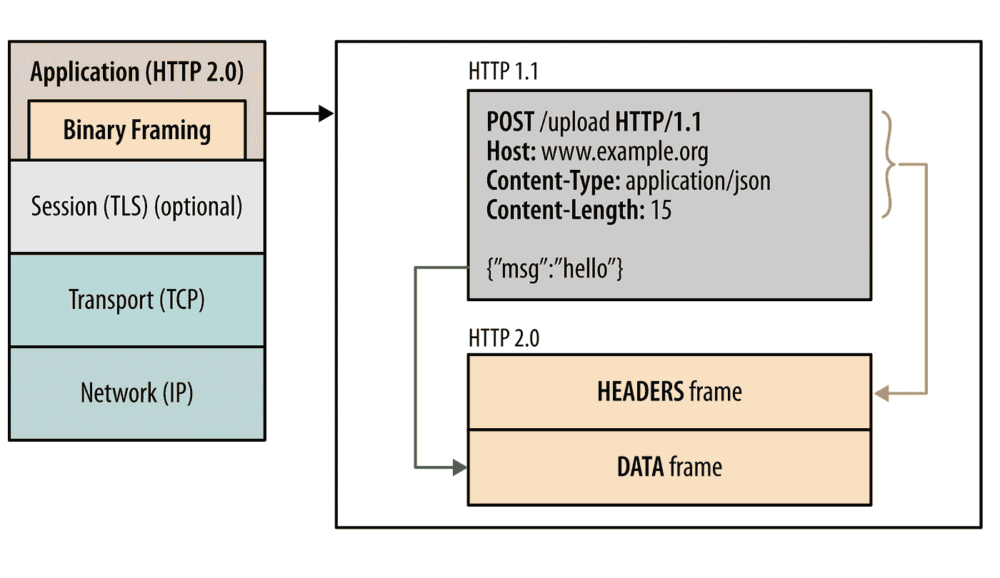
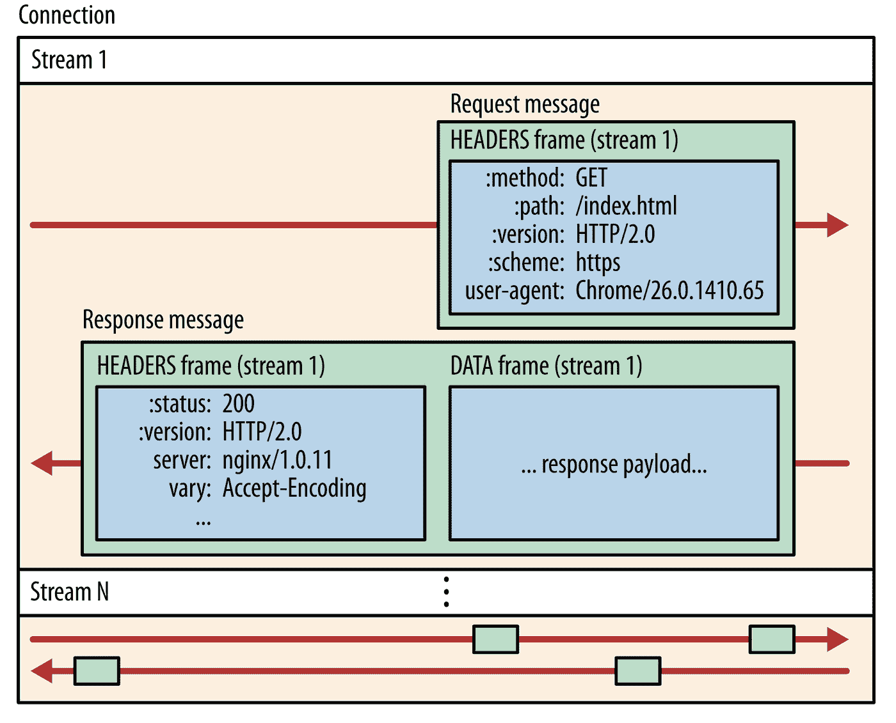
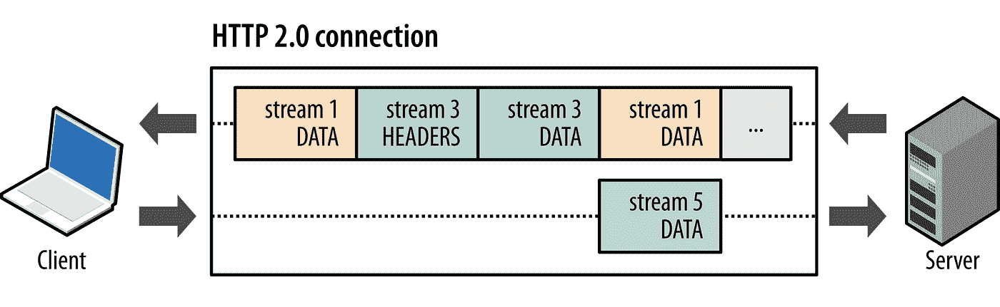
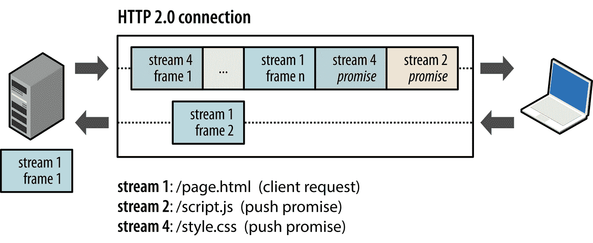
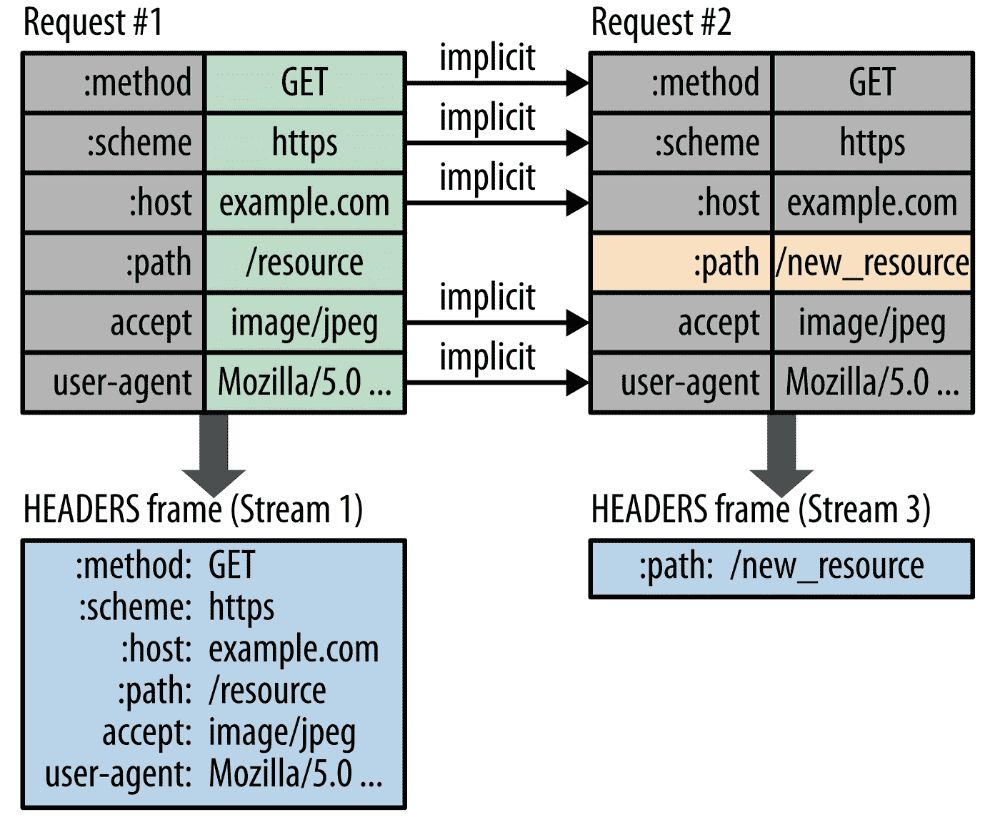
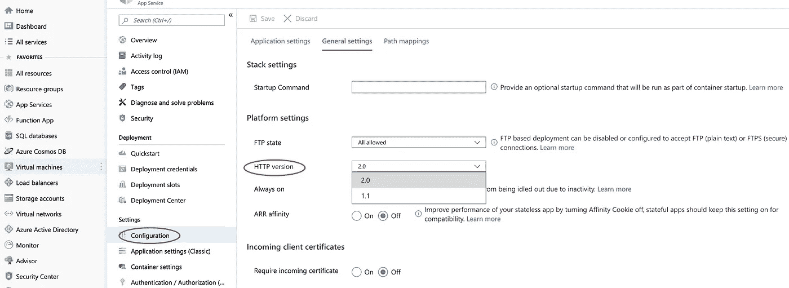

# HTTP 2 简介

> 原文：<https://medium.com/walmartglobaltech/introduction-to-http-2-d3e3b4f4d662?source=collection_archive---------2----------------------->


# HTTP 的简史

HTTP 是一个古老的协议，最初定义于 1991 年，最新的主要修订版 HTTP/1.1 发布于 1999 年。1999 年的网站与我们今天开发的网站非常不同。现在加载一个普通网站的主页所需的数据量是 1.9 MB，显示一个页面需要 100 多个单独的资源。资源可以是从图像或字体到 JavaScript 或 CSS 文件的任何东西。当检索显示一个现代网站所需的大量资源时，HTTP/1.1 的性能并不好。

# HTTP/2 简介

HTTP/2 将使我们的应用程序更快、更简单、更健壮，因为它允许我们撤销以前在应用程序中完成的许多 HTTP/1.1 变通方法，并在传输层本身解决这些问题。

HTTP/2 的主要目标是通过启用完整的请求和响应多路复用来减少延迟，通过有效压缩 HTTP 头字段来最小化协议开销，并添加对请求优先级和服务器推送的支持。

HTTP/2 不会以任何方式修改 HTTP 的应用程序语义。所有的核心概念，比如 HTTP 方法、状态代码、URIs 和头字段都保留了下来，这意味着所有现有的应用程序都可以不加任何修改地交付。

# HTTP/2 的功能

# 二进制帧层

HTTP/2 引入了新的二进制帧层，它规定了 HTTP 消息如何在客户机和服务器之间封装和传输。

HTTP/1.1 使用换行符分隔的明文协议，而 HTTP/2 通信被分成更小的消息和帧，每个消息和帧都以二进制格式编码。



source:developers.google.com

# 流、消息和帧

为了理解用于在客户机和服务器之间交换数据的新的二进制成帧机制，我们需要熟悉 HTTP/2 术语:

*   *流*:已建立连接内的双向字节流，可以携带一条或多条消息。
*   *消息*:映射到逻辑请求或响应消息的完整帧序列。
*   帧:HTTP/2 中最小的通信单元，每个单元包含一个帧头，它至少标识该帧所属的流。



source:developers.google.com

这些术语的关系描述如下:

*   所有通信都是通过一个 TCP 连接进行的，该连接可以承载任意数量的双向流。
*   每个流都有一个唯一的标识符和可选的优先级信息，用于承载双向消息。
*   每个消息都是一个逻辑 HTTP 消息，如请求或响应，由一个或多个帧组成。
*   帧是承载特定类型数据的最小通信单元，例如 HTTP 报头、消息有效载荷等。来自不同流的帧可以被交织，然后经由每个帧的报头中嵌入的流标识符被重组。

# 请求和响应多路复用

对于 HTTP/1.1，客户端使用多个 TCP 连接来发出多个并行请求，以提高性能。使用 HTTP/1.1，每个连接一次只能传送一个响应(响应队列)。

有了 HTTP/2，新的二进制成帧层消除了这些限制，并通过允许客户机和服务器将 HTTP 消息分解成独立的帧，将它们交错，然后在另一端重新组合，实现了完全的请求和响应多路复用。



source:developers.google.com

# 每个原点一个连接

HTTP/2 不再需要多个 TCP 连接来并行多路传输流，因为它使用了新的二进制成帧机制，HTTP/2 中的每个流都被分割成多个帧，这些帧可以交错并区分优先级。因此，对于 HTTP/2，每个源只需要一个连接，这提供了许多性能优势。

# 服务器推送

HTTP/2 的另一个强大的新特性是服务器能够为单个客户机请求发送多个响应。也就是说，除了对原始请求的响应之外，服务器可以将额外的资源推送到客户端，而客户端不必显式地请求每一个资源。



source:developers.google.com

典型的 web 应用程序由多个资源组成，这些资源由客户端通过检查服务器提供的文档来发现。然后，我们可以消除额外的延迟，让服务器提前推送相关资源。服务器已经知道客户端将需要哪些资源，这就是服务器推送。

# 标题压缩

每个 HTTP 传输都带有一组描述传输的资源及其属性的头。在 HTTP/1.1 中，该元数据总是以纯文本的形式发送，每次传输会增加 500-800 字节的开销，如果使用 HTTP cookies，有时会增加数千字节。为了减少这种开销并提高性能，HTTP/2 使用 HPACK 压缩格式来压缩请求和响应头元数据，这种压缩格式使用了两种简单但功能强大的技术。

1.  它允许通过静态霍夫曼码对传输的报头字段进行编码，从而减小了它们各自的传输大小。
2.  它要求客户端和服务器都维护和更新先前看到的报头字段的索引列表(换句话说，它建立了共享的压缩上下文)，然后该列表被用作有效编码先前传输的值的参考。



source:developers.google.com

# 利弊

# 优点:

*   HTTP/2 是二进制的，而不是文本的。
*   通过引入报头字段压缩，HTTP2 能够更有效地利用网络资源并减少延迟。
*   HTTP/2 是完全多路复用的。我们可以在一个 TCP 连接中发出多个并行请求来提高性能。这又导致可用网络容量的更好利用。
*   有了服务器推送的新特性，服务器已经知道客户端将需要哪些资源，而无需客户端像 CSS 或 JS 文件那样明确地请求每一个资源。
*   总的来说，有了 HTTP2，我们可以大大减少应用程序的加载时间。

# 缺点:

首先，目前确实没有比 HTTP/2 更好的替代方案。但是，作为一名 IT 专家，您仍然应该知道该协议的弱点。一些专家认为，随着“HTTP/3”协议的发布，这些问题可能会在未来得到解决，但就目前而言，这些只是一些不利因素。

*   不需要加密。
*   Cookie 安全性仍然是一个问题。
*   它不是很快，也不是超级现代。

# 在 Azure 应用服务上启用 HTTP/2

默认情况下，对所有客户禁用 HTTP/2。但是，如果您想为您的站点启用 HTTP/2，请遵循以下步骤:

打开 Azure portal，转到您的应用服务并搜索“配置”。

在配置中，转到“常规设置”选项卡

在常规设置中会有一个名为“HTTP 版本”的下拉菜单。选择 2.0 版本并保存。

重新启动你的应用服务，你就完成了！



**注意**:大多数现代浏览器只支持在 SSL 上使用 HTTP/2 协议，而非 SSL 流量则继续使用 HTTP/1.1，App Service 使 SSL 的启动和运行变得很容易。[了解如何为你的应用配置](https://docs.microsoft.com/en-us/azure/app-service/web-sites-purchase-ssl-web-site)新的 SSL 证书，或者了解如何[将现有的 SSL 证书](https://docs.microsoft.com/en-us/Azure/app-service/app-service-web-tutorial-custom-ssl)绑定到你的应用。

# 向后兼容 HTTP/1.1

HTTP/2 是向后兼容的，不支持 HTTP/2 的浏览器将回退到使用 HTTP/1.1。我们将测试 curl 请求的向后兼容性。

# 使用 HTTP/1.1 的 Curl 请求

```
curl -I — http1.1 <hostname>**response** :HTTP/1.1 200 OK
Content-Length: 3318
Content-Type: text/html
Last-Modified: Wed, 15 May 2019 11:19:57 GMT
Accept-Ranges: bytes
Date: Wed, 15 May 2019 18:18:48 GMT
```

# 使用 HTTP/2 的 Curl 请求

```
curl -I — http2 <hostname>**response** :HTTP/2 200
content-length: 3318
content-type: text/html
last-modified: Wed, 15 May 2019 11:19:57 GMT
accept-ranges: bytes
date: Wed, 15 May 2019 18:22:09 GMT
```

正如我们在上面的例子中看到的，当我们使用 HTTP/1.1 协议向启用了 HTTP/2 的服务器发送 curl 请求时，我们得到的是 HTTP/1.1 中的响应，但是当我们使用 HTTP/2 协议发送请求时，我们得到的是 HTTP/2 中的响应。这个测试表明 HTTP/2 向后兼容 HTTP/1.1

# HTTP/2 的性能改进

我创建了一个简单的页面，其中包含多个 Rest api 调用，我将用它来演示 HTTP/2 的性能改进。

# 代码片段

**HTML**

**JS 控制器**

在上面的 controller 代码中，我们创建了一个 someFunction()方法，其中我们调用了一个资源(部署在 azure app service 上的 Rest API ),然后我们使用 q.all()方法多次调用 someFunction()方法来测试加载时间。

# 使用 HTTP/1.1 的页面加载时间

我们可以在瀑布图中看到，请求是如何通过多个批处理(TCP 连接)发出的，导致页面加载时间达到 9.408 秒。


# 使用 HTTP/2 的页面加载时间

我们可以在瀑布图中看到请求是如何通过 2 个批处理(TCP 连接)发出的，从而将页面加载时间减少到 4.196 秒。这与 HTTP/1.1 相比在加载时间上有很大不同


正如我们在上面的比较中所看到的，使用 HTTP/2，我们可以极大地提高网页性能。目前，几乎所有的 web 客户机都广泛支持 HTTP/2，所以它的实现是没有痛苦的。虽然 HTTP/2 协议的实现很容易，但是你应该记住，使用 HTTP/2，你可能需要改变应用程序的机制(比如为客户端提供资源),以充分发挥该协议的潜力。