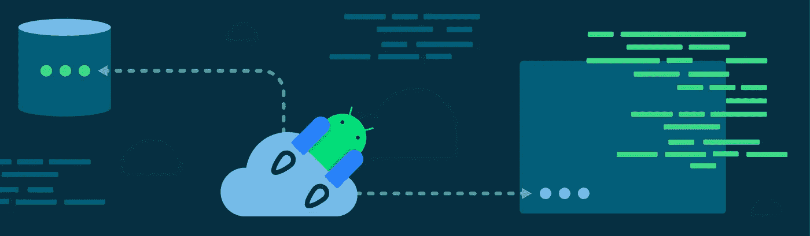
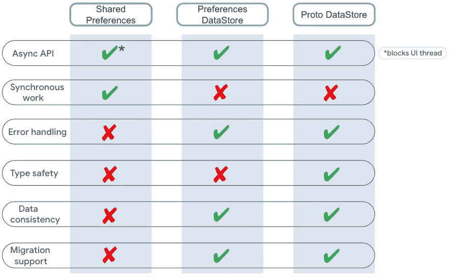
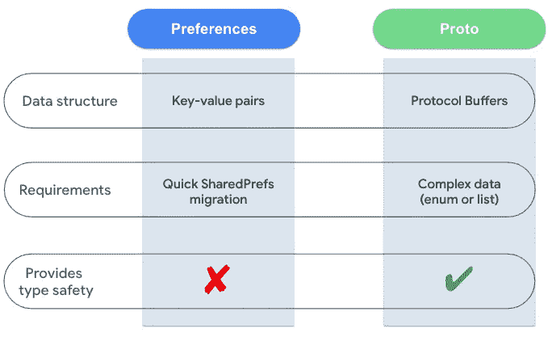
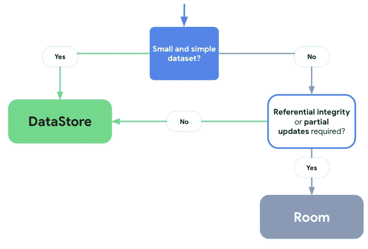

# Jetpack 数据存储简介

> 原文：<https://medium.com/androiddevelopers/introduction-to-jetpack-datastore-3dc8d74139e7?source=collection_archive---------3----------------------->

[**DataStore**](https://developer.android.com/topic/libraries/architecture/datastore) 是一个 Jetpack 数据存储库，它提供了一种安全一致的方式来存储少量数据，如首选项或应用程序状态。它基于支持异步数据存储的 **Kotlin 协同程序和流程**。它旨在取代`SharedPreferences`，因为它是线程安全和非阻塞的。它提供了两种不同的实现:[**Proto DataStore**](https://developer.android.com/topic/libraries/architecture/datastore?gclid=CjwKCAiA55mPBhBOEiwANmzoQtX8aFaxx5WFTDOpYVN429tF3U8X3BnZu8ZMfJhRqGtyme_PzaypHhoCQDsQAvD_BwE&gclsrc=aw.ds#datastore-typed)，它存储类型化的对象(由[协议缓冲区](https://developers.google.com/protocol-buffers)支持)和[**Preferences DataStore**](https://developer.android.com/topic/libraries/architecture/datastore?gclid=CjwKCAiA55mPBhBOEiwANmzoQtX8aFaxx5WFTDOpYVN429tF3U8X3BnZu8ZMfJhRqGtyme_PzaypHhoCQDsQAvD_BwE&gclsrc=aw.ds#datastore-preferences)，它存储键值对。接下来，当我们仅使用`DataStore`时，这指的是两种实现，除非另有说明。

在这篇博文中，我们将进一步了解**数据存储—** 它是如何工作的，它提供了哪些实现以及它们各自的使用案例。我们还将看看它给`SharedPreferences`带来了什么好处和改进，以及为什么这些让数据存储值得你去做。

# 数据存储与共享首选项

很可能你已经在你的应用中使用过`SharedPreferences`。你也可能经历过`SharedPreferences`的问题，这些问题**很难重现**——在你的分析中看到由于未捕获的异常导致的奇怪的崩溃，在调用时阻塞 UI 线程，或者在你的应用中出现不一致的持久数据。数据存储库就是为了解决所有这些问题而构建的。

让我们来看一下`SharedPreferences`和数据存储之间的直接比较:

Comparing DataStore implementations with SharedPreferences

## **异步 API**

对于大多数数据存储 API，当数据被修改时，您通常需要得到异步通知**。`SharedPreferences`确实为*提供了一些*异步支持，但仅仅是为了通过`[**OnSharedPreferenceChangeListener**](https://developer.android.com/reference/android/content/SharedPreferences.OnSharedPreferenceChangeListener)`获得更改值的更新。然而，这个回调仍然在**主线程**上被调用。类似地，如果你想将文件保存工作卸载到后台，你可以使用`SharedPreferences` `apply()`，但是记住这将**阻塞`fsync()`上的 UI 线程**，潜在地导致 jank 和 ANRs。这可能发生在服务启动或停止，或者活动暂停或停止的任何时候。相比之下，DataStore 提供了一个**完全异步的 API** 来检索和保存数据，使用 Kotlin 协同程序和流的能力，降低了阻塞 UI 线程的风险。对于那些不熟悉 Kotlin 流的人来说，它只是一个可以异步计算的值流。**

## **同步工作**

`SharedPreferences` API 支持开箱即用的同步工作。然而，它的用于修改持久化数据的同步`commit()`看起来在 UI 线程上调用是安全的，但是它实际上执行了**更重的 I/O 操作**。这是一个有风险的场景，可能并且经常会导致 ANRs 和 UI jank。为了防止这种情况，数据存储**不提供现成的同步支持**。DataStore 将首选项保存在一个文件中，除非另有说明，否则它会在`**Dispatchers.IO**` **、**上执行所有数据操作，从而保持 UI 线程的畅通。

然而，在协程构建器的帮助下，将数据存储和同步工作结合起来是可能的，我们将在后面看到。

## **错误处理**

`SharedPreferences`可以抛出解析错误作为运行时异常，让你的应用容易崩溃。例如，`ClassCastException`是 API 在请求**错误数据类型**时抛出的常见异常。数据存储提供了一种**在读取或写入数据时捕捉任何异常**的方式，依靠流的错误信号机制。

## **类型安全**

使用映射键值对来保存和检索数据不提供类型安全保护。然而，使用 Proto DataStore，您可以为您的数据模型预定义一个模式，并获得**全类型安全**的额外好处。

## **数据一致性**

缺乏原子性保证意味着你不能依赖于你的数据修改总是在任何地方被反映。这可能是危险的，特别是因为这个 API 的全部目的是**持久化数据存储**。相比之下，数据存储的**完全事务 API** 提供了强大的 [ACID](https://en.wikipedia.org/wiki/ACID) 保证，因为数据是在**原子读-修改-写**操作中更新的。它还提供了“*写后读*”一致性，反映了所有已完成的更新将反映在读取值中的事实。

## **迁移支持**

`SharedPreferences`没有内置的迁移机制，您需要完成一些繁琐且容易出错的工作，将旧存储中的值重新映射到新存储中，然后进行清理。所有这些都增加了**运行时异常**的几率，因为您很容易遇到数据类型不匹配的问题。然而，数据存储提供了一种将数据轻松迁移到数据存储的方式，并提供了从`SharedPreferences`到数据存储的迁移实现。

# 首选项与原始数据存储

既然我们已经看到了数据存储相对于`SharedPreferences`提供的优势，那么让我们来讨论如何在它的两种实现— **Preferences 和 Proto DataStore** 之间做出选择。

[**首选项** **数据存储**](https://developer.android.com/topic/libraries/architecture/datastore?gclid=CjwKCAiA55mPBhBOEiwANmzoQtX8aFaxx5WFTDOpYVN429tF3U8X3BnZu8ZMfJhRqGtyme_PzaypHhoCQDsQAvD_BwE&gclsrc=aw.ds#datastore-preferences) 根据**键值对**读取和写入数据，无需预先定义模式。虽然这听起来可能类似于`SharedPreferences`，但是请记住上面提到的数据存储带来的所有改进。不要被它们在命名中联合使用“ *Preferences* ”所迷惑——它们没有任何共同点，并且来自两个完全不同的 API。

[**Proto****DataStore**](https://developer.android.com/topic/libraries/architecture/datastore?gclid=CjwKCAiA55mPBhBOEiwANmzoQtX8aFaxx5WFTDOpYVN429tF3U8X3BnZu8ZMfJhRqGtyme_PzaypHhoCQDsQAvD_BwE&gclsrc=aw.ds#datastore-typed)存储**类型化的对象**，由`[**Protocol Buffers**](https://developers.google.com/protocol-buffers)`支持，提供类型安全并消除对密钥的需求。Protobufs 比 XML 和其他类似的数据格式更快、更小、更简单、更明确。如果你以前没有用过它们，不用担心！这些很容易学。虽然 Proto DataStore 确实需要您学习一种新的序列化机制，但我们相信它的优势，尤其是**类型安全**，是值得的。

Comparing DataStore implementations

在两者之间进行选择时，您应该考虑以下因素:

*   如果您正在使用**键-值对**来读写数据，希望**以最小的改变从`SharedPreferences`快速迁移**，同时仍然利用数据存储的改进，并且在没有类型安全检查的情况下感到足够自信，您可以使用**首选项数据存储**
*   如果您希望学习协议缓冲区以获得提高可读性的额外好处，如果您的数据需要处理**更复杂的类**，如枚举或列表，并且您希望在这样做的同时获得**完全类型安全**支持，您可以尝试 **Proto DataStore**

# 数据存储与房间

你可能会问——“*嗯，为什么不直接用* [***房间***](https://developer.android.com/training/data-storage/room) *来存储我的数据*？”。这是一个公平的问题！所以，让我们来看看这一切的空间。

如果您需要处理大于几十 kb 的复杂数据集，很可能您需要不同数据表之间的部分更新。在这种情况下，你应该考虑使用**房间**。

然而，如果你正在使用**更小更简单的** **数据集**，比如偏好或应用状态，因此不需要部分更新或参照完整性，你应该选择**数据存储**。

How to choose between DataStore and Room

# 待续

我们已经更详细地介绍了**数据存储库** —它是如何工作的，它带来了哪些变化和改进，以及如何在两种实现方式之间做出选择。在接下来的两篇博文中，我们将进一步讨论 **Proto 和 Preferences DataStore**——如何创建、读取和写入数据，处理任何错误，以及如何从`SharedPreferences`迁移。敬请期待！

您可以在这里找到我们的 Jetpack DataStore 系列的所有帖子:
[Jetpack DataStore 简介](/androiddevelopers/introduction-to-jetpack-datastore-3dc8d74139e7)
[所有关于首选项 DataStore](/androiddevelopers/all-about-preferences-datastore-cc7995679334)
[所有关于原型 DataStore](/androiddevelopers/all-about-proto-datastore-1b1af6cd2879)
[DataStore 和依赖注入](/androiddevelopers/datastore-and-dependency-injection-ea32b95704e3)
[DataStore 和 Kotlin 序列化](/androiddevelopers/datastore-and-kotlin-serialization-8b25bf0be66c)
[DataStore 和同步工作](/androiddevelopers/datastore-and-synchronous-work-576f3869ec4c)
[DataStore 和数据迁移](/androiddevelopers/datastore-and-data-migration-fdca806eb1aa)
[DataStore 和测试](/androiddevelopers/datastore-and-testing-edf7ae8df3d8)