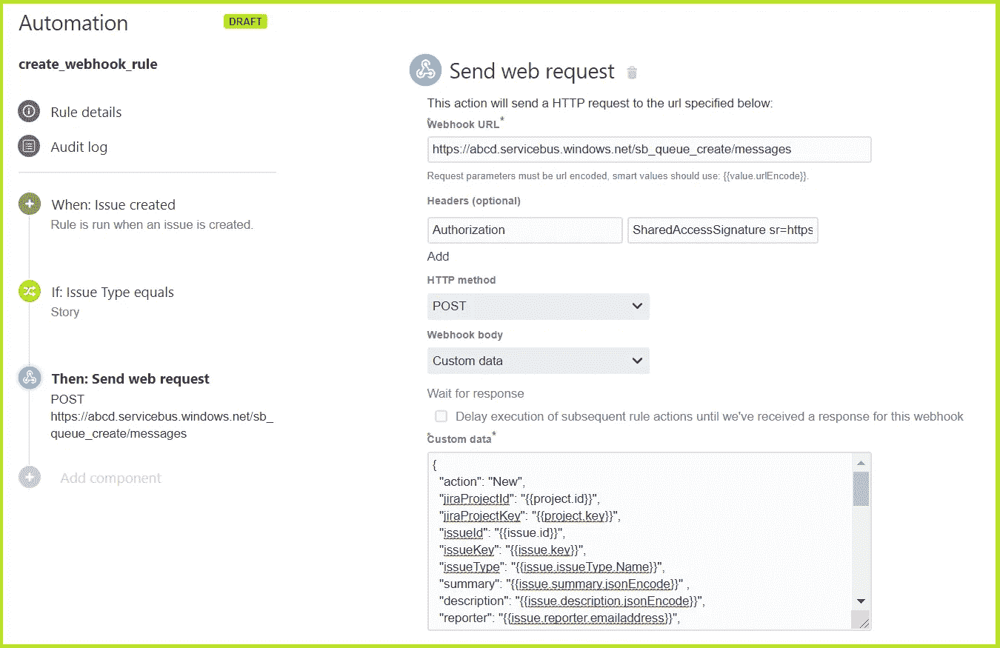
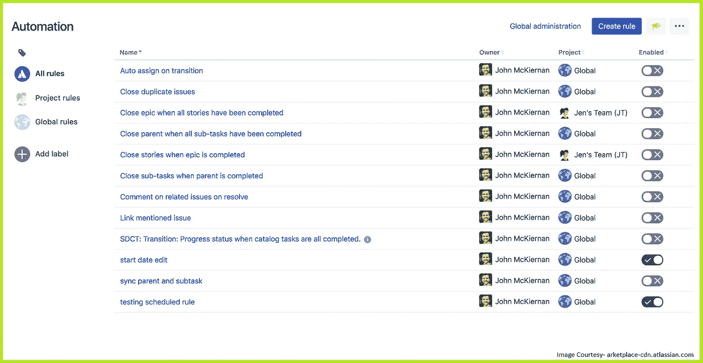
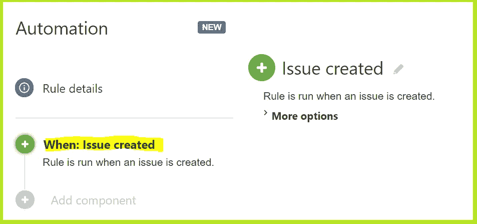
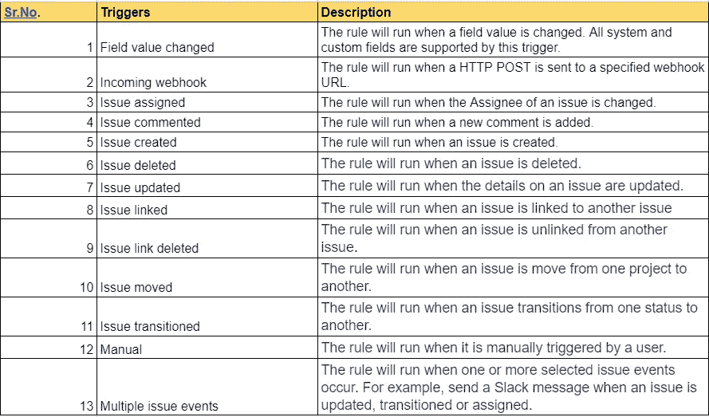
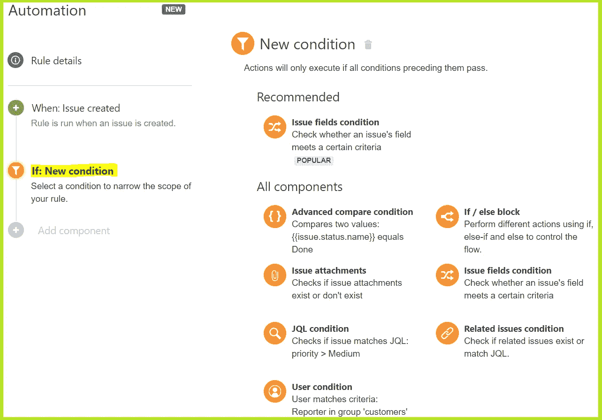
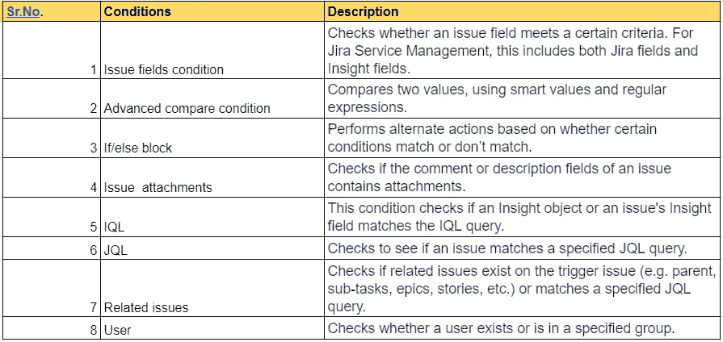
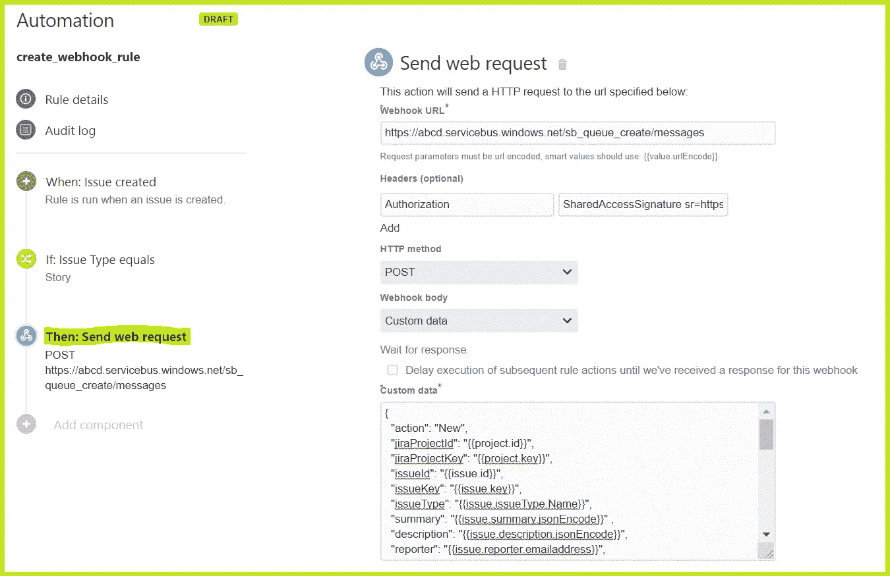
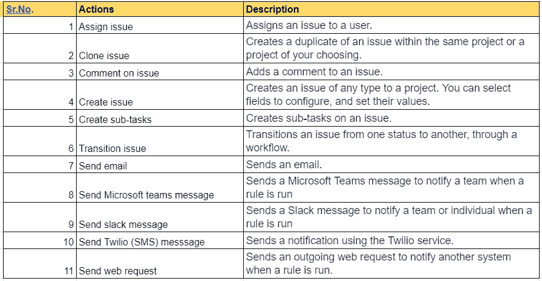
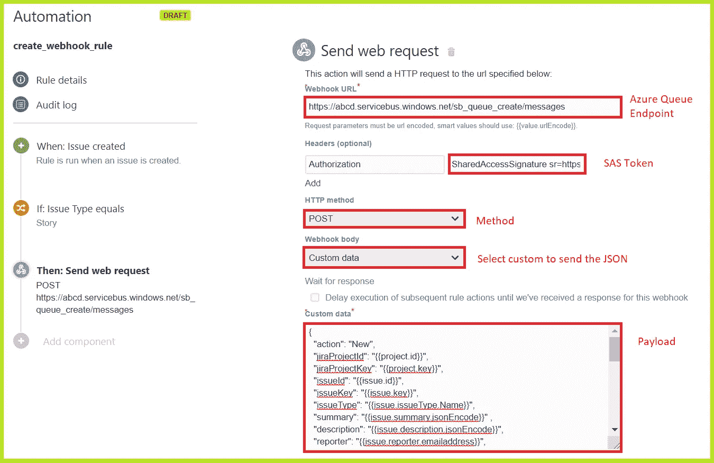

# 吉拉自动化及其与 Microsoft Azure Queue 的集成简介

> 原文：<https://medium.com/globant/introduction-to-jira-automation-and-its-integration-with-microsoft-azure-queue-9ad618a66d6?source=collection_archive---------1----------------------->

本文的目标是帮助用吉拉自动化和微软 Azure Queue 构建开箱即用的解决方案。我们将介绍如何配置吉拉自动化规则，以及如何通过吉拉自动化向 Azure Queue 发送消息。这将有助于自动化操作。例如，当一个问题将被创建、更新或删除时，将详细信息发送到 Azure queue。此外，我们可以开发任何跨平台的应用程序来处理 Azure 队列消息数据。

**规则示例-**

## **只需点击几下鼠标，即可自动完成任何任务或流程**

Atlassian 吉拉为在吉拉实施强大的自动化提供了一种便捷的方式。自动化是通过定义所谓的*规则*来实现的，这些规则是*触发*和*动作*的组合。

概括地说，执行模型是:如果触发器“发生”，那么动作就被“执行”。

> **自动化和扩展吉拉的简单方法。所有的权力，没有脚本。**

## 1.触发器-

每个规则都是从一个触发器开始的。他们开始执行你的规则。触发器将侦听吉拉中的事件，如创建问题或更改字段值时。

找到下面的一些触发器列表-

[查看可用触发器的列表](https://support.atlassian.com/jira-software-cloud/docs/automation-triggers/)。

## 2.情况

在什么情况下应该在吉拉境内执行自动驾驶？

允许用户选择是否触发自动操作的条件。

找到下面的一些条件列表-

[查看可用条件列表](https://support.atlassian.com/jira-software-cloud/docs/automation-conditions/)。

## 3.动作-

基本上，动作是我们想要自动化的任务，这种集成实现了自动化。例如，我们可以发送电子邮件或发送 Web 请求。

在下面找到一些操作的列表-

[查看可用动作列表](https://support.atlassian.com/jira-software-cloud/docs/automation-actions/)。

## 如何建立规则

1.  导航到您的自动化设置，并选择右上角的创建规则。
2.  选择问题创建触发器，然后选择保存。
3.  选择“新建条件”，然后选择“问题字段”条件。
4.  配置条件如下:
    将字段设置为问题类型
    将条件设置为等于
    将值设置为与 Bug 进行比较
    选择保存。
5.  选择“新建操作”，然后选择“创建子任务”操作。
6.  配置操作如下:
    添加 3 个子任务，称为检查代码、故障诊断和解决。
    选择保存。
7.  选择“新建操作”，然后选择“分配问题”操作。
8.  选择用户以指定受理人，然后选择保存。
9.  为您的规则命名，并选择打开它。

> **如何构建向 Azure Queue 发送消息的规则？**

我们将讨论这条规则中最棘手的部分，即 REST API 配置。考虑到这一点，我们按照下面的步骤来。我们将边走边解释如何制作:

1.  **网页挂钩网址:**

Azure 队列可使用以下 URL 格式寻址-

*https:// <存储 _ 账号>. queue . core . windows . net/<que _ name>/messages*

**2。Webhook 头:**

添加带有*授权*的表头

***授权:****SharedAccessSignature Sr = https % 3a % 2f % 2fa zure . service bus . windows . net % queue _ name % 2f messages&SIG = y 8 vet 1a 9 ejfvxfjdwk 2c 0 yxowgy 82 vqnlcul 7 vmz 4c % 3d&se = 1925297008&skn = RootManageSharedAccessKey*

要向 Azure 队列发送请求，我们需要提供 SAS 授权令牌。要了解更多请查看 [*存储-SAS-概述*](https://docs.microsoft.com/en-us/azure/storage/common/storage-sas-overview)[*# Generating _ a _ SAS _ Token*](https://adamtheautomator.com/azure-sas-token/#Generating_a_SAS_Token_using_PowerShell)

**3。Webhook 方法:**

**贴*贴*贴**

在这种情况下，我们将通过 POST 发送 web 请求，但是，也可以使用其他方法，如 GET、PUT、DELETE。

**4。Webhook 主体:**

我们可以选择变量来包含和定制我们的有效载荷。从 webhook body 下拉列表中选择“*自定义数据”*。

*{
" issueId ":" { { issue . id } } "，
"issueKey": "{{issue.key}} "，
" issue type ":" { { issue . issue type . name } } "，
" summary ":" { { issue . summary . jsonencode } } "，
" description ":" { { issue . description . jsonencode } } "，
" reporter ":" { { issue . reporter . email address。*

智能值允许在吉拉访问和操作问题数据。 [*什么是智能价值观？*](https://support.atlassian.com/jira-software-cloud/docs/what-are-smart-values)

**5。规则输出:**

最后一步是保存规则并启用它。每当创建新问题时，此规则都会向 Microsoft azure 队列发送 http 请求，并以 JSON 有效负载格式提供所有问题详细信息。

***希望这篇文章对大家有帮助！:)***