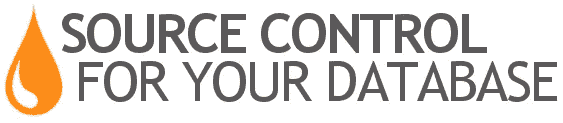

# Liquibase 介绍和管理您的数据库源代码

> 原文：<https://medium.com/oracledevs/introduction-to-liquibase-and-managing-your-database-source-code-70f0ec634542?source=collection_archive---------0----------------------->

在之前的博客中，我展示了如何借助 Oracle 开发者云服务 ( [DevCS](https://cloud.oracle.com/developer_service) )作为整体 Oracle DB DevOps 解决方案的一部分来[管理 SQL 脚本生命周期。我想再添加一个实用程序，作为 SQL 脚本管理的替代或补充——liqui base。](http://blogs.oracle.com/developers/lifecycle-management-and-devops-for-oracle-databases)


[**Liquibase**](http://www.liquibase.org/) 是一个用于管理数据库模式脚本修订的开源解决方案。它跨各种类型的数据库工作，并支持用于定义 DB 结构的各种文件格式。Liquibase 中最吸引人的特性可能是它从特定点回滚和前滚更改的能力——使您不必知道在特定数据库实例上运行的最后一次更改/脚本是什么。



Liquibase 使用脚本(称为“变更集”)来管理您对数据库所做的更改。变更集文件可以是各种格式，包括 XML、JSON、YAML 和 SQL。在下面的例子中，我使用的是 XML 格式。

随着您在开发生命周期中不断更改和增强您的数据库结构，您将添加更多的变更集。主文件列出了所有变更集文件(或它们所在的目录)。并行 Liquibase 跟踪数据库中已经运行的变更集。

当您发出 liquibase **update** 命令时，liquibase 会查看数据库的当前状态，并识别已经发生了哪些更改。然后，它运行其余的更改——让您看到正在定义的结构的最新版本。

通过将 Liquibase 集成到您的整体代码版本管理系统和持续集成平台中，您可以将数据库版本与应用程序版本同步。对我来说，这当然意味着与 Oracle 开发人员云服务(DevCS)的集成，您可以通过 Oracle 数据库云服务免费获得 DevCS。在下面的视频中，我展示了一个流程，包括:

*   在问题系统中跟踪我的 DBA 任务
*   用 Liquibase 修改本地 MySQL 数据库(进行前滚和后滚)
*   添加定义新表的变更集
*   致力于 Git
*   在 Oracle 数据库云服务中实施变更的自动构建
*   使用 UT/PLSQL 进行自动测试

下面是一个 10 分钟的快速演示:

对于那些想要尝试和复制这一点的人，这里有一些资源。

创建包含三列的“department”表的变更集:

```
<?xml version="1.0" encoding="UTF-8"?>
<databaseChangeLog ae jc" href="http://www.liquibase.org/xml/ns/dbchangelog" rel="noopener ugc nofollow" target="_blank">http://www.liquibase.org/xml/ns/dbchangelog" xmlns:ext="[http://www.liquibase.org/xml/ns/dbchangelog-ext](http://www.liquibase.org/xml/ns/dbchangelog-ext)" xmlns:xsi="[http://www.w3.org/2001/XMLSchema-instance](http://www.w3.org/2001/XMLSchema-instance)" xsi:schemaLocation="[http://www.liquibase.org/xml/ns/dbchangelog](http://www.liquibase.org/xml/ns/dbchangelog) [http://www.liquibase.org/xml/ns/dbchangelog/dbchangelog-3.1.xsd](http://www.liquibase.org/xml/ns/dbchangelog/dbchangelog-3.1.xsd) [http://www.liquibase.org/xml/ns/dbchangelog-ext](http://www.liquibase.org/xml/ns/dbchangelog-ext) [http://www.liquibase.org/xml/ns/dbchangelog/dbchangelog-ext.xsd](http://www.liquibase.org/xml/ns/dbchangelog/dbchangelog-ext.xsd)">
   <changeSet id="0" author="shay">
      <createTable tableName="department">
         <column name="id" type="int">
            <constraints primaryKey="true" nullable="false" />
         </column>
         <column name="name" type="varchar(50)">
            <constraints nullable="false" />
         </column>
         <column name="active" type="boolean" defaultValueBoolean="true" />
      </createTable>
   </changeSet>
</databaseChangeLog>
```

创建 PL/SQL 函数、包和过程的变更集。请注意，第 3 行中的 **dbms="oracle"** 表示该脚本仅在我们连接到 oracle 数据库时运行:

```
<?xml version="1.0" encoding="UTF-8"?>
<databaseChangeLog ae jc" href="http://www.liquibase.org/xml/ns/dbchangelog" rel="noopener ugc nofollow" target="_blank">http://www.liquibase.org/xml/ns/dbchangelog" xmlns:ext="[http://www.liquibase.org/xml/ns/dbchangelog-ext](http://www.liquibase.org/xml/ns/dbchangelog-ext)" xmlns:xsi="[http://www.w3.org/2001/XMLSchema-instance](http://www.w3.org/2001/XMLSchema-instance)" xsi:schemaLocation="[http://www.liquibase.org/xml/ns/dbchangelog](http://www.liquibase.org/xml/ns/dbchangelog) [http://www.liquibase.org/xml/ns/dbchangelog/dbchangelog-3.1.xsd](http://www.liquibase.org/xml/ns/dbchangelog/dbchangelog-3.1.xsd) [http://www.liquibase.org/xml/ns/dbchangelog-ext](http://www.liquibase.org/xml/ns/dbchangelog-ext) [http://www.liquibase.org/xml/ns/dbchangelog/dbchangelog-ext.xsd](http://www.liquibase.org/xml/ns/dbchangelog/dbchangelog-ext.xsd)">
   <changeSet author="shay" id="createProcedure-example" dbms="oracle">
      <createProcedure>create or replace function betwnstr( a_string varchar2, a_start_pos integer, a_end_pos integer ) return varchar2
is
begin
return substr( a_string, a_start_pos, a_end_pos - a_start_pos+1 );
end;</createProcedure>
      <createProcedure>create or replace package test_betwnstr as
-- %suite(Between string function)
-- %test(Returns substring from start position to end position)
procedure basic_usage;
end;</createProcedure>
      <createProcedure>create or replace package body test_betwnstr as
procedure basic_usage is
begin
ut.expect( betwnstr( '1234567', 2, 5 ) ).to_equal('2345');
end;
end;</createProcedure>
   </changeSet>
</databaseChangeLog>
```

向表中添加记录的变更集。<rollback>行有 rollback 标记，它定义了如何对此插入进行回滚:</rollback>

```
<?xml version="1.0" encoding="UTF-8"?>
<databaseChangeLog ae jc" href="http://www.liquibase.org/xml/ns/dbchangelog" rel="noopener ugc nofollow" target="_blank">http://www.liquibase.org/xml/ns/dbchangelog" xmlns:ext="[http://www.liquibase.org/xml/ns/dbchangelog-ext](http://www.liquibase.org/xml/ns/dbchangelog-ext)" xmlns:xsi="[http://www.w3.org/2001/XMLSchema-instance](http://www.w3.org/2001/XMLSchema-instance)" xsi:schemaLocation="[http://www.liquibase.org/xml/ns/dbchangelog](http://www.liquibase.org/xml/ns/dbchangelog) [http://www.liquibase.org/xml/ns/dbchangelog/dbchangelog-3.1.xsd](http://www.liquibase.org/xml/ns/dbchangelog/dbchangelog-3.1.xsd) [http://www.liquibase.org/xml/ns/dbchangelog-ext](http://www.liquibase.org/xml/ns/dbchangelog-ext) [http://www.liquibase.org/xml/ns/dbchangelog/dbchangelog-ext.xsd](http://www.liquibase.org/xml/ns/dbchangelog/dbchangelog-ext.xsd)">
   <changeSet author="shay" id="4">
      <insert tableName="department">
         <column name="id" value="10" />
         <column name="name" value="Sales" />
      </insert>
      <rollback>delete from department where id=10</rollback>
   </changeSet>
</databaseChangeLog>
```

关于我的 [DevCS](https://cloud.oracle.com/developer_service) 项目和构建设置的一些提示。

1.  为了简单起见，我将 liquibase 和 JDBC jar 文件加载到我的 git 存储库中——这使得我的构建步骤很容易找到并执行这些文件。我猜你也可以用 Maven 来托管这些。
2.  我在我的构建中使用了一个密码参数，所以我不需要硬编码密码，为我的构建增加了一点安全性。在您的构建中使用$符号引用参数— *$password*
3.  想了解更多关于使用 ut/PLSQL 自动化测试的知识— [查看这篇博客文章](https://blogs.oracle.com/shay/extending-oracle-database-devops-with-automated-plsql-unit-testing)。

*原载于 2017 年 10 月 16 日*[*blogs.oracle.com*](https://blogs.oracle.com/shay/introduction-to-liquibase-and-managing-your-database-source-code)*。*