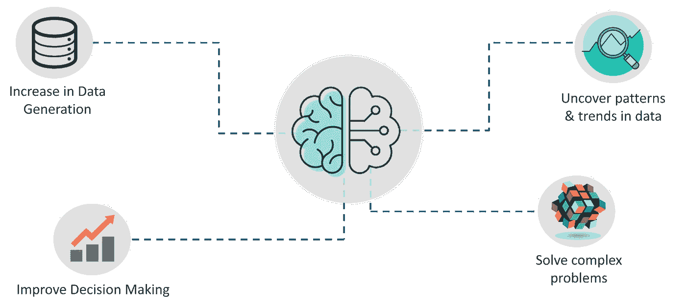
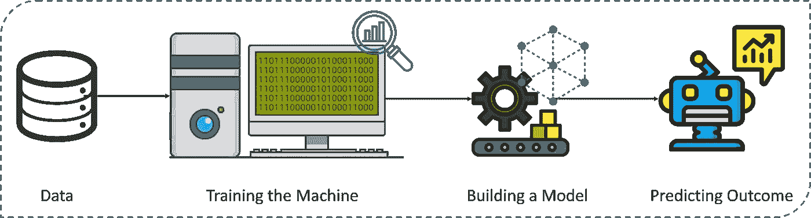
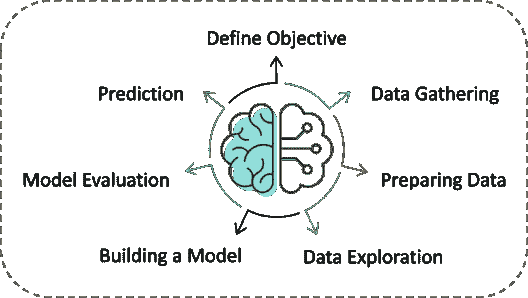
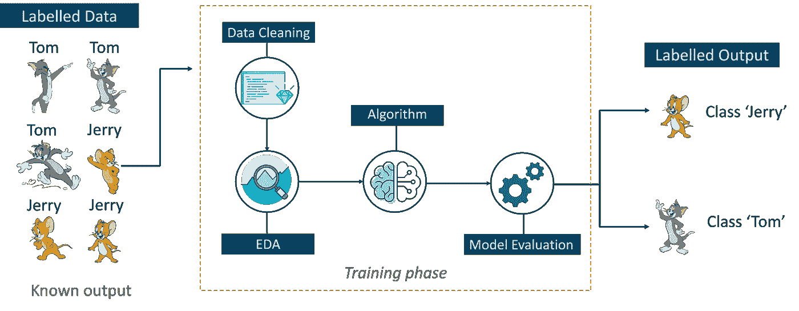
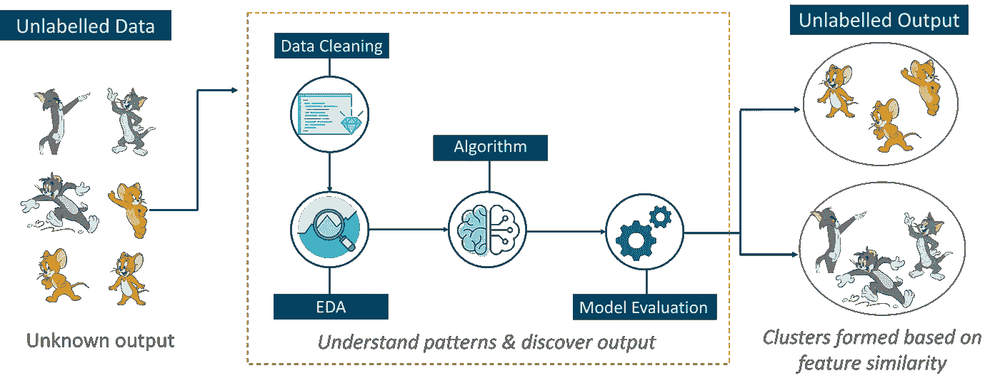
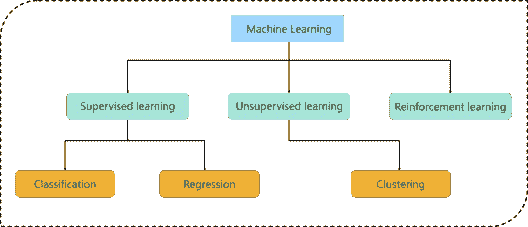
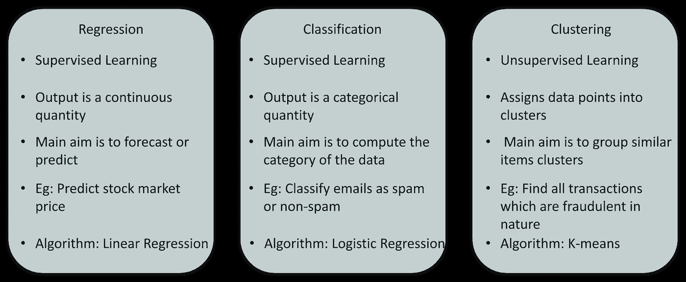
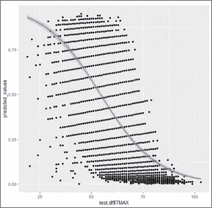

# 机器学习介绍及实际操作

> 原文：<https://medium.com/edureka/introduction-to-machine-learning-97973c43e776?source=collection_archive---------4----------------------->


Introduction To Machine Learning — Edureka

毫无疑问，机器学习是当今市场上最受欢迎的技术。它的应用范围从无人驾驶汽车到预测 ALS 等致命疾病。对机器学习技能的高需求是这篇文章背后的动机。在本文中，您将了解机器学习的所有基本概念，以及使用 R 语言实现机器学习的一个实际应用。

本文涵盖了以下主题:

1.  对机器学习的需求
2.  什么是机器学习？
3.  机器学习定义
4.  机器学习过程
5.  机器学习的类型
6.  使用机器学习解决的问题类型
7.  机器学习的实际实现

# 对机器学习的需求

自从技术革命以来，我们一直在生成不可估量的数据。根据研究，我们每天生成大约 2.5 万亿字节的数据！据估计，到 2020 年，地球上每个人每秒将产生 1.7 兆字节的数据。

有了这么多的数据，最终有可能建立预测模型，研究和分析复杂的数据，以找到有用的见解，并提供更准确的结果。

网飞和亚马逊等顶级公司通过使用大量数据来建立这种机器学习模型，以识别有利可图的机会并避免不必要的风险。

以下是机器学习如此重要的原因:

*   **数据生成量的增加:**由于数据的生产量过大，我们需要一种能够用来结构化、分析并从数据中得出有用见解的方法。这就是机器学习的用武之地。它使用数据来解决问题，并为组织面临的最复杂的任务找到解决方案。
*   **改善决策:**通过利用各种算法，机器学习可以用来做出更好的商业决策。例如，机器学习用于预测销售，预测股票市场的下跌，识别风险和异常情况等。



*   **揭示模式&数据中的趋势**:从数据中发现隐藏的模式并提取关键洞察是机器学习最本质的部分。通过建立预测模型和使用统计技术，机器学习允许你挖掘表面之下，探索微小尺度的数据。手动理解数据和提取模式需要几天时间，而机器学习算法可以在不到一秒钟内完成这样的计算。
*   **解决复杂问题:**从检测与致命的 ALS 疾病相关的基因到建造自动驾驶汽车，机器学习可以用来解决最复杂的问题。

***为了让你更好地理解机器学习有多重要，让我们列出几个机器学习的应用:***

*   ***网飞的推荐引擎* :** 网飞的核心是其声名狼藉的推荐引擎。你观看的超过 75%的内容是由网飞推荐的，这些推荐是通过实现机器学习而做出的。
*   ***脸书的自动标记功能:*** 脸书的 DeepMind 人脸验证系统背后的逻辑是机器学习和神经网络。DeepMind 研究图像中的面部特征来标记你的朋友和家人。
*   ***亚马逊的 Alexa:*** 臭名昭著的基于自然语言处理和机器学习的 Alexa 是一个高级别的虚拟助手，它不仅仅是播放你播放列表上的歌曲。它可以为你预订优步，连接家中的其他物联网设备，跟踪你的健康状况等。
*   ***谷歌的垃圾邮件过滤器:*** Gmail 利用机器学习过滤掉垃圾邮件。它使用[机器学习算法](https://www.edureka.co/blog/machine-learning-algorithms?utm_source=medium&utm_medium=content-link&utm_campaign=introduction-to-machine-learning)和自然语言处理来实时分析电子邮件，并将它们分类为垃圾邮件或非垃圾邮件。

既然你知道了机器学习为什么如此重要，那么让我们来看看机器学习到底是什么。

# 机器学习导论

机器学习这个术语是由亚瑟·塞缪尔在 1959 年首次提出的。回顾过去，就技术进步而言，那一年可能是最重要的一年。

如果你在网上浏览“什么是机器学习”，你会得到至少 100 个不同的定义。然而，第一个正式定义是由汤姆·米切尔提出的:

> *“如果由 P 测量的计算机程序在 T 中的任务上的性能随着经验 E 而提高，则称该计算机程序从关于某类任务 T 和性能测量 P 的经验 E 中学习。”*

简而言之，*机器学习是人工智能(AI)的一个子集，它为机器提供了自动学习的能力&根据经验改进，而无需显式编程。*从某种意义上说，它是通过获得思考能力让机器解决问题的实践。

但是等等，机器能思考或做决定吗？嗯，如果你给一台机器输入大量的数据，它会学习如何通过使用机器学习算法来解释、处理和分析这些数据，以解决现实世界的问题。

在进一步讨论之前，让我们讨论一些机器学习中最常用的术语。

# 机器学习定义

**算法:**机器学习算法是一组规则和统计技术，用于从数据中学习模式，并从中提取重要信息。这是机器学习模型背后的逻辑。机器学习算法的一个例子是线性回归算法。

**模型:**模型是机器学习的主要组成部分。通过使用机器学习算法来训练模型。一种算法根据给定的输入映射模型应该采取的所有决策，以便获得正确的输出。

**预测变量:**可以用来预测输出的数据特征。

**响应变量:**需要使用预测变量预测的是特征或输出变量。

**训练数据:**使用训练数据构建机器学习模型。训练数据有助于模型识别对预测输出至关重要的关键趋势和模式。

**测试数据:**对模型进行训练后，必须对其进行测试，以评估其预测结果的准确性。这是由测试数据集完成的。



总结一下，看一下上图。*机器学习过程始于向机器提供大量数据，通过使用这些数据，机器被训练来检测隐藏的见解和趋势。然后，通过使用算法，将这些见解用于建立机器学习模型，以便解决问题。*

这个机器学习入门博客的下一个主题是机器学习过程。

# 机器学习过程

机器学习过程包括建立预测模型，该模型可用于找到问题陈述的解决方案。为了理解机器学习过程，让我们假设你已经被给予了一个需要使用机器学习来解决的问题。



*问题是利用机器学习来预测你所在地区的降雨发生情况。*

在机器学习过程中遵循以下步骤:

**步骤 1:** 定义问题陈述的目标

在这一步，我们必须明白到底需要预测什么。在我们的案例中，目标是通过研究天气状况来预测下雨的可能性。在这个阶段，记住什么样的数据可以用来解决这个问题，或者你必须遵循什么类型的方法来得到解决方案，这也是很重要的。

**步骤 2:** 数据收集

在这个阶段，你必须问这样的问题，

*   解决这个问题需要什么样的数据？
*   数据是否可用？
*   我如何能得到数据？

一旦您知道了所需的数据类型，您就必须了解如何获得这些数据。数据收集可以手动完成，也可以通过网络搜集完成。然而，如果你是一个初学者，你只是想学习机器学习，你不必担心获得数据。网上有成千上万的数据资源，你可以下载数据集并开始使用。

回到手头的问题，天气预报所需的数据包括湿度、温度、压力、地点、你是否住在山区等等。必须收集和存储这些数据以供分析。

**第三步**:数据准备

你收集的数据几乎从来没有正确的格式。你会在数据集中遇到很多不一致的地方，比如缺失值、冗余变量、重复值等。消除这种不一致是非常必要的，因为它们可能导致错误的计算和预测。因此，在这一阶段，您扫描数据集以寻找任何不一致的地方，然后立即修复它们。

**第四步:**探索性数据分析

带上你的侦探眼镜，因为这个阶段是关于深入研究数据和发现所有隐藏的数据秘密。EDA 或探索性数据分析是机器学习的头脑风暴阶段。数据探索包括理解数据中的模式和趋势。在这个阶段，所有有用的见解都被提取出来，变量之间的相关性也得到理解。

例如，在预测降雨的情况下，我们知道如果温度下降很低，很有可能会下雨。在这个阶段，必须理解和绘制这种相关性。

**第五步:**建立机器学习模型

在数据探索期间获得的所有见解和模式都用于构建机器学习模型。这个阶段总是从将数据集分成两部分开始，即训练数据和测试数据。训练数据将用于构建和分析模型。模型的逻辑基于正在实现的机器学习算法。

在预测降雨量的情况下，由于输出将采用 True(如果明天会下雨)或 False(明天不会下雨)的形式，因此我们可以使用 Logistic 回归等分类算法。

选择正确的算法取决于你要解决的问题的类型、数据集和问题的复杂程度。在接下来的章节中，我们将讨论通过使用机器学习可以解决的不同类型的问题。

**第六步:**模型评估&优化

在使用训练数据集建立模型之后，最后是测试模型的时候了。测试数据集用于检查模型的效率以及预测结果的准确性。一旦计算出精度，就可以在这个阶段对模型进行任何进一步的改进。可以使用参数调整和交叉验证等方法来提高模型的性能。

**第七步:**预测

一旦模型被评估和改进，它最终被用于进行预测。最终输出可以是分类变量(例如真或假)，也可以是连续量(例如股票的预测值)。

在我们的例子中，为了预测降雨的发生，输出将是一个分类变量。

这就是整个机器学习过程。现在是时候了解机器学习的不同方式了。

# 机器学习类型

机器可以通过以下三种方法中的任何一种来学习解决问题。这些是机器学习的方式:

1.  监督学习
2.  无监督学习
3.  强化学习

## 监督学习

*监督学习是一种技术，在这种技术中，我们使用良好标记的数据来教授或训练机器。*

为了理解监督学习，让我们考虑一个类比。小时候，我们都需要有人指导我们解决数学问题。我们的老师帮助我们理解加法是什么以及如何做加法。类似地，你可以将监督学习视为一种涉及指导的机器学习。带标签的数据集是训练你理解数据模式的老师。被标记的数据集只不过是训练数据集。



考虑上图。在这里，我们给机器输入汤姆和杰里的图像，目标是让机器识别图像并将其分为两组(汤姆图像和杰里图像)。输入到模型中的训练数据集被标记为“我们告诉机器，‘这是汤姆的长相，这是杰瑞’”。通过这样做，您可以使用标记的数据来训练机器。在监督学习中，有一个在标记数据的帮助下完成的明确定义的训练阶段。

## 无监督学习

*无监督学习涉及使用未标记数据进行训练，并允许模型在没有指导的情况下对这些信息采取行动。*

把无监督学习想象成一个在没有任何指导的情况下学习的聪明孩子。在这种类型的机器学习中，模型没有被输入带标签的数据，因为模型没有“这个图像是汤姆，这个是杰里”的线索，它通过接受大量数据，自己找出模式以及汤姆和杰里之间的差异。



例如，它识别 Tom 的突出特征，如尖耳朵、较大的尺寸等，以理解该图像是类型 1。类似地，它在杰瑞身上发现了这样的特征，并且知道这个图像属于类型 2。因此，它将图像分为两个不同的类别，而不知道谁是汤姆或杰里。

## 强化学习

*强化学习是机器学习的一部分，其中一个代理被置于一个环境中，他通过执行某些动作并观察
从这些动作中获得的回报来学习在这个环境中的行为。*

这种类型的机器学习比较不同。想象一下你被丢在一个孤岛上！你会怎么做？

恐慌？是的，当然，最初我们都会。但是久而久之，你将学会如何在岛上生活。你将探索环境，了解气候条件，那里生长的食物类型，岛上的危险等等。这正是强化学习的工作方式，它涉及到一个被放在未知环境(岛)中的代理人(你，被困在岛上)，他必须通过观察和执行导致奖励的行动来学习。

强化学习主要用于高级机器学习领域，如自动驾驶汽车、AplhaGo 等。

这总结了机器学习的类型。现在，让我们看看使用机器学习解决的问题类型。

# 机器学习中的问题类型



考虑上图，机器学习中可以解决的问题主要有三类:

1.  **回归:**在这类问题中输出是一个连续的量。所以，举个例子，如果你想在给定距离的情况下预测一辆车的速度，这是一个回归问题。回归问题可以通过使用像线性回归这样的监督学习算法来解决。
2.  **分类:**在这种类型中，输出的是分类值。将电子邮件分为垃圾邮件和非垃圾邮件两类是一个分类问题，可以通过使用支持向量机、朴素贝叶斯、逻辑回归、K 近邻等监督学习分类算法来解决。
3.  **聚类:**这类问题涉及到根据特征相似性将输入分配到两个或更多的聚类中。例如，可以通过使用无监督学习算法(如 K-Means 聚类)来根据观众的兴趣、年龄、地理位置等将观众聚类成相似的组。

下表总结了回归、分类和聚类之间的区别。



现在，为了让事情变得有趣，我将在下面留下几个问题陈述，你们的作业是猜测这是什么类型的问题(回归、分类或聚类):

1.  **问题陈述 1:** 研究一个银行信贷数据集，根据申请人的社会经济概况决定是否批准其贷款。
2.  **问题陈述 2:** 研究房屋销售数据集，建立预测房屋定价指数的机器学习模型。
3.  **问题陈述 3:** 根据电影在社交媒体上的影响程度，将一组电影分为好电影或一般电影。

别忘了在评论区留下你的答案。

既然你对什么是机器学习以及其中涉及的过程有了很好的了解，那么让我们来执行一个演示，它将帮助你理解机器学习实际上是如何工作的。

# R 中的机器学习

一个简短的声明:我将使用 R 语言来展示机器学习是如何工作的。 [R](https://www.edureka.co/blog/r-tutorial?utm_source=medium&utm_medium=content-link&utm_campaign=introduction-to-machine-learning) 是一种统计编程语言，主要用于数据科学和机器学习。

现在，让我们开始吧。

**问题陈述:**研究西雅图天气预报数据集，建立一个可以预测下雨可能性的机器学习模型。

**数据集描述:**数据集是通过研究和观察西雅图-塔科马国际机场的天气情况收集的。数据集包含以下变量:

*   日期=观察日期
*   PRCP =降水量，单位为英寸
*   TMAX =当天的最高温度，单位为华氏度
*   TMIN =当天的最低温度，单位为华氏度
*   RAIN =如果当天观察到下雨，则为真；如果没有下雨，则为假

在这种情况下，目标或响应变量是“RAIN”。如果你注意到，这个变量本质上是分类的，也就是说，它的值有两类，真或假。因此，这是一个分类问题，我们将使用一种称为逻辑回归的分类算法。

尽管它的名字表明它是一种“回归”算法，但它实际上不是。它属于 GLM(广义线性模型)家族，因此得名逻辑回归。

**逻辑:**建立逻辑回归模型，根据天气情况预测某一天是否会下雨。

现在你知道了这个演示的目的，让我们开动脑筋，开始编码吧。

## **步骤 1:安装并加载库**

r 提供了 1000 个包来运行机器学习算法和数学模型。所以第一步是安装并加载所有相关的库。

```
#Load required libraries
library(tidyverse)
library(boot)
install.packages('forecast')
library(forecast)
library(tseries)
install.packages('caret')
library(caret)
install.packages('ROCR')
library(ROCR)
```

每个库都有特定的用途，你可以在官方的 R 文档中读到更多关于这些库的内容。

## **第二步:导入数据集**

幸运的是，我在网上找到了数据集，所以我不必手动收集它。在下面的代码片段中，我通过使用 r 提供的“read.csv()”函数将数据集加载到一个名为“data.df”的变量中。

```
#Import data set
data.df <- read.csv("/Users/Zulaikha_Geer/Desktop/Data/seattleWeather_1948-2017.csv", header = TRUE)
```

## **第三步:研究数据集**

让我们来看看数据集中的一些观察结果。为此，我们可以使用 r 提供的 head()函数。这将列出数据集中的前 6 个观察值。

```
> head(data.df)
DATE     PRCP   TMAX   TMIN  RAIN
1 1948-01-01    0.47       51      42    TRUE
2 1948-01-02   0.59      45      36    TRUE
3 1948-01-03   0.42      45      35    TRUE
4 1948-01-04   0.31      45      34     TRUE
5 1948-01-05   0.17      45      32     TRUE
6 1948-01-06   0.44     48      39     TRUE
```

现在，让我们通过使用 str()函数来看看数据集的结构。

```
#Studying the structure of the data set
> str(data.df)
'data.frame': 25551 obs. of 5 variables:
$ DATE: Factor w/ 25551 levels "1948-01-01","1948-01-02",..: 1 2 3 4 5 6 7 8 9 10 ...
$ PRCP: num 0.47 0.59 0.42 0.31 0.17 0.44 0.41 0.04 0.12 0.74 ...
$ TMAX: int 51 45 45 45 45 48 50 48 50 43 ...
$ TMIN: int 42 36 35 34 32 39 40 35 31 34 ...
$ RAIN: logi TRUE TRUE TRUE TRUE TRUE TRUE ...
```

在上面的代码中，您可以看到“DATE”和“RAIN”变量的数据类型格式不正确。“日期”变量必须是日期类型，“雨”变量必须是因子。

## **第四步:数据清理**

格式化“日期”和“雨”变量时的以下代码片段:

```
#Formatting 'date' and 'rain' variable
data.df$DATE <- as.Date(data.df$DATE)
data.df$RAIN <- as.factor(data.df$RAIN)
```

正如我前面提到的，检查数据集中任何缺失或 NA 值是非常重要的，下面的代码片段检查每个变量中的 NA 值:

```
#Checking for NA values in the 'DATE' variable
> which(is.na(data.df$DATE))
integer(0)

#Checking for NA values in the 'TMAX' variable
> which(is.na(data.df$TMAX))
integer(0)

#Checking for NA values in the 'TMIN' variable
> which(is.na(data.df$TMIN))
integer(0)

#Checking for NA values in the 'PRCP' variable
> which(is.na(data.df$PRCP))
[1] 18416 18417 21068

#Checking for NA values in the 'rain' variable
> which(is.na(data.df$RAIN))
[1] 18416 18417 21068
```

如果您注意到上面的代码片段，您会发现变量 TMAX、TMIN 和日期没有 NA 值，而“PRCP”和“雨”变量有 3 个缺失值，这些值必须删除。

```
# Remove the rows with missing RAIN value
> data.df <- data.df[-c(18416, 18417, 21068),]
```

值已成功删除！

## **第五步:数据拼接**

数据拼接只是将数据集分成训练集和测试集的另一个花哨术语。训练数据集必须更大，因为训练模型并帮助它研究趋势需要更多的数据。下面的代码片段以 7:3 的比例将数据集分为训练集和测试集。这意味着 70%的数据用于训练，而 30%用于测试。

```
#Data Splicing
#Data Partitioning: create a train and test dataset (0.7: 0.3)
index <- createDataPartition(data.df$RAIN, p = 0.7, list = FALSE)
# Training set
train.df <- data.df[index,]
# Testing dataset
test.df <- data.df[-index,]
```

您可以通过使用 R:

```
> summary(train.df) 
> summary(test.df)
```

## **第六步:数据探索**

这个阶段包括检测数据中的模式，找出预测变量和响应变量之间的相关性。在下面的代码片段中，我使用了 r。

这种相关性检验显示了预测变量在建立模型中的重要性。此外，cor.test()函数要求您拥有数值类型的变量，这就是为什么在下面的代码中我将' Rain '变量格式化为数值。

```
#Setting rain variable as numeric for computing the correlation
train.df$RAIN <- as.numeric(train.df$RAIN)

#Correlation between 'Rain' variable and 'TMAX'
> cor.test(train.df$TMAX, train.df$RAIN)

Pearson's product-moment correlation

data: train.df$TMAX and train.df$RAIN
t = -55.492, df = 17882, p-value < 2.2e-16
alternative hypothesis: true correlation is not equal to 0
95 percent confidence interval:
-0.3957173 -0.3707104
sample estimates:
cor
-0.3832841

> #Correlation between 'Rain' variable and 'TMIN'
cor.test(train.df$TMIN, train.df$RAIN)

Pearson's product-moment correlation

data: train.df$TMIN and train.df$RAIN
t = -18.163, df = 17882, p-value < 2.2e-16
alternative hypothesis: true correlation is not equal to 0
95 percent confidence interval:
-0.1489493 -0.1201678
sample estimates:
cor
-0.1345869
```

上述输出表明，TMIN 和 TMAX 都是重要的预测变量。注意两个变量的 p 值。p 值或概率值是理解模型重要性的最重要的参数。

如果变量的 p 值小于 0.05，它被认为是预测结果的一个重要特征。在我们的例子中，这些变量的 p 值都远低于 0.05，这是一件好事。

在继续之前，让我们将“RAIN”变量转换回“factor”类型:

```
#Setting rain variable as a factor for building the model train.df$RAIN <- as.factor(train.df$RAIN)
```

## **第七步:建立机器学习模型**

理解了相关性之后，就该建立模型了。我们将使用逻辑回归算法来构建模型。r 提供了一个名为 glm()的函数，其中包含逻辑回归算法。glm()函数的语法是:

*glm(公式，数据，家族)*

在上面的语法中:

*   **公式:**公式表示因变量和自变量之间的关系。
*   **数据:**应用公式的数据集。
*   **系列:**该字段指定回归模型的类型。在我们的例子中，它是一个二元逻辑回归模型。

```
> #Building a Logictic regression model
> # glm logistic regression
> model <- glm(RAIN ~ TMAX + TMIN, data = train.df, family = binomial)
> summary(model)

Call:
glm(formula = RAIN ~ TMAX + TMIN, family = binomial, data = train.df)

Deviance Residuals:
Min 1Q Median 3Q Max
-2.4700 -0.8119 -0.2557 0.8490 3.2691

Coefficients:
Estimate Std. Error z value Pr(>|z|)
(Intercept) 2.808373 0.098668 28.46 <2e-16 ***
TMAX -0.250859 0.004121 -60.87 <2e-16 ***
TMIN 0.259747 0.005036 51.57 <2e-16 ***
---
Signif. codes: 0 ‘***’ 0.001 ‘**’ 0.01 ‘*’ 0.05 ‘.’ 0.1 ‘ ’ 1

(Dispersion parameter for binomial family taken to be 1)

Null deviance: 24406 on 17883 degrees of freedom
Residual deviance: 17905 on 17881 degrees of freedom
AIC: 17911

Number of Fisher Scoring iterations: 5
```

我们通过使用“TMAX”和“TMIN”变量成功构建了模型，因为它们与目标变量(“雨”)有很强的相关性。

## **步骤 8:模型评估**

在这一步，我们将通过使用测试数据集来验证机器学习模型的效率。

```
#Model Evaluation
#Storing predicted values
> predicted_values <- predict(model, test.df, type = "response")
> head(predicted_values)
2 4 5 8 9 18
0.7048729 0.5868884 0.4580049 0.4646309 0.1567753 0.8585068

#Creating a table containing the actual 'RAIN' values in the test data set
> table(test.df$RAIN)

FALSE TRUE
4394     3270
> nrows_prediction<-nrow(test.df)

#Creating a data frame containing the predicted 'Rain' values
> prediction <- data.frame(c(1:nrows_prediction))
> colnames(prediction) <- c("RAIN")
> str(prediction)
'data.frame': 7664 obs. of 1 variable:
$ RAIN: int 1 2 3 4 5 6 7 8 9 10 ...

#Converting the 'Rain' variable into a character that stores either (T/F)
prediction$RAIN <- as.character(prediction$RAIN)

#Setting the threshold value
prediction$RAIN <- "TRUE"
prediction$RAIN[ predicted_values < 0.5] <- "FALSE"
#prediction [predicted_values > 0.5] <- "TRUE"
prediction$RAIN <- as.factor(prediction$RAIN)
```

参考代码的注释，它很容易理解。

```
#Comparing the predicted values and the actual values
> table(prediction$RAIN, test.df$RAIN)

FALSE TRUE
FALSE    3460    931
TRUE       934    2339
```

在下面的代码片段中，我们使用混淆矩阵来评估模型的准确性。

```
#Confusion Matrix
> confusionMatrix(prediction$RAIN, test.df$RAIN)
Confusion Matrix and Statistics

Reference
Prediction FALSE TRUE
FALSE 3460 931
TRUE 934 2339

Accuracy : 0.7567
95% CI : (0.7469, 0.7662)
No Information Rate : 0.5733
P-Value [Acc > NIR] : <2e-16

Kappa : 0.5027

Mcnemar's Test P-Value : 0.9631

Sensitivity : 0.7874
Specificity : 0.7153
Pos Pred Value : 0.7880
Neg Pred Value : 0.7146
Prevalence : 0.5733
Detection Rate : 0.4515
Detection Prevalence : 0.5729
Balanced Accuracy : 0.7514

'Positive' Class : FALSE
```

根据上述输出，该模型可以预测降雨的可能性，准确率约为 76%，相当不错。总而言之，让我们绘制一个显示逻辑回归曲线的图表，该曲线被称为预测变量 TMAX 和目标变量 RAIN 之间的 Sigmoid 曲线。

```
#Output plot showing the variation between TMAX and Rainfall
ggplot(test.df, aes(x = test.df$TMAX, y = predicted_values))+
geom_point() + # add points
geom_smooth(method = "glm", # plot a regression...
method.args = list(family = "binomial"))
```



因此，我们到此结束这个机器学习博客的介绍。我希望你们都觉得这篇博客内容丰富。如果你有任何想法分享，请在下面评论。敬请关注更多类似的博客！

如果你想查看更多关于 Python、DevOps、Ethical Hacking 等市场最热门技术的文章，那么你可以参考 [Edureka 的官方网站。](https://www.edureka.co/blog/?utm_source=medium&utm_medium=content-link&utm_campaign=introduction-to-machine-learning)

请留意本系列中的其他文章，它们将解释数据科学的各个方面。

> *1。*[*R 中的线性回归*](/edureka/linear-regression-in-r-da3e42f16dd3)
> 
> *2。* [*数据科学*](/edureka/math-and-statistics-for-data-science-1152e30cee73) 数学与统计
> 
> *3。*[*R 中的线性回归*](/edureka/linear-regression-in-r-da3e42f16dd3)
> 
> *4。* [*数据科学教程*](/edureka/data-science-tutorial-484da1ff952b)
> 
> *5。*[*R 中的逻辑回归*](/edureka/logistic-regression-in-r-2d08ac51cd4f)
> 
> *6。* [*分类算法*](/edureka/classification-algorithms-ba27044f28f1)
> 
> *7。* [*随机森林中的 R*](/edureka/random-forest-classifier-92123fd2b5f9)
> 
> *8。* [*决策树中的 R*](/edureka/a-complete-guide-on-decision-tree-algorithm-3245e269ece)
> 
> *9。* [*排名前 5 的机器学习算法*](/edureka/machine-learning-algorithms-29eea8b69a54)
> 
> 10。 [*朴素贝叶斯在 R*](/edureka/naive-bayes-in-r-37ca73f3e85c)
> 
> *11。* [*统计与概率*](/edureka/statistics-and-probability-cf736d703703)
> 
> *12。* [*如何创建一个完美的决策树？*](/edureka/decision-trees-b00348e0ac89)
> 
> *13。* [*关于数据科学家角色的十大神话*](/edureka/data-scientists-myths-14acade1f6f7)
> 
> *14。* [*顶级数据科学项目*](/edureka/data-science-projects-b32f1328eed8)
> 
> 15。 [*数据分析师 vs 数据工程师 vs 数据科学家*](/edureka/data-analyst-vs-data-engineer-vs-data-scientist-27aacdcaffa5)
> 
> *16。* [*人工智能的种类*](/edureka/types-of-artificial-intelligence-4c40a35f784)
> 
> *17。*[*R vs Python*](/edureka/r-vs-python-48eb86b7b40f)
> 
> *18。* [*人工智能 vs 机器学习 vs 深度学习*](/edureka/ai-vs-machine-learning-vs-deep-learning-1725e8b30b2e)
> 
> *19。* [*机器学习项目*](/edureka/machine-learning-projects-cb0130d0606f)
> 
> *20。* [*数据分析师面试问答*](/edureka/data-analyst-interview-questions-867756f37e3d)
> 
> *21。* [*面向非程序员的数据科学和机器学习工具*](/edureka/data-science-and-machine-learning-for-non-programmers-c9366f4ac3fb)
> 
> *22。* [*十大机器学习框架*](/edureka/top-10-machine-learning-frameworks-72459e902ebb)
> 
> *23。* [*统计机器学习*](/edureka/statistics-for-machine-learning-c8bc158bb3c8)
> 
> 24。 [*随机森林中的 R*](/edureka/random-forest-classifier-92123fd2b5f9)
> 
> *25。* [*广度优先搜索算法*](/edureka/breadth-first-search-algorithm-17d2c72f0eaa)
> 
> *26。*[*R 中的线性判别分析*](/edureka/linear-discriminant-analysis-88fa8ad59d0f)
> 
> 27。 [*机器学习的先决条件*](/edureka/prerequisites-for-machine-learning-68430f467427)
> 
> *二十八。* [*互动 WebApps 使用 R 闪亮*](/edureka/r-shiny-tutorial-47b050927bd2)
> 
> *29。* [*机器学习十大书籍*](/edureka/top-10-machine-learning-books-541f011d824e)
> 
> *30。* [*无监督学习*](/edureka/unsupervised-learning-40a82b0bac64)
> 
> *31.1* [*0 最佳数据科学书籍*](/edureka/10-best-books-data-science-9161f8e82aca)
> 
> *32。* [*监督学习*](/edureka/supervised-learning-5a72987484d0)

*原载于 2019 年 4 月 22 日*[*https://www.edureka.co*](https://www.edureka.co/blog/introduction-to-machine-learning/)*。*