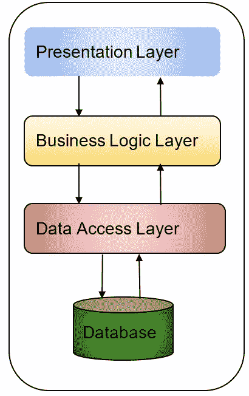
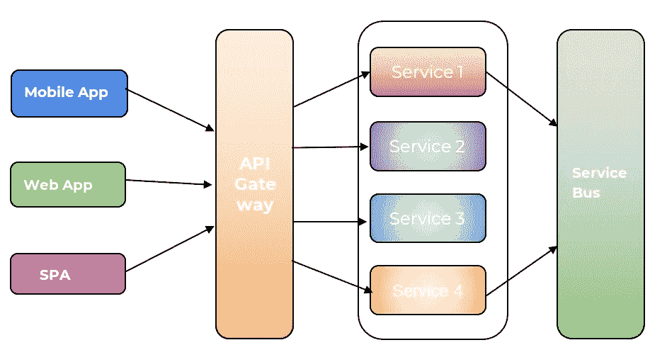
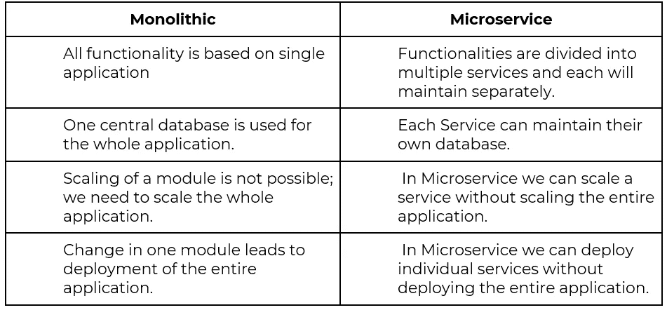

# 微服务简介

> 原文：<https://medium.com/globant/introduction-to-microservice-eae5d905857c?source=collection_archive---------0----------------------->

在讨论什么是微服务之前，我们首先需要了解什么是整体架构，以及我们在整体架构方面面临的挑战。这将有助于我们更好地了解微服务。

## 整体建筑

在我们传统的软件开发方法中，我们基本上遵循整体架构风格。我们在不同的层设计我们的应用程序，表示层，业务逻辑层和数据访问层。所有这些层都相互依赖，这使得我们的应用程序紧密耦合。

## 整体架构的优势

●与微服务应用相比，开发简单。

●易于部署应用程序，因为只部署了一个 jar/war 文件。

●与微服务应用相比，易于测试和调试，因为所有代码库都在一个单元中，我们可以对其进行端到端测试。

## 单片架构的缺点:

●单片应用程序包含基于单个应用程序的所有代码，该应用程序庞大且过于复杂，无法修改或添加新的更改

●由于单一代码库减慢了启动时间，应用程序的规模不断增长。

●每次需要部署整个应用程序时，针对每个新的变更。

●单独扩展单个模块是不可能的，因为每个服务都有不同的资源需求。

●特定模块中的错误或缺陷可能会导致整个应用程序崩溃。

●在整体架构中采用新技术很困难，因为框架或语言的改变会导致重写整个应用程序。

## 微服务:

微服务是一种架构风格，它只有一个职责或单一逻辑来解决特定的问题。它是面向服务架构(SOA)的轻量级形式，其中服务用于特定的工作。每个服务都是用自己的数据库单独构建的。业务需求被分解成具有良好定义接口的较小模块。以便小团队可以在服务的整个生命周期中单独维护和部署这些模块。在 DDD(域驱动设计)环境中，微服务通常是为了实现特定领域的功能。

构建独立服务的优势就像可维护性很容易。大型复杂应用程序的维护很容易，因为与整体应用程序相比，每个服务都是单独维护的。

每个微服务应具有以下特征

●微服务负责单一功能。

●微服务可单独部署。

●微服务的每个服务可以有一个单独的数据库。

●微服务是可更换的。

●一个小团队能维护的微服务屈指可数。

在单芯片应用中，我们需要扩展整个应用，但在微服务中，我们可以独立扩展。在微服务中，您可以只扩展需要更多网络带宽或处理能力来支持需求的特定服务，从而节省成本和硬件需求。
让我们来看看微服务架构是如何工作的。

## 微服务架构:

不要构建一个大型的整体应用程序，而是将应用程序拆分成可以相互连接的较小的服务。每个服务可以有自己的数据库和依赖关系。
正如我们在上面的图表中看到的，来自任何平台(移动应用程序、Web 应用程序、单页应用程序(SPA))的 UI 都可以与 API 网关通信，网关将决定调用哪个服务来满足请求。
每个服务都可以有自己的框架、语言和数据库。服务总线有助于不同服务之间的互通。

## 微服务的优势:

●将应用程序分解成开发和维护速度更快的小服务。

●由于整个应用更像是一组相互隔离的服务，如果需要，可以一次部署一个微服务。任何一个方面的失败都不会导致整个系统瘫痪。

●每项服务都可以独立扩展，因此无需扩展整个应用。

●由于服务是独立的，开发者可以根据他们模块的需求自由选择技术。假设，第一组使用 Java 和 sprint boat 进行服务。第二组使用 Python 和 Node 作为他们的服务。这也被称为多语种微服务。

●微服务高度可用，如果一项服务出现故障，不会导致整个系统关闭。

## 微服务的缺点:

●服务之间的进程间通信很困难，因为需要选择消息或 RPC 机制来编写代码。

●测试微服务很复杂，因为服务相互依赖，需要正确管理以执行测试用例。

●微服务的部署更加复杂，因为每个服务都需要单独配置、部署、扩展和监控。

## 整体服务与微服务

## 结论:

微服务适用于构建复杂、多功能的应用程序，我们需要根据业务需求构建可扩展的服务。当我们使用微服务作为架构时，我们首先需要仔细评估我们的需求。