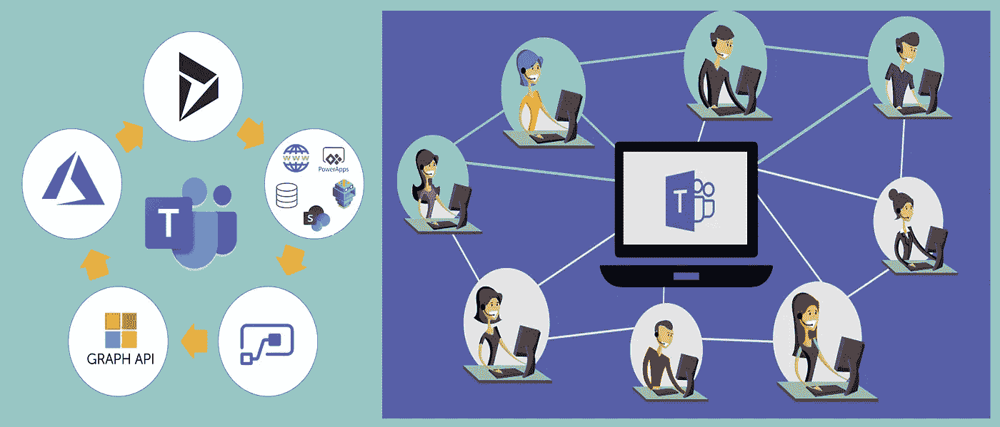
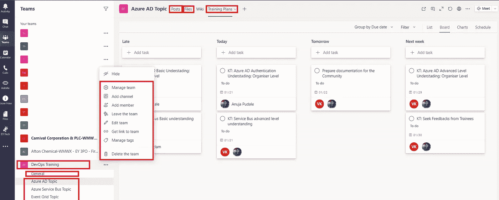
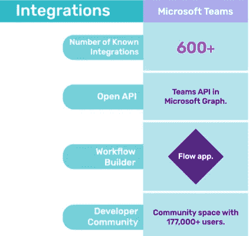

# 微软团队介绍&使用图形 API 实现自动化

> 原文：<https://medium.com/globant/introduction-to-microsoft-teams-its-automation-using-graph-apis-16a06c79ad13?source=collection_archive---------3----------------------->

将“团队”还原为“团队合作”。

Source: [Teams Meeting](https://isnews.stir.ac.uk/files/2020/03/teams-smaller-750x410.jpg&imgrefurl=https://isnews.stir.ac.uk/2020/03/08/meetings-in-ms-teams/&tbnid=acvVyrAVbCVhMM&vet=10CAMQxiAoAGoXChMIqLe20emu7gIVAAAAAB0AAAAAEAc..i&docid=q7WE5Cc_T3NGHM&w=750&h=410&itg=1&q=microsoft%20teams%20integration%20images&ved=0CAMQxiAoAGoXChMIqLe20emu7gIVAAAAAB0AAAAAEAc) and [Google](https://1.bp.blogspot.com/-nd4WheWUCxw/XqVfFJTqSGI/AAAAAAAACiI/y9vxUw2bGZw1fVLI08NVPfldtaTA_uAwACLcBGAsYHQ/s1600/32.PNG)

在新冠肺炎继续影响世界各地的人和国家的艰难时期，让尽可能多的人可以使用**团队**，微软的目标是通过在团队分开工作时保持团队联系来支持公共健康和安全。

那么，让**微软团队**与你的网络应用程序平稳集成如何？如果任何实体工作流需要一个便于团队成员协作和交流的平台。

## **首先，什么是微软团队？**

没有人比微软说得更好。

" *Microsoft Teams 是 Office 365 中基于聊天的工作区，它集成了您的团队需要的所有人员、内容和工具，以提高参与度和效率。*”

它可以在 Windows，macOS，iOS，Android 上运行，并且(当然)可以通过 Office 365 获得。
今天，在本文中，我将分享关于**微软团队供应及其与 PowerApps** 集成的信息。

*好吧，你一定在想…*

## **微软团队的业务用例是什么？**

这是真正的奇迹发生的地方。就我个人而言，我会使用**团队**进行活动规划、项目和倡议。当然，它并不局限于这些用例，但最终，它是由您来决定的。

以下是一些业务场景:

> 1.比方说，我有一群人，他们定期共享文件，共同创作文档，举行团队对话、电话和会议。我应该创建一个团队吗？**绝对**。
> 
> 2.我的培训活动策划团队需要一个可以分享想法、共同工作和寻找内容的地方。团队能工作吗？**绝对**。
> 
> 3.我的项目相关的 web 应用程序有一个工作流，其中一组成员和所有者参与执行创建活动、工具集成和成员管理的任务，这使他们需要一个平台来一起工作。他们能用团队吗？**绝对**。

Teams View[site, channels, tabs for Planner]

## 创建团队网站以协同工作

创建工作组时，它会使用工作组网站模板在后台创建 SharePoint 网站集。它还为该团队创建了一个 **Office 365 组**(即共享邮箱、日历、权限、通讯组列表) **OneNote** 和**规划器**(每个团队站点可以有多个)。

## **创建渠道，将您的内容集中在微软团队上**

在团队网站中，您可以添加团队频道，在那里您可以专注于内容和对话。请记住，默认情况下，每个站点都有一个不能删除的通用频道。

## **在您的频道中添加标签以支持您的团队**

在添加“团队”选项卡时，您将获得相当多的选项，但我更喜欢添加 OneNote、Power BI、Planner、SharePoint、Stream 和 Website。

你可以在这个链接上了解更多—[*https://docs . Microsoft . com/en-us/Microsoft teams/built-in-custom-tabs*](https://docs.microsoft.com/en-us/microsoftteams/built-in-custom-tabs/)*。*

关于**规划器**，我想说一件事——它是一个你可以设定任务、跟踪任务进度、管理时间和跟踪你的表现的空间。简而言之，完美的虚拟日程计划为你工作。

但是，你想想，人工创建团队、渠道、做会员管理【假设，500+】是多么繁琐的任务。

## 那么，如何为您的应用程序需求自动化团队集成呢？

你知道吗？Graph APIs 是开发者的游戏改变者，它为我们提供了自动化下面提到的团队生命周期的能力。

> [创建团队站点](https://docs.microsoft.com/en-us/graph/api/team-put-teams?view=graph-rest-1.0&tabs=http) **—** [添加成员&拥有者](https://docs.microsoft.com/en-us/graph/api/team-post-members?view=graph-rest-1.0&tabs=http) **—** [添加频道](https://docs.microsoft.com/en-us/graph/api/channel-post?view=graph-rest-1.0&tabs=http) **—** [安装应用](https://docs.microsoft.com/en-us/graph/api/team-post-installedapps?view=graph-rest-1.0&tabs=http) **—** [添加标签](https://docs.microsoft.com/en-us/graph/api/channel-post-tabs?view=graph-rest-1.0) **—** [存档或者到时候删除团队](https://docs.microsoft.com/en-us/graph/api/group-delete?view=graph-rest-1.0&tabs=http) s

这里有一个使用 Graph API & Azure 的非常高级的解决方案:

*   **Azure AD —** 首先，我们需要为您的 Azure 应用程序注册应用程序，以便我们可以调用和验证 Microsoft graph API。
*   **Microsoft Graph API —** 在 Azure AD 中执行操作[ ***检索/创建并获取 Azure AD 用户*** ]和 Microsoft Teams [ ***创建 O365 组&团队，添加团队所有者和成员，创建频道和选项卡*** 。
*   **数据源[** *应用程序必须对图形 API 具有适当的权限，以执行团队操作***——**到传递所有相关信息以实现自动化，如团队名称、团队所有者、团队成员、频道名称、标签详细信息等。
*   **Automate —** 你可以在一个特定的动作上尝试 azure 触发器功能，从数据源中提取信息，并自动执行团队集成操作。

您可以点击[此处](https://jeffbrown.tech/getting-started-with-microsoft-teams-and-graph-api/)了解更多详细信息。

## 问:在使用 Microsoft Graph API 之前，需要考虑哪些先决条件？

*   您需要有 Azure 订阅
*   您需要在 Azure 中注册一个应用程序。捕获其 **ClientID** 、 **ClientSecret** 和 **TenantID** 。
*   注册应用程序并获得用户或服务的身份验证令牌后，您可以向 Microsoft Graph API 发出请求。

## **问:我可以用哪种语言来玩微软 Graph API？**

Microsoft Graph API 是一个独立于平台和语言的 API。少数几种可用于使用 Microsoft Graph API 的语言是:

**ASP.NET、C#、JAVA、Node JS、Android、Angular、JavaScript、IOS、PHP、Python、React、Ruby 等等。**

## 你想看看吗，团队已经有多少整合了？

微软团队在其应用商店中列出了 600 多个应用。你可以在这里找到更多关于它的信息。

[MS Teams Integrations](https://dispatch.m.io/microsoft-teams-integrations/)

希望这篇文章对你有帮助！敬请关注更多更新。

注意安全，保重！！