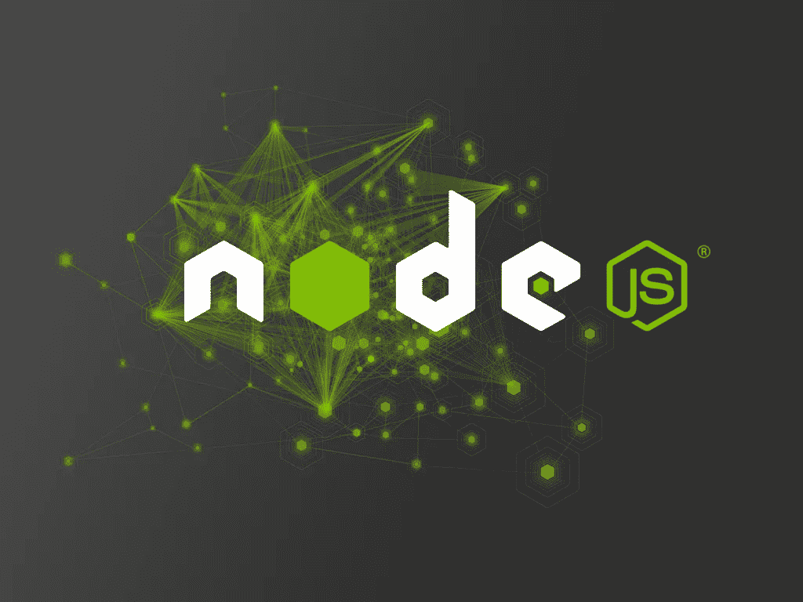
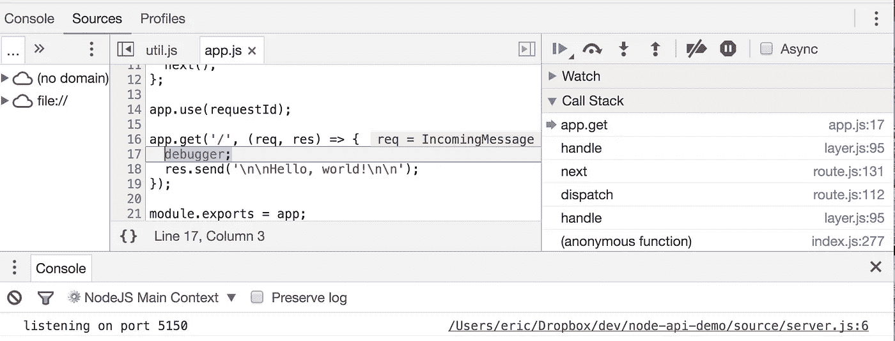

# Node & Express 简介

> 原文：<https://medium.com/javascript-scene/introduction-to-node-express-90c431f9e6fd?source=collection_archive---------3----------------------->



> 这个帖子系列为[“跟随 Eric Elliott 学习 JavaScript”](https://ericelliottjs.com/product/lifetime-access-pass/)的成员提供了配套的视频和练习。会员的视频课在这里:[《节点与快车入门》视频课程](https://ericelliottjs.com/premium-content/introduction-to-node-express/)。还不是会员？[现在报名](https://ericelliottjs.com/product/lifetime-access-pass/)。

Node 是一个 JavaScript 环境，构建在谷歌 Chrome 网络浏览器中使用的同一 JavaScript 引擎上。它有一些很棒的特性，这些特性使它成为构建服务器端应用程序中间层的有吸引力的选择，包括 web 服务器和用于平台 API 的 web 服务。

非阻塞事件驱动的 I/O 模型为它提供了非常有吸引力的性能，轻松击败了 PHP 和 Ruby on Rails 等线程服务器环境，这些环境在 I/O 上阻塞，并通过为每个用户旋转单独的线程来处理多个并发用户。

我已经将拥有数千万用户的生产应用程序从 PHP 和 Ruby on Rails 移植到 Node，使响应处理时间和单个服务器同时处理的用户数量提高了 2 到 10 倍。

**节点特性:**

*   快！(默认情况下为非阻塞 I/O)。
*   事件驱动。
*   一流的网络。
*   一流的流式 API。
*   用于与操作系统、文件系统等接口的优秀标准库…
*   当您需要用 C++之类的低级语言扩展 Node 的功能时，支持编译的二进制模块。
*   受运行任务关键型应用程序的大型企业的信任和支持。(Adobe、谷歌、微软、网飞、贝宝、优步、沃尔玛等……)。
*   容易上手。

# 安装节点

在我们开始之前，让我们确保您已经安装了 Node。Node 始终有两个受支持的版本，长期支持版本(稳定)和当前版本。对于生产项目，尝试 LTS 版本。如果你想玩未来的尖端功能，选择当前版本。

## Windows 操作系统

点击[节点网站](https://nodejs.org/en/)，点击其中一个绿色大安装按钮。

## Mac 或 Linux

如果你在 Mac 或 Linux 系统上，我最喜欢用 nvm 安装 Node。

要安装或更新 nvm，您可以使用 cURL 使用[安装脚本](https://github.com/creationix/nvm/blob/v0.32.1/install.sh):

```
curl -o- https://raw.githubusercontent.com/creationix/nvm/v0.33.11/install.sh | bash
```

或 Wget:

```
wget -qO- https://raw.githubusercontent.com/creationix/nvm/v0.33.11/install.sh | bash
```

一旦安装了 nvm，您可以使用它来安装任何版本的节点。

# 你好，世界！

Node & Express 非常简单，您可以用一个基本的 web 服务器来服务“Hello，world！”在大约 12 行代码中:

在这段代码运行之前，您需要对您的应用程序进行一些设置。首先创建一个新的 git repo:

```
mkdir my-node-app && cd my-node-app
git init
```

你需要一个`package.json`文件来存储你的应用程序的配置。要创建一个，请使用 Node:

```
npm init
```

回答几个问题(应用名称、git 回购等)，你就可以开始了。然后，您需要安装 Express:

```
npm install --save express
```

安装完依赖项后，您可以通过键入以下内容来运行应用程序:

```
node index.js
```

用`curl`测试一下:

```
curl localhost:3000
```

或者在浏览器中访问`localhost:3000`。

就是这样！您刚刚构建了第一个节点应用程序。

# 环境变量

您可以使用环境变量来配置节点应用程序。这使得在不同的环境中使用不同的配置变得容易，比如开发人员的本地机器、测试服务器、中间服务器和生产服务器。

您还应该使用环境变量将应用程序机密(如 API 密钥)注入到应用程序中，而无需将它们签入源代码控制。一些部署环境允许您使用包含应用程序配置设置的`.env`文件，但是您会遇到这样的问题，“我如何将`.env`设置加载到应用程序可以使用的环境变量中？”

为此，请尝试使用节点的 [dotenv](https://github.com/motdotla/dotenv) :

```
npm install --save dotenv
```

然后在条目文件的顶部添加一行:

```
require('dotenv').config();
```

现在你可以从一个`.env`文件中加载`port`设置。在项目根目录下创建一个名为`.env`的新文件，如下所示:

```
PORT=5150
```

保存它，并重新启动应用程序，您应该会看到:

```
listening on port 5150
```

您不想将您的`.env`文件签入 Git，所以将其添加到您的`.gitignore`文件中。事实上，当我们这样做的时候，让我们也添加一些其他的东西:

您仍然希望记录您的应用程序所需的设置，所以我喜欢签入一份编辑了应用程序机密的`.env`文件。该应用的新用户可以复制文件，将其命名为`.env`，自定义设置，然后关闭并运行。我将签入的副本命名为`.env.example`，并在项目的`README.md`文件中包含对开发人员的说明。

```
PORT=5150
AWS_KEY=<your AWS key here>
```

请注意，您应该小心，所有的应用程序机密都被编辑在您的`.env.example`文件中，如所示。

> 不要将您的应用程序秘密签入 Git 存储库。

# 测试节点应用程序

我喜欢用 [Supertest](https://github.com/visionmedia/supertest) 测试节点应用，它抽象出了 http 连接问题，并提供了一个简单、流畅的 API。对于 http 端点，我使用[功能测试](https://www.sitepoint.com/javascript-testing-unit-functional-integration/)，这意味着我不用担心嘲讽数据库等等。我只是用一些值点击 API，并期望得到一个具体的响应。

这里有一个简单的 Supertest 和[磁带](/javascript-scene/why-i-use-tape-instead-of-mocha-so-should-you-6aa105d8eaf4)的例子:

我还为我用来构建 API 的任何更小的、可重用的模块编写单元测试。

请注意，我们不是处理网络，而是直接导入 express 应用程序。Supertest 不需要读取您的应用程序配置来知道要连接到哪个端口。它在幕后处理所有这些细节，但要实现这一点，您需要在应用文件中导出您的应用:

```
module.exports = app;
```

出于这个和其他原因，我将我的应用程序分成几个不同的部分，`app.js`我构建和配置应用程序本身，`server.js`我导入应用程序，处理网络细节，并调用`app.listen()`。

## 设置节点路径

当你开始把你的应用分成模块时，你可能会厌倦这样的相对路径要求:

```
const app = require('../../app');
```

幸运的是，你不需要使用它们。将你的应用程序文件放在名为`source`或`src`的目录中，然后设置`NODE_PATH`环境变量。您可以使用`cross-env`来设置环境变量，以便它们能够跨平台工作(在 Windows 上读取、运行您的应用程序):

```
npm install --save cross-env
```

然后在您的`package.json`脚本中，您可以安全地设置您的环境变量:

使用`NODE_PATH`设置，您可以要求如下模块:

```
const app = require('app');
```

好多了！

# 中间件

Express 是最流行的节点应用程序框架，它的特色是使用连续传递的中间件。当您想要为潜在的许多不同路线运行相同的代码时，该代码的合适位置可能是中间件。

中间件是一个传递请求和响应对象的函数，以及一个调用的延续函数，称为`next()`。假设您想为每个请求/响应对添加一个`requestId`,这样当您调试或搜索日志时，就可以很容易地追溯到单个请求。

你可以像这样写一些中间件:

# 内存管理

由于 Node 是单线程的，这意味着所有用户将共享相同的内存空间。换句话说，与在浏览器中不同，您必须小心不要将特定于用户的数据存储在闭包中，因为其他连接可以获取这些数据。出于这个原因，我喜欢使用`res.locals`来存储临时用户数据，这些数据只在用户的请求/响应周期内可用:

这也是上面提到的`requestId`比较好的存放方式。

# 调试节点应用程序

Node v6.4.x+附带了一个集成的 Chrome 调试器，因此您可以连接 Node 使用与您在浏览器中调试 JS 应用程序相同的工具。

要使用它，只需在想要设置断点的任何地方添加调试器语句，然后运行:

```
node --inspect-brk source/app.js
```

在浏览器中打开`chrome://inspect/`，点击目标，你会得到一个交互式调试环境。



我默认使用`--inspect-brk`来告诉它在开始时中断，但是你可以省去它。请记住，您可能需要在浏览器中或从 curl 中点击您的路线来触发路线处理程序并点击您的断点。

你可能已经知道，Chrome 的开发工具充满了有价值的调试见解。您可以分析、检查内存管理并观察内存泄漏，一次一行地单步执行代码，将鼠标悬停在变量上以查看值，等等

# 让它崩溃吧

进程崩溃。像所有事情一样，您的服务器的运行时可能会在某个时候遇到它无法处理的错误。别担心。记录错误，关闭服务器，并启动一个新实例。

你绝对不能做的是:

```
process.on('uncaughtException', (err) => {
  console.log('Oops!');
});
```

当出现未捕获的异常时，您必须关闭进程，因为根据定义，如果您不知道应用程序出了什么问题，您的应用程序就处于未知、未定义的状态，几乎任何事情都可能出错。

你可能会泄露资源。您的用户可能看不到正确的数据。你可能会有各种疯狂的，不确定的行为。当出现您没有特别计划的异常时，记录错误，尽可能清理资源，并关闭进程。

我编写了一个模块，让 Node 的错误处理变得更加简单。查看[快速错误处理程序](https://github.com/ericelliott/express-error-handler)。

## 故障修复

有各种各样的服务器监控实用程序来检测崩溃和修复服务，以保持事情顺利运行，即使面对意外的异常。

为此我强烈推荐 [PM2](http://pm2.keymetrics.io/) 。我使用它，它受到微软、IBM 和 PayPal 等公司的信任。

要安装，运行`npm install -g pm2`。使用`npm install --save-dev pm2`在本地安装。然后你就可以用`pm2 start source/app.js`启动应用了。

你可以用`pm2 list`管理正在运行的应用实例，用`pm2 stop`停止实例。详见[快速启动](http://pm2.keymetrics.io/docs/usage/quick-start/)。

额外好处:PM2 可以配置为与 [Keymetrics](https://keymetrics.io/) 集成，这可以通过友好的 web 界面提供对您的生产应用程序实例的深刻见解。

# 结论

我们只是触及了节点的表面。还有很多东西需要学习，包括会话管理、令牌认证、API 设计等等。我已经在[“JavaScript 应用程序编程”](http://pjabook.com)(免费在线)中更深入地讨论了其中的一些主题。

想了解更多关于 Node 的知识吗？我们将为 EricElliottJS.com 的成员推出一个新的节点视频系列。如果你不是会员，你就错过了。

[](https://ericelliottjs.com)

***埃里克·艾略特*** *著有* [*【编程 JavaScript 应用】*](http://pjabook.com) *(奥赖利)，以及* [*《跟埃里克·艾略特学 JavaScript》*](http://ericelliottjs.com/product/lifetime-access-pass/)*。他为 Adobe Systems******Zumba Fitness*******华尔街日报*******ESPN*****BBC**等顶级录音师贡献了软件经验******

**他大部分时间都在旧金山湾区和世界上最美丽的女人在一起。**