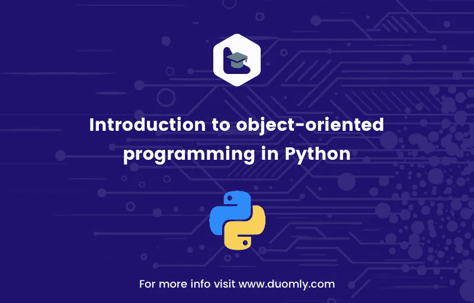

# Python 中面向对象编程的介绍

> 原文：<https://medium.com/duomly-blockchain-online-courses/introduction-to-object-oriented-programming-in-python-a6188020d0fb?source=collection_archive---------1----------------------->

[Duomly — programming online courses](https://www.duomly.com)

本文最初发布于:[https://www . blog . duomly . com/object-oriented-programming-in-python/](https://www.blog.duomly.com/object-oriented-programming-in-python/)

Python 允许按照几种编程范式(如过程编程、函数编程、面向对象编程)编写程序，并允许将它们结合起来。