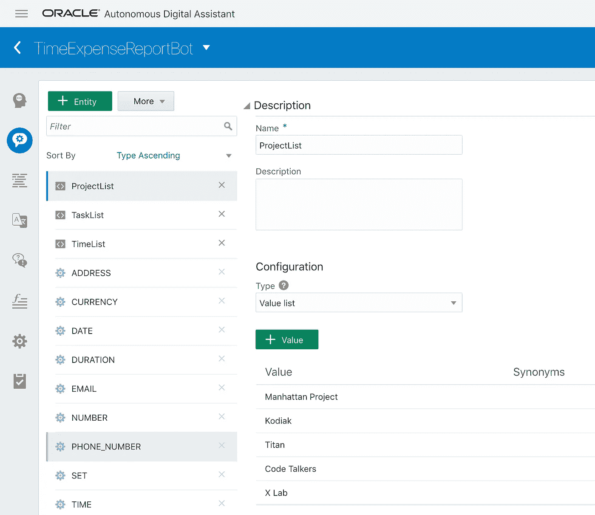

# Oracle 数字助理对话流程简介

> 原文：<https://medium.com/oracledevs/introduction-to-oracle-digital-assistant-dialog-flow-72075c6bd841?source=collection_archive---------0----------------------->

Oracle 数字助理是 Oracle 聊天机器人的新名称。实际上，它不仅仅是一个新名称——从现在开始，聊天机器人功能被提取到单独的云服务中——Oracle 数字助理(ODA)云服务。它现在单独运行，不属于 Oracle 移动云服务。我认为这是一个很大的进步——这将使 ODA 服务更轻便、更易于使用，并且对不是 Oracle 移动云服务客户的人更有吸引力。

我在玩 ODA 中的对话流定义，想分享一些经验教训。我从 ODA 中提取了我的 bot 定义，上传到 [GitHub](https://github.com/abaranovskis-redsamurai/TimeExpenseReportBot) repo 供大家参考。

当在 ODA 服务中创建新机器人时，首先你需要定义意图列表，并为每个意图提供示例短语。基于该信息，算法训练并创建用于用户输入分类的机器学习模型:

ODA 给了我们一个选择——使用更简单的基于语言学的模型或机器学习算法。在我的简单例子中，我使用的是第一个:

意图与实体一起分配:

将实体视为关于类型，它定义了某个基本类型的单个值，或者它可以是值的列表。实体将定义对话流变量的类型:

bot 实现的关键部分——对话流程。这是您定义如何处理意图以及如何处理对话上下文的规则的地方。目前，ODA 没有为托管对话流提供 UI 接口，您需要手工输入规则(如果您的 bot 逻辑很复杂，您可以在 ODA 之外创建 YAML 结构)。我强烈推荐阅读 ODA 对话流程指南，这是 bot 实现中最复杂的部分——[对话流程定义](https://docs.oracle.com/en/cloud/paas/autonomous-digital-assistant-cloud/use-chatbot/dialog-flow-definition.html#GUID-CE86A43E-286A-462C-8B80-0BA2666D80F7)。

对话流定义基于两个主要部分——上下文变量和状态。上下文变量—这是您定义 bot 上下文中可访问的变量的地方。如你所见，既可以使用基本类型，也可以使用我们自己定义的类型(实体)。类型 *nlpresult* 是内置类型，该类型的变量获取分类意图信息:

状态部分定义了停止(或对话)的顺序，在与用户对话期间，机器人从一个停止转换到另一个停止。每个站点都指向某个组件，有许多内置组件，您也可以使用自定义组件(例如，也可以调用 REST 服务)。在下面的示例中，用户键入*提交项目时间*，这将触发分类，结果由系统处理。意图，从对话流开始的地方-它转到对话框，用户应该从列表中选择项目。在对话流停留在上下文中之前，我们不需要对用户输入进行分类，因为我们将用户答案视为输入变量:

用户一选择项目，流程就转到下一站*选择任务*，在这里我们要求用户选择任务:

选择任务时—转到下一站，选择花费在此任务上的时间。查看我们如何在当前提示文本中引用以前的答案。我们可以通过表达式引用和显示以前的答案:

最后我们问一个问题——如果用户想输入更多关于任务的细节。默认情况下，所有停靠点从上到下按顺序执行，如果过渡为空，这意味着将执行下一个停靠点，在这种情况下为 *confirmtaskdetails* 。下一站将是有条件的(系统。ConditionEquals component)，根据用户的回答，它将选择下一个要执行的站点:

如果用户选择是—将转到下一站，在那里用户需要键入文本(系统。文本组件):

最后，我们打印任务日志信息，并询问用户是否想继续。如果他回答“否”,我们停止上下文流，否则我们询问用户——他下一步想做什么:

当用户键入句子时，我们脱离了对话上下文，句子将被分类以识别新的意图，并且流程将继续:

我希望这为您提供了关于 Oracle 数字助理服务中 bot 对话流实现的良好介绍。

*原载于 2018 年 11 月 9 日*[*andrejusb.blogspot.com*](https://andrejusb.blogspot.com/2018/11/introduction-to-oracle-digital.html)*。*