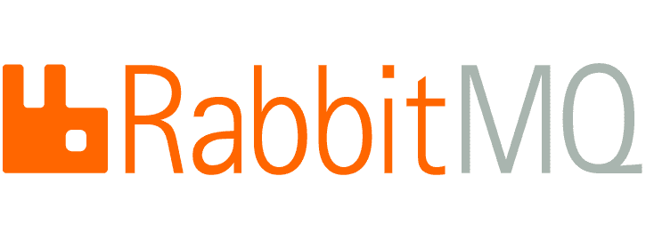
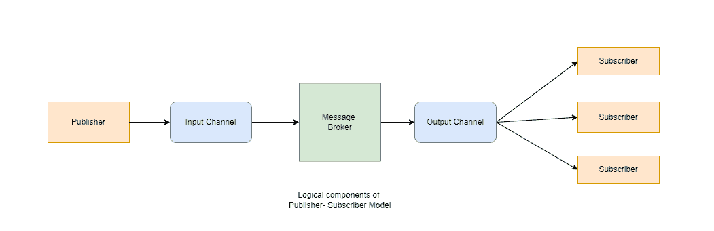
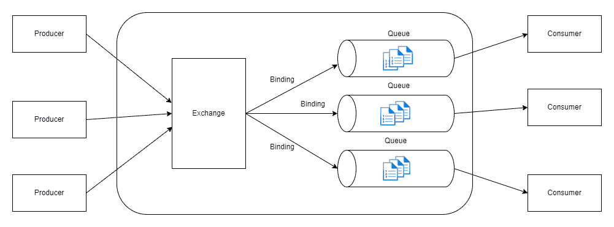
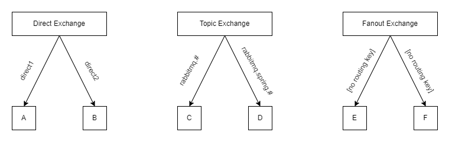

# RabbitMQ 简介

> 原文：<https://medium.com/globant/introduction-to-rabbitmq-5af1a58b942e?source=collection_archive---------1----------------------->

嗨，朋友们，在这篇文章中，我们将简要介绍什么是 RabbitMQ，以及它如何帮助扩展我们的微服务，

RabbitMQ 遵循发布-订阅模式进行通信，因此在进入 RabbitMQ 之前，让我们了解一下这种发布-订阅机制到底是什么，

## 发布-订阅模型

在分布式应用程序中，当事件发生时，系统的组件通常需要向其他组件提供信息。为此，消息传递应运而生，它是一种有效的方法，可以将发送者从消费者中分离出来，并避免阻止发送者等待响应。

然而，这也带来了一些问题，

**可伸缩性**:为每个消费者使用一个专用的消息队列并不能最终扩展到许多消费者。

**抽象**:一些消费者可能只对队列中可用信息的子集感兴趣。

**耦合**:有时，发送者想要向所有感兴趣的团体广播事件，而不知道他们的位置/地址。如果发送方存储位置映射，那么它将导致一个紧密耦合的系统。

我们可以使用包含以下内容的异步消息传递机制来解决这些问题:

发送方使用输入消息传递通道。发送方使用预定义的消息格式将事件相关数据编译成消息，并通过传输通道发送这些消息。这种机制中的发送者也被称为**发布者**。

另一方面，这些信息可以被消费者接收。消费者被称为**用户**。

用于将每个消息从输入通道复制到输出通道以供对该消息感兴趣的所有订户使用的通信介质被称为**消息代理**或**事件总线**。

下图显示了该机制的逻辑组件:

发布-订阅的优点:

*   **解耦/松散耦合的组件:**通过发布-订阅机制，子系统得到解耦，并且可以通过独立的异步通信轻松管理。它将仍然需要通信的子系统解耦。
*   **可扩展且高度负责:**消息的发送者(发布者)能够快速将消息发送到通信通道，并立即返回其核心处理职责。它不必担心消息的传递。消息传递基础设施将负责向相关方传递消息。
*   **路由、延迟/预定处理:**用户可以等到非高峰时间再取消息，或者可以根据特定的时间表路由或处理消息。
*   **容错**:使系统在增加的负载下平稳运行，更有效地处理间歇性故障，使系统更加可靠和容错。
*   **工作流兼容性:**它提供了跨分布式应用程序的异步工作流编排。
*   **关注点分离:**每个应用程序可以专注于其核心功能，而消息传递基础设施处理将消息可靠地路由到多个消费者所需的一切。

这种发布者-订阅者机制广泛用于 n/w 操作、自动化、数据中心和其他需要实时计算的行业。对于无服务器计算和基于云的分布式系统来说，这也是一个非常有用的模式。RabbutMQ 是内部实现这种模式的技术之一，让我们更详细地研究 rabbitmq。

## 兔子 q

RabbitMQ 是一款使用 [***AMQP***](https://www.amqp.org/about/what) 协议传输数据的消息代理软件。也就是说，RabbitMQ 接受来自生产者的消息，并将它们传递给消费者。它之所以被广泛使用，是因为它是开源的，不像它的竞争对手——[Amazon MQ](https://aws.amazon.com/amazon-mq/pricing/)或 [GC Pub/Sub](https://cloud.google.com/pubsub/pricing) 。

RabbitMQ 充当中间人的角色，用于减少交付时间和应用服务器的负载。它为您的应用程序提供了一个发送和接收消息的通用接口，并为您的消息提供了一个安全的存放位置(即队列),直到消息被接收为止。

*关于 AMQP*

AMQP 是高级消息队列协议，它是一种消息协议，使客户端应用程序能够与消息中间件代理进行通信。

消息传递代理接收来自发布者的消息，并将它们发送给消费者。

AMQP 有队列、交换和绑定，统称为它的实体。这些实体帮助我们将消息从生产者传递给消费者。

## RabbitMQ 组件

RabbitMQ 包含以下 4 个基本组件:

–生产商

–交换

–排队

–消费者

**制片人**

生产者是发布消息的用户应用程序。我们从出版商那里发送信息。发布者将连接到 RabbitMQ，发送一条消息，然后退出。

发布消息时，发布者可以指定各种*消息属性*(消息元数据)。其中一些属性可以被 RabbitMQ (broker)使用，但是许多属性只能被接收者使用。

**交换**

来自发布-订阅机制的代理被称为交换。它还有一个队列来存储消息。

交换从生产者那里获取消息，并将其路由到零个或多个队列中。使用的路由算法取决于交换类型和称为绑定的规则。该算法还有一个与之关联的路由关键字。它只是由生产者添加到消息头的一个消息属性。我们可以把路由键想象成一个“地址”,交换使用它来决定如何路由消息。消息进入队列时，其绑定键与消息的路由键完全匹配。

有以下几种交换类型:

–*直接交换*:当我们必须发送消息到队列时，只有当它们之间的特定键(路由键)值匹配时。

–*扇出交换*:当我们想要广播我们的消息，以便任何队列都可以接收消息时。

–*话题交换*:与直接交换不同，他们匹配模式而不是一个确切的键。

–*报头交换*:报头的值等于路由键上指定的值。

**队列**

一个*队列*是 RabbitMQ 的消息存储/缓冲区。当消息流经 RabbitMQ 组件时，它们只能存储在一个*队列*中。

许多*生产者*可以向一个队列发送消息，许多*消费者*可以尝试从一个*队列*接收数据。它本质上只受主机内存&磁盘限制的约束。

在使用队列之前，必须对其进行声明。如果队列尚不存在，声明队列将导致创建队列。如果队列已经存在，并且其属性与声明中的属性相同，则重新声明将无效。

**接收器**

*消费者*是主要等待接收消息(即订阅消息)的程序。消费者根据附加的不同策略监听来自 RabbitMQ 队列的消息。每当队列中有接收者正在监听的新消息时，它将能够按照消息插入队列的顺序从队列中取出这些消息。

此外，当添加一个新的消费者时，假设队列中已经有准备好的消息，传递将立即开始。

## RabbitMQ 优势

*   **异步消息传递:**
    支持多种消息传递协议、消息队列、送达确认、灵活的队列路由和多种交换类型。
*   **企业&云兼容:**
    授权，支持 TLS 和 LDAP，可插拔认证。轻量级，易于在公共云和私有云部署。
*   **开发经验:** 与码头工人、木偶等一起部署。用喜欢的编程语言开发，比如 Java、PHP、Python、JavaScript 等等。
*   **分布式部署:** 跨越多个可用地带和地区的邦联；还可以部署为集群，以实现高吞吐量和高可用性。
*   **工具&插件:**用于扩展 RabbitMQ 功能的灵活插件方法。
*   **易于管理&监控:**
    UI、命令行工具和用于管理和监控 RabbitMQ 的 HTTP-API

总的来说，发布-订阅机制使应用程序能够异步地向多个感兴趣的消费者宣布事件，而无需将发送者耦合到接收者。RabbitMQ 提供了一个使用发布-订阅机制的接口，为分布式应用程序联合高度可伸缩和可用的组件。

*参考文献*:

1.  [https://www.amqp.org/about/what](https://www.amqp.org/about/what)
2.  [https://www . cloudamqp . com/blog/part 2-2-rabbit MQ-for-初学者 _ example-and-sample-code-node-js . html](https://www.cloudamqp.com/blog/part2-2-rabbitmq-for-beginners_example-and-sample-code-node-js.html)
3.  [https://blog.knoldus.com/introduction-to-rabbitmq/](https://blog.knoldus.com/introduction-to-rabbitmq/)
4.  [https://docs . Microsoft . com/en-us/azure/architecture/patterns/publisher-subscriber](https://docs.microsoft.com/en-us/azure/architecture/patterns/publisher-subscriber)
5.  [https://en . Wikipedia . org/wiki/Publish % E2 % 80% 93 subscribe _ pattern](https://en.wikipedia.org/wiki/Publish%E2%80%93subscribe_pattern)