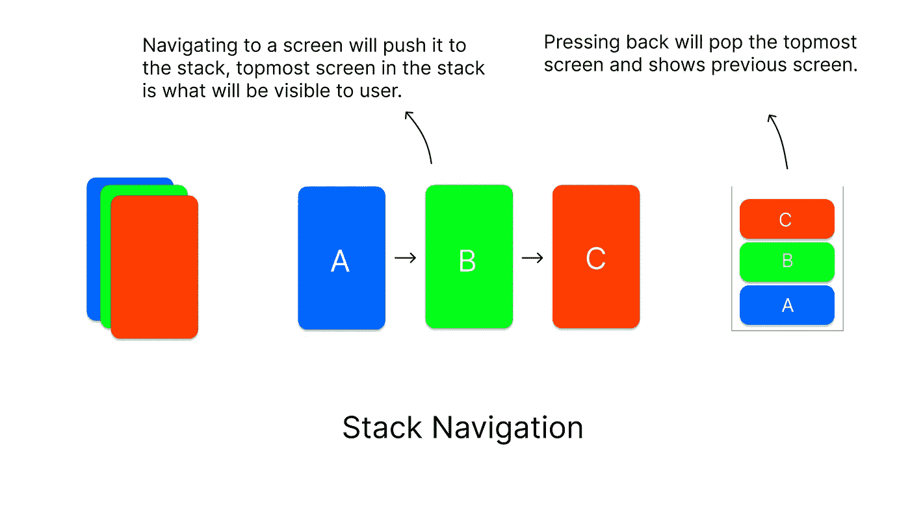
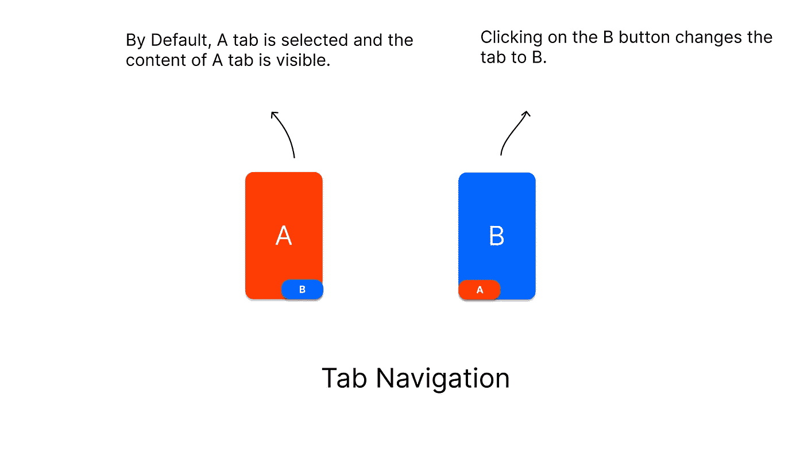
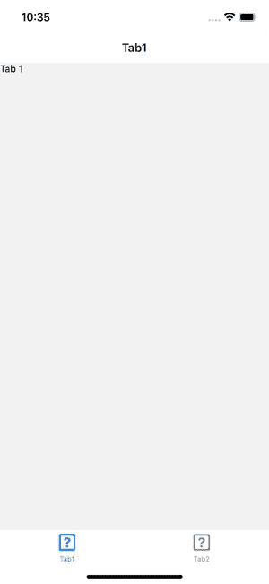
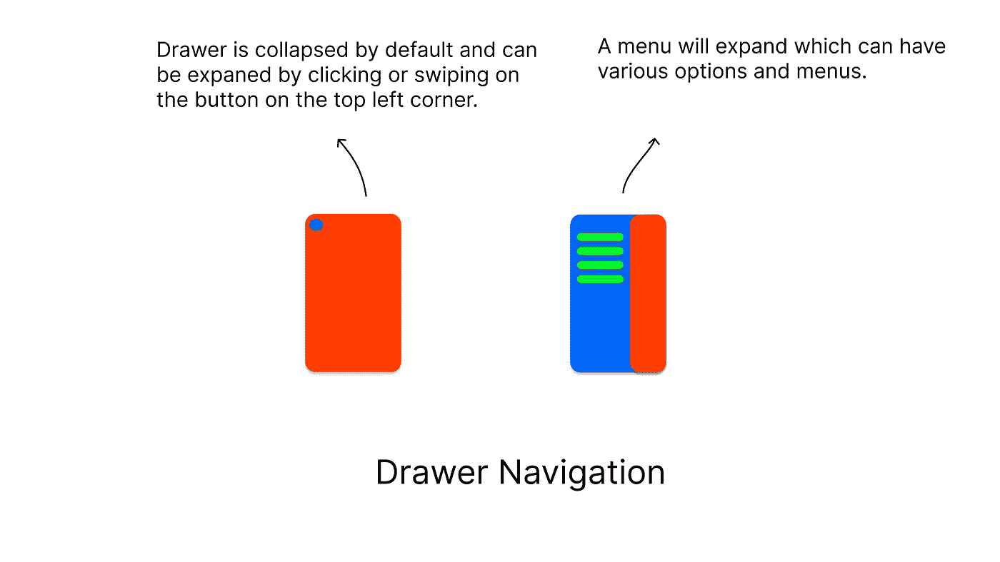
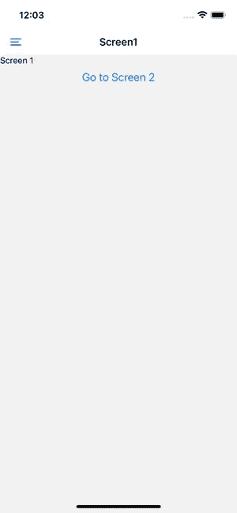

# React 本机导航简介

> 原文：<https://medium.com/walmartglobaltech/introduction-to-react-native-navigation-83ac8903ddad?source=collection_archive---------2----------------------->


Image from [Matheus Bertelli](https://www.pexels.com/photo/forced-perspective-photography-of-cars-running-on-road-below-smartphone-799443/)

在本文中，我们将学习如何在 React Native 中实现导航。我们将使用 [React Navigation](https://reactnavigation.org/) ，它是用于向 React 本地应用程序添加路由和导航的官方库。我们将讨论以下导航类型以及如何实现它们:

*   堆栈导航
*   标签导航
*   抽屉导航

## **先决条件**

*   React 的基础
*   [React 导航设置](https://reactnavigation.org/docs/getting-started)



Stack Navigation Illustration

***堆栈导航*** 在这种导航中，维护的是一堆屏幕。每次我们访问一个屏幕，它就被推到堆栈中，按 back 会从堆栈中弹出该项，显示最后一个屏幕。这种类型的导航的一个很好的例子是网页，我们在网站的不同页面之间导航，并按 back 移动到最后一页。在我们继续之前，我们需要添加堆栈导航所需的库。

```
npm install @react-navigation/native-stack
```

## ***我们怎样才能创建屏幕？***

要在应用程序中添加可导航的屏幕，我们需要创建一个基本结构，如下面的代码示例所示，包括用`createNativeStackNavigator()`初始化堆栈导航器，并在`NavigationContainer`中使用它。

Stack Navigation Structure

在`<Stack.Navigator>`里面是我们需要放置所有屏幕的地方。每个屏幕都带有`<Stack.Screen>`标签，我们将传递两个道具`name`和`component`，其中`name`是组件的名称，确保它是唯一的，并避免使用特殊字符和空格，`component`是我们要添加到屏幕的组件。下面给出的是添加了两个屏幕的代码。默认情况下，`<Stack.Navigator>`中最先出现的屏幕将首先对用户可见，或者换句话说，它将是堆栈中已经被推到那里的屏幕，例如在下面的代码中`Screen1`将是可见的。

> **提示:**我们也可以使用`Stack.Navigator`上的`initialRouteName`道具来指定默认屏幕。

Adding Screens to Stack Navigator

该应用程序现在看起来像下面给出的图像，我们看到我们的默认屏幕(屏幕 1)，目前没有办法导航到屏幕 2。我们将在下一节讨论如何做到这一点。


Screen1 is visible as the default screen

## 我们如何在屏幕间穿梭？

现在我们的应用程序中有两个屏幕。让我们看看如何在这些屏幕之间移动，或者我们可以说如何将新屏幕推到堆栈中。React 导航附带了一个名为`navigate()`的方法来实现这一点，该方法在`navigation`道具中可用，该道具会自动添加到每个屏幕中。在`navigate()`方法中，我们只需要通过我们想要导航到的屏幕的`name`。这个`name`与我们在上一节中设置的`name`相同。让我们看一个代码示例，其中我们在`Screen1`中有一个按钮导航到`Screen2`，在后者中有一个按钮导航到前者。

Navigating between screens


Animation of navigation between screens

您可以看到，点击`Go to Screen 2`会将我们带到`Screen2`，此外，在`Screen2`的左上角有一个后退按钮可以返回。`Screen2`中的`Go to Screen 1`按钮将我们带回到`Screen1`，其行为与按下后退按钮相同，这由 React 导航库处理。它不是把新的`Screen1`压入堆栈，而是回顾堆栈的历史，如果找到就导航到所需的页面。此外，以类似的方式，如果要导航的页面已经在堆栈中，它将继续弹出堆栈，直到到达该页面。如果您的要求是创建新屏幕并推入堆栈，而不是回顾历史堆栈，请使用`navigation.push("name")`而不是`navigation.navigate("name")`。

> **注意:** React 导航提供两种类型的堆栈导航器 API，我们使用[原生堆栈](https://reactnavigation.org/docs/native-stack-navigator)而不是[堆栈](https://reactnavigation.org/docs/stack-navigator/)，因为前者使用原生导航原语来提供更好的性能。如果你想要更多的可定制性，选择后者。



Tab Navigation Illustration

另一种常用的导航方式是在页面上设置选项卡并来回导航。选项卡可以在屏幕的顶部或底部。React 导航为选项卡提供了三种不同的 API:

*   [底部标签](https://reactnavigation.org/docs/bottom-tab-navigator)屏幕底部的一个简单标签栏。
*   [材料底部标签](https://reactnavigation.org/docs/material-bottom-tab-navigator)屏幕底部以材料设计为主题的标签栏。
*   [材料顶部标签](https://reactnavigation.org/docs/material-top-tab-navigator)屏幕顶部的一个以材料设计为主题的标签栏。

在本文中，我们将只查看底部的选项卡，以了解如何使用选项卡导航器。从安装底部标签所需的软件包开始:

```
npm install @react-navigation/bottom-tabs
```

就像堆栈导航一样，我们必须遵循下面示例代码中给出的结构。我们必须使用`createBottomTabNavigator()`初始化导航器，然后在`NavigationContainer`中使用它。如示例所示，所有选项卡屏幕都在`Tab.Navigator`中。

Tab Navigation Structure

让我们为选项卡创建简单的组件，`Tab1`和`Tab2`，每个组件都需要在`<Tab.Navigator>`元素中。我们需要用`Tab.Screen`创建每个选项卡，并以与堆栈示例中类似的方式传递`name`和`component`。

> 您也可以像在 Stack Navigator 中一样使用`navigation.navigate()`方法。

Adding Tabs to Tab navigator

让我们来看一个动画，看看我们的项目在当前代码变化的情况下是怎样的。单击按钮上的选项卡名称应该会改变渲染组件，如下图动画所示。



> 您还可以使用每个`Tab.Screen`上的`options`支柱上的`tabBarIcon`键自定义每个选项卡的图标，或者通过将`tabBarIcon`传递给`Tab.Navigator`上的`screenOptions`来自定义每个选项卡的图标，为了保持代码示例简单，我将这种探索留给您自己。



Drawer Navigation

**抽屉**可以说是一种特殊类型的拉环，其中改变拉环的按钮活在左侧(或右侧)的抽屉中。要在项目中使用抽屉，从安装依赖项开始。

```
npm install @react-navigation/drawer
```

此外，要完成设置，请遵循此处[给出的说明](https://reactnavigation.org/docs/drawer-navigator/#installation)。建议在完成所有依赖项安装后，运行`ios`文件夹中的`pod install`。

就像前面已经讨论过的其他导航器一样，Drawer 也有类似的结构。我们使用`createDrawerNavigator()`来初始化导航器，并在`<NavigationContainer>`中使用它，如下面的代码示例所示。

Drawer Navigation Structure

同样，我们将使用`Drawer.Navigator`放置所有不同的屏风/抽屉组件。现在让我们看看一个有三个屏幕的完整抽屉。每个画面都会配有`Drawer.Screen`和`name`和`component`道具。在每个屏幕上，我们也有一个在它们之间导航的链接，或者，我们可以使用抽屉来改变屏幕。下面给出的是代码和输出。

Adding Drawer Components to Drawer Navigator



Drawer Navigation Animation

**资源:**

*   [反应原生导航文档](https://reactnavigation.org/)