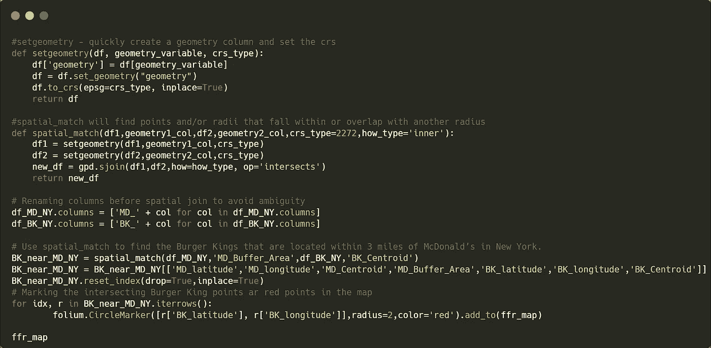

# Python 中的空间分析简介

> 原文：<https://medium.com/walmartglobaltech/introduction-to-spatial-analytics-in-python-44e92b4af362?source=collection_archive---------0----------------------->

Image Source: [Pixabay](https://pixabay.com/illustrations/web-map-flat-design-pin-world-3120321/)

涉及任何类型的特定地理区域或位置信息的数据被称为“空间”数据(或“地理空间”数据)。地理空间数据有助于理解地理属性和任何其他度量数据之间的关系，例如，城市地区和沿海地区的产品销售有何不同？地理空间数据有多种应用，例如

*   可视化数据描述的区域
*   执行贸易区分析
*   为品牌选择开设新店的地点
*   规划电信/交通网络
*   破坏性天气等造成的风险评估。

获得这样的见解是很有价值的，这使得空间数据技能成为任何数据科学家的工具集的重要补充。在本文中，通过“geopandas”包中的一些基本地理空间操作，对 Python 的空间分析生态系统进行了介绍性概述。在本文结束时，读者将了解到

*   地理空间数据格式的基础
*   根据纬度和经度创建点几何
*   为贸易分析在点周围创建缓冲区
*   使用 folium 可视化地理空间数据
*   两个空间数据帧相交点的连接操作

**1。** **处理地理空间数据**

**1.1。** **矢量数据**

矢量数据表示世界上的几何图形。打开导航地图时，您会看到矢量数据。道路网络、建筑物、餐馆和自动取款机都是具有相关属性的向量。矢量数据只是称为“顶点”的离散位置((x，y)值)的集合，这些位置定义了三种形状之一:

*   **点**:单个(x，y)点。比如你家的位置。
*   **线**:两个或多个相连的(x，y)点。就像一条路。
*   **多边形**:三个或三个以上(x，y)点连接并闭合。比如一个湖，或者一个国家的边界。

Shapes of different vector data

矢量数据通常以“shapefile”格式存储。shapefile 由三个具有相同前缀(此处为“空间数据”)但扩展名不同的必需文件组成:

*   *spatial-data.shp* :存储每个形状几何记录的主文件
*   *spatial-data.shx* :主文件中几何图形如何相互关联的索引
*   *spatial-data.dbf* :每条记录的属性

还有其他存储矢量数据的文件类型，如 geojson。这些文件通常可以使用我们下面使用的相同方法和包导入到 Python 中。

**1.2。**T22【地质公园】

在本文中，我们将主要使用名为 [geopandas](https://geopandas.org/getting_started/introduction.html) 的开源 python 库来处理 python 中的矢量数据。Geopandas 将[熊猫](https://pandas.pydata.org/pandas-docs/stable/)的功能扩展到地理空间数据，并利用 [shapely](https://shapely.readthedocs.io/en/stable/manual.html) 的功能对空间数据执行几何运算。Geopandas 依赖 [fiona](https://fiona.readthedocs.io/en/latest/manual.html) 进行文件访问，依赖 matplotlib 进行绘图。geopandas 中使用的关键数据类型是 GeoSeries 和 GeoDataFrame like Series 以及来自 pandas 的数据帧。地理数据框包含通常称为“几何”的几何列。几何列包含不同的几何图形，如点(纬度和经度)、线、多边形等。，作为匀称的物体。以下是地理数据框架的示意图。

Data format of a typical geodataframe

接下来，我们将通过分析美国快餐店的数据集来探索地理空间操作的一些示例。

**2。** **美国快餐案例研究**

在这个案例研究中，我们将使用来自 [Kaggle](https://www.kaggle.com/datasets/datafiniti/fast-food-restaurants?select=FastFoodRestaurants.csv) 的数据集，其中包含美国 10，000 家快餐店的信息。为了简单起见，我们将只分析数据集的一个子集。目标是定位纽约州的所有麦当劳餐厅，并确定相应麦当劳餐厅附近有多少家汉堡王餐厅(麦当劳的竞争对手)。

首先，我们将导入必要的 python 库并加载数据集。

**2.1。** **创建点和缓冲区**

请注意，这些数据集是常见的熊猫数据帧。接下来，我们将通过从纬度和经度创建点几何对象来将这些转换为地理数据框。以下函数使用 WGS84 的坐标参考系统(CRS)将数据集转换为地理空间数据。WGS84 是 GPS 的标准，由参考椭球体、标准坐标系、海拔数据和大地水准面组成。鼓励读者查看此[链接](https://epsg.io/4326)以了解更多关于 CRS 的信息。

如下所示，创建了一个新列“质心”,这是一种点几何数据类型，数据框的类被转换为地理数据框。

接下来，我们基于给定的半径在质心点周围创建一个缓冲区。

如下所示，地理数据框架现在由另一个名为“Buffer_Area”的几何对象列组成，该列是一个多边形。

**2.2。** **可视化地理空间数据**

现在，我们将使用 python 库''和底层内置图块集 ['OpenStreetMap'](http://openstreetmap.org/) '在地图上可视化点('质心')和多边形(' Buffer_Area ')几何对象。

McDonald’s in New York State

Polygons are drawn around 3 miles from all the McDonald’s

**2.3。** **空间连接**

在本节中，我们将使用 Geopandas 的空间连接功能来查找位于麦当劳相应缓冲区内的汉堡王餐厅点。就像 Pandas 的连接操作一样，该操作也涉及连接两个至少具有一个几何类型变量的地理数据框架。但是，还有几件事值得一提:

*   两个数据帧中几何对象的 CRS 单位应匹配。
*   要连接的每个数据框中的几何对象都应命名为“geometry”或“set_geometry”。如果数据框中有多个几何列，应使用选项来表示主几何对象。
*   执行内部空间连接操作后，仅保留左侧数据框中的几何对象数据，而丢弃另一个数据框。

有关详细信息，请读者查看 geopandas 文档[此处](https://geopandas.org/docs/user_guide/mergingdata.html)。下面的代码演示了如何使用 spatial_match 来查找位于纽约麦当劳 3 英里范围内的汉堡王。

正如下面放大的地图所示，汉堡王被标记为麦当劳蓝色缓冲区内的红点。

Red points indicate the locations of Burger Kings

这个案例研究的代码可以在这个 [github 链接](https://github.com/samrat-nath/python-tests/blob/94610d35e2b2d578959f63c324a55b99e7c86965/Misc/spatial_analytics.py)中找到。

**3。结论**

本文的目标是介绍地理空间分析、geopandas 和其他丰富的开源 python 空间库的概念。我们已经介绍了常见的空间操作，如创建几何点、创建缓冲区、空间连接以及在地图上可视化地理空间数据。使用地理空间分析还可以做很多事情，例如从地理空间数据创建 KML 文件、计算地理点之间的行驶距离等。，我们希望在以后的帖子中讨论这个问题。敬请关注。

***鸣谢:*** *感谢@*[*Sai Manikanta Mukka*](/@saimanikantamukka)*协作撰写本文*。

**4。参考文献**

 [## geo pandas 0 . 11 . 0-geo pandas 0 . 11 . 0+0 . g 1977 b 50 . dirty 文档

### GeoPandas 是一个开源项目，旨在简化 python 中地理空间数据的处理。GeoPandas 扩展了…

geopandas.org](https://geopandas.org/en/stable/)  [## Shapely 用户手册- Shapely 1.8.4 文档

### 作者 Sean Gillies，版本 1.8.0，日期 2022 年 8 月 17 日版权所有本作品采用知识共享协议授权…

shapely.readthedocs.io](https://shapely.readthedocs.io/en/stable/manual.html)  [## 1 Fiona 用户手册- Fiona 2.0dev 文档

### 地理信息系统(GIS)帮助我们计划、反应和理解我们的物理、政治…

fiona.readthedocs.io](https://fiona.readthedocs.io/en/latest/manual.html)  [## 0.12.1 文件

### 基于 Python 生态系统的数据优势和库的映射优势。操纵…

python-visualization.github.io](https://python-visualization.github.io/folium/)  [## 全美的快餐店

### 10，000 家餐馆及其位置的列表。

www.kaggle.com](https://www.kaggle.com/datasets/datafiniti/fast-food-restaurants?select=FastFoodRestaurants.csv)  [## OpenStreetMap

### OpenStreetMap 是一张世界地图，由像您这样的人创建，在开放许可下可以免费使用。

openstreetmap.org](http://openstreetmap.org/)  [## EPSG.io:全球坐标系

### EPSG.io:全球坐标系统(EPSG/ESRI)，在地图上预览位置，获取变换，WKT，OGC GML，项目 4…

epsg.io](https://epsg.io/)