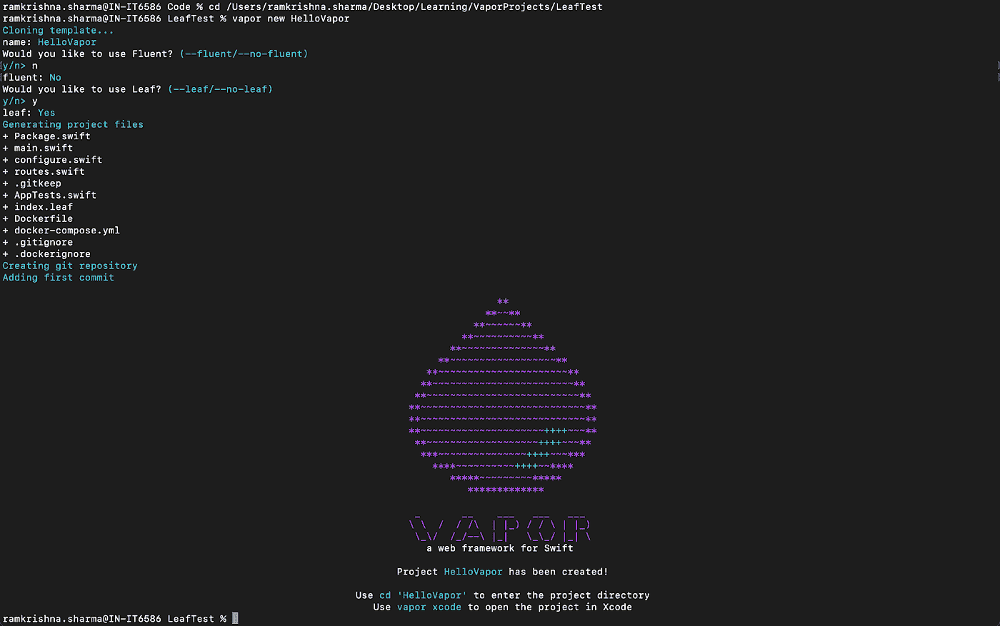
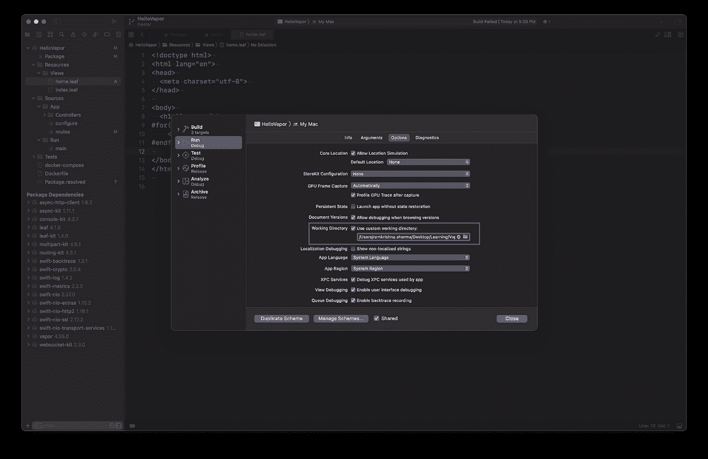

# iOS 版 Leaf 简介

> 原文：<https://medium.com/globant/introduction-to-the-leaf-in-ios-applications-64ceb8fa3f54?source=collection_archive---------0----------------------->

# 叶子是什么？

Leaf 是一种功能强大的模板语言，具有受 Swift 启发的语法。您可以使用它为前端网站生成动态 HTML 页面，或者从 API 生成丰富的电子邮件。它提供了一种用最少的逻辑编写 HTML 代码的有效方法。我们不需要写 HTML 代码，把它留给 Leaf 就行了。它支持 Swift 语法，对于 iOS 开发者来说可以很容易理解。

让我们探索更多关于 Leaf 的内容，并尝试使用 Leaf 构建第一个应用程序。

# 如何用 Leaf 构建您的第一个应用程序

在我们开始创建新项目之前，我们需要在 Xcode 上安装一些必要的工具，这些工具将用于创建项目环境。

**蒸汽**

Vapor 是一个用于 Swift 的 web 框架，允许您在 Swift 中编写后端、web 应用程序 API 和 HTTP 服务器。Vapor 是用 Swift 编写的，这是一种现代的、强大的、安全的语言，与更传统的服务器语言相比，它提供了许多好处。

**在 Mac OS 上安装 Vapor 的步骤如下:**

现在你已经安装了 Swift，让我们安装 [Vapor 工具箱](https://github.com/vapor/toolbox)。这个 CLI 工具不是使用 Vapor 所必需的，但是它包括了一些有用的工具，比如一个新的项目创建器。

工具箱通过自制软件分发。如果你还没有自制软件，请访问 [brew.sh](https://brew.sh/) 获取安装说明。

```
brew Install vapor
```

通过打印帮助，仔细检查以确保安装成功。

```
vapor — help
```

您应该会看到可用命令的列表。

# 开始构建您的第一个应用程序

首先，您需要在 Mac 上的某个地方创建一个新的目录来处理 Vapor 项目。

**创建新目录的步骤:**

打开终端并按照以下步骤操作。

```
mkdir vaporProject
cd vaporProject
```

这将在您的主文件夹中创建一个名为 vaporProject 的新目录，并导航到该目录。

按照命令创建一个新项目。

```
vapor new HelloVapor
```

而上述命令的执行会询问你是否愿意使用 Leaf。然后在这种情况下键入“y ”,并按 enter 键。您的项目将会生成，看起来像这样。



现在尝试使用 Xcode 运行一个应用程序。确保你已经创建了一个自定义的工作目录，否则 Leaf 找不到你的模板。



您也可以使用命令行运行服务器，如下所示。

```
swift run Run
```

在您的浏览器中输入 [http://localhost:8080](http://localhost:8080) ，您将能够检查输出。

# 项目结构

让我们看一下项目文件夹和结构，这将有助于我们理解它们是如何工作的。

**包装**

从项目中找到包清单文件，双击打开它。如您所见，叶子已经作为依赖项添加到项目中。

```
import PackageDescription
let package = Package(
    name: "HelloVapor",
    platforms: [
        .macOS(.v10_15)
    ],
    dependencies: [
        /// Any other dependencies …
        .package(url: "[https://github.com/vapor/leaf.git](https://github.com/vapor/leaf.git)", from: "4.0.0"),
    ],
    targets: [
        .target(name: "App", dependencies: [
            .product(name: "Leaf", package: "leaf"),
            // Any other dependencies
        ]),
        // Other targets
    ]
)
```

**配置**

添加到包中后，现在您可以开始配置 vapor 来使用它。检查项目中的 **Configure.swift** 文件，如下所示:

```
import Leafapp.views.use(.leaf)
```

这告诉 Vapor 在代码中调用 **req.view** 时使用 **LeafRenderer** 。

**文件夹结构**

完成后，配置需要确保您有一个**视图**文件夹来存储您的。**叶**文件在。默认情况下，**视图**文件夹在**处。相对于项目根的/Resources/Views** 。

理想的流程如下。

vapor app
├──package . swift
├──资源
│ ├──观点
│└──hello . leaf
├──公开
│ ├──图片(图片资源)
│ ├──风格(css 资源)
└──来源
└──上…

**渲染视图**

现在叶子已经配置好了，让我们试着渲染一个模板。在**中新建一个名为 **hello.leaf** 的文件。/Resources/Views** 包含以下内容。

```
Hello, #(name)!
```

然后注册路线渲染视图，一般在**中完成。快速**文件或在**视图控制器**中。路由器文件中的内容如下所示。

```
app.get(“hello”) { req -> EventLoopFuture<View> in
 return req.view.render(“hello”, [“name”: “Leaf”])
}// orapp.get(“hello”) { req async throws -> View in
 return try await req.view.render(“hello”, [“name”: “Leaf”])
}
```

这将根据请求使用通用视图属性，而不是直接调用 Leaf。这允许您在渲染器之间切换。

打开你的浏览器到[http://localhost:8080/hello](http://localhost:8080/hello)，你应该会看到 **hello，Leaf！**在控制台上。

# 叶语法概述

这是叶标签使用的基本信息概述。

有#count(users)个用户。

叶标签由四个元素组成，如下所示。

*   **Token #** :这表示叶解析器开始寻找标签。
*   **名称计数**:识别标签。
*   **参数列表(用户):**可以接受零个或多个参数。
*   **Body** :可以使用分号和结束标签为一些标签提供可选的 Body

基于实现，叶子标签有许多不同的用法，让我们看看下面例子中解释的一些内置标签。

```
#(variable)
#extend(“template”): I’m added to a base template! #endextend
#export(“title”): Welcome to Vapor #endexport
#import(“body”)
#count(friends)
#for(friend in friends): <li>#(friend.name)</li> #endfor
```

Leaf 还支持您在 Swift 中熟悉的以下运算符。

*   +(加号)
*   %(模数)
*   >(大于)
*   ==(等于)
*   ||(逻辑或)
*   等等。

用法示例如下:

```
#if(1 + 1 == 2):
 Hello!
#endif#if(index % 2 == 0):
 This is even index.
#else:
 This is odd index.
#endif
```

**上下文**

在开始的例子中，我们使用[String: String]字典将数据传递给叶子。你可以把任何可编码的**传给叶子。实际上最好使用**可编码的**结构，因为不支持【String: Any】。这意味着不能传入数组。让我们看一个使用 struts 的例子。**

**Swift 文件内容如下:**

```
struct WelcomeContext: Encodable {
 var title: String
 var numbers: [Int]
}
return req.view.render(“home”, WelcomeContext(title: “Hello!”, numbers: [42, 9001]))
```

**应渲染如下**

```
<h1>#(title)</h1>
#for(number in numbers):
 <p>#(number)</p>
#endfor
```

# 一些常用标签的用法

# 情况

Leaf 能够评估带有标签 **#if** 的条件。让我们看一些如何评估条件的例子。

无论检查变量是否存在，考虑下面的例子。

```
#if(title):
 The title is #(title)
#else:
 No title was provided.
#endif
```

与下面示例中的自定义字符串检查进行比较。

```
#if(title == “Welcome”):
 This is a friendly web page.
#else:
 No strangers allowed!
#endif
```

如果您想使用另一个标记作为条件的一部分，您应该省略内部标记的 **#** 。你也可以使用 **#else** 考虑下面的例子:

```
#if(title == “Welcome”):
 Hello new user!
#elseif(title == “Welcome back!”):
 Hello old user
#else:
 Unexpected page!
#endif
```

# 环

由于您不能直接向叶子提供数组，但是您可以通过使用下面的 **#for** 标签来操作每一项，这个示例将有助于理解。

例如，我们可以更新我们的 Swift 代码来提供行星列表:

```
struct SolarSystem: Codable {
 let planets = [“Venus”, “Earth”, “Mars”]
}return req.view.render(“solarSystem”, SolarSystem())
```

然后我们可以像这样在 Leaf 中循环它们:

行星:

```
<ul>
#for(planet in planets):
 <li>#(planet)</li>
#endfor
</ul>
```

这将呈现一个类似于

```
Planets:
- Venus
- Earth
- Mars
```

# 扩展模板

Leaf 的 **#extend** 标签允许您将一个模板的内容复制到另一个模板中。

扩展对于复制标准内容非常有用，例如页脚、广告代码或跨多页共享的表格:

```
#extend(“footer”)
```

# 其他标签

**#计数**

#count 标记返回数组中的项数。例如:

```
Your search matched #count(matches) pages.
```

**#小写**

#lowercased 标签小写字符串中的所有字母。

```
#lowercased(name)
```

**#大写**

#uppercased 标签将字符串中的所有字母大写。

```
#uppercased(name)
```

**#大写**

大写的#标记大写字符串中每个单词的第一个字母，小写其他的。

```
#capitalized(name)
```

**#包含**

#contains 标记接受一个数组和一个值作为它的两个参数，如果第一个参数中的数组包含第二个参数中的值，则返回 true。

```
#if(contains(planets, “Earth”)):
 Earth is here!
#else:
 Earth is not in this array.
#endif
```

**#日期**

#date 标记将日期格式化为可读的字符串。默认情况下，它使用 ISO8601 格式。

```
render(…, [“now”: Date()])The time is #date(now)
```

您可以将自定义日期格式化程序字符串作为第二个参数传递。

```
The date is #date(now, “yyyy-MM-dd”)
```

**#unsafeHTML**

# unsafeHTML 标签的作用类似于变量标签——例如#(变量)。但是，它不会转义变量可能包含的任何 HTML:

```
The time is #unsafeHTML(styledTitle)
```

# 自定义标签

您还可以使用叶标签协议创建自定义标签。

让我们来看看如何创建一个定制标签 **#now** 来打印当前的时间戳。该标记还将支持一个用于指定日期格式的可选参数。

**LeafTag**

首先，创建一个名为 NowTag 的类，并使其符合 LeafTag。

```
struct NowTag: LeafTag { func render(_ ctx: LeafContext) throws -> LeafData {
     …
   }
}
```

现在让我们实现 render(_:)方法。传递给这个方法的 LeafContext 上下文拥有我们应该需要的一切。

```
struct NowTagError: Error {}
func render(_ ctx: LeafContext) throws -> LeafData {
    let formatter = DateFormatter()
    switch ctx.parameters.count {
    case 0: formatter.dateFormat = "yyyy-MM-dd HH:mm:ss"
    case 1:
        guard let string = ctx.parameters[0].string else {
            throw NowTagError()
        }
        formatter.dateFormat = string
    default:
        throw NowTagError()
    }
    let dateAsString = formatter.string(from: Date())
    return LeafData.string(dateAsString)
}
```

**配置标签**

现在我们已经实现了 NowTag，我们只需要把它告诉 Leaf。您可以像这样添加任何标签——即使它们来自单独的包。这通常在 **configure.swift** 中完成:

```
app.leaf.tags[“now”] = NowTag()
```

就是这样！我们现在可以在 Leaf 中使用我们的自定义标签了。

```
The time is #now()
```

# 利益

*   这个框架纯粹是用 Swift 编写的，以便 iOS 开发者可以利用它，并且很容易理解。
*   它消除了对第三方库的依赖，其他框架可能会选择在第三方库中实现 Node.js 的 HTTP 解析器，但它有自己的 Swift 解析器。
*   Leaf 的优势在于天生快速，并且被设计成以一种与 Vapor 的引擎很好地工作的方式集成，Vapor 的引擎是处理请求和响应的底层系统。

# 结论

本文提供了对 Leaf 的基本介绍。正如我们所见，它支持 Swift 语法，因此对于任何 iOS 开发人员来说都很容易理解，有了它，我们可以创建一些服务器端实现和 HTML 模板。尽管它有一些局限性，并且目前范围有限，但是这个基本概述将有助于理解 Leaf 将如何创建模板。希望更多的范围和定制对创建动态 HTML 页面更有用。

# 贡献者

我非常感谢 [Gopal Sorathiya](https://medium.com/u/a2c1f661f6e2?source=post_page-----64ceb8fa3f54--------------------------------) 完成了本文的内容， [Jignesh Raiyani](https://medium.com/u/53dd15a07de1?source=post_page-----64ceb8fa3f54--------------------------------) 策划了这篇文章。