# NIM 恶意软件状态调查(2)

> 原文：<https://medium.com/walmartglobaltech/investigation-into-the-state-of-nim-malware-part-2-a28bffffa671?source=collection_archive---------4----------------------->

作者:杰森·里维斯


在发现 NimRod/Nimza[2，5]和 RustyBuer[3，4]后，我们在 2021 年早些时候对 NIM 恶意软件的使用进行了调查，这两个恶意软件都被与 TrickBot 船员相关的演员利用。这只是早期报告的延续，或者是随着时间的推移继续跟踪基于 NIM 的恶意软件的数据转储。

# NimGrabber

```
**MD5**: 8753b73e2486523f0bd1120b0d87df21
**SHA-1**: 5048bb4ac50049ba1490347920a65d7309e1ebfb
**SHA-256**: 8ec44187e50c15a7c4c89af4a1e99c63c855539101ec1ef4588d2e12e05f7d2b**MD5**: 8c7086bf1606da31134b36cef134a91f
**SHA-1**: ee85527be9f6017e9dee0a9979a9b948a8d244be
**SHA-256**: bc74f22b5407ac67b8d7dcb05262bee0dc9581620448c2b6514ed519ab7f6bd2
```

这些样本根据它构建并发送给参与者的报告自称为 NimGrabber。

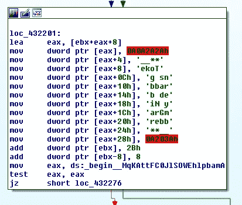

被盗数据包括来自流行浏览器的不和谐令牌数据，包括:

*   Vivaldi
*   微软 Edge
*   歌剧
*   铬
*   Yandex
*   勇敢的

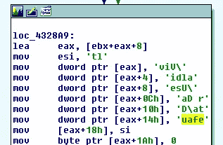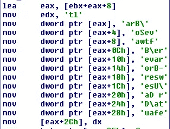

在收集数据并生成报告后，通过将数据发送到一个不和谐的网络钩子来进行过滤:

```
hxxps://discord.]com/api/webhooks/891404241124605982/evrTSNuCyasJcFT1KiY35gFCugpWZFoE7VfNXtlhrEfJLWeYK-p3dYvM4Ev84YoPbKAL
```

# **钴击舞台**

```
**MD5:** 9d6c1908baa481203faa31bce05ab8b2
**SHA-1:** 76441909714108823c90f7ed9603d21bab53d801
**SHA-256:** 41f40f8bbaeaeb811e5a9f8ba7870e6165fc749fe1121d09da30b127291ef351
```

这个 stager 板载了一个 base64 编码的 blob，但是利用 3DES 来解密解码的数据。事实证明，这个 stager 是基于一个名为 NimShellCodeLoader[6]的项目构建的，该项目可以利用多种加密例程，包括我们之前提到的 Caesar 或我们之前报告中的基于查找表的编码[1]。

Base64 解码后，我们剩下一个 blob，它包含明文的长度，后跟 3DES 密钥，然后是加密的外壳代码 blob。不幸的是，我的 python 版本 3DES 是不兼容的，我已经谈论过这个问题如何在过去出现在加密算法中。既然我们有源代码，这里最简单的解决方案就是利用它来解码数据。

```
proc D3DES_Decrypt(plainBuffer:cstring,keyBuffer:cstring,cipherBuffer:cstring,n:cint):cint {.importc,cdecl.}
import base64,strutils,sequtilsconst source {.strdefine.}: string = ""
var code*:cstring
var codelen*:cint = 0proc de3des(enbase64:string): void =
    let shellcode:string = decode(enbase64) 
    let plain_len_byte = cast[int16]([shellcode[0],shellcode[1]])
    let input_encode:cstring = shellcode[26..high(shellcode)]
    let key:cstring = shellcode[2..25]
    var str = cast[cstring](alloc0(plain_len_byte));
    discard D3DES_Decrypt(input_encode,key,str,cast[cint](plain_len_byte))
    code = str
    codelen = plain_len_bytewhen isMainModule:
        let data = readFile("blah.bin")
        de3des(data)
        let f = open("blah.dec", fmWrite)
        let b = writeBuffer(f, code, codelen)
        close(f)
```

如果我们想在 python 中制作一个独立的解码器，我们可以搜索替代的 python 实现，或者只是将我们的 NIM 代码编译到一个共享库中，并使用 python 中的 ctypes 调用它。不管怎样，有了代码，我们就可以轻松地从样本中解码外壳代码。

```
1.14.66.81
/3mXe
User-Agent: Mozilla/4.0 (compatible; MSIE 7.0; Windows NT 5.1; Trident/4.0; .NET CLR 2.0.50727)
```

样本:

```
**MD5:** 5fd028a9bd6087c70c0a09cc2ac8f2fd
**SHA-1:** 0d6b34d4c9678dd35155093fde7aaca1847d3f09
**SHA-256:** d34bc5060dd7e433bd11f16fb7f2ef289511476a2ba32721078483fbc0372024
```

数据:

```
81.69.224.81
/dJv9
User-Agent: Mozilla/5.0 (compatible; MSIE 10.0; Windows NT 6.2; WOW64; Trident/6.0; MDDCJS)
```

样本:

```
**MD5:** da61a622aff329ad08141387c9432b1a
**SHA-1:** c49649cc71e7aaf243265959ec372173947a34a0
**SHA-256:** ff261192a1defd66fcd5924e04c04cf255859beda3a02bb58dfe6d3e211d9c04
```

数据:

```
192.168.111.141
/LwAY
User-Agent: Mozilla/5.0 (compatible; MSIE 10.0; Windows NT 6.1; WOW64; Trident/6.0)
```

样本:

```
**MD5:** c48763be59b1ba3fe81b06a31a5369bc
**SHA-1:** 2e4086ca701304d67d14063b2105c20ff85a366c
**SHA-256:** 40f8ca4c9f19d0330e42c98b9d0396b9f0caf191c6a544df4e4edb6837ed542c
```

这个 CobaltStrike stager 似乎比其他的更定制，它仍然利用 base64，但在解码和加载外壳代码之前有一组替换字符。

这里我们可以看到类似 base64 的字符串，但是混合了非标准字符:

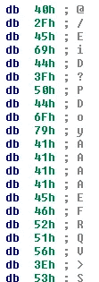

在进行 Base64 解码之前，一些字符被替换:

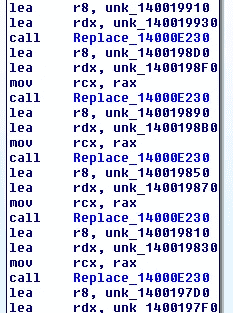

Replacement of characters

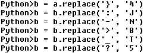

Python version

替换字符并进行 base64 解码后，我们只剩下 CobaltStrike stager 外壳代码:

```
/Mds9
User-Agent: Mozilla/4.0 (compatible; MSIE 8.0; Windows NT 5.1; Trident/4.0; QQDownload 733; .NET CLR 2.0.50727)
www[.monksec[.tk
```

该服务器在分析时仍处于以下状态:

```
'DOMAINS': 'www[.monksec[.tk,/j.ad'
'SUBMITURI': '/submit.php'
'WATERMARK': '305419896'
'USERAGENT': 'Mozilla/5.0 (compatible; MSIE 9.0; Windows NT 6.1; WOW64; Trident/5.0; MANM)'
```

# **勒索软件**

```
**MD5:** 8c09df22e86a70bfc3aa541e5ccab80b
**SHA-1:** bfb1b412fde1ba4bf26d10ac7d76915051fafc3e
**SHA-256:** a7517bca3c161893f0af6884415538defe3da75534e6b2b75720a61ae1c77abf
```

勒索软件是最近媒体的热门话题，找到用新语言编写的工具或与之相关的样本并不奇怪，然而在这种情况下，勒索软件竟然来自一个博客[7]。

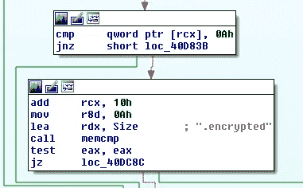

样本:

```
**MD5:** d65a8c0a2e771bb3b9664559552e69a7
**SHA-1:** 4912dfe9fa35f5e209a5c019f5abce9a4e64132d
**SHA-256:** 29f56a007e3f9b19a9a6ad9eab2af8edcdb3164a6f3323f0463c2983f83cdcef
```

这是另一个勒索软件样本，似乎也在测试中，但这一次他们添加了一个连接块，接收来自嵌入式域的 HTTP 请求的内容。在内部，对象被命名为嵌入域的“exfilurl ”:

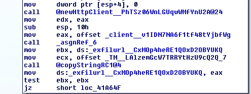

“rware”代表负责加密文件的功能:

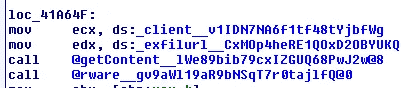

文件加密似乎是硬编码字符串的散列，将在 bcmode 中用作 AES 密钥:

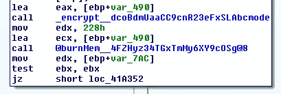

然后文件被覆盖:

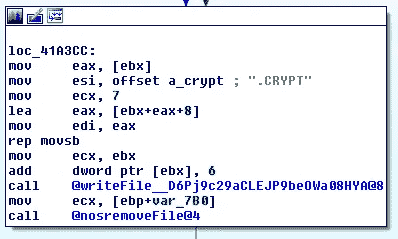

勒索软件示例只针对带有'的硬编码位置的文件。“local”域以及二进制文件“RwareEmulator.nim”中的源文件名工件使我们怀疑这仍然是正在进行的测试或演示。

# **后门**

发现的另一个样本似乎也与测试有关:

```
**MD5:** 28d231ca6d2b5c219eb23abbf2e6eec6
**SHA-1:** 3512085d14fada2a5afc123efc4a087a48b98be1
**SHA-256:** 181b1d6ba674bd6d4f786c6838b2ba36f79e7210cb1b7cef9de93aa68153b488
```

这个例子更像是一个简单的反向 shell 后门程序，名为 NimRev，github 上有很多基于 NIM 的反向 shell 的例子，但是反汇编的二进制文件最像这篇博客中的代码[8]。

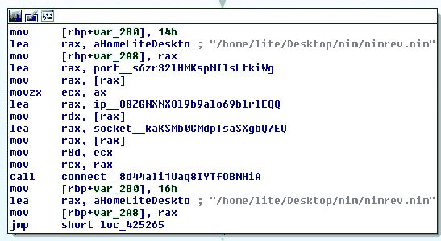

该示例将 IP 和端口作为参数，并连接回它们，然后通过发送“>”向服务器发出信号，表示它已准备好接收命令:

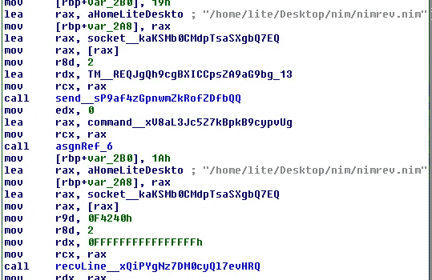

收到命令后，它引爆命令并发回输出:

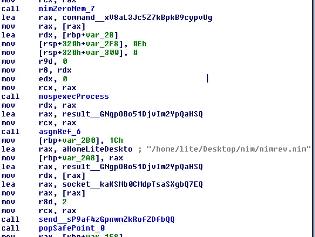

虽然反向外壳是相当简单的后门，但它们可能非常有效。

另一个 NimRev 样本:

```
**MD5:** 533082e631bb02f640dde461b9b71939
**SHA-1:** 955578c34fe814d0ffaf87b8e38ca2510dbc7f9f
**SHA-256:** 8503bd24fd22b322a8ccd2290a655630cef45fe144a386ef57cb9a7cb8ae5bef
```

除了它发送回服务器的提示是‘nimrev >’而不仅仅是“>”之外，这一个是非常相似的。

# YARA 规则

```
rule caesar_cs_stager
{
meta:
author = "Jason Reaves"
strings:
$a1 = "caesar__w9"
condition:
all of them
}rule nim_sc_loader
{
meta:
author = "Jason Reaves"
strings:
$a1 = "de3des__"
$a2 = "D3DES_Decrypt"
$a3 = "Direct_LoadPcy"
condition:
any of them
}rule nimrev
{
meta:
author="Jason Reaves"
strings:
$a1 = "nimrev.nim"
$b1 = "result__"
$b2 = "VirtualAlloc"
$b3 = "recv__"
$b4 = "send__"
$b5 = "execProces"
condition:
$a1 or all of ($b*)
}
```

# **参考文献**

1:[https://medium . com/Walmart global tech/investigation-into-the-state-of-nim-malware-14c c543 af 811](/walmartglobaltech/investigation-into-the-state-of-nim-malware-14cc543af811)

2:[https://medium . com/Walmart global tech/nimar-loader-4f 61 c 090 c49e](/walmartglobaltech/nimar-loader-4f61c090c49e)

3:[https://medium . com/walmartglobaltech/buer loader-updates-3 e34c 1949 b96](/walmartglobaltech/buerloader-updates-3e34c1949b96)

4:[https://www . proof point . com/us/blog/threat-insight/new-variant-布尔-loader-written-rust](https://www.proofpoint.com/us/blog/threat-insight/new-variant-buer-loader-written-rust)

5:[https://www . proof point . com/us/blog/threat-insight/nimzaloader-ta 800s-new-initial-access-malware](https://www.proofpoint.com/us/blog/threat-insight/nimzaloader-ta800s-new-initial-access-malware)

6:[https://github.com/aeverj/NimShellCodeLoader](https://github.com/aeverj/NimShellCodeLoader)

https://ilankalendarov.github.io/posts/nim-ransomware/

8:[https://trust foundry . net/writing-basic-offensive-tooling-in-nim/](https://trustfoundry.net/writing-basic-offensive-tooling-in-nim/)