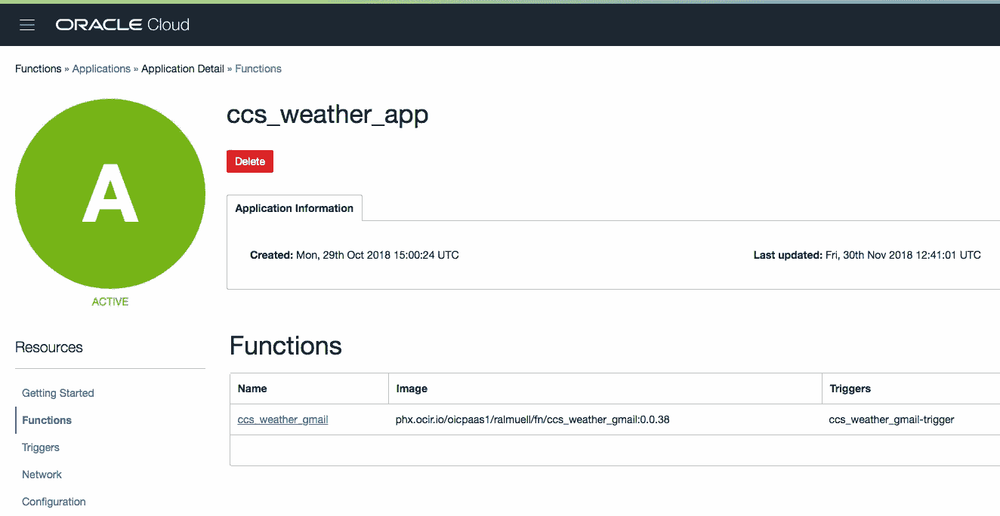
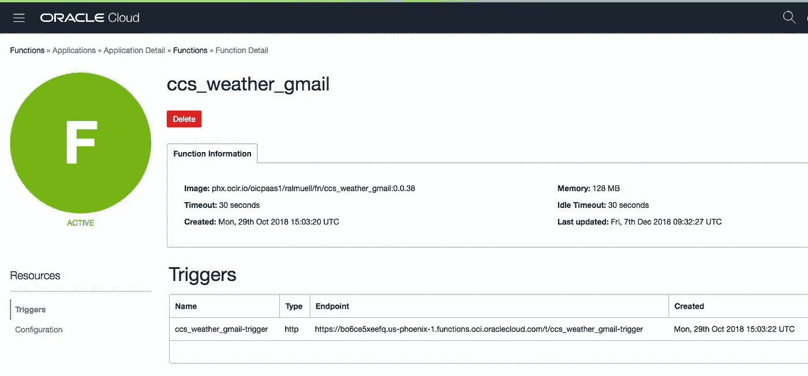

# 通过 REST 调用 Oracle 函数

> 原文：<https://medium.com/oracledevs/invoke-oracle-functions-via-rest-6fa8b257e262?source=collection_archive---------0----------------------->


Green Line (Image © Ralf Mueller)

这篇文章涵盖了通过 [oci-curl](https://docs.cloud.oracle.com/iaas/Content/API/Concepts/signingrequests.htm#Bash) 调用部署在 Oracle Functions 上的函数，oci-curl 是 Oracle 云基础设施(oci)提供的 bash 脚本，它支持 OCI RESTful 服务的请求签名。

> 在撰写本文时，Oracle Functions 的可用性有限，尚未发布。因此，在 UI 屏幕截图下方，fn CLI 命令和函数 API 仍会发生变化。

# 设置

L ets 从部署到 Oracle 函数的一个简单函数开始。[甲骨文功能](https://blogs.oracle.com/developers/announcing-oracle-functions-v2)在西雅图 [KubeCon 2018](https://events.linuxfoundation.org/events/kubecon-cloudnativecon-north-america-2018/) 大会上公布。下面的屏幕截图显示了部署到 Oracle Functions 的应用程序



ccs_weather_app Application in Oracle Functions console

以及为该应用程序部署的一个功能



ccs_weather_gmail Function

通过 **fn** 命令行调用该函数很容易，如下所示

```
> cat payload.json | fn invoke ccs_weather_app ccs_weather_gmail
```

其中函数的输入负载在文件 payload.json 中给出

# 经由 OCI 旋度的休止调用

## 检查功能

那么，如果我们想通过其公开的 REST 端点来调用这个函数呢？首先，我们可以检查函数以获得更多的细节

```
> fn inspect f ccs_weather_app ccs_weather_gmail
```

这可能会返回类似这样的结果(下面显示的 OCID 是无效的，所以尝试一下没有意义，它不会工作)

Result of fn inspect

这里重要的信息是注释**fnproject.io/fn/invokeEndpoint**，它表示 REST 调用的目标 URL。

## 列出触发器

每个函数都公开一个或多个触发器。在撰写本文时，HTTP 触发器可以在函数初始化时创建。函数的触发器显示在函数控制台中，如上图所示。也可以使用以下命令从 fn CLI 中检索

```
fn list t ccs_weather_app ccs_weather_gmail
```

在我们的示例中，它打印出类似于

```
NAME    ID      TYPE        SOURCE                       ENDPOINTccs_weather_gmail-trigger ocid1.fntrig.oc1.phx.XXXwqovtgjwgxpktsfbdq http /ccs_weather_gmail-trigger https://bo6ce5xeefq.us-phoenix-1.functions.oci.oraclecloud.com/t/ccs_weather_gmail-trigger
```

两个端点，即所谓的*调用端点*和 *HTTP* *触发器*的端点都可以用于 REST 调用，如下一章所示。请注意，在 Oracle Functions 的未来版本中，将会添加其他类型的触发器(HTTP 除外)。理解这一点很重要，只有 HTTP 类型的触发器端点可以通过 REST 调用。

## 设置 oci-curl

bash 实用程序 oci-curl 可以从[https://docs . cloud . Oracle . com/iaas/Content/Resources/Assets/signing _ sample _ bash . txt](https://docs.cloud.oracle.com/iaas/Content/Resources/Assets/signing_sample_bash.txt)下载

它是一个 bash 脚本，用于基于 Unix 的系统，其他脚本用 PowerShell、perl、Python 等实现。也可从[请求签名](https://docs.cloud.oracle.com/iaas/Content/API/Concepts/signingrequests.htm)文档中获得。

U 用户应该在他们想要使用 oci-curl 的终端中获取脚本，如下所示

```
> source oci-curl
```

然而，我认为将脚本添加到路径中并使其可执行要简单得多。为此，请添加以下行作为脚本的第一行

```
#!/bin/bash
```

然后在脚本的最后一行添加下面一行

```
oci-curl $1 $2 $3 $4
```

脚本本身必须针对用户租用进行修改和调整。必须根据您的用户和租户在脚本中设置以下四个变量

```
local tenancyId="ocid1.tenancy.oc1..XX55gth7ioc2gbpbvqo5ecoa";
local authUserId="ocid1.user.oc1..XXXX53zsuna775rdcnxcaxxhsddu6ha";
local keyFingerprint="76:..:3b:10:57";
local privateKeyPath="/Users/someuser/.oci/oci_api_key.pem";
```

可以从 OCI 控制台检索关于 tenancyId、authUserId、keyFingerprint 的信息。有关用户凭证、指纹等的更多信息。您可能需要检查以下文档

*   [所需的密钥和 ocid](https://docs.cloud.oracle.com/iaas/Content/API/Concepts/apisigningkey.htmhttps://docs.cloud.oracle.com/iaas/Content/API/Concepts/apisigningkey.htm)
*   [SDK 和 CLI 配置文件](https://docs.cloud.oracle.com/iaas/Content/API/Concepts/sdkconfig.htm)

# Oracle 函数 REST 端点的调用

现在 oci-curl 脚本已经针对您的用户和租户进行了调整，您可以通过调用 Oracle 函数*调用端点*

```
> oci-curl XXXXXX.us-phoenix-1.functions.oci.oraclecloud.com \
           post ./payload.json \ "[/invoke/ocid1.fnfunc.oc1.phx.aaaaaaaaXXXXXXXXXXXXXXn2tjmkzrvjg3ibyfbkpnhey7lq](https://bo6ce5xeefq.us-phoenix-1.functions.oci.oraclecloud.com/invoke/ocid1.fnfunc.oc1.phx.aaaaaaaaaajw2n6c2fbjfix3k5xyhrtu7kn2tjmkzrvjg3ibyfbkpnhey7lq)"
```

其中 payload.json 包含函数的输入。

作为替代，您可以通过函数的 *HTTP 触发端点*来调用函数

```
> oci-curl XXXXXX.us-phoenix-1.functions.oci.oraclecloud.com \
           post ./payload.json \
           "/t/ccs_weather_gmail-trigger"
```

小文章到此结束，感谢一路看完。我可能会更新这篇文章，举例说明如何从 Java 调用 Oracle 函数，继续关注。