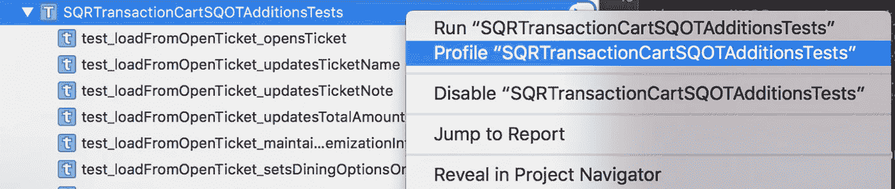
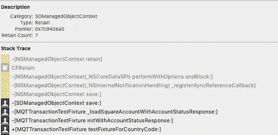
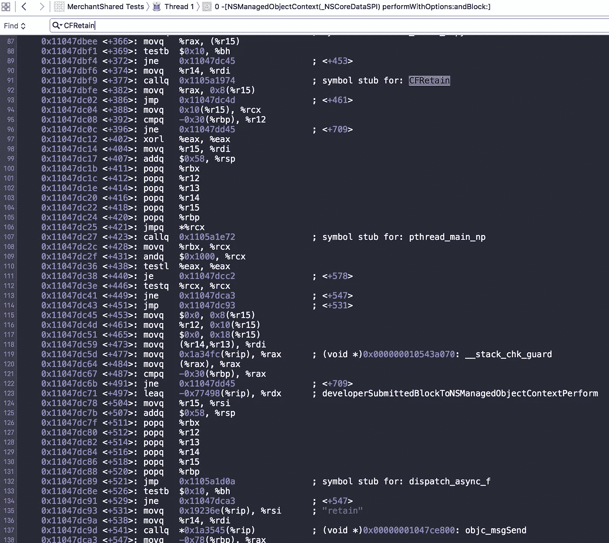
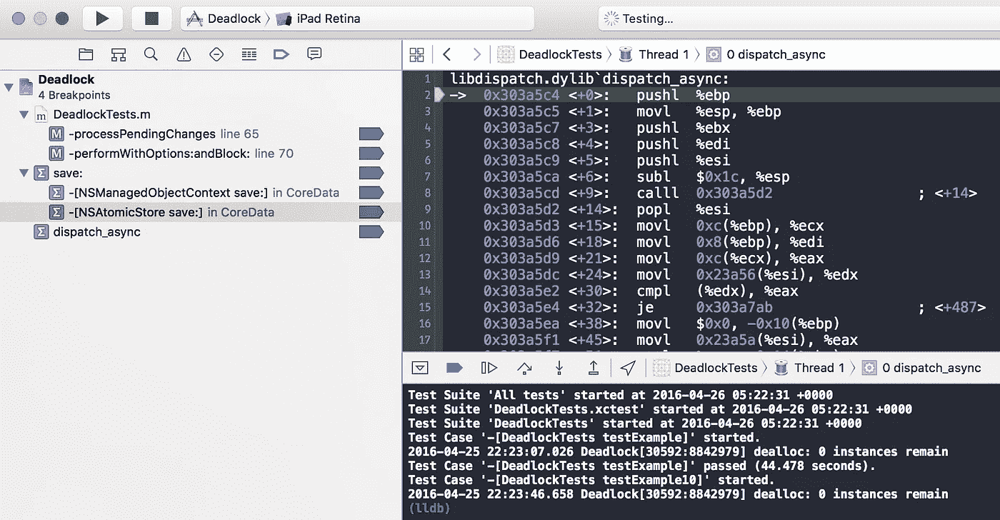
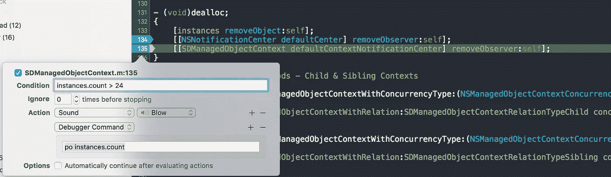

# iOS 9 升级:为什么我的单元测试陷入停顿？

> 原文：<https://medium.com/square-corner-blog/ios-9-upgrade-why-did-my-unit-tests-grind-to-a-halt-7460ae8285bb?source=collection_archive---------1----------------------->

## 关于为什么从 iOS 8 升级到 9 SDK 会导致测试变慢的调查。

*作者* [*艾伦·芬伯格*](https://medium.com/u/6710389d9d0?source=post_page-----7460ae8285bb--------------------------------) *。*

> 注意，我们已经行动了！如果您想继续了解 Square 的最新技术内容，请访问我们的新家[https://developer.squareup.com/blog](https://developer.squareup.com/blog)

*在将 Square Register 从 iOS 8 升级到 iOS 9 时，我们发现我们的单元测试行为发生了难以诊断的变化。我们调查了这个问题，并追溯我们的步骤以找到根本原因。最终，我们发现潜在的问题不仅仅是 Square 特有的，而是一个可能影响任何 iOS 开发者的问题。*

# 测试现在又慢又不可靠

在将近 7 岁的时候，Square Register for iOS 是一个庞大的应用程序，包含超过一百万行代码。虽然从 iOS 8 或 iOS 9 迁移基础 SDK 看起来很简单，但这种变化的规模带来了许多挑战。

这些挑战中最主要的是应用程序的测试套件。在实现变更后不久，我们注意到我们的单元测试套件——为每个构建运行了数千个测试——已经明显变慢了，并且最终会失败。这些测试失败在单独运行时从来没有发生过，但是作为一个更大的测试套件的一部分经常失败，并且不总是以相同的方式。因为没有一个测试是错误的，一个合理的解释表明共享测试环境的污染。

# 是主队列！

下一步是缩小我们的干草堆。我们开始注释掉测试以缩小范围。注释掉一个又一个文件变得很乏味——我们加入了一个分类技巧，让生活变得更简单(如下)。不幸的是，没有更好的方法来运行符合 iOS 命名模式的测试子集:

上面的*:一个有用的类别，只运行一组特定的匹配一些字符串模式的测试。*

使用这种过滤，我们将范围缩小到少数测试类，以便一致地重现失败。然后我们注意到一件奇怪的事情:运行哪些测试本身并不重要；决定结果的是考试的数量。

我们看到这组测试需要运行大约三分钟；少一点，他们都会通过。有一项测试会先于所有其他测试失败，这也成为了调查的重点:

上图:我们试图追踪的主要测试失败。注意旋转 runloop(等待期望)和锁定的使用。

故障发生在旋转运行回路之后，即预期从未实现。我们正在等待队列中的工作被执行，但是测试将会超时。所以，我们决定查看所有的队列…

啊哈！当我们在更大的测试运行中达到问题测试时，主队列已经被过多的操作阻塞了:

```
(lldb) p (int) [[NSOperationQueue mainQueue] operationCount]
(int) $6 = 2781
```

我们已经找到了罪魁祸首:测试很慢，因为主队列负担过重，我们的第一次测试失败是由于等待一个解锁操作，该操作卡在了这个队列上。

为了证明队列是问题的根源，我们在测试的 tearDown 方法中添加了对*[[nsoperationqueue main queue]cancelAllOperations]*的调用；测试现在通过了！

通过一行一行地检查并观察*[[NSOpertaionQueue main queue]operation count]*中的变化，我们追踪到在设置测试夹具时调用的特定模块。它将为创建的每个测试夹具向主队列添加 4 个调度操作(每个*设置*一个)。这些操作会累积，因为它们没有机会从*主队列*中排出。这就解释了为什么大量的测试显示了这个问题，而少量的测试却没有。

看起来案子已经结了。我们准备对有问题的模块做一些调整，然后“到此为止”,但是这个特殊的“日子”不会这么容易就“结束”,并且这个案例仍然是开放的！

# 其实不是这样的！

我们已经修复了测试夹具的调度问题，但是发现仍然有一个问题。

我们首先尝试通过[重组](http://nshipster.com/method-swizzling/) *NSOperationQueue* 来验证我们的修复，这样它拒绝了添加到主操作队列上的所有其他工作，*除了失败测试所做的工作*。

坏消息:失败仍然发生，但是现在，它需要一个更大的测试套件来重现！即使当主队列只有一个操作要执行时，也会出现故障，令人困惑的是，为什么这个队列——只有一个操作——不会耗尽。很明显，这并不像之前认为的那样，只是队列被“猛”了一下。

换句话说，即使主队列如下所示，相同的测试仍然会永远等待主队列上的操作:

```
(lldb) p (int) [[NSOperationQueue mainQueue] operationCount]
(int) $6 = 1
```

*解锁操作仍然滞留在队列中，即使队列中没有其他东西！*

# 退后一步

由于我们的测试失败表现为一个死锁(一个从未释放的锁)，我们深入研究同步代码(节选如下)并搜索下一个竞争条件。因为测试是平行进行的，这看起来似乎是合理的，但这是在抓救命稻草。虽然我们经常认为我们正在做一些事情，但是当我们发现一个竞争条件时，我们却两手空空。

即使涉及到主队列和锁，不管我们多么想找到一个竞争条件，这都不是问题。

出于想法，我们开始拆开问题测试，看看有什么浮出水面。我们尽可能地注释掉或替换它，以缩小它的范围，甚至用手工滚动的 runloop spinning 替换了 XCTestExpectation。

# 一次愉快的事故

我在替换*waitforexceptionswithtime out*时犯了一个时间单位转换错误，现在测试将会持续 1000 倍于预期的持续时间。当调试器旋转时，我暂停了它，并注意到一些奇怪的事情。通常情况下，暂停调试器会依靠 *processPendingChanges* ，这是一种 *NSManagedObjectContext* 用来保存 CoreData 更新的方法。

虽然在问题测试开始时暂停调试器是我首先尝试(并放弃)的事情之一，但直到此刻我才发现任何有趣的事情(如果我想到使用时间分析器，仪器也可以提供线索)。错过了几次机会，但现在我们有所收获。

等待时再次出现 *processPendingChanges* 似乎很有趣，但我们需要更多信息来确定这意味着什么。

为了查看有多少个 *NSManagedObjectContext* 正在调用 *processPendingChanges* ，我们使用静态 *NSHashTable* 将实例日志记录添加到我们的 *NSManagedObjectContext* 类中(类似于下面的示例):

*我们子类化了 NSManagedObjectContext，并添加了类似于上面示例的实例跟踪。*

使用这个实例跟踪，我们发现在测试运行之间有数百个，甚至数千个这样的上下文持续存在。更糟糕的是，它们会在主运行循环上执行工作，这些泄漏的上下文似乎有可能将 NSOperationQueues 挤出运行循环。

换句话说，在运行循环期间，NSManagedObjectContext processPendingChanges 调用蜂拥而至，使我们的 NSOperationQueue 处于饥饿状态。我们的主队列无法耗尽，因为这种排山倒海的调度调用在每个周期都耗尽了 runloop 的所有可用带宽。

# 是内存泄露！

好了，NSManagedObjectContext 在两次测试运行之间被保留(泄露)。这就归结为找出对象的保留计数在哪里增加了，在哪里减少了，以及为什么前者大于后者。

幸运的是，Xcode 附带了一个名为 *Instruments* 的工具，它有一个泄漏诊断工具。因此，我们只需右键单击测试名称，并选择*Profile SQOTAdditionsTest*和*瞧*，仪器就能让一切一目了然。不对！可悲的是，这些都没有发生，从仪器通过这个菜单连接自己开始:



令人沮丧的是，Xcode 的这个特性只是启动了一个惰性的仪器实例，而不是附加到一个进程上。

相反，为了分析测试运行，我们必须:

*   在代码中设置一个断点，
*   运行测试，
*   发射仪器，
*   小心地通过进程 ID 附加到正确的进程(下拉列表中可能有重复)
*   创下记录。

Leaks 工具不认为 NSManagedObjectContext(下面截图中的 SDManagedObjectContext)是泄漏，因为它最终被拆除了。但是它报告了一个保留/释放对列表。因此，我们查看了单个对象的超过 6000 个保留/释放的列表。当时，我们没有看到罪魁祸首，所以又回到了通过 lldb 进行调试。

经过大量的调试并打印出[context retainCount]之后，我们发现上下文的 save:方法添加了一个 retain，如果我们注释掉这一行，上下文就像预期的那样被清除了。)，漏洞被堵上了。

我回到 Instruments，用这个新信息反复检查它的报告，果然，它在那里:


*罗，一个不成对的保留者。*

导致泄漏的挡板详图:



*仪器详细视图:堆栈跟踪包括 save:、CFRetain 和 _ registerAyncReferenceCallback(sic)*

# 诊断

为了进行调试，我重写并为[NSManagedObjectContext(_ NSCoreDataSPI)performWithOptions:and block](基于上面的仪器输出)设置了一个符号断点。我不擅长汇编，但是我可以通过阅读评论来理解:



在第 91 行，我们增加了保留计数。在第 132 行，我们将异步工作添加到一个队列中。

我们推断，当调用 save:时，上下文正在将一些工作排队，同时保留自己(单步执行并调用 p (int)[$esi retainCount]证实了这一点)。这项工作也减少了保留计数，但是由于它停留在队列中，自保留上下文将永远保留。在使用 sqlite3 和时，我们也逐步完成了。转储以验证如果排队的工作从未运行，没有数据丢失。

我们认为我们最终理解了正在发生的事情，我们离开去创建一个小的测试项目来隔离我们的怀疑，并确认这个问题存在于一个更简单的例子中。已经确定了！示例项目展示了相同的问题([试用一下](https://github.com/alanf/deadlock)！).



*使用符号断点确定 Xcode 6 v. 7 中的行为差异*

我们使用这个测试项目比较了 iOS 8 和 iOS 9。很明显:保存:iOS8 中没有异步！**

**让我来限定一下:(据我从汇编中得知*)iOS 8 save:在其“标准代码路径”中是同步的，并且没有使用 dispatch_async 对工作进行排队。从 iOS 9 开始，它现在是异步的，并立即调用 dispatch_async 作为其“标准代码路径”的一部分。我鼓励检查一下[示例项目](https://github.com/alanf/deadlock)，并在 Xcode 6 和 Xcode 7 中进行比较(将 masterbranch 和 xcode-6 进行比较)。*

# 处理

不幸的是，让上下文的异步工作脱离主队列的唯一方法是旋转 runloop。如果不管，操作将在后台建立，当 runloop 最终运行时，上下文将使操作队列饥饿。

因此，我们的解决方案是添加如下所示的代码来拆卸:

```
[[NSRunLoop currentRunLoop] runMode:NSDefaultRunLoopMode beforeDate:[NSDate dateWithTimeIntervalSinceNow:0.001]];
```

在此之后，一些上下文仍然会泄漏，但这些是来自没有完全拆除的服务的合法内存泄漏。

确保我们所有的 t 都是点状的，我将条件断点添加到上下文的 dealloc 断点，并让它在有超过 24 个实例时发出声音并暂停:



*播放声音和使用条件意味着我们可以让测试运行，并在太多实例堆积时得到警告。*

尽管完成整个测试套件需要一段时间，但是由于我们的实例跟踪，这是一个机械的过程来跟踪剩余的漏洞并验证没有任何漏洞存在。

# 成功！

在跟踪剩余的漏洞并在拆卸时添加一些 runloop 旋转之后，runloop 变得清晰，测试速度提高了 28%。尽管调试花费了相当多的时间，但希望这种时间损失在未来通过更短、更稳定的测试运行得到补偿——更不用说我们从中获得了一篇博客帖子。

*感谢* [*凯尔·范·埃森*](https://twitter.com/kyleve)*[*埃里克·穆勒*](https://twitter.com/theprofessor22)*[*贾斯汀·马丁*](https://github.com/justinseanmartin) *对他们的援助！***

**[](/@dunbar151) [## 艾伦·芬伯格-简介

### 债务:最初的 5000 年给我留下了深刻的印象，所以我急切地阅读了大卫·格雷伯的《规则的乌托邦》。它…

medium.com](/@dunbar151)**