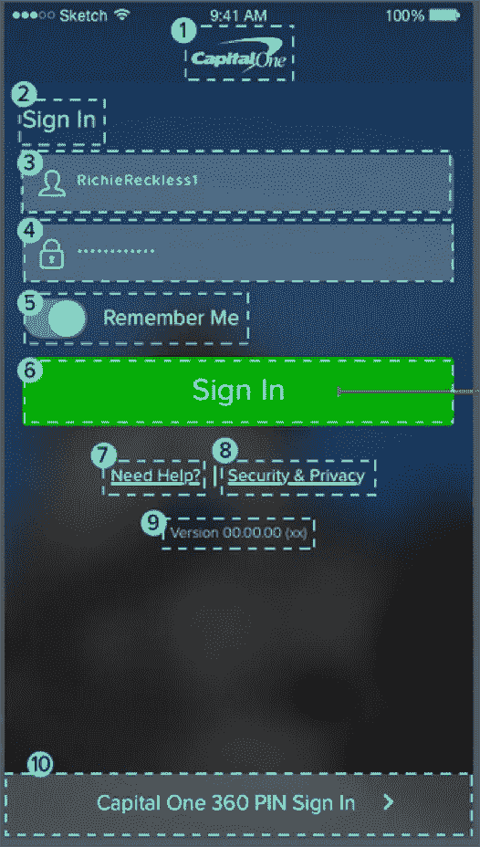
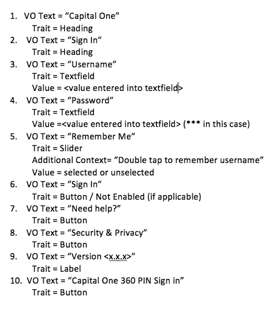
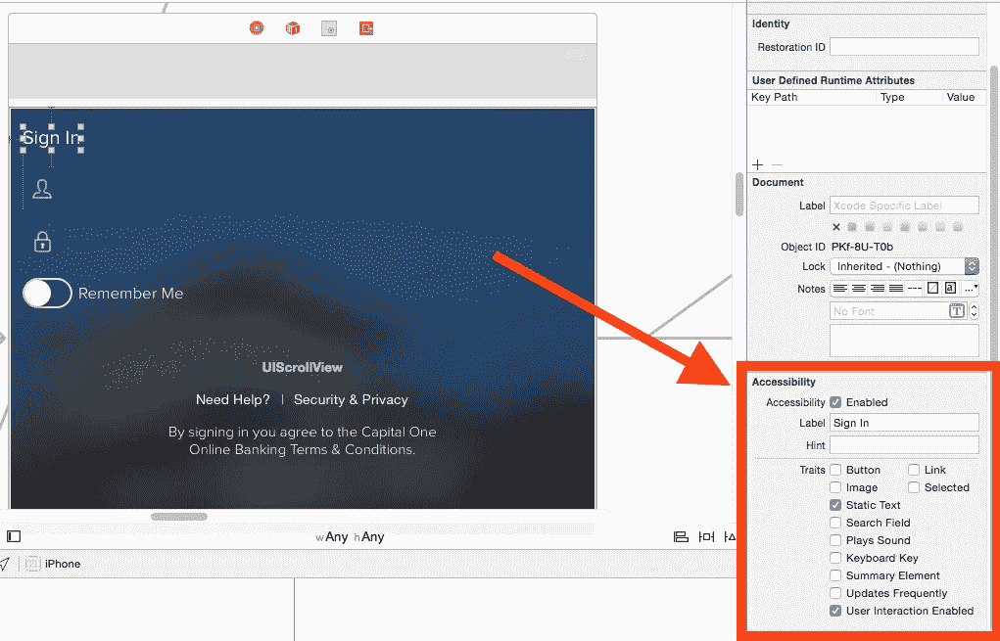

# iOS 辅助功能 VoiceOver 用户体验的最佳实践

> 原文：<https://medium.com/capital-one-tech/ios-accessibility-best-practices-for-the-voiceover-user-experience-dc08112ef16?source=collection_archive---------2----------------------->


在 Capital One，我们正努力为所有用户(包括残障用户)编写“同类最佳”的金融服务应用程序。在过去的六个月里，我有机会开发了用于 iPhone 的 Capital One Mobile 应用程序。具体来说，我一直在大力参与我们为 VoiceOver (VO)用户提供的用户体验。对于外行人来说，VO 是苹果的屏幕阅读器技术，盲人和低视力用户可以使用它来充分利用他们的移动设备。虽然这对视力受损的社区有很大的好处，但所有用户都可以从 VO 体验中受益。例如，当我在车里无法看屏幕时，我曾亲自在 Capital One Mobile for iPhone 应用程序上使用我们的 VO 体验来支付我的信用账单。*要了解有关 VoiceOver 和辅助功能的更多信息，请查看苹果的文档* [*此处*](http://www.capitalone.io/www.apple.com/accessibility/ios/voiceover/) *。*

让我们谈谈如何让应用程序变得可访问，以及我们在 Capital One Mobile for iPhone 应用程序之旅中发现的最佳实践。对于本文的范围，我将集中在两个方面: ***对可访问性和开发人员最佳实践采取整体的方法。***

## **对无障碍环境采取整体方法**

在开发过程的早期，我们发现我们需要更早地考虑 VO 体验，并且开发应用程序的每个人都需要知道他们在项目中的特定角色如何与实现 WCAG 2.0 合规性水平相关。*有关 WCAG 2.0 标准的更多信息，请点击* [*此处*](http://www.capitalone.io/www.w3.org/TR/WCAG20/) *获取 web 标准，点击* [*此处*](http://www.capitalone.io/www.w3.org/TR/mobile-accessibility-mapping/) *获取其移动草案(尚未正式发布)。*

简单地在你的接受标准上加上“让屏幕可访问”并不足以设计出我们为用户设想的那种应用程序。因此，我们深入研究了我们的方法，并决定对我们的开发过程进行一些更改。我们发现，项目中的每个人都想让我们的应用程序易于访问，但是我们并没有尽可能彻底地了解 WCAG 准则。为了做到这一点，我们需要“去神秘化”可访问性，考虑到这一点，我们编写了一个开发过程，在这个过程中，设计、需求编写、开发、测试和审计在使我们的应用程序更易访问方面都起着同样重要的作用。

由于团队中并不是每个人都精通《美国残疾人法案》第三章的内容，我们提出了几个设计和需求写作的重点，以帮助团队在将他们的作品提交给我们的数字无障碍团队(我们的主题专家)进行审查之前处理好无障碍问题。有关我们的更多详细信息，请参见下文。

**设计**

对于我们设计的每个线框，都有一个包含以下信息的覆盖图(参见需求书写部分的可视化示例)。

1.  定义每个 VO 帧。
2.  为每个表单建立滑动顺序。
3.  在适用的情况下，将刷卡和标签结合起来。
4.  特殊考虑(每一页都有唯一的标题吗？对于小于 18 磅的文本，颜色对比度至少是 3:1 还是 4.5:1？).

**要求写作**

在每个故事中，都有一个与可访问性相关的需求部分。我们决定创建一个编号列表来对应每个部分的滑动顺序。

1.  *VO Text:* 定义每个 VO 帧的副本，以与 iOS 的*accessibility label*相对应。
2.  *特征:*定义每个框架的特征，以对应于*iOS 的可访问性特征*(按钮、标题、静态文本等。).
3.  *附加上下文:*根据需要添加附加上下文，以与*accessibility hint*相对应(稀疏使用，仅在必要时添加，且不会对标签造成冗余。).
4.  *值/状态:*如果适用，定义元素值/状态(未启用、已选择等。).

这些对我们如何构思设计和需求编写的补充，有助于为我们的每个屏幕和 UI 故事建立更强的可访问性接受标准。

这在屏幕上看起来像什么？

## **无障碍线框和无障碍验收标准示例**



现在，我们已经创建了一个漂亮的规范来制作一个可访问且符合 WCAG 2.0 的屏幕！这消除了对可访问性的猜测，当然也“揭开”了过程中接下来的步骤。接下来，这个规范被传递给工程人员来实现，然后由测试人员来评审。这对于我们的移动组织的工作流是一个巨大的改进，并允许我们相对自给自足，确保我们的代码符合可访问性标准，而没有繁琐的项目管理监督。我说的“相对”是指这一开发过程将使我们的屏幕更接近无障碍，但不会绕过数字无障碍项目团队审查我们的工作并确保我们完全符合 WCAG 2.0 的需要。

## **开发最佳实践**

是时候了解真相了！在我浏览 Capital One Mobile for iPhone 应用程序的过程中，我发现有许多不同的方法来编写您的 iOS 代码，以满足 WCAG 2.0 标准。下面是我们在这个项目的代码审查过程中形成的开发最佳实践列表。

**1。**如果屏幕上的内容是静态的，使用界面构建器配置辅助功能选项。



**2。**如果页面上的内容是动态的，使用代码来配置可访问性选项。

**3。**属性化的字符串在 VO 屏幕阅读器上并不总是播放得很好。我们发现屏幕阅读器需要多次点击来阅读这种类型的字符串。有时候这是一个优势，但是在读取货币金额的情况下，这就产生了一个问题。为了解决这个问题，我们在 String 上创建了一个名为*formatcurrencyforvoice over*的扩展。以下是一组函数，可用于为 voice over 用户创建用户友好的货币字符串。以便在您的字符串上简单地使用*callformatcurrencyforvoice over*(例如:*myattributedcurrencystring . formatcurrencyforvoice over()*)。

```
func formatCurrencyForAccessibility () -> String {
     var unformattedCurrency = self.NSCharacterSet(charactersInString: “0123456789-”).invertedSet
     unformattedCurrency = unformattedCurrency.componentsSeparatedByCharactersInSet(invertedSet).joinWithSeparator(“”)
     if unformattedCurrency == “” {
          return NSLocalizedString(“, unknown amount”, comment: “This is a string used for an accessibility label if the amount is unknown”)
     }

     var dollarStringIndex = unformattedCurrency.endIndex.advanceBy(-2)
     let dollarString = unformattedCurrency.substringToIndex(dollarStringIndex)
     let centString = unformattedCurrency.substringFromIndex(2)

     var dollarText = NSLocalizedString(“ dollars and “, comment: “String for dollars in currency”)
     if (dollarString == “1”) {
          dollarText = NSLocalizedString(“ dollar and “, comment: “String for dollar in currency”)
     }

     var centText = NSLocalizedString(“ cents”, comment: “String for cents in currency”)
     if (centString == “1”) {
          centText = NSLocalizedString(“ cent”, comment: “String for cent in currency”)
     }

     let formattedAccessibilityTextForCurrency = String(“@%@%@%@%”, dollarString, dollarText, centString, centText)

     return formattedAccessibilityTextForCurrency
 }
```

**4** 。每一页都必须有一个标题，许多页面可能有几个副标题。从 Xcode 7.1 开始，这可以在 Interface Builder 中应用，但如果您使用的是以前的版本，则必须在代码中应用。请注意，在撰写本文时(2015 年 12 月)，您必须在设备上构建您的应用程序，以测试 header trait 是否正确应用。目前，这是 iOS 模拟器中辅助功能检查器的一个缺陷。

```
headingLabel.accessibilityTraits |= UIAccessibilityTraitHeader
```

**5。**如果您需要将多个元素连接到一个 VO 滑动中，请禁用子元素上的辅助功能，并仅启用“父”元素上的辅助功能。注意:对于静态和动态内容，请遵循这里的最佳实践 1 和 2。下面是一段动态代码的例子。在这个示例中，VO 框架将获取单元格的框架，并在一次滑动中从 label1 和 label2 读取文本，而不是两次单独的滑动。

```
cell.isAccessibilityElement = true
cell.label1.isAccessibiltyElement = false
cell.label2.isAccessibilityElement = false
cell.accessibilityLabel = NSLocalizedString(“@%@%”, cell.label1.text, cell.label2.text, comment:”Concatenated accessibility label text for cell”);
```

**6。**如果你有一个复杂的自定义控件，实现 *accessibilityActivate* 非正式协议。这允许 VO 用户执行双击，而不是执行实际的应用手势，这在启用 VO 的情况下可能无法执行。例如，如果您的项目中有一个 *slider.swift* 类，并且您想要为 VO 用户双击而不是滑动来触发账单支付确认。在 *slider.swift* 类中实现这个方法。

```
override func accessibilityActivate() -> Bool {
     //perform desired action
     confirmBillPay()
     return true
 }
```

## 走向一个更加无障碍的未来

这些是我们在 Capital One Mobile for iPhone 项目的学习过程中发现的一些更有意义的发现和开发模式。随着我们继续构建更好、更易访问的应用程序，我们期待在 Capital One Mobile for iPhone 应用程序的未来版本以及未来的 Capital One 项目中探索更多的可访问性控件。

**如果您对这篇文章还有其他问题，或者想联系我们的无障碍团队，请在这里** **给我们发送一条消息** [**。**](https://www.capitalone.com/legal/contact-accessibility/?Log=1&EventType=Link&ComponentType=T&LOB=MTS%3A%3ALCTMMQC4S&PageName=Accessibility+at+Capital+One&PortletLocation=4%3B16-col%3B2-2-1-1&ComponentName=capital-one-accessibility-contact-form-rev%3B15&ContentElement=1%3BContact+Us%3Cspan+class%3D%22icon-chevron%22%3E%3C%2Fspan%3E&TargetLob=MTS%3A%3ALCTMJBE8Z&TargetPageName=Contact+Capital+One+Accessibility&referer=https%3A%2F%2Fwww.capitalone.com%2Fabout%2Faccessibility-commitment)

*欲了解更多关于 Capital One 的 API、开源、社区活动和开发人员文化的信息，请访问我们的一站式开发人员门户网站 DevExchange。*[*https://developer.capitalone.com/*](https://developer.capitalone.com/)