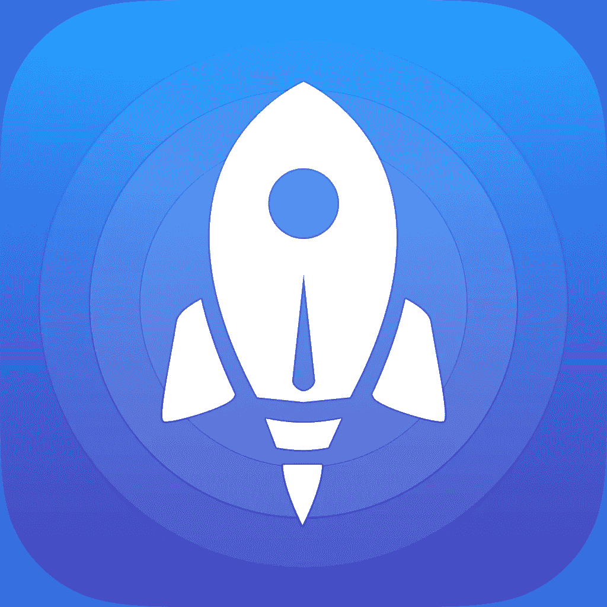
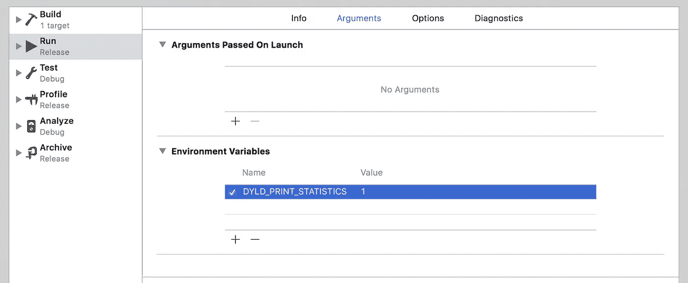
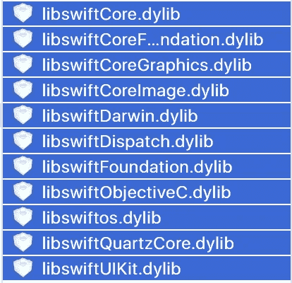
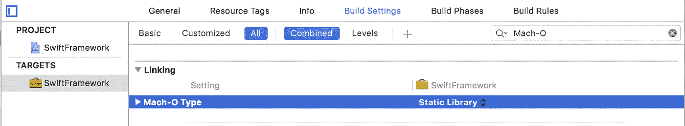
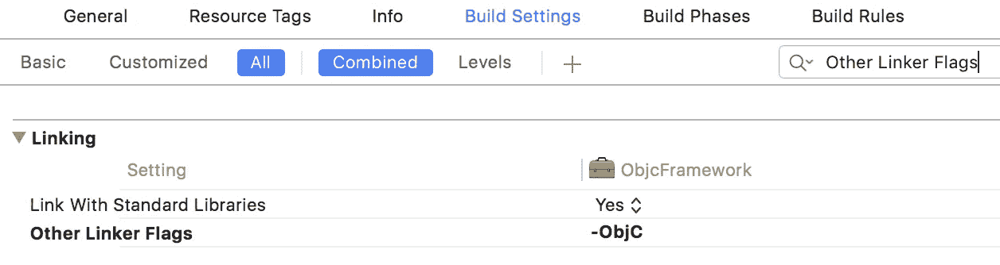
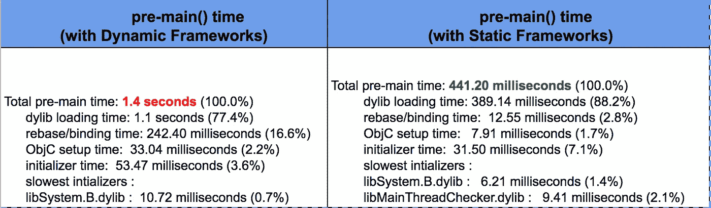

# iOS 应用启动时间分析和优化

> 原文：<https://medium.com/globant/ios-app-launch-time-analysis-and-optimization-a219ee81447c?source=collection_archive---------0----------------------->



任何产品的第一印象对其长期成功都是至关重要的。拆箱体验必须是最好的，如果手机等有形产品如此，移动应用程序也是如此，而移动应用程序是这些物理设备的核心和灵魂。

当用户从 AppStore 下载应用程序时，他所关心的是:只需在主屏幕上点击应用程序图标，并尽快体验该应用程序提供的一切。

也就是说，不管应用程序的**【Launch】**屏幕看起来有多花哨，也许是通过漂亮的动画，或者仅仅是从启动屏幕到闪屏，最后到欢迎/主屏幕的过渡。

嗯，所有这些听起来都很明显，但在引擎盖下，应用程序开发人员在未经用户同意的情况下，将他们的错误隐藏在启动屏幕后面。如果你是一个开发者，你一定已经意识到，我在说什么。你看，这样做你会破坏用户对你的应用程序的第一印象。更不用说这些应用程序的用户可能会对这些应用程序评价很差和/或完全放弃它们。

*那么你应该怎么做呢？*

## *第一:*

让我们分析一下问题陈述，首先我们需要了解应用发布的类型:

1.  **冷启动:**这仅仅意味着 App 进程不存在于系统(OS)内核缓冲区缓存中。假设应用程序是第一次启动，或者设备已经重新启动并且内核缓存被清空。这是应用程序启动的最坏情况，因此应该在应用程序启动优化分析中加以考虑。这意味着每次你想测量你的应用程序启动重启设备。
2.  **热启动:**这是一种应用程序进程和数据存在于系统内存中的启动类型，系统所做的只是将内存中现有的应用程序实例应用到前台。为了模拟这种情况，可以直接关闭应用程序，然后重新启动。
3.  **热启动:**此启动意味着应用程序不会被终止，但可能会被后台处理或暂停，并且应用程序会被调用并带到前台。

这三种类型的启动在 iOS 和 Android 平台上都很常见。然而，Android 的第三种启动类型被称为*不冷不热的启动*，它介于冷启动和热启动类型之间。在 Android 中，这种类型的启动意味着应用程序进程可能存在于内存中，但是活动的实例必须从头开始重新创建。或者，如果流程和活动都不存在于系统内存中，但是[任务](https://developer.android.com/guide/components/activities/tasks-and-back-stack.html)的重新创建可以从 *savedInstanceState* 包中受益，该包是活动的`onCreate()` 方法的参数。

## *第二:*

让我们分析一下应用发布时间的类型，看看我们能做些什么来改善它。

回到 iOS 世界；应用启动时间可以分为两部分:

1.  **pre-** `**main()**`时间:返回`UIApplicationMain` 之前的时间。或者简单的说，当你的应用程序的`main()` 方法被调用，你得到了 OS 对 App 的控制权。到目前为止，你一定已经意识到了，因为这段时间不在你的控制范围内，所以很难管理。然而，dyld 有一个内置的度量(一个环境变量:`DYLD_PRINT_STATISTICS`)来分析这一点。如下图所示。



Environment variable setting on Xcode to calculate pre-main time of the App

您一定已经注意到，构建配置应该设置为`Release`用于计算，因为这是应用程序将在 AppStore 上发布的配置。此外，总是建议在 iPhone 上做这个练习，而不是在模拟器上。一旦配置完成，应用程序运行，您将会在控制台上看到`main()`之前的详细计时信息，如下所示:

```
Total pre-main time: 1.4 seconds (100.0%)
      dylib loading time: 1.1 seconds (77.4%)
      rebase/binding time: 242.40 milliseconds (16.6%)
      ObjC setup time:  33.04 milliseconds (2.2%)
      initializer time:  53.47 milliseconds (3.6%)
      slowest intializers :
      libSystem.B.dylib :  10.72 milliseconds (0.7%)
```

这些数据给你一个抽象的概念，你的应用程序中可能有什么导致它启动缓慢。要深入了解这些类型，我推荐观看 WWDC 2016 关于优化应用启动时间的演讲。

正如在演讲中提到的，你的应用程序启动时间慢的主要原因可能是使用了多个动态框架。虽然苹果建议只使用 6 个，但实际上，随着你的应用包含越来越多的功能，你往往会有多个框架。此外，因为您必须已经在您的应用程序中使用了 Swift。每个应用程序都必须附带 Swift 标准库。



Swift dylib(s) shipped with each iOS App using Swift

好吧，我相信这些库肯定已经被苹果优化了，但是它们仍然存在。然而，在我们完成 Swift 的 [ABI 稳定性](https://swift.org/blog/abi-stability-and-apple/)之前，这不是你能控制的。[从 Xcode 10.2 和 iOS 12.2 开始](https://developer.apple.com/documentation/xcode_release_notes/xcode_10_2_beta_2_release_notes/swift_5_release_notes_for_xcode_10_2_beta_2)应用程序将不再附带 Swift 标准库。这将使变薄的 IPA 尺寸减少 **~9MB** 。也就是说，你应该考虑做的第一件也是最重要的事情是:检查所有的依赖关系，如果可能的话，在不打破应用程序逻辑界限的情况下，尽可能多的合并它们。第二步是将依赖关系转换为`Static Frameworks`而不是`Dynamic Frameworks`

在`Xcode 9`之前，不可能将 Swift 框架作为静态框架发布，但幸运的是，`Xcode 9 beta 4`之后有了 [ABI 源代码兼容性](https://github.com/apple/swift/blob/master/docs/ABIStabilityManifesto.md)，这让您可以灵活地将 Swift 框架作为静态框架发布。您只需将框架目标的构建设置更改为:



请注意，这适用于纯 Swift 框架以及同时包含 Swift 和 Objective-C 的框架。

然而，需要注意的是，如果您使用 Objective-C/Hybrid 框架作为静态框架，并向消费者应用程序公开 Objective-C 类或[类别](https://developer.apple.com/library/content/documentation/General/Conceptual/DevPedia-CocoaCore/Category.html)，您应该确保在框架和消费者应用程序的*构建设置*下设置`OTHER_LDFLAGS = “-ObjC”`。下面的截图描述了一个例子:



Build Setting to load all the members of static archive libraries that implement an Objective-C class or category.

仅仅通过合并框架并将它们转换成静态框架，您就会看到应用程序在`main()`发布之前和之后的巨大差异。下面显示了一个简单的示例，其中包含 4 个框架依赖项:



Dynamic vs Static Frameworks impact on pre-`main()` time

虽然这应该有助于你赢得与应用的 pre-T1 启动时间相关的战斗的`90%`,其余的与编码最佳实践相关，如 WWDC 演讲中所述:[优化应用启动时间](https://developer.apple.com/videos/play/wwdc2016/406/)

静态框架不仅改善了应用程序的加载时间，而且也有利于应用程序的整体[大小。](/@avijeet.dutta13/ios-app-size-analysis-76206a18a666)

随着 **iOS 13，** dyld3 也将包含在 iOS 应用中，这是一个很大的改进，因为这将使 iOS 应用的启动速度加快 **2x** 。这是一个来自 WWDC 2019 的非常好的[视频](https://developer.apple.com/videos/play/wwdc2019/423/)，它更详细地解释了所有的优化。

继续下一个…

2.**后** `**main()**`时间:这个因素是你作为一个开发者会完全控制的。因此，这是非常确定的，易于理解和管理。这从你的`AppDelegate`的`[application:willFinishLaunchingWithOptions:](https://developer.apple.com/documentation/uikit/uiapplicationdelegate/1623032-application)`和`[application:didFinishLaunchingWithOptions](https://developer.apple.com/documentation/uikit/uiapplicationdelegate/1622921-application)`开始，一直到你的用户可以看到你的应用程序的“欢迎/回家”屏幕时的`viewDidLoad`和`viewWillAppear`方法。

不用说，如果您已经有了 AppDelegates 和初始 ViewController 的层次结构，那么您将需要在上述方法组合的所有级别上测量时间。您总是想把所有的全局初始化代码放在上面提到的 AppDelegate 的生命周期方法中；大多在`[application:didFinishLaunchingWithOptions](https://developer.apple.com/documentation/uikit/uiapplicationdelegate/1622921-application)`法。但是你必须意识到这样做会增加你的应用程序启动时间。

在应用程序发布期间，应该进行彻底的分析，尽可能做最少的工作。特别是在这种情况下，我建议在 AppDelegate 的`[application:didFinishLaunchingWithOptions](https://developer.apple.com/documentation/uikit/uiapplicationdelegate/1622921-application)`方法中使用三种不同的策略:

1.  首次运行循环:这是你的应用在第一个`CFRunloop`周期中必须配置的。理想情况下，这应该是最少的总工作`~10%`，你想在应用程序启动期间做。
2.  第二次运行循环:这只是主队列上的一个调度异步，但是可以推迟到第二个`CFRunLoop`周期。这也应该尽可能少。和
3.  后台操作:这是全局队列上的调度异步，线程优先级为:`DISPATCH_QUEUE_PRIORITY_BACKGROUND`理想情况下，这是您的最佳选择。尽可能推迟一些不重要的应用程序发布工作。诸如注册到 Analytics、配置在应用启动时不立即需要的组件等操作。这肯定会给你带来更好的收益。

## 最后:

简单的方程式是:

```
pre-main() time + post-main() time = Total time of App Launch
```

也就是说，为了给用户提供更好的体验，从而最大限度地保留你的产品，你应该在你的应用程序的每个版本中严格检查上述所有策略。