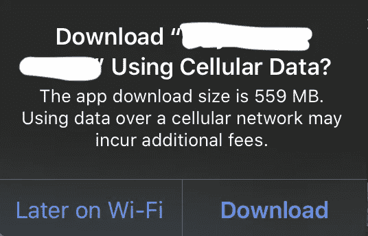

# iOS 应用程序大小分析

> 原文：<https://medium.com/globant/ios-app-size-analysis-76206a18a666?source=collection_archive---------0----------------------->

尤其是在构建企业移动应用程序时，最关键的难点之一是将应用程序大小限制在远远低于大小限制的范围内。所谓大小限制，我指的是苹果的手机下载大小限制(即 **200 MB** )。虽然这只是 iOS 11 发布后的一个警告，但是保持应用程序的小尺寸可以提高用户的保留率。

App Download Size limit warning

现在，随着你的应用在你提供的功能方面的增长，因为你总是被要求迎合你的产品需求，有时很难让你的应用低于预期的大小限制。进行应用程序大小分析不仅重要，而且同样重要，因为自 2017 年 2 月*在 iTunes Connect 上发布以来，苹果已经停止提供每台设备的应用程序下载大小拆分信息。您只会得到每个设备的应用程序安装大小分解信息和一个警告，指示您的一个或多个二进制文件(以粗体字标记的*)是否超过了符合条件的下载大小限制。**

****

**App install size information of an app uploaded on iTunes Connect**

**您必须记住，您的客户可能并不总能访问 WiFi。因此，通过蜂窝网络下载是应该首先考虑的最坏情况分析。这是一个值得关注的问题，不仅在设计应用程序时很重要，在 AppStore 上发布应用程序时也很重要。**

***那你该怎么办？***

**好吧，有一些最佳做法你应该遵循，以确保你收紧你的应用的腰围。**

1.  ****部署目标:**如果您仍然支持旧版本，请将其更改为 **9** 。截至 2017 年 6 月 5 日、 **97%的**用户正在使用 **iOS 9** 及以上版本……所以我认为没有充分的理由仍然支持旧版本的 iOS。这是因为运行 **9.0** 及更高版本的设备支持切片应用；否则，商店会向顾客提供通用应用程序。如果你在想什么是切片应用:那么它们只是通用 IPA 的一部分，支持非模拟器 iOS 架构。 **arm64** 、 **armv7** 或**arm V7**。这些就是你的 *iPhone/iPad* 的处理器架构。**
2.  ****文件变更:**不要对文件进行不必要的修改。用`diff`或另一个目录比较工具比较你的应用程序以前版本和新版本的内容，并验证你只改变了你在应用程序捆绑包中期望的东西。**
3.  ****内容更改:**您希望在更新中更改的内容应该与您不希望更改的内容存储在不同的文件中。这减小了*更新包*的大小，提高了它的安装速度。**
4.  ****删除不必要的资源:**您可能会大量减少资源的大小，但是在生成一个`.ipa`文件之后，您可能会发现该资源的压缩大小并没有发生显著的变化。减小一个`.ipa`文件大小的最有效的方法是删除不必要的资源。**
5.  ****按需资源:** [O *n-demand 资源*](https://developer.apple.com/library/content/documentation/FileManagement/Conceptual/On_Demand_Resources_Guide/index.html#//apple_ref/doc/uid/TP40015083) 就是托管在 AppStore 上，与用户最初从 App Store 下载的相关应用捆绑包相分离的应用内容(任何种类的资源)。点播资源在 AppStore 上也有每个平台的大小限制，如下所示:**

****

**On-Demand size limit and slicing eligibility on AppStore**

**[按需资源](https://developer.apple.com/library/content/documentation/FileManagement/Conceptual/On_Demand_Resources_Guide/index.html#//apple_ref/doc/uid/TP40015083)如果你正在构建一个游戏，这是特别重要的，因为一个游戏将有多个级别，更合理的做法是不要将资源(游戏的更高级别将需要这些资源)与 IPA 一起运送，使其体积庞大。这种技术类似于在应用服务器上拥有应用资源。如果您的应用程序附带预加载的数据库，请确保它包含您认为客户在安装应用程序且没有互联网连接时应该访问的最少或相当重要的数据(同样是最坏情况分析)。**

**6.**资产目录** : [资产目录](https://developer.apple.com/library/content/documentation/Xcode/Reference/xcode_ref-Asset_Catalog_Format/)根据相关设备特性组织资源，即。屏幕尺寸、屏幕分辨率、图形能力(从 **iOS 9** 开始)，以及内存水平(从 **iOS 9** 开始)。使用*资产目录*意味着使用 *1x* 、 *2x、*和 *3x* —图像集和数据集。需要注意的一点是:应用程序切片不会在**松散的**资源上执行。它必须是**资产目录**的一部分。*资产目录中的 Content.json* 包含了所有基于设备特性对 app 资源进行切片的标记信息。**

**7.**iOS 9 API:**有了一个新的类: *NamedData* 来精简任何不一定来自资产目录的文件。它存储任意文件内容。根据硬件功能进行分类。使用 *NSDataAsset* 类检索应用程序中的内容。**

**8.框架大小:你应该始终确保你在应用中使用的框架也是按照最佳实践创建的。当你发布一个新版本的应用程序，甚至发布一个新的应用程序时，你应该打开 IPA 文件，检查框架对应用程序实际大小的贡献。下载大小实际上是最坏的情况，只适用于第一次使用的用户。对于现有用户来说，这并不适用，因为他们总是需要从 AppStore 为每个新版本的应用程序下载更新包，更新包的大小将比应用程序的下载大小小得多。**

**9.**使用公共资产目录:**如果你的应用程序使用多个组件，它们很可能有一些或更多的公共资产。因此，将所有的公共资产保存在一个共享区域(资产目录)中是非常重要的，这样就不会在多个框架中重复，从而减少了总的规模。**

**10.**删除不必要的代码**:这类似于#4，不同之处在于这适用于源文件，通过适当的设计和重构，这是可以实现的。删除不需要的代码将帮助您减小 Unix 可执行文件的大小，从而减小应用程序的整体大小。**

## **附加指针**

*   **AppStore 的 IPA 大小总是大于估计的 IPA 大小，因为包含了。用于崩溃报告和按需资源的 dSYM 文件。**
*   **应用程序大小缩减分析只能在精简的 IPA 上执行，而不能在通用 IPA 上执行。**
*   ***App 精简大小报告*给出了有关精简后的 IPA 大小及其特征的信息。请参见下面的示例:**

****

**An App Thinning report for iPhone 6s Plus**

**这是你感兴趣的数据。如果你在上面的 *App 细化大小报告*中看到， *App 大小*有两个值:压缩和未压缩；前者表示从 AppStore 全新安装的应用 OTA(空中下载)下载*大小，而后者表示设备上的应用安装大小，现在这也因设备而异，因此用户在从 AppStore 下载应用时会看到不同大小的应用。iTunes Connect 将为您提供每个设备的安装大小信息，正如我之前在[摘录](https://cdn-images-1.medium.com/max/1600/1*n8W8R2Ecky2IA379XH6usg.png)中展示的那样。**

**(*)这里需要注意的一个非常重要的**点是，上面显示的*压缩后的*大小总是小于 AppStore 上应用程序的实际下载大小。这是因为 AppStore 对应用程序二进制文件进行加密，从而增加了应用程序的整体大小。加密不会改变二进制的大小，但是加密后的二进制会有不同的压缩特性，导致*。App Store 中的 ipa* 文件大于应用精简大小报告中列出的大小。大小变化并不是 App Store 加密算法独有的，而是任何强加密算法的正常结果之一。按照设计，强加密算法产生的输出无法有效压缩。****

## **结论**

**[App Thinning](https://developer.apple.com/library/content/documentation/IDEs/Conceptual/AppDistributionGuide/AppThinning/AppThinning.html#//apple_ref/doc/uid/TP40012582-CH35-SW1) 的三个主要组件是*切片、位代码*和*按需资源*。仔细检查这些可以帮助你保持你的应用苗条。**

**此外，这也要求你为你的应用程序采取更好的架构和设计决策，这将为你带来几个好处，即。更好的代码维护、代码重用、代码模块化、可伸缩性，所有这些都会让你收获:*快乐的客户*！**