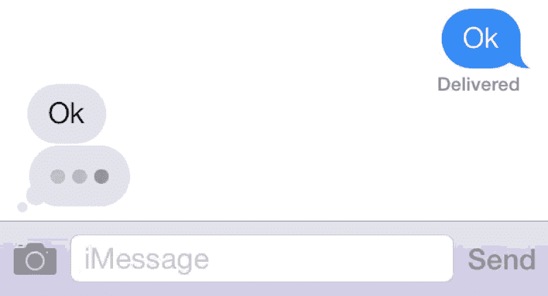

# iOS Bites —组合和反应模式简介

> 原文：<https://medium.com/capital-one-tech/ios-bites-an-intro-to-combine-and-the-reactive-pattern-24da924a6863?source=collection_archive---------1----------------------->


你听说过深潜吗？iOS Bites 是对 iOS 开发中的新概念和新方法的一系列简短探索

在今年由苹果主办的全球开发者大会上，一个为 iOS 开发者展示最新新兴技术的活动，我们许多人都对苹果向世界宣布他们的新[组合](https://developer.apple.com/documentation/combine/)框架感到惊讶。在此之前，苹果一直提倡在他们平台的应用程序开发中使用 [MVC 模式](https://en.wikipedia.org/wiki/Model%E2%80%93view%E2%80%93controller)。现在他们似乎抛弃了这一点，代之以通常所说的[反应模式](https://en.wikipedia.org/wiki/Reactive_programming)。苹果是否用这种新的未经证实的模式取代了他们屡试不爽的编写应用程序的方式？

事实上，没有什么比这更偏离事实了。反应模式是[观察者模式](https://en.wikipedia.org/wiki/Observer_pattern)和[迭代器模式](https://en.wikipedia.org/wiki/Iterator_pattern)的组合，在[函数式编程](https://en.wikipedia.org/wiki/Functional_programming)的良好帮助下，事情变得不那么冗长。自从 SDK 首次公开发布以来，观察者模式和迭代器都是 iOS 核心库的一部分。随着 Objective-C 中的[闭包](http://www.informit.com/blogs/blog.aspx?uk=Ask-Big-Nerd-Ranch-Blocks-in-Objective-C&WT)的引入，函数式编程首次出现在 iOS 开发中，随着 Swift 编程语言的发布，函数式编程进入了自己的领域。

因此，从这个角度来看，反应式编程只是 iOS 开发进化的下一步。事实上，苹果的发布落后于社区赞助的库，如 [RxSwift](https://github.com/ReactiveX/RxSwift) ，这是一个四年前实现的反应式编程，是[react evex](http://reactivex.io/)库的一部分。但是这仍然留给我们一个问题— *反应式编程试图解决什么问题？*

# 使用反应式—一个简单的例子

让我们以一个移动应用程序的常见用例为例，该应用程序使用来自 API 的数据在屏幕上显示信息。对于这个例子，我们将想象一个音乐平台，它托管一个 API，该 API 返回关于用户播放列表的数据。当用户打开应用程序时，会看到他们的播放列表列表。点击一个，他们可以看到该播放列表的所有细节，如歌曲和艺术家。所有这些信息都会因各种因素而稍有延迟。其中一些因素，比如从数据库中检索信息需要多长时间，可以被最小化。其他问题，如网络拥塞，将一直存在，并且在很大程度上不可预测。

一旦我们发起这个行动，我们将需要采取一些中间步骤。首先，我们需要显示一些指示器，表明一个不确定的调用正在发生，也就是我们正在进行一个网络调用。当网络调用返回时，我们需要显示检索到的数据，并从屏幕上删除该指示器。还需要考虑用户方面的错误状态和取消。

# 典型方法

当前的实践表明，我们可以通过在应用程序启动时获取所有这些值，并在用户导航到该页面时显示它们，来尝试针对这些情况进行预优化。但是这让我们有可能显示过时的信息。此外，我们现在必须在整个应用程序中随身携带这些信息，或者将其存储在本地，这会带来潜在的安全风险。所以最佳情况是当用户需要时从服务器获取它。

# 反应溶液

进入联合收割机框架。Combine 位于现有框架之上，将反应式编程引入 iPhone 开发。现有的框架结合使用的有:

*   目标/行动
*   通知中心
*   URLSession
*   键值观察
*   临时回电

通过将这些框架的使用“组合”成一个框架，开发人员可以降低网络和 UI 交互的复杂性。此外，大型团队将受益于苹果制定的标准，这对企业开发人员来说非常好。

对于我们的示例，我们需要了解三个关键的组合概念:

*   **发布者** —在我们的示例中，发布者是网络层，它接收来自 API 的响应，并让任何订阅者知道数据已经可用。
*   **订户** —订户知道数据已经可用。这个实例中的订户是显示用户播放列表信息的 UI。
*   **操作符** —位于发布者和订阅者之间的是过滤和修改发布者推送的值的操作符。对于运营商来说，一个很好的用例是预取前十几个播放列表的附加元信息，以帮助进一步减少感知延迟。

# 联合行动

我们可以使用 Xcode 11+中的 Playgrounds 在控制台上实现一个简单的版本。请注意，这是使用 Xcode 11.2 测试版构建的。

```
import Foundationlet name = Notification.Name.init("timerFired")
let publisher = NotificationCenter.default.publisher(for: name)Timer.scheduledTimer(withTimeInterval: 1, repeats: true) { (timer) in
    NotificationCenter.default.post(name: name, object: "First Event")
}publisher
    .receive(on: RunLoop.main)
    .sink(receiveValue: {
        print("Received event \($0)")
    }
)let name3 = Notification.Name.init("timerFired3")
let publisher3 = NotificationCenter.default.publisher(for: name3)Timer.scheduledTimer(withTimeInterval: 3, repeats: true) { (timer) in
    NotificationCenter.default.post(name: name3, object: "Second Event")
}publisher
    .combineLatest(publisher3)
    .receive(on: RunLoop.main)
    .sink(receiveValue: {
        print("Fired at \($0) and \($1)")
    })
```

当我们运行这段代码时，我们会看到以下输出:

```
Received event name = timerFired, object = First Event
Received event name = timerFired, object = First Event
Received event name = timerFired, object = First Event
Fired at name = timerFired, object = First Event, name = timerFired3, object = Second Event
```

第一个发布者每秒触发一次，我们将它的输出视为“接收到的事件”，而第二个发布者“在名称处触发”，每三秒触发一次。将这些发布者和订阅者与操作符 combineLatest 结合使用，我们可以看到如何使用 Combine 框架在异步触发事件的基础上快速构建应用程序。

# 乐观 UI

Combine 的登陆正值一种新的设计模式开始在 iOS 领域崭露头角。进入[乐观的 UI](https://uxplanet.org/optimistic-1000-34d9eefe4c05) 它已经存在了一段时间，但是大部分都被开发者和用户忽略了。当谈到让应用程序感觉快速和响应时，不管网络延迟或其他瓶颈，设计发挥了巨大的作用。多年来，苹果一直在他们的 [HIG](https://developer.apple.com/design/human-interface-guidelines/ios/icons-and-images/launch-screen/) 中建议，对于启动屏幕，应用程序跳过传统的带有应用程序标志的加载屏幕，而是显示应用程序首屏的空白版本。对于乐观用户界面，这种模式适用于每一个可能出现延迟的屏幕。在反应模式的支持下，我们现在知道数据何时可用，因此我们可以更新 UI。

*“当你的应用程序启动时，启动屏幕会立即出现，并很快被应用程序的第一个屏幕取代，给人的印象是你的应用程序速度快、响应快。”*

使用乐观用户界面的一个主要例子是 iOS 附带的 Messages 应用程序。当用户发送消息时，消息窗口会立即更新以包含新消息，即使用户在“发送”消息时可能是离线的。消息旁边有一个微调器，根据发布消息的网络调用的结果，微调器会在成功时消失，或者会以红色显示一条错误消息，如“未送达”。所有这些都发生在用户界面完全响应任何触摸的时候。这种模式也适用于任何收到的消息，当对方正在键入时，键入指示器会显示三个点。



Optimistic UI in action in the Message app

# 骨架屏幕

乐观 UI 的一个流行实现是[框架屏幕](https://www.lukew.com/ff/entry.asp?1797)，最常见的用例是脸书提要。当启动应用程序时，不是看到一个微调器并等待信息下载完成后再显示内容，而是骨架屏幕显示大致对应于数据布局的块，通常带有微光效果。


Skeleton screen with a shimmer

这两种 UI 实现都依赖于数据被填充*最终被填充*，而不是立即被填充。它们与需要等待异步网络操作完成相吻合，同时也给人一种应用程序快速响应的印象。

回到我们的音乐平台的例子。有了新的编程和 UI 模式，我们可以更新体验以限制网络使用，同时使应用程序看起来快速响应。打开应用程序并进入播放列表页面后，会调用 API 来返回播放列表信息。同时，会显示一个显示播放列表轮廓的框架屏幕。一旦 API 调用返回，这个框架屏幕就会被替换为真正的数据，比如歌曲和艺术家。

# 期货

被动模式并不是使异步计算更容易理解的唯一尝试。[期货](https://en.wikipedia.org/wiki/Futures_and_promises)，有时被称为承诺，也试图这样做。然而，这种模式往往会导致开发人员开始混合同步和异步函数，也就是所谓的[有色函数问题](http://journal.stuffwithstuff.com/2015/02/01/what-color-is-your-function/)。简而言之，虽然同步(蓝色)函数可以从异步(红色)函数调用，但异步函数只能从其他异步函数调用。同样，你的程序很可能采用[延续传递风格](https://en.wikipedia.org/wiki/Continuation-passing_style)，也就是[末日金字塔](https://en.wikipedia.org/wiki/Pyramid_of_doom_(programming))，这使得跟踪程序执行变得困难。

# 结论

随着手机继续吞噬市场份额和眼球，消费者对快速响应应用的期望也将增加。响应式模式远非本月的特色，而是满足这一需求的一种成熟方法，苹果通过其 Combine 框架实现这一模式对于 iOS 开发者来说是令人鼓舞的一步。

# 资源

*   [介绍联合收割机](https://developer.apple.com/videos/play/wwdc2019/722/)
*   [结合实际](https://developer.apple.com/videos/play/wwdc2019/721/)
*   [用联合收割机接收和处理事件](https://developer.apple.com/documentation/combine/receiving_and_handling_events_with_combine)
*   [使用 Combine Swift 解决问题](/flawless-app-stories/problem-solving-with-combine-swift-4751885fda77)
*   [解释联合收割机框架概念的 Swift 游乐场](https://github.com/AvdLee/CombineSwiftPlayground)

# 相关文章

*   [iOS Bites——用 Reality Composer 构建 AR 体验简介](/capital-one-tech/ios-bites-an-intro-to-building-ar-experiences-with-reality-composer-8f891a333cab)

*披露声明:2020 首创一号。观点是作者个人的观点。除非本帖中另有说明，否则 Capital One 不隶属于所提及的任何公司，也不被这些公司认可。使用或展示的所有商标和其他知识产权是其各自所有者的财产。*