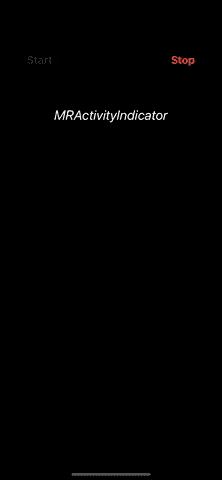

# iOS |带图像的自定义活动指示器

> 原文：<https://medium.com/globant/ios-custom-activity-indicator-with-image-3326d80e8803?source=collection_archive---------0----------------------->



活动指示器是一个旋转的轮子，指示任务正在进行中。苹果已经提供了基本的`[UIActivityIndicatorView](https://developer.apple.com/documentation/uikit/uiactivityindicatorview)`，但是没有提供图像的外观定制。在这篇文章中，我们将设计一个自定义的活动指示器，其中单个图像将作为纺车动画。在这篇文章中，我们也将使用`[UIDynamicItemBehaviour](https://developer.apple.com/documentation/uikit/uidynamicitembehavior)`和`[UIDynamicAnimator](https://developer.apple.com/documentation/uikit/uidynamicanimator)`来给出纺车的效果。

让我们开始设计我们自己的牛逼且方便使用的自定义活动指示器:

# **设置活动指示器**

1.  声明并初始化`UIImageView`实例，用你想要的图像作为旋转器。

```
let theImage = UIImage(named: "activityLoader")
let imageView = UIImageView(image: theImage)
imageView.frame = CGRect(x: self.center.x — 20, y: self.center.y — 20, width: 40, height: 40)
```

> **注意**:这里 self 是一个名为 MRActivityIndicator 的`UIVIew`类实例，activityLoader 是一个名为的图像，它将充当 spinner。

2.为图像视图上的动态动画添加动态行为。

```
let spinnerBehavior = UIDynamicItemBehavior(items: [imageView])
let animator = UIDynamicAnimator(referenceView: self)
```

# **显示活动指示器**

1.  将 imageView 添加到屏幕上并开始播放动画。

```
func showLoadingActivity() {
   addSubview(imageView)
   startAnimation()
   UIApplication.shared.windows.first?.addSubview(self)
}
```

> **注意**:如果您想在显示微调器时忽略用户的交互，请将其添加到上面的 If-block
> 

2.在 startAnimation()中，如果 animator 不包含 spinnerBehavior，则为 imageView 添加角速度值(此处为 5.0)。一旦 spinnerBehavior 被添加到 animator 中，imageView 就开始旋转，其行为就像纺车一样。

```
func startAnimation() {
   if !animator.behaviors.contains(spinnerBehavior) {
      spinnerBehavior.addAngularVelocity(5.0, for: imageView)
      animator.addBehavior(spinnerBehavior)
   }
}
```

> **注**:我们可以增加速度以获得更快的旋转效果。

# 隐藏活动指示器

要停止活动指示器，我们将遵循以下步骤:

```
animator.removeAllBehaviors()
imageView.removeFromSuperview()
imageView = nil
self.removeFromSuperview()
```

> **注意**:如果你禁用了用户交互，那么请添加下面的代码来启用它。
> `UIApplication.shared.endIgnoringInteractionEvents()`

请查找活动指示器的完整代码片段，我们在其中使用了 UIImageView 并对其进行了定制，使其像纺车一样运行。

# MRActivityIndicator 的用法

1.  要显示它，请使用
    `MRActivityIndicator.shared.show()`
2.  要隐藏它，请使用
    `MRActivityIndicator.shared.hide()`

> 如果你喜欢这篇文章，请用掌声和评论来欣赏它。这真的会鼓励我多写！！！！