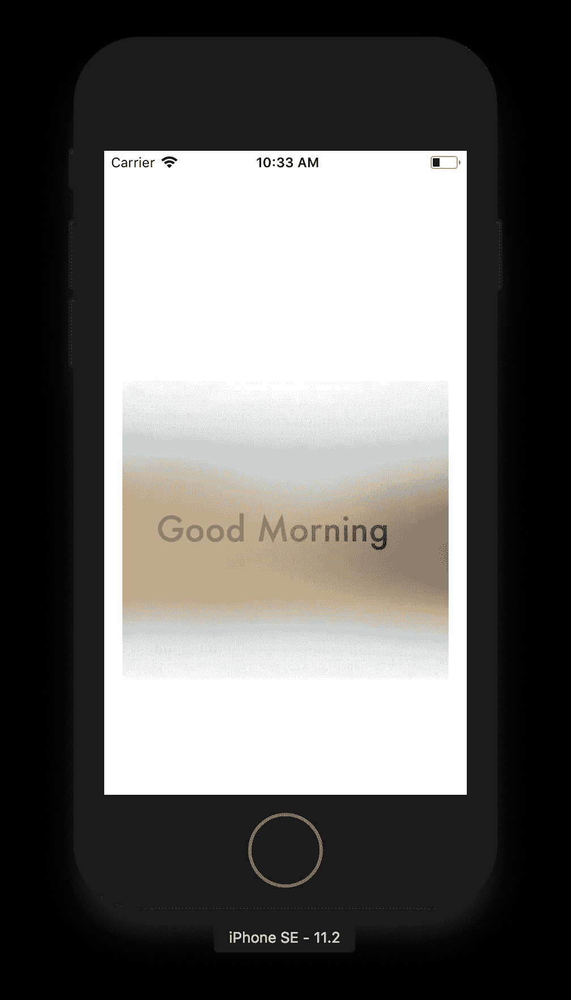

# iOS 开发参考—模糊与活力

> 原文：<https://medium.com/quick-code/ios-dev-reference-blur-vibrancy-24f068f1182c?source=collection_archive---------0----------------------->

我们经常需要在图像视图上获得模糊，或者在任何动态背景上获得模糊视图。有两种方法可以做到这一点。

1.有一个理想的模糊效果的模糊视图，并添加任何标签。

2.有模糊的观点和鲜明的观点。然后在上面添加一些内容，比如文本。

添加模糊视图-

```
let blurEffect = UIBlurEffect(style: .regular)let blurredEffectView = UIVisualEffectView(effect: blurEffect)blurredEffectView.frame = view.boundsview.addSubview(blurredEffectView)
```

向模糊视图添加标签

```
let tLabel : UILabel = UILabel()tLabel.text = "Good Morning"tLabel.font = UIFont(name: "Futura", size: 30)tLabel.textColor = UIColor.white.withAlphaComponent(0.6)tLabel.frame = blurredEffectView.contentView.boundsblurredEffectView.contentView.addSubview(tlabel)
```

添加活力和标签

```
let vibrancyEffect = UIVibrancyEffect(blurEffect: blurEffect)let vibrancyView = UIVisualEffectView(effect: vibrancyEffect)vibrancyView.frame = blurredEffectView.contentView.boundsvibrancyView.contentView.addSubview(tLabel)tLabel.frame = vibrancyView.contentView.boundsblurredEffectView.contentView.addSubview(vibrancyView)view.addSubview(blurredEffectView)
```



## 参考

*   [RayWanderlich 的 UIVisualEffectView 教程](https://www.raywenderlich.com/178486/uivisualeffectview-tutorial-getting-started)
*   [使用 UIVisualEffectView](https://ios8programminginswift.wordpress.com/2014/08/16/working-with-uivisualeffectview-blurview-coding/)
*   [StackOverflow 关于模糊度的问题&活力度](https://stackoverflow.com/questions/28831372/how-to-add-uivibrancyeffect-to-an-existing-uilabel-iboutlet)
*   [OmniDev 网站的模糊指南&活力](https://www.omnigroup.com/developer/how-to-make-text-in-a-uivisualeffectview-readable-on-any-background)
*   [破解 Swift 关于模糊的文章&活力](https://www.hackingwithswift.com/example-code/uikit/how-to-add-blur-and-vibrancy-using-uivisualeffectview)