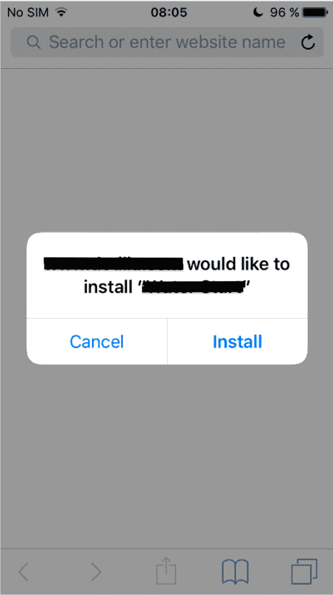

# 在自己的服务器上分发 iOS 内部应用程序

> 原文：<https://medium.com/globant/ios-in-house-app-distribution-on-own-server-ca23e793670a?source=collection_archive---------0----------------------->

内部应用分发是一种技术，通过使用这种技术，我们可以将我们的应用分发给我们的最终用户，而无需将应用上传到应用商店。在此下，应用程序被签名并从 Xcode 导出。

因此，当我们的 iOS 应用程序开发完成后，下一步就是将应用程序分发给最终用户。

如果我们的目标是让每个人都可以公开使用这款应用，那么我们可以通过[苹果开发者计划](https://developer.apple.com/programs/enroll/)(每年 99 美元)来部署这款应用。
苹果开发者计划允许我们:

*   通过 [iTunesConnect](https://itunesconnect.apple.com/login) 在苹果应用商店分发 iOS 应用。
*   在发布任何应用程序之前，允许用户通过 TestFlight 测试应用程序的 Beta 版本。
*   通过临时分发为特定企业(包括您的组织)定制应用程序。

然而，如果我们不希望我们的应用程序对所有人公开，那么在应用程序商店之外分发它可能是一个不错的选择。
分发应用程序最有效的方法是使用[苹果开发者企业计划](https://developer.apple.com/programs/enterprise/)(每年 299 美元)进行内部分发。
In house distribution 提供了以下优势:

*   IOS 应用不需要苹果审核。
*   最终用户可以快速获得任何关键更改或任何应用程序更新。

在这个过程中，应用程序的。ipa 文件将被托管在一个安全的服务器上，我们将能够给首选客户端的网址。它不允许使用 TestFlight 访问 iTunes Connect 来部署应用程序或测试应用程序。
要分发应用程序，我们必须遵循以下步骤

## **1。创建分发证书:**

> 1.1 打开[苹果开发者会员](https://developer.apple.com/)，凭证登录。
> 1.2 登录后，浏览至**证书、标识符&配置文件部分。
> 1.3 从下拉菜单中选择 **iOS、tvOS、watchOS** 。
> 1.4 现在，单击屏幕右上角“证书”下的“+”按钮，创建一个新证书。
> 1.5 点击继续按钮，按照给出的说明创建证书。**

## 2.**为应用创建应用 ID:**

> 2.1 在**标识符**下选择一个应用 Id。

> 2.2 现在，单击“+”按钮(位于屏幕右上角)创建一个新的应用 ID。2.3 命名应用程序 Id。确保应用 Id 遵循标准命名约定:com . your company name . your App name
> 2.4 点击继续按钮，按照给出的说明生成应用 ID。

## **3。创建配置文件:**

> 3.1 创建应用 ID 后，转到个人资料。
> 3.2 选择内部/临时选项
> 3.3 点击继续，然后选择我们创建的应用 ID。

> 3.4 完成此过程后，我们将能够下载配置文件并双击该文件。

## **4。在 Xcode:** 中选择适当的预置描述文件

> 4.1 打开 Xcode，转到 App Target，选择构建设置。

> 4.2 在签名部分下，选择预配配置文件，然后选择下载的预配配置文件。

## **5。归档 app 并从 Xcode:** 创建一个. ipa 文件

> 5.1 从顶部菜单中，选择构建目标作为通用 iOS 设备。
> 5.2 之后，从菜单栏选择产品菜单- >存档。

> **5.3。首先验证**存档应用程序。

> 5.4 成功验证后，单击“分发应用程序”并选择创建的档案，然后单击“导出”。
> 5.5 当提示输入导出方法时，选择保存用于企业部署**。**

> 5.6 单击“下一步”按钮，并按照说明完成该过程。完成这个过程后会看到总结。

> 5.7 确保选中“包括无线安装清单”复选框，然后单击“下一步”保存 ipa 文件。它将生成一个清单(。plist)文件。

> 5.8 给出适当的名称，然后点击导出按钮将其保存到计算机中。

## **6。托管应用程序的二进制文件(。ipa)文件在服务器上:**

> 6.1 在托管服务器上创建一个文件夹，并将其命名为与应用程序名称相同的名称。
> 6.2 上传下载。此文件夹中的 ipa 文件。
> 6.3 上传后，复制其可共享网址。
> 6.4 现在修改清单文件的数据。

**注意:-** 我们需要将这个清单文件保存在我们的服务器上，保存在我们上传 ipa 文件的同一个文件夹中。

什么是清单文件？
‘‘一个清单(。plist)是一个包含元数据的文件，该元数据由它描述的其他文件标识。例如，在我们的例子中。plist 文件将指示您的应用程序的 URL。ipa 文件、包 ID 和应用程序的名称。''它有以下内容-

在上面的文件中，我们需要替换大括号中的粗体元素。
**【https 链接 IPA 文件】:**这是我们的。将托管在安全服务器
**【捆绑包 ID】**上的 ipa 文件的 URL:将在此页面上提供的我们的应用的 ID:*发布>证书> iOS* **【应用名称】**:这是我们的应用的名称。

**7。创建一个网页链接到清单:** 后，我们已经上传了。plist 文件在一个安全的服务器上，然后我们可以创建一个网页，在那里我们将放一个链接来下载我们的应用程序。
下面是同样的例子:

[【URL _ OF _ THE _ PLIST _ FILE】" id = " text ">下载我们的申请
< /a >](”itms-services://?action=download-manifest&url=<strong)

我们需要将粗体元素替换为实际的清单 plist 文件 URL，并将“下载我们的应用程序”替换为适当的消息。

**对于最终用户来说是怎样的？** 答:我们已经制作了一个下载页面，并通过内部网站或电子邮件发送给您的决赛用户。然后他们可以点击里面的链接下载您的应用程序。
第一次启动时，会出现新的弹出窗口。

B.然后成功安装应用程序后，当它第一次启动时，会出现一个新的弹出窗口，要求信任该应用程序。

C.为了确认这一点并使应用程序可用，用户必须在他们的 iOS 设备中进入菜单*设置>常规>配置文件和设备管理*。

**注:-** “内部”分配证书 3 年后到期。一旦过期，您的最终用户将无法下载该应用程序。我们将不得不更新它。