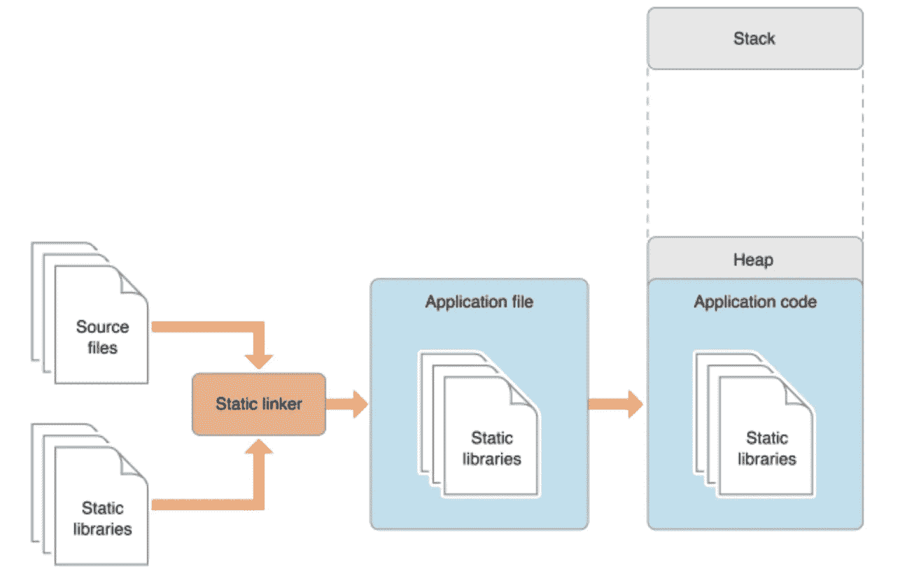
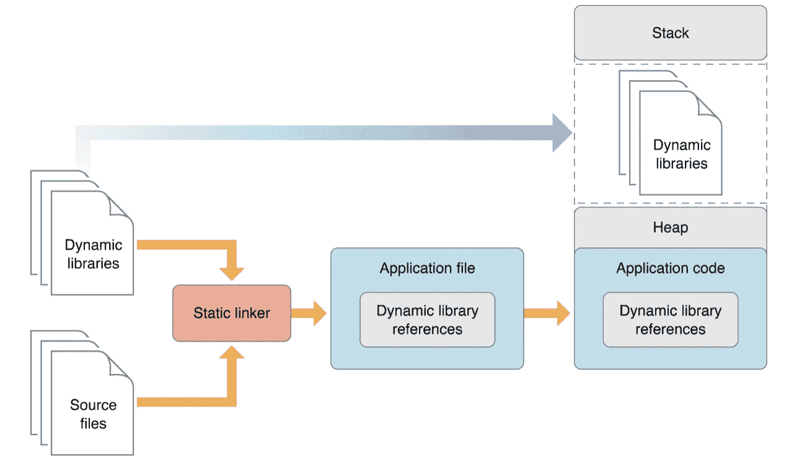
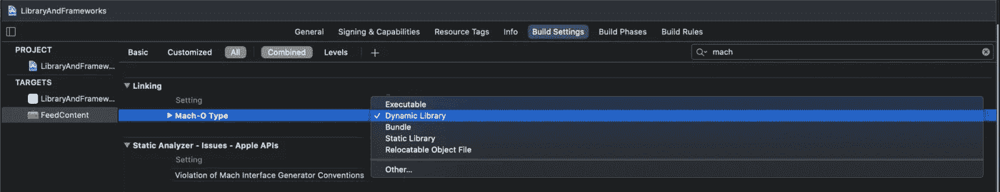
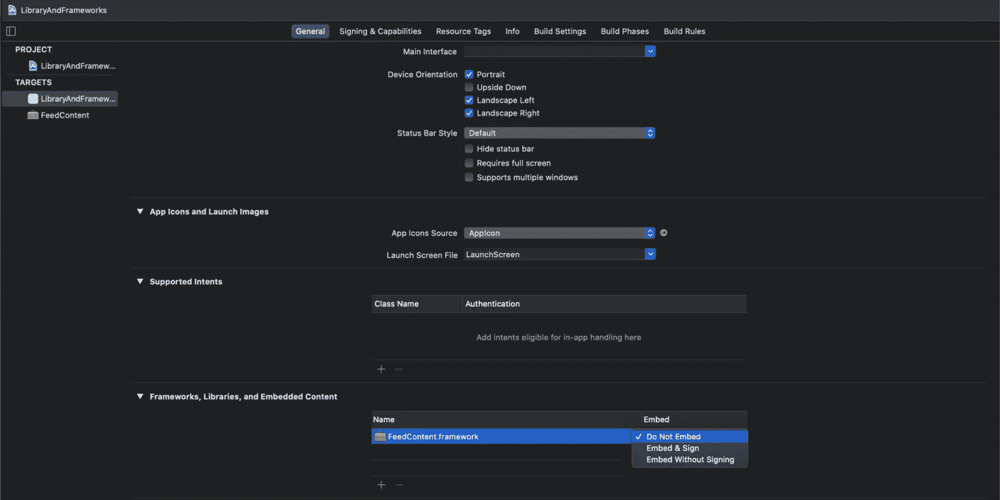

# iOS 库、捆绑包和框架

> 原文：<https://medium.com/walmartglobaltech/ios-library-bundle-and-frameworks-8fdc0aac6952?source=collection_archive---------1----------------------->

应用程序趋向于增长，它们的源代码也是如此。具有非常大的代码库的单片应用程序在可维护性、部署和修改方面提出了挑战。因此，将代码库组织成可管理的组件是每个应用程序的重要部分。这样做有各种原因:降低代码复杂性；维护、测试和重用现有部件；甚至优化应用程序本身。

iOS 提供了各种方式，如模块、库、捆绑包和框架来打包和交付组件。它们听起来很相似，但在内部工作方式上有一些关键区别。

**Module** : Module 是一个单独的代码分发单元，是作为一个单独的单元构建和发货的框架或应用程序，可以由另一个模块使用 swift 的 import 关键字导入。

**库**:定义不属于 Xcode 目标的代码和数据的文件。

**Bundle**:Bundle 是一个文件目录，里面有子目录。在 iOS 上，包可以方便地将相关文件打包在一个包中——例如，图像、nib 或编译后的代码。系统将其视为一个文件，您可以在不知道其内部结构的情况下访问包资源。

捆绑的类型

尽管所有软件包都支持相同的基本功能，但是定义和创建软件包的方式有所不同，这些软件包定义了它们的预期用途:

1.应用程序—应用程序包管理与可启动流程相关的代码和资源。例如，iOS 应用程序包包含 info.plist、可执行文件、资源和其他支持的文件。

2.框架—框架包管理动态共享库及其相关资源，如头文件。应用程序可以链接一个或多个框架，以利用它们包含的代码。

3.插件— macOS 支持许多系统功能的插件。

**框架**:它是一个包，可以包含动态库、字符串、头文件、图片、故事板等资源。

框架也是以。框架扩展。它们可以由 NSBundle / Bundle 类从代码中访问，并且与大多数 Bundle 文件不同，可以在文件系统中浏览，这使得开发人员更容易检查其内容。框架具有版本化的捆绑包格式，允许存储代码和头文件的多个副本，以支持较旧的程序版本

**静态和动态库**

**静态库**:编译时链接的代码单元，不会改变。(只能包含代码)。应用程序使用的代码在编译时被静态链接器复制到生成的可执行文件中。但是，iOS 静态库不允许包含图像/资产(仅限代码)。您可以通过使用媒体包来绕过这一限制。

**动态库**:运行时链接的可能改变的代码和/或资产单元。它们不同于静态库，因为它们在运行时与应用程序的可执行文件链接，而不是复制到其中。因此，可执行文件更小，并且因为代码仅在需要时才加载，启动时间通常更快。它们通常在应用程序之间共享，因此系统只需要存储库的一个副本，让不同的进程访问它。因此，从动态库中调用代码和数据比从静态库中调用要慢。

**注意**:框架包之外的动态库，通常具有文件扩展名。dylib 在 iOS、watchOS 或 tvOS 上不受支持，Xcode 提供的系统 Swift 库除外。你不允许创建这些，因为这将导致你的应用被拒绝。只有苹果被允许为 iOS 创建动态库。

系统 iOS 和 macOS 库是动态的。这意味着您的应用程序将从苹果的更新中获得改进，而无需提交新的构建。这也可能导致互操作性的问题。这就是为什么在新的操作系统版本发布之前对其进行测试总是一个好主意。

**文字基础。dylib 存根:**

当系统库被链接时，比如 UIKit 或 Foundation，我们不想把它们全部复制到应用程序中，因为那样会太大。基于文本。dylib stub 或者。tbd 是一个文本文件，包含方法的名称，没有方法体，在动态库中声明。它导致的大小显著降低。除了方法名之外，它还包含相应的。dylib、架构、平台和其他一些元数据。

**静态和动态的比较:**

决定应用程序性能的两个重要因素是它们的启动时间和内存占用。缩小应用程序可执行文件的大小，并在启动后最大限度地减少其内存使用，可以使应用程序启动更快，并在启动后使用更少的内存。使用动态库代替静态库可以减小应用程序的可执行文件大小。它们还允许应用程序仅在需要时才延迟加载具有特殊功能的库，而不是在启动时。这一特性有助于进一步减少启动时间和有效使用内存。

当一个应用程序启动时，该应用程序的代码(包括它所链接的静态库的代码)被加载到该应用程序的地址空间中。将许多静态库链接到一个应用程序中会产生很大的应用程序可执行文件。下图显示了使用静态库中实现的功能的应用程序的内存使用情况。具有大型可执行文件的应用程序启动速度慢，内存占用量大。此外，当静态库更新时，它的客户端应用程序不会从对它的改进中受益。为了获得改进的功能，应用程序的开发人员必须将应用程序的对象文件与新版本的库链接起来。应用程序的用户必须用最新版本替换他们的应用程序副本。因此，用静态库提供的最新功能更新应用程序需要开发人员和最终用户进行破坏性的工作。

静态库如何工作

一个更好的方法是应用程序在实际需要的时候将代码加载到它的地址空间，无论是在启动时还是运行时。动态库不是静态链接到客户端应用程序中的；它们不会成为可执行文件的一部分。相反，动态库可以在应用程序启动或运行时加载(和链接)到应用程序中。

下图显示了将某些功能实现为动态库而不是静态库如何减少应用程序启动后使用的内存。

动态库如何工作

使用动态库，程序可以从它们自动使用的库的改进中受益，因为它们到库的链接是动态的，而不是静态的。也就是说，客户端应用的功能可以被改进和扩展，而不需要应用开发者重新编译应用。为 OS X 编写的应用程序受益于这个特性，因为 OS X 的所有系统库都是动态库。这就是使用 Carbon 或 Cocoa 技术的应用程序从 OS X 的改进中受益的方式。

动态库提供的另一个好处是，它们可以在加载时初始化，并且可以在客户端应用程序正常终止时执行清理任务。静态库没有这个特性。

开发人员在开发动态库时必须记住的一个问题是，在库更新时，要保持与客户端应用程序的兼容性。因为库可以在客户端应用程序开发人员不知情的情况下更新，所以应用程序必须能够使用新版本的库，而无需更改其代码。为此，库的 API 不应该改变。然而，有时改进需要改变 API。在这种情况下，先前版本的资源库必须保留在用户的电脑上，客户端应用程序才能正常运行。动态库设计指南探讨了随着动态库的发展，管理与客户端应用程序的兼容性这一主题。

**如何使用动态库**

当一个应用程序启动时，OS X 内核会将应用程序的代码和数据加载到一个新进程的地址空间中。内核还将动态加载器(/usr/lib/dyld)加载到进程中，并将控制权交给它。然后，动态加载器加载应用程序的依赖库。这些是应用程序链接的动态库。静态链接器在应用程序被链接时记录每个依赖库的文件名。这个文件名称为动态库的安装名。动态加载器使用应用程序的依赖库的安装名称在文件系统中定位它们。如果动态加载程序在启动时没有找到应用程序的所有依赖库，或者如果有任何库与应用程序不兼容，启动过程将中止。

除了在启动时自动加载动态库之外，动态加载器还在运行时应应用程序的请求加载动态库。也就是说，如果应用程序不要求在启动时加载动态库，开发人员可以选择不将应用程序的对象文件与动态库链接，而是只在应用程序需要的部分加载动态库。以这种方式使用动态库可以加快启动过程。

**静态和动态框架:**

静态框架包含一个与资源打包在一起的静态库。动态框架包含静态/动态库及其资源。除此之外，动态框架可以方便地在同一个框架中包含同一个动态库的不同版本。

就像动态共享库一样，框架提供了一种将常用代码提取到一个中心位置的方法，该位置可以由多个应用程序共享。在任何给定时间，只有一份框架代码和资源的副本驻留在内存中，不管有多少个进程正在使用这些资源。链接框架的应用程序共享包含框架的内存。这种行为减少了系统的内存占用，有助于提高性能。

**注意**:只有一个框架的代码和只读资源是共享的。如果一个框架定义了可写变量，每个应用程序都会得到这些变量的副本，以防止它们影响其他应用程序。

**实验:**

为了更好地理解静态和动态框架嵌入，我们创建了一个具有 FeedContent 依赖项的项目。我们选择了具有动态和静态库的框架，具有不同的选项无签名嵌入和无嵌入。

静态和动态框架:

要查看框架的内容，请检查结果文件夹

# [shilpabansal/staticdynamicframe framework](https://github.com/shilpabansal/StaticDynamicFramework)

# [调查尺寸的静态和动态框架—shilpabansal/staticdynamicframe](https://github.com/shilpabansal/StaticDynamicFramework)

github.com

尺寸:

动态框架:188 KB

静态框架:139 KB

动态和静态框架实现:[https://github . com/shilpabansal/statidynamicframeworkflementation](https://github.com/shilpabansal/StaticDynamicFrameworkImplementation)

更新依赖模块的类型

更新框架嵌入方式的不同设置

**结论:**

**静态框架**:静态库总是被编译并嵌入到可执行文件中

1.带/不带登录的嵌入:如果存档是用带嵌入的静态库创建的，它将创建代码的 2 个副本。由于代码已经在应用程序的可执行文件中，它只会增加二进制文件的大小，而框架文件夹中的文件将永远不会被使用。

2.如果框架已经登录，对于客户端可以选择“嵌入而不登录”选项，而如果它还没有登录，它应该与客户端一起登录。

3.使用静态框架的最佳选择是不嵌入。

**优点**:

1.启动时间更快，因为它已经在内存中加载了应用程序代码

2.静态库保证存在于应用程序中，并且具有正确的版本。

3.无需通过库更新来保持应用程序最新。

4.更好的库调用性能。

**缺点**:

1.为了改变任何事情，应用程序必须重新编译和发布

2.膨胀的应用程序大小。

3.即使使用单个函数，也必须复制整个库。

4.由于臃肿的应用程序可执行文件，启动时间会缩短。

**动态框架**:动态框架从来都不是可执行文件的一部分，它在加载时或运行时链接——基于客户端选择的选项

1.未嵌入:如果框架未嵌入，它将使应用程序崩溃，因为它不是可执行文件的一部分

2.嵌入:使用它的理想方式是嵌入

**优点**:

1.如果选择按需加载选项，启动时间会更快。

2.无需重新编译应用程序，即可受益于库的改进。对系统库特别有用。

3.由于在应用程序之间共享，占用的磁盘空间更少。

4.分段加载:如果使用单个函数，不需要加载整个库。

**缺点**:

1.如果库中发生任何变化，都有可能中断程序。

2.对库函数的调用较慢，因为它位于应用程序可执行文件之外。

**沃尔玛应用:**

沃尔玛应用程序是动态和静态框架的结合。

在 Sam's，考虑到崩溃的风险以及更好的性能和启动时间，我们通常使用静态框架。模块化是通过制造 4 类模块来实现的。

1.  **接口模块** —这些模块为其余模块提供两个重要角色:

*   包含所有的功能模块接口(协议)和它们相关的数据模型
*   保存依赖注入容器，这是特性模块用来注册它们的可用功能和解析对其他模块的依赖的容器

1.  **功能模块** —这些模块将是我们应用程序中的大部分代码，并将由应用程序*中维护状态*的一些功能的“垂直切片”组成。
2.  库模块(Library Module)—这些模块表示共享的、无状态的和无依赖性的构建块，如实用方法、可重用的 UI 组件或样式，以及基本定义或配置
3.  **应用程序模块** —这是 Sam 应用程序的核心，应用程序代理就位于其中。

*   通过注册所有功能模块的程序集来加载它们
*   处理应用程序注册通知、处理深层链接、主要导航、初始化框架的任务

**结论**

随着应用程序规模在代码行数和贡献者数量上不断增长，模块化变得必不可少，因为它:

1.  实施更好的关注点分离
2.  让更大的团队更容易为代码库做出贡献
3.  集成特性，无需在开发人员的机器上构建和运行整个应用程序

动态框架好还是静态框架好是一个有争议的话题？这很大程度上取决于应用程序的需求和优先级。动态框架提供了构建时间更短的好处，但也带来了运行时崩溃的风险。静态框架有助于实现更好的性能和启动时间。根据用途和产品优先级，您的应用程序可以是两种选项的组合。

参考资料:

# [iOS 中的静态和动态库和框架](https://www.vadimbulavin.com/static-dynamic-frameworks-and-libraries/)

# [图书馆？静电？动态？还是框架？另一个项目内的项目](https://stackoverflow.com/questions/15331056/library-static-dynamic-or-framework-project-inside-another-project)

# [https://youtu.be/IqsKGyklmL0](https://youtu.be/IqsKGyklmL0)