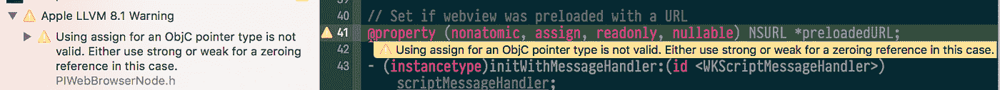
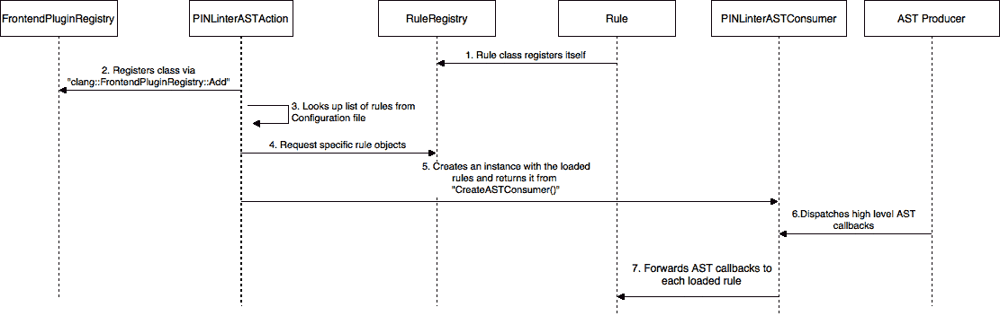
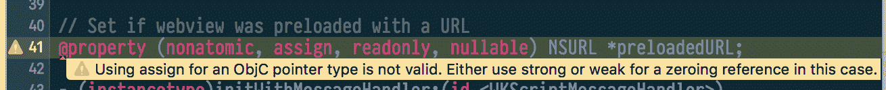
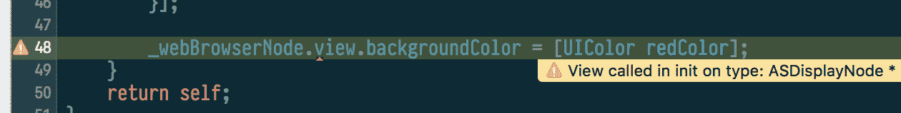
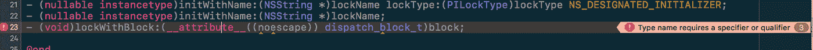

# Pinterest 上的 iOS 林挺

> 原文：<https://medium.com/pinterest-engineering/ios-linting-at-pinterest-3108d8764390?source=collection_archive---------1----------------------->

*迈克尔·施耐德| Pinterest 工程师，iOS 核心体验*

对于一个每天都有大量开发人员工作、每周都有新工程师加入的代码库来说，编码一致性和指导方针至关重要。为了控制代码质量和实施最佳实践，我们最近在基础设施中添加了林挺，以帮助开发人员编写更好的代码。林挺是运行程序来分析代码中潜在错误的过程。

与此同时，我们正在将我们当前的构建基础架构迁移到巴泽尔，因此这是考虑哪些林挺选项将与新构建很好地配合的好时机。该计划的主要目标是尽早推进林挺过程，以便在编译时，如果代码不符合我们的指导方针或最佳实践，开发人员可以立即做出响应。在本帖中，我们将介绍我们如何实施林挺以及在此过程中学到的最佳实践。

## 叮当工具

我们评估了现有的解决方案，但是没有一个足够灵活或者能够容易地集成到我们的构建系统中。然后我们研究了 LLVM 能提供什么，尤其是围绕 Clang 的工具。

Clang 提供了编写工具的基础结构，这些工具需要一个叫做 Clang Tools 的程序的语法和语义信息。Clang 为开发人员提供了不同的接口来连接 Clang 的编译过程。可用的接口有 [LibClang](http://clang.llvm.org/doxygen/group__CINDEX.html) 、 [Clang 插件](https://clang.llvm.org/docs/ClangPlugins.html)和 [LibTooling](https://clang.llvm.org/docs/LibTooling.html) 。页面[“为您的应用选择正确的接口”](https://clang.llvm.org/docs/Tooling.html)对于决定哪些 Clang 工具接口最适合我们的需求特别有帮助。我们在一个小例子中测试了每个接口，发现 LibClang 不能提供对 AST 的完全控制，LibTooling 不能运行由依赖关系变化触发的部分构建。最终我们决定使用 Clang 插件。

值得注意的一点是，由于 Clang 是用 C++编写的，工具扩展点本身是作为 C++接口公开的。此外，所有文档大部分都是从带注释的 C++源代码中自动生成的 doxygen 输出。所以在用 Clang 工作时，有以前的 C++经验是非常有帮助的。

## Clang 插件

Clang 插件使我们能够在 Clang AST ( [抽象语法树](https://en.wikipedia.org/wiki/Abstract_syntax_tree))上运行额外的操作，作为编译的一部分。Clang 的 AST 不同于其他编译器生成的 AST，因为它非常类似于编写的 C++代码和 C++标准。例如，在 AST 中，圆括号表达式和编译时间常数以未简化的形式提供。这使得 Clang 的 AST 非常适合重构工具。(更多信息请参见[叮当声介绍](http://clang.llvm.org/docs/IntroductionToTheClangAST.html)。 [)](http://clang.llvm.org/docs/IntroductionToTheClangAST.html)

插件是由编译器在运行时加载的动态库，允许我们向编译器发出特殊的 lint 风格的警告和错误，这些警告和错误将在 Xcode 左侧的警告标签部分或直接在源代码中显示为众所周知的警告或错误。我们称我们的 Clang 插件为 PINLinter。



# 体系结构

和所有 Clang 插件一样，PINLinter 由一个在编译时加载的动态库(dylib)来表示。一旦加载了 PINLinter 插件，Clang 就会使用一个 JSON 格式的配置文件，其中包含一个应该加载的所有规则的列表，以及一个惟一的名称，并加载每个列出的 Linter 规则。这允许我们只为所有规则使用一个 Clang 插件，而不是为每个规则都使用一个，并且我们可以为不同的规则配置启用或禁用某些规则，比如开发与构建机器。



## PINLinterASTAction

主 Clang 插件类的名字叫`PINLinterASTAction`，是一个[前端动作](http://clang.llvm.org/docs/ClangPlugins.html)。`FrontendAction`是一个接口，允许执行用户特定的动作作为编译的一部分。为了在 AST 上运行工具，Clang 提供了方便的接口`PluginASTAction`，它通过实现为每个翻译单元返回一个`ASTConsumer`的`CreateASTConsumer`方法来执行动作。

编译器在运行时从动态库中加载插件。为了在库中注册 PINLinter 插件，我们使用了`FrontendPluginRegistry::Add<>`方法:

```
static clang::FrontendPluginRegistry::Add<PINLinterASTAction> X("PINLinter", "LLVM Pinterest Linter Plugin");}
```

在 PINLinter 的`CreateConsumer`实现中，将解析一个配置文件以获得应该加载的规则列表。配置文件非常简单，如下所示。

```
{ // ... linters: [ "PINPreventAssignPointersRule", "PINCallViewInInitRule", // ... ] // ...
}
```

对于配置文件中列出的每个规则，将通过`CreateRulesForConfiguration`创建一个具体的对象。然后，规则对象的向量被传递给`PINLinterASTConsumer`类的初始化器。

```
// Central place where the linters plugin is registeredclass PINLinterASTAction : public PluginASTAction {// ...protected: virtual std::unique_ptr<ASTConsumer> CreateASTConsumer(CompilerInstance &CI, StringRef InFile) { // Try read linters path from environment variables Optional<std::string> env = sys::Process::GetEnv("PINLINTERS_CONFIGURATION"); if (env.hasValue()) { CreateRulesForConfiguration(env.getValue()); } return make_unique<PINLinterASTConsumer>(std::move(m_rules)); } // ...
}
```

## PINLinterASTConsumer

一个`ASTConsumer`是一个客户端对象，当 AST 被构建并“消费”它时，它从 Clang 接收回调。`PINLinterASTConsumer`本身就是`PINLinterASTAction`和所有`PINLinter::Rule`对象之间的粘合剂。它的主要工作是将被覆盖的`Initialize`和`HandleTranslationUnit`方法的调用转发给它知道的所有加载的规则。

```
class PINLinterASTConsumer : public ASTConsumer { // ...
  virtual void Initialize(ASTContext &Context) override { // Initialize all loaded linters for (auto &linter : m_linter) { linter->Initialize(Context); } } virtual void HandleTranslationUnit(ASTContext &context) override { // Pass through call to all registered linter for (auto &linter : m_linter) { linter->HandleTranslationUnit(context); } } // ...};
```

## PINLinter::规则

每个 linter 规则都是`PINLinter::Rule`类的子类。`PINLinter::Rule`子类有两个主要用途。第一种是通过重写 initialize 来初始化自己，以创建一个顶级`RecursiveASTVisitor`并将`HandleTranslationUnit`中的高级翻译单元分派给上述根 AST 访问者对象。具体规则子类的示例实现如下所示:

```
class PINPreventAssignPointersRule : public PINLinter::Rule { // ... virtual void Initialize(ASTContext &Context) override { PINLinter::Rule::Initialize(Context); _Visitor = make_unique<PINPreventAssignPointersLinterVisitor>(Context); } virtual void HandleTranslationUnit(ASTContext &Context) override { PINLinter::Rule::HandleTranslationUnit(Context); _Visitor->TraverseDecl(Context.getTranslationUnitDecl()); } // ...
};
```

如上所述，`PINLinterASTAction`负责基于本地配置文件创建和初始化具体的规则对象。查找可用的 linter 规则类的能力提供了一个名为`PINLinter::registry::RuleRegistry`的中央注册表对象，其中每个规则类都可以用一个惟一的名称注册自己。为了简化注册过程，我们创建了一个名为`RULE_REGISTER`的宏来简化注册。例如，这里我们注册了一个名为`PINPreventAssignPointersRule`的规则类用于使用:

```
RULE_REGISTER(PINPreventAssignPointersRule, "PINPreventAssignPointersRule")
```

## RecursiveASTVisitor

`RecursiveASTVisitor`对象，即`PINLinter::Rule`类在它们的`Initialize`方法中创建的对象，在整个 Clang AST 上完成前序或后序深度优先遍历，并访问每个节点。在我们的例子中，它通过用根级翻译单元声明调用`TraverseDecl`来启动这个过程。默认情况下，这个访问者预订单遍历 AST。如果需要后序遍历，需要覆盖`shouldTraversePostOrder`方法以返回 true。

`RecursiveASTVisitor`类执行三个不同的任务:

1.  遍历 AST(即转到每个节点)。
2.  在给定的节点，从节点的动态类型开始沿着类层次向上走，直到到达最顶层的类(例如 Stmt、Decl 或 type)。
3.  给定一个(节点，类)组合，其中“类”是“节点”的动态类型的某个基类，调用一个用户可重写的函数来实际访问该节点。

这些任务分别由三组方法完成:

1.  `TraverseDecl(Decl *x)`执行任务#1。它是遍历一个以 x 为根的 AST 的入口点，这个方法简单地调度(即转发)到`TraverseFoo(Foo *x)`其中`Foo`是`*x`的动态类型，它调用`WalkUpFromFoo(x)`，然后递归访问`x`的子节点。`TraverseStmt(Stmt *x)`和`TraverseType(QualType x)`工作原理类似。
2.  `WalkUpFromFoo(Foo *x)`执行任务 2。它不会尝试访问`x`的任何子节点。而是先调用`WalkUpFromBar(x)`其中 Bar 是`Foo`的直接父类(除非`Foo`没有父类)，再调用`VisitFoo(x)`(见下一个列表项)。
3.  `VisitFoo(Foo *x)`执行任务 3。

出于我们的目的，我们只对上面的第三个任务感兴趣。为了挂钩到解析过程，我们必须子类化`RecursiveASTVisitor`类(提供我们自己作为模板参数，使用[模板模式](https://sourcemaking.com/design_patterns/template_method))并为声明、类型、语句、表达式或访问者应该定制行为的其他 AST 节点重写任何`Visit*`方法。

例如，如果我们想要根据 Objective-C 方法声明检查某些情况，我们必须实现`bool VisitObjCMethodDecl(ObjCMethodDecl *D)`并使用作为参数传入的`ObjCMethodDecl`对象来做进一步的检查，并根据发现发出警告或错误。

## 实施规则的示例

为了展示具体的`PINLinter::Rule`实现在实践中是怎样的，让我们看一下我们目前在代码库中运行的两个例子。

**防止为 Objective-C 指针分配属性**

我们实现的一个 linter 规则阻止了 Objective-C 类型的赋值属性。在以下情况下，一旦开发人员在 Xcode 中点击 compile，就会对其进行检查:

```
// Error using pointer for a scalar type@property (nonatomic, assign) CGFloat *foo;// Error using assign for an objc pointer type@property (nonatomic, assign) NSNumber *bar;
```

为了检查特定的 Objective-C 属性声明，我们在`RecursiveASTVisitor`子类中覆盖了`VisitObjCPropertyDecl`方法。每个 Objective-C 属性声明都会调用这个方法。具体实现如下所示:

```
class PINPreventAssignPointersLinterVisitor : public RecursiveASTVisitor<PINPreventAssignPointersLinterVisitor> { // … bool VisitObjCPropertyDecl(ObjCPropertyDecl *P) { // … // Check for pointer type QualType Type = P->getType(); // We are interested in any pointer type, but for now don’t bother for void // pointers as well as pointer to pointers if (Type->isAnyPointerType() && !Type->isVoidPointerType() && !isPointerToPointerType(Type)) { // Check if the written properties contains the one we are interested const auto PropertyAttributes = P->getPropertyAttributes(); const auto IsAssignPointer = (PropertyAttributes & (ObjCPropertyDecl::PropertyAttributeKind::OBJC_PR_assign | ObjCPropertyDecl::PropertyAttributeKind:: OBJC_PR_unsafe_unretained)); if (IsAssignPointer) { std::string WarningString = ([Type]() { if (Type->isObjCObjectPointerType()) { return “Using assign for an ObjC pointer type is not valid. Either “ “use strong or weak for a zeroing reference in this case.”; } else { return “Using a pointer for a scalar type is invalid.”; } }()); // Emit warning / error auto &DiagnosticEngine = _Context.getDiagnostics(); unsigned DiagnosticID = DiagnosticEngine.getCustomDiagID(DiagnosticsEngine::Warning, “%0”); DiagnosticEngine.Report(P->getLocStart(), DiagnosticID) << WarningString; } } // … } //…
};
```

开发人员在引入新代码后第一次尝试编译时，Xcode 会立即显示一条警告，并提示如何修复该问题:



## **纹理:在 init 方法中访问视图属性**

Pinterest 的 iOS 应用几乎全部是用[纹理](https://github.com/texturegroup/texture)(原 AsyncDisplayKit)编写的。有一些常见的模式会降低 Texture 提高性能的能力，因为我们拥有 linter 基础设施，所以我们创建了专门针对这些反模式的规则。

例如，其中一种模式是在任何类型的 init 方法中访问`ASDisplayNode`的视图属性。访问`ASDisplayNode`的视图将加载其支持视图或层。然而，init 方法可以被任何线程调用，所以这样做不是线程安全的，因为加载过程会导致访问后台`UIView`或`CALayer`对象的属性。



定制的林挺基础设施允许我们灵活地快速对新的需求做出改变，而不需要依赖其他的 linter 基础设施来为我们的需求添加规则。

## 安全舱口

在某些情况下，有必要跳过林挺。PINLinter 提供了一个逃生出口。我们拥有对 AST 的完全访问权限，并且可以查找自定义的属性，通过添加可以附加到函数、方法或属性的自定义属性来完全跳过 linter 规则:

```
// functions__attribute__((annotate(“pi_nolint”)))static int divide(int denominator, int numerator) { /* … */ } // methods- (ASCellNodeBlock)tableNode:(ASTableNode *)tableNode nodeBlockForRowAtIndexPath:(NSIndexPath *)indexPath __attribute__((annotate(“pi_nolint”))) { /*… */ } // properties__attribute__((annotate(“pi_nolint”)))@property (assign) CGFloat *iKnowWhatImDoint;
```

如果这个属性附加到一个声明中，linter 规则将跳过它，并且不会显示警告。该选项仅在特殊情况下使用。我们在代码评审基础设施中添加了一个特定的规则，如果使用了`pi_nolint`属性，它会自动将特定的一组人添加到评审的差异中。

## 警告

**自定义 Clang 版本**

要使用 [Clang](https://clang.llvm.org/docs/ClangPlugins.html) ，必须从源代码构建 Clang，或者使用来自 [LLVM 网站](http://releases.llvm.org/download.html)的预构建版本。通过 Xcode 发布的 Clang 版本不支持现成的 Clang 插件，所以我们在安装期间为每个开发人员下载了一个预构建的 Clang 二进制文件，并指示 Xcode 在编译过程中使用这个版本的 Clang。这可以通过将 CC 和 CXX 构建变量设置为自定义 Clang 二进制文件所在的路径来实现。接下来的每个编译过程都将使用这个 Clang 二进制文件，而不是 Xcode 二进制文件。

**未知属性 no scape**

我们遇到的另一个问题是预编译的 Clang 二进制文件不理解 no escape 属性，我们第一次编译 Pinterest 的 iOS 应用程序时就看到了编译错误。



为了解决这个问题，我们创建了一个宏，如果编译器支持`no_escape`它就会扩展，并用它替换了所有的`__attribute__((noescape))`外观。

```
#if __has_attribute(noescape) #define PI_NOESCAPE __attribute__((noescape))#else #define PI_NOESCAPE#endif
```

## 摘要

总的来说，我们看到了这种基础设施协同工作的主要收益，以及代码质量和开发人员满意度的显著提高。

*鸣谢:感谢我们所有的 iOS 开发者使用和提供反馈，特别是我的队友 Garrett Moon、Jon Parise、Brandon Kase、Rahul Malik 和 Levi McCallum 对本文的反馈。*