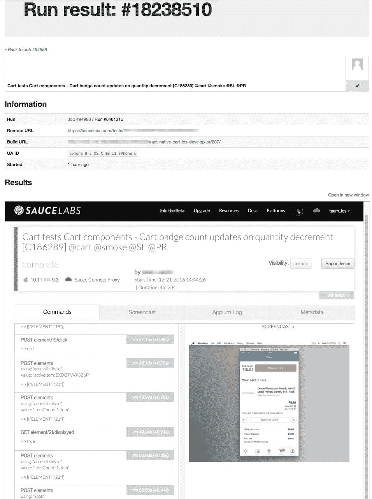

# iOS 测试自动化@WalmartLabs

> 原文：<https://medium.com/walmartglobaltech/ios-test-automation-walmartlabs-d8668d85a27?source=collection_archive---------3----------------------->

在文章中， [*成功大规模自动化测试的要素*](/walmartlabs/elements-of-successful-massive-scale-automated-testing-f071c17f2907#.y4qn9hf9q) ，UI 自动化测试在总体上已经被概括为 ***只是普通的*** ，而对于移动来说更是如此*。*

*然而，这篇文章也展示了 WalmartLabs 的测试自动化过程策略:**大规模并行**、**早期测试**和**确定性行为。**在本文中，我们将进一步了解沃尔玛 iOS 测试自动化如何努力实现这三个基本功能，并作为一个**快速反馈系统**提供给开发人员。*

## *大局*

*沃尔玛的 iOS 应用程序被模块化为不同的组件:搜索和浏览、购物车、药房、商店等。，由不同的团队开发，采用不同的技术堆栈。这里我们将以 [**React Native**](/walmartlabs/react-native-at-walmartlabs-cdd140589560#.q1yzcqyoh) 中编写的 Cart 组件为例。*

*我们在 WalmartLabs 内提供的 iOS 自动化测试解决方案基于 [**Appium**](http://appium.io) 及其 Javascript 客户端。测试用例用 Node.js 编写，用 [Mocha](http://mochajs.org) 运行。我们选择 Javascript 绑定解决方案不仅是因为 Cart 组件中的 React 本地技术堆栈选择，而且我们还希望与 Node.js 中的 Web 前端自动化测试解决方案保持一致，并利用由 [TestArmada](http://testarmada.io/) 提供的工具链，我们将在下面看到。*

*对于测试执行，我们使用基于云的平台，这样我们就可以免除所有虚拟机和不同版本的 iOS 模拟器的维护。*

## *从慢到平行*

*乍一看，串行运行移动自动化测试与并行运行相比如何？*

**

*让我们仔细看看 React Native Cart 团队的当前 CI 作业构建日志示例:*

**

*CI Job build log*

*此 CI 构建中有 6 个步骤由拉请求触发:*

1.  *npm 软件包安装*
2.  *代码林挺*
3.  *单元测试*
4.  *创建 React 本机包*
5.  *将其复制到应用程序中*

*最后一步是在 Sauce Labs 的虚拟机 中远程并行执行 ***所有 84 个 UI 自动化测试，包括:****

*   *压缩应用程序包，并将其上传到远程云*
*   *等待云中的虚拟机启动，并启动指定 iOS 版本的模拟器*
*   *将上传的包安装到模拟器*
*   *在 3 次自动失败重试的同时开始测试执行*

*需要多长时间？在**麦哲伦**的帮助下，按照 **10 分钟**的顺序:*

**

*Test result analytics dashboard*

*Magellan 旋转 84 个并行的工人(进程)，这使得所有的测试用例同时运行。随着开发人员继续添加更多的测试覆盖，我们密切监控测试结果分析仪表板(这是与 Magellan 集成的另一个 TestArmarda 工具，名为 [**Bloop**](https://github.com/TestArmada/bloop) ),并及时调整 Magellan 并行工作人员数量和 CI 结构。*

## *从古怪到确定的行为*

*这可能是移动世界中最棘手的部分。尤其是对于与如此多不同种类的后端服务交互的应用程序。精心设计的确定性测试场景是不够的。自动重试也不理想或不够。服务剥落仍然像一个幽灵，它将继续困扰测试，除非你用**嘲弄**来消除它们。*

*我们使用 **Shifu** ，一个 WalmartLabs 自己开发的模仿解决方案来实现这一点。简单地说，它用预先记录的虚拟数据启动一个模拟服务器来代替真正的服务。棘手的部分在于两个部分:*

*   *请记住，我们使用麦哲伦并行执行所有测试。对于不同的测试用例，如何并行地将不同的响应路由到同一个后端服务 URL？例如，测试 A 需要购物车中有 6 种不同的商品，而测试 B 需要空购物车。他们同时点击 get cart 后端服务，但显然他们需要接收不同的模拟响应来填充购物车。目前，我们在不同的端口为每个测试启动一个 Shifu 模拟服务器。幸运的是 Magellan 有这样一个[网络端口管理特性](https://github.com/TestArmada/magellan#features)来帮助轻松地为每个并行进程分配 mock 端口。*
*   *如何告诉移动应用程序使用分配的端口而不是真实的服务来访问模拟服务器？在 simulator 中启动应用程序时，我们可以传入进程参数。例如:`-mockingUrl=localhost:13000`，它从 [NSUserDefaults 类](https://developer.apple.com/reference/foundation/userdefaults)保存到一个对象中，在这里我们告诉应用程序使用这个值，而不是真正的服务来调用特定的后端服务。*

> **我们将深入探讨*系列*在沃尔玛实验室使用的嘲笑技巧。敬请关注。**

## ***从混沌到早期测试***

**

*CI build sample screenshot*

*React Native Cart 团队已经对每一个拉请求进行了 UI 自动化测试，这为开发人员提供了非常早期的反馈以及**信心**。另外，所有的测试都是由开发人员自己编写的，他们对测试覆盖范围有完全的控制权，并且能够非常迅速地对测试失败做出反应。*

## *测试结果反馈*

*为了向开发人员展示测试结果，我们使用了 TestArmada 提供的另一个开源工具[**Admiral**](https://github.com/TestArmada/admiral)dashboard。*

*下面的屏幕截图是 React 本机购物车项目的概述页面。它显示了每个 PR 验证的测试结果的大图:*

**

*PR test result overview page*

*如果您点击概览页面中的任何 PR 链接，您将会找到这个 PR 验证的所有测试案例结果:*

**

*Test result details page*

*此外，如果您单击任何一个测试结果，您将看到该测试运行的详细信息，包括 CI 环境信息。由于 Admiral 能够嵌入 Sauce Labs 测试结果链接，因此可以看到 Appium 命令和日志等信息，甚至可以看到单个 UI 测试的截屏回放:*

**

*Single test result page*

*正如我们所看到的，Admiral 仪表板为每个需要不同级别测试结果信息的人提供了一个多功能的地方。对于任何测试失败，所有的调试信息都包括在内。大多数人直接去看回放，看看测试实际是怎么失败的。*

## *摘要*

*在 WalmartLabs，iOS 自动化 UI 测试:*

*   *使用 **Magellan** 和基于云的解决方案实现大规模并行。*
*   *使用**师傅**嘲讽实现确定性行为。*
*   *它被提升为**拉请求拦截器**，以提供早期测试结果反馈。*
*   *测试结果和所有相关信息显示在**上将**仪表板上。*
*   *可以从分析仪表板 **Bloop** 中分析测试用例执行统计数据，以进一步提高效率。*

## *下一步是什么*

*对于 React Native 团队来说，不应该有任何阻碍来采用相同的 Appium 测试来测试 Android UI。我们正在研究在 Sauce Labs 模拟器中远程并行运行 Android 自动化测试和 iOS 测试。*

*我们相信，通过改进的 UI 元素定位器策略，仍然有从每次测试运行中挤出时间的空间。*

*我们希望鼓励其他移动应用租户也采用同样的方法。*

*我们正在将同样的策略应用到即将到来的真实设备群测试中。*