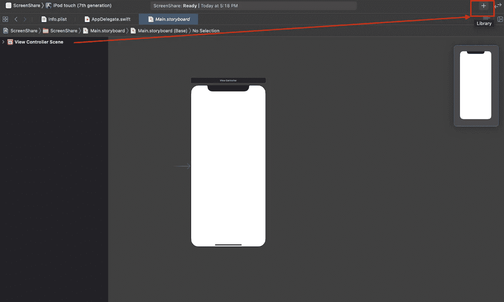
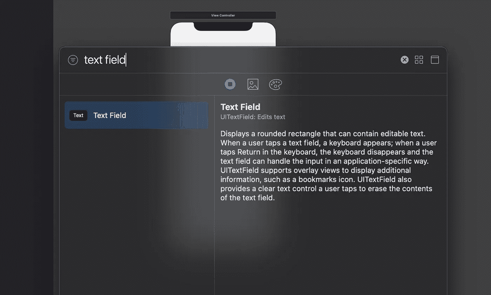
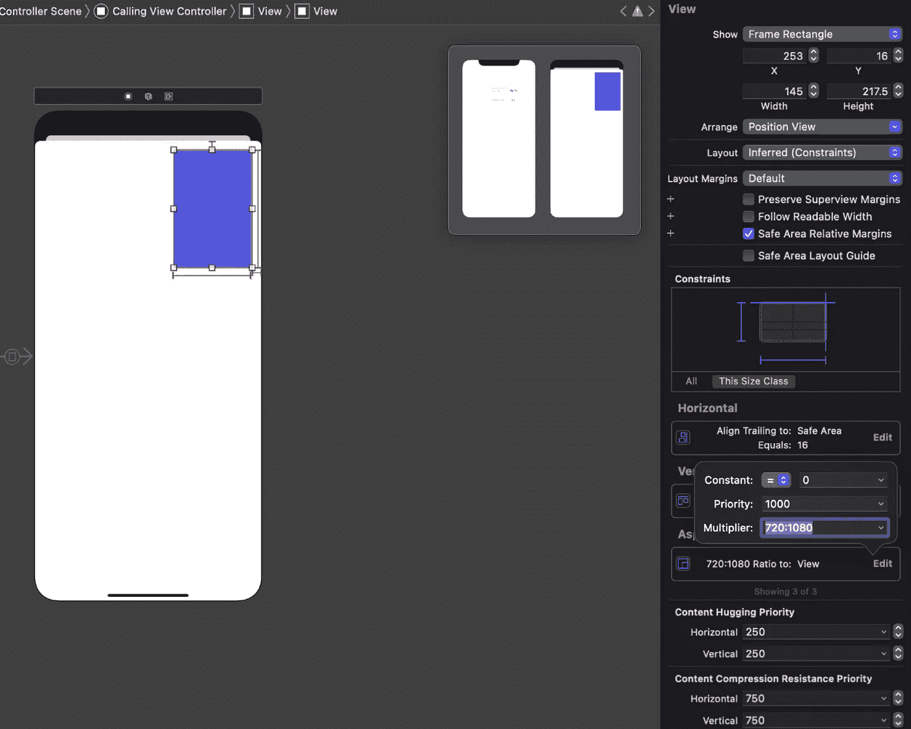

# 如何建立一个屏幕共享的 iOS 视频聊天应用程序

> 原文：<https://medium.com/quick-code/ios-video-chat-and-screen-sharing-15e5bd27619e?source=collection_archive---------0----------------------->

© Sendbird 2021

由迦娜·麦克劳克林
解决方案工程师| [Sendbird](https://www.sendbird.com/)

*如果你正在寻找关于 Swift、Kotlin、React 等的教程，请查看我们的* [*开发者门户*](https://sendbird.com/developer/tutorials) ***。***

*对于本教程，一个 iOS Sendbird 调用示例应用程序的* [*代码*](https://github.com/sendbird/sendbird-calls-ios) *可能会对你有所帮助。也可以查看一个 iOS 分屏 app 的样本* [*代码*](https://github.com/sendbird/examples-calls-ios/tree/main/ScreenShare) *。不要忘记咨询我们的* [*文档*](https://sendbird.com/docs/calls/v1/ios/quickstart/make-first-call) *以获得更多指导，并查看我们的* [*调用*](https://sendbird.com/features/voice-and-video) *页面以了解更多信息。*

*本教程中的截图来自 XCode 和 Sendbird 仪表盘。*

# 介绍

本教程将帮助您实现 Sendbird 调用的屏幕共享。我们将使用 XCode 中的故事板在 Swift 中构建一个 iOS 应用程序。

请注意以下先决条件:

1.  您已经在 [**Sendbird 仪表板**](https://dashboard.sendbird.com/) 上创建了一个 Sendbird 应用程序和两个用户
2.  您已经准备好您的应用程序 ID 和用户 ID，可以使用了

关于如何设置这些的更多细节，请查看这个 Sendbird 调用 [**视频教程**](https://youtu.be/R4jtLS9paS0) 。

我们开始吧！

# 第一步。创建新的 Xcode 应用程序，配置和导入 Sendbird 调用

1.在 Xcode 中创建新应用程序:

将你的应用命名为 ScreenShare，将界面设置为**故事板**，选择 **Swift** 作为语言:

Xcode 会自动用我们将在本教程中编辑的`AppDelegate.swift`、`ViewController.swift`、**、**和`Main.storyboard`文件创建您的应用程序。

2.在 GitHub 上`Readme.md` [**文件**](https://github.com/sendbird/sendbird-calls-ios) 中，按照**入门**和**为 Sendbird 上的 SDK** 部分配置应用程序调用 iOS SDK。这将引导您完成该应用程序启用麦克风和摄像头所需的所有 SDK 安装和`Info.plist` 文件配置。对于本教程，您可以跳过添加任何后台模式操作。

在安装和 SDK 配置之后，确保关闭任何当前的 Xcode 会话，并从现在开始为这个项目使用`ScreenShare.xcworkspace`文件。这将使以后构建和运行应用程序成为可能。

3.是时候更新代码了。在`AppDelegate.swift`文件中，导入 Sendbird 调用并更新`didFinishLaunchingWithOptions`方法。为此，请添加您的 Sendbird 应用程序 ID，并为您的应用程序配置 Sendbird 调用。

Xcode 可能会显示一个警告`Argument type ‘AppDelegate’ does not conform to expected type ‘SendBirdCallDelegate’`，后面跟着一个修复选项。选择 Fix 自动将 SendBirdCallDelegate 协议添加到实现`didStartRinging(_ call: DirectCall)`函数的 AppDelegate 中。注释掉占位符文本“code ”,因为我们稍后将实现该函数。

# 第二步。鉴定

在`Main.storyboard`中，添加一个用于输入用户 id 的文本字段和一个登录按钮。

1.当您选择`Main.storyboard`文件时，您应该默认看到`View Controller Scene`。选择右上角的 **+** 图标，搜索`Text Field`。将其拖动到视图的上半部分。

打开检查器进行编辑。

显示属性检查器并编辑`Placeholder`为`User ID`。

再次选择右上角的 **+** 图标，搜索`Button`。将按钮拖到文本字段旁边的视图上。双击该按钮编辑文本以显示“登录”。

2.接下来，我们将编辑`ViewController.swift`类，以便当用户 ID 被输入到文本字段并点击登录按钮时，用户通过 Sendbird 调用得到验证。

查看`Main.storyboard`文件时，在右边打开一个编辑器(点击带有竖线|和加号+的方形图标)。第二个`Main.storyboard`将打开。在顶部，选择`Main.storyboard`选项，并选择`ViewController.swift`来改变文件。

接下来，我们将为连接到视图的文本字段和按钮添加变量。
`@IBOutlet weak var userIdTextField: UITextField!
@IBOutlet weak var authenticateButton: UIButton!`

在左边的`Main.storyboard`中，按住 control 键并单击文本字段，将鼠标拖动到`ViewController.swift`类上，以插入`IBOutlet`变量。将文本字段命名为`userIdTextField` ，并单击 Connect。

对签到按钮重复上述步骤，命名为`authenticateButton`。您现在应该在代码中看到两个`IBOutlet`变量。

在`ViewController.swift`中，为 Sendbird 调用添加一个导入，覆盖`viewDidLoad()`方法，并在用户登录按钮被选中时为该按钮调用一个新的`authenticate()`方法。您也可以选择添加一个`deauthenticate()` 方法供用户注销。

3.现在，您应该能够以 Sendbird 呼叫用户的身份运行应用程序并连接(单击顶部的播放按钮运行)。您应该会看到以下屏幕:

输入您的用户 ID，然后选择“登录”按钮，通过 Sendbird Calls 对您的应用进行身份验证。

# 第三步。到

在屏幕共享之前，您需要有一个连接的呼叫。为此，我们需要输入被调用方的用户 ID，拨打被调用方，并创建一个新的`CallingViewController.swift`类来显示调用 UI。我们还需要设置视频视图和处理呼叫动作。

1.在`Main.storyboard`中，添加一个新的文本字段来指定被叫方的用户 ID，并在用户 ID 文本字段下添加一个拨号按钮。使用我们之前创建的登录按钮。

2.查看`Main.storyboard`文件时，打开右边的编辑器，导航到`ViewController.swift`。像本教程前面一样，按住 control 键并单击被调用方文本字段，然后将其拖到`ViewController.swift`以创建`IBOutlet`变量。将文本字段命名为`calleeIdTextField`。

按住 Control 键并单击拨号按钮，然后将其拖至`ViewController.swift`。这一次，将连接类型更改为`Action`(而不是之前的 Outlet)并将其命名为`didTapDialButton`以创建一个新函数。

您应该会在代码中看到新的文本字段和函数:

3.接下来，让我们创建新的`CallingViewController` UI。在`Main.storyboard`中，点击右上角的 **+** 图标，搜索`View Controller`。在场景中选择新的视图控制器，在右边的检查器中选择“显示身份检查器”图标。给类命名`CallingViewController`。

按住 Ctrl 键并单击左栏中的`View Controller`，将鼠标拖动到`Calling View Controller`上。在 Manuel Segue 下，选择“呈现模式”选项。

点击新片段，然后点击右边检查器中的“显示属性检查器”图标。将标识符设置为`dial`。那种应该说`Present Modally`。

4.创建`CallingViewController.swift`类并扩展`UIViewController`类。您可以右键单击左侧的项目文件夹，然后选择“新建文件…”来创建这个新的 Swift 文件。导入Sendbird 调用，并添加一个`recentCallId`空字符串变量，以便稍后跟踪调用。现在添加一个类型为`DirectCall`的`call`变量，并覆盖`viewDidLoad()` 方法。

5.接下来，给`CallingViewController`添加一个扩展。这实现了`DirectCallDelegate`、`didConnect(_ call: DirectCall)`和`didEnd(_ call: DirectCall)`方法。在`didConnect` 方法中，添加设置`recentCallId = call.callId`。在`didEnd`方法中，添加一个对`self.dismiss(animated: true) { }`的调用。

使用此代码作为`CallingViewController.swift`的参考:

6.打开`ViewController.swift`。我们将添加`prepare(for segue: UIStoryboardSegue, sender: Any?)`方法。我们还将更新`didTapDialButton(_ sender: Any)`方法，这样当在`View Controller`**中点击拨号按钮时，用户界面将转换到`Calling View Controller`。我们还将添加代码来拨打电话，并将呼叫对象从`View Controller`传递到`Calling View Controller`。**

**您的代码现在应该如下所示:**

**7.现在，您可以再次运行该应用程序。这一次，以不同的用户身份登录。在被叫方 ID 文本字段中输入第一个用户的用户 ID，然后选择拨号按钮。这将打开新的`Calling View Controller`并给该用户打电话。**

****

**ViewController**

****

**CallingViewController**

**8.最后，让我们更新我们的`Calling View Controller` UI，以支持视频和结束通话。在`Main.storyboard`中，点击+图标搜索`uiview`找到`View`对象。**

****

**将`View`拖放到右上角的`Calling View Controller` 上。将视图重命名为`Local Video View`。**

**在右边的属性检查器中，您可以调整`Background` 颜色，以便在编辑时更容易地查看视图。**

****

**在尺寸检查器中调整视图的位置和大小: **X=253，Y=16，宽度=145，高度=217.5** 。您的视图现在应该如下所示:**

****

**选择 Xcode 底部的“添加新约束”图标。设置约束 **Top=16** 和 **Trailing=16** 。选择`Aspect Ratio`。**

****

**这些新的约束应该出现在右边的大小检查器中。调整**纵横比乘数=720:1080****

****

**最后，在`Local Video View`中按住 control 键并点击鼠标，将线条拖到`Calling View Controller Safe Area`上。选择“等宽”约束。**

********

**再次点击 **+** ，在`Calling View Controller`底部增加一个`Button`，并将其重命名为“结束通话”。**

**9.添加代码，以便 Sendbird Calls 了解本地和远程视频视图。从`Main.storyboard`开始，再次向右添加编辑器并打开`CallingViewController.swift`。**

**按住 Control 键并单击`Local Video View`，将该行拖动到`CallingViewController`类中。制造出名为`localVideoView`的`IBOutlet`。按住 Control 键并点击`End Call Button`，创建名为`didTapEndCallButton`的`IBAction`。在新方法中添加`call.end()`。**

****

**最后，将代码添加到`viewDidLoad()`方法中，以创建和更新本地`SendBirdVideoView`和远程`SendBirdVideoView`。将这些视图嵌入到我们的 UI 视图中。设置`call.delegate = self` 和`call.startVideo()`。参见下面的源代码:**

# **第四步。使用 Sendbird 仪表板测试呼叫**

**要测试通话，请在查看 Sendbird 应用程序时使用 Sendbird 仪表盘。从你的通话工作室，你有机会打开你的电话亭，并呼吁主持人用户。phonebooth 用户的用户 ID 通常是一个数字。以我为例，我的 phonebooth 用户 ID 是 679697。**

****

**导航到 send bird Dashboard with Calls Studio 并打开 Phonebooth。**

**现在，通过在被呼叫者 ID 字段中输入电话亭用户 ID，从应用程序呼叫您的仪表板用户。你收到来电仪表板上的电话了吗？如果是，您就成功拨打了一个电话！从仪表板上，您可以接受或拒绝呼叫。**

# **第五步。接收来自认证用户的呼叫**

**如果您想使用客户端应用程序而不是 Sendbird 仪表板来测试这一点，那么您需要实现接收呼叫的功能。**

**为了快速将此功能添加到您的应用程序中，并在被呼叫者在`View Controller` 屏幕上打开应用程序时接收呼叫，我们将把`didStartRinging(_ call: DirectCall)`方法添加到`AppDelegate`类或新的 AppDelegate 扩展中。`AppDelegate`将为此方法实现`SendBirdCallDelegate`协议。该方法将检索呼叫信息，设置呼叫者 ID，并在警报中共享呼叫者。被呼叫者可以选择接受或拒绝呼叫。作为助手功能，我们将添加一个新的`UIViewController.swift` 类扩展来确定和呈现一个顶视图控制器。**

**请在此处查看代码:**

***注意:大多数通话可能发生在用户没有打开应用程序的时候。要在应用程序关闭的情况下实现解决方案，请查看结论中提到的教程。***

# **第六步。开始和停止屏幕共享**

**一旦您有正在进行的通话，您就可以开始共享您的屏幕。为此，让我们实现一个显示`Start share`按钮的新函数。**

**可选:我们可以显示名为`Sendbird on the Web`的第二个按钮，通过将它连接到`WebViewController`来在屏幕共享时显示网站。**

****

**让我们实现按钮功能。**

1.  **像之前创建`End Call`按钮一样，打开`Main.storyboard`，选择右上角的 **+** ，在`Calling View Controller`中创建一个按钮。将其重命名为“开始共享”。**
2.  **可选:创建另一个`Button`并将其重命名为`Sendbird on the Web`。创建一个名为`WebViewController`的新`View Controller`。创建一个新的`WebViewController.swift`类，并添加以下代码:**

1.  **在`Main.storyboard`中，选择`Web View Controller` ，在右边的检查器中显示身份检查器。将类别设置为`WebViewController`并选择“从目标继承模块”复选框。**
2.  **按住 Control 键并点击`Sendbird on the Web`按钮，将线拖动到新的`Web View Controller`上。创建一个设置为“显示详细信息”的操作序列。点击此按钮时，将出现一个新的网络浏览器窗口，并共享 Sendbird online 的一些图像。**
3.  **当在`Main.storyboard`中时，在右边添加一个编辑器来打开`CallingViewController.swift`文件。按住 Control 键并点击`Start Share` 按钮，新建一个`IBAction`名为`didTapScreenShareButton`。我们将很快填写这个新方法。
    可选:按住 Control 键并点击你的`Sendbird on the Web`按钮，创建一个名为`didTapWebButton`的`IBAction`。**
4.  **再次按住 Control 键并单击`Start Share` 按钮，创建一个名为`screenShareButton`的新 IBOutlet。在代码中添加`import ReplayKit` 和`let rpScreenRecorder = RPScreenRecorder.shared()`。这是屏幕共享所必需的。**
5.  **在新的`didTapScreenShareButton(_ sender: Any)`方法中，我们将调用`self.call.startScreenShare` 来开始屏幕共享。**
6.  **用同样的方法`didTapScreenShareButton(_ sender: Any)`，我们也将调用`self.rpScreenRecorder.stopCapture`，它调用`self.call.stopScreenShare`来结束我们的屏幕共享。
    参见下面的代码:**

**现在，运行应用程序。拨打电话给其他用户。当该用户接受时，点击`Start Share`按钮进行屏幕共享。该应用程序将提示您允许屏幕捕捉。选择“录制屏幕”按钮开始。**

****

**成功共享屏幕后，您将能够共享当前屏幕上的内容。在本教程中，被呼叫者看到我的屏幕上有我的脸和按钮。**

****

**如果你实现了可选的`Sendbird on the Web` 按钮，你可以在通话中在你的屏幕上显示一个网页。点击那个按钮打开页面。向下滑动以关闭页面。选择`Stop Share`按钮退出。**

****

**上图描绘了被呼叫者在网页屏幕共享的 Sendbird 仪表板上的视图。**

# **结论**

**恭喜你，你成功了！今天，您有:**

*   **创建了一个新的 Xcode 应用程序，配置并导入了 Sendbird 调用**
*   **收到一个经过验证的用户的呼叫**
*   **与被呼叫者共享了您的屏幕**

**接下来，如果你想在应用程序关闭时收到电话，你需要实现 iOS CallKit。我们建议对 Sendbird 呼叫使用 VoIP 通知。教程 [**如何用 iOS CallKit 和 Sendbird Calls**](https://sendbird.com/developer/tutorials/make-local-calls-with-callkit-and-sendbird-calls) 制作视频通话 app 将帮助你实现这一点。有关如何接听电话的更多信息，您可以查看 Sendbird d [**ocs**](https://sendbird.com/docs/calls/v1/ios/guides/direct-call#2-receive-a-call) 。**

**感谢您阅读本教程和快乐的屏幕分享！✌**

# **资源和有用的链接**

1.  **[Sendbird 仪表盘](https://dashboard.sendbird.com/)**
2.  **[iOS 中 Sendbird 调用的 GitHub repo](https://github.com/sendbird/sendbird-calls-ios)**
3.  **[用于 iOS 中屏幕共享的 GitHub repo](https://github.com/sendbird/examples-calls-ios/tree/main/ScreenShare)**
4.  **仙鸟通话[视频教程](https://youtu.be/R4jtLS9paS0)**
5.  **Sendbird [文档](https://sendbird.com/docs/calls/v1/ios/quickstart/make-first-call)**
6.  **[教程](https://sendbird.com/developer/tutorials/make-local-calls-with-callkit-and-sendbird-calls)关于如何用 iOS CallKit 和 [Sendbird Calls](https://sendbird.com/features/voice-and-video) 制作视频通话 app**