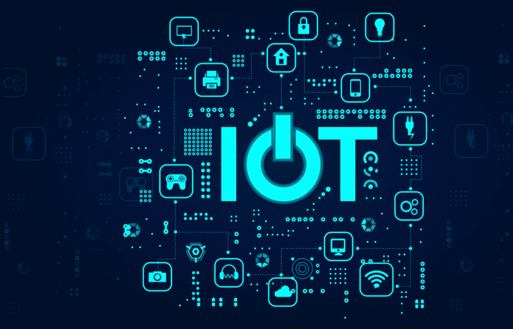
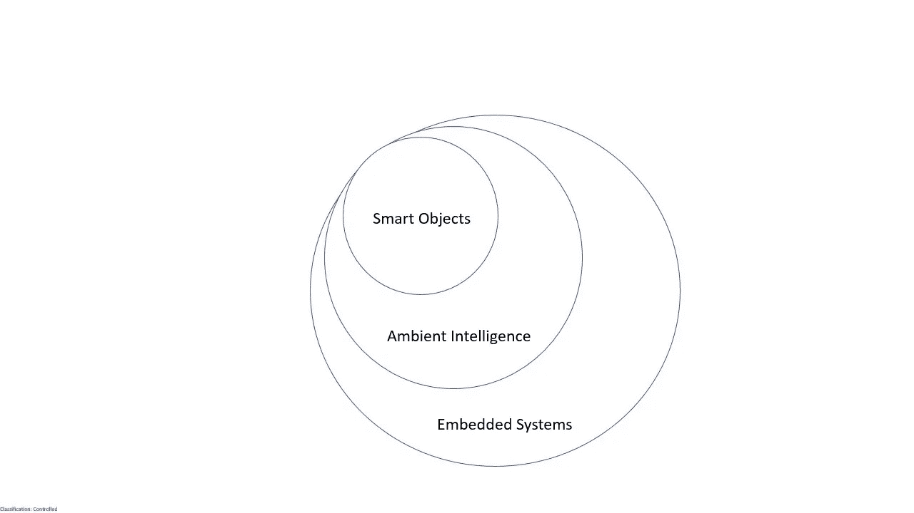
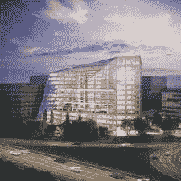
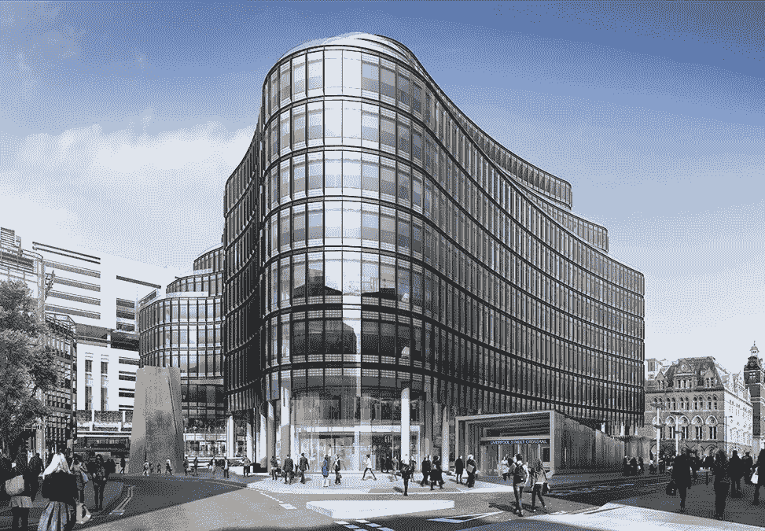

# 物联网和智能事物

> 原文：<https://medium.com/version-1/iot-and-smart-things-3195dd10cd9d?source=collection_archive---------7----------------------->

# 物联网

广义而言，术语*物联网* (IoT)是指通过部署具有嵌入式识别、传感和/或驱动功能的分布式设备，将互联网扩展到物理领域。物联网通过信息和通信技术(ICT)将数字和物理实体联系起来，以实现全新类别的应用和服务。

# 智能对象

作为物联网的一部分，智能物体，或简称为*的东西*(带有一个大写的 T)，构成了普适计算环境。将电子设备嵌入日常物理物体使它们变得智能，并让它们无缝集成到最终的网络物理基础设施中。事物是实体:-

*   具有带有一组特征(尺寸、形状等)物理实施例。).
*   具有一组最少的通信功能，例如能够被发现、接受传入的消息并回复它们。
*   拥有唯一的标识符。
*   与至少一个人类可读名称和一个机器可读地址相关联，以实现 M2M 通信。
*   至少具备基本的计算能力。
*   拥有感知物理现象的传感器和/或触发对现实有物理影响的动作的致动器。

将计算系统嵌入到环境中给了我们无处不在的计算。富含传感、计算和驱动能力的环境被称为*环境智能* (AmI)。

智能对象与 AmI 有许多共同的特征。

AmI 应用程序主要是为封闭环境开发的，在封闭环境中支持特定的功能——在设计时就知道了。

智能对象扩展了 AmI 概念，以集成开放场景，其中新功能需要在运行时适应，而不必在设计时考虑。

这要求智能对象解决方案本质上是自主的，以提供这种更大的灵活性，即提供所需的自配置和自组织能力。

智能对象可以被认为是嵌入式系统的一个特殊子集。

Smart Objects as a mathematical subset of Embedded Systems.

# 研究挑战

为了使物联网成为设计精良、商业上可行的主流技术，需要解决以下研究挑战

*   **计算、通信和识别技术**从能源消耗的优化、占空比协议和能量采集的开发，到微电子和纳米电子技术的发展，以及用于识别的近场通信技术。
*   **分布式系统技术**涉及使智能对象能够构建自组织网络，创建分布式平台。分布式系统的体系结构和协议的设计，如路由协议、流量控制鲁棒性、容错、同步和领导者选举问题。独特的对象寻址问题——与 DNS 类似——需要全球标准化努力。
*   **分布式智能**的特点是数据量巨大，物联网及其智能对象必须解释和推理所有这些数据。数据挖掘和人工智能的进步将需要解决这些自治实体，或*代理*如何与他们的环境互动，并协调他们自己以追求给定的目标。
*   **安全性**这些考虑因素与其他研究领域正交，包括通信/网络、平台/数据管理和应用/服务级别。特定于安全性的研究挑战可以细分为以下几个问题
*   **数据保密性**保证只有授权实体——人类用户和其他对象——才能访问和修改数据。这需要定义合适的*身份访问管理* (IAM)和*身份管理* (IdM)机制，能够实时和大规模地执行。
*   **隐私**用于数据交换的无线通信通道将在物联网中扮演重要角色。由于此类渠道的远程访问能力和固有的 MitM(中间人)攻击风险，如窃听和伪装/欺骗，这可能会带来新的隐私侵犯风险。开发解决方案和隐私政策，平衡匿名需求和定位/跟踪需求。
*   **信任**依赖于 P2P(对等)交互，相互信任协商是凭证交换的过程，该过程允许从另一个实体请求服务或资源的实体获得它，传统上通过其他第三方实体的认证来实现，例如认证机构。这与上面提到的 IdM 和我有关。然而，传统信任协商方法的高计算开销并不适合物联网领域。任何有效的信任模型都应该考虑物联网对象的高度分布式、动态性以及物联网应用的响应时间要求。需要从传统的集中式静态模型转移到假设系统实体之间没有先验定义的信任关系的模型。

# 智能城市

*智慧城市*是物联网应用的一个例子。表示在城市范围内部署高级通信基础设施和新型服务的信息物理系统(CPS)。

随着越来越多的人预计将迁入城市，通过使用监控和优化来提高现有物理基础设施的效率成为物联网部署的可能。作为修建更多道路的替代方案，更好地利用现有道路网成为可能。这保证了所有公民更好的生活质量，更好地使用和集中公共资金。

通过智能城市物联网部署，我们可以收集和使用一直存在的数据。

空气质量监测(AQM)站和交通流量数据使我们能够实时了解网络中哪些道路目前超额使用，哪些道路使用不足，并使用互联智能标牌指导道路用户使用备用路线来缓解拥堵。

# 智能建筑

智能城市也可以成为智能建筑的家园。

*The Edge* 是位于荷兰阿姆斯特丹 Zuidas 商业区的一座 40000 平方米的办公楼。该项目是为全球金融公司和主要租户德勤(Deloitte)设计的，是德勤向数字时代转型的催化剂。一座办公楼获得了世界最高的 BREEAM*评级，可持续技术为其提供了全新的工作环境。

【*】*建筑研究所环境评估方法*是世界上历史最悠久的评估、评级和认证建筑可持续性的方法。

The Edge, Amsterdam

*The Edge* 整合了众多智能技术来创建适应性强的智能工作空间，将德勤在全市多个地点的员工整合到一个环境中。

占用、移动、照明水平、湿度和温度被连续测量，并且使用智能技术，包括与飞利浦共同开发的以太网供电的 LED 连接照明，建筑系统响应以最大化效率。

该建筑的照明系统集成了 30，000 个传感器，允许它自动调整能源使用。以太网照明(LoE) LED 系统由以太网供电，基于 IP。这使得系统可以由计算机控制，从而可以在不打开吊顶的情况下快速、方便地实施变更。每盏灯都配备了飞利浦的*编码灯*系统，允许通过智能手机进行高精度定位，精度低至 20 厘米，比 WiFi 或信标系统精确得多。与传统照明相比，这可以减少约 50%的能源需求，并且可以监控日常建筑使用。这些数据通过建筑管理系统(BMS)提供给设施经理，允许:-

*   **远程洞察**大楼里有没有人。供暖、制冷、新鲜空气和照明完全物联网集成，BMS 根据入住情况按每 200 平方英尺进行控制。零占用率意味着几乎没有能源消耗。
*   **根据实时历史数据以及交通和天气信息预测午餐时间的占用率**，以避免食物浪费。
*   **未使用的房间**将从清洁计划中跳过。
*   **管理人员提醒**灯需要更换，打印机需要纸张。

每个员工都通过智能手机上的应用程序与大楼相连。使用该应用程序，他们可以找到停车位，找到免费办公桌或其他同事，向设施团队报告问题，甚至在大楼内导航。员工可以通过手机应用程序定制他们选择在大楼内工作的任何地方的温度和亮度。该应用程序会记住他们喜欢喝什么样的咖啡，并跟踪他们的能源使用情况，这样他们就知道了。The Edge 的真正成果不仅仅是减少了用户的水和能源使用，还体现了该项目作为新技术、新设计方式和新工作方式的一个可行的高质量范例的作用。

# 净零建筑

英国土地上的第一座零净建筑，也是融合数字和物理场所营造来创造杰出场所的领先范例， *100 Liverpool Street* 是英国第一座拥有融合网络和集成子系统的大型办公楼，用于*物联网*就绪基础设施。

100 Liverpool Street, Broadgate, London

将丰富的数据交付到一个仪表板中，有助于深入、实时地了解建筑物内发生的情况，从而优化运营性能。

利物浦街 100 号*内的每一个系统都被指定为能够以通用语言协议发送和接收数据——从灯泡、电表和空气质量传感器，到冷却器、锅炉和电梯。这种一致的命名和数据方法允许通过安全网关从传统系统前端和基于云的软件发送和接收数据和命令。*

该建筑包含 90，000 平方英尺的零售和餐饮空间，以及 20，000 平方英尺的五层室外露台。
它的建造通过保留一半的原始结构(保留现有的结构框架、地下室和地基)，使用高效设计和低碳材料，节省了 11，000 吨嵌入碳。

# 雄心勃勃的未来目标

随着该行业旨在实现雄心勃勃的净零目标，智能产品将发挥重要作用。它有能力改变建筑的使用和运作方式。

拥有更多关于建筑物的粒度数据有助于构建和使用数据集来优化性能和体验。

**关于作者:** 莎伦·米切尔是 AWS DevOps 第 1 版的工程师。