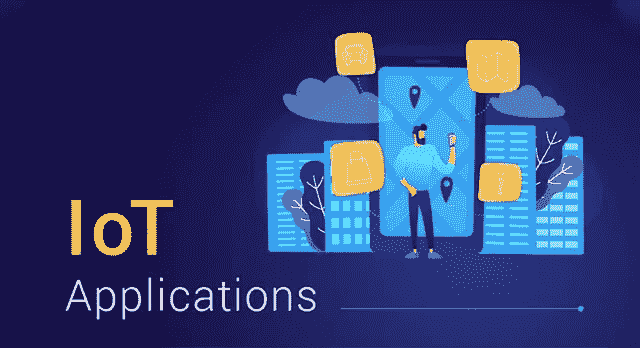
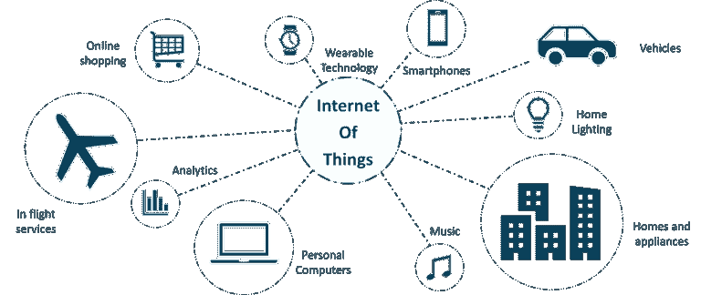
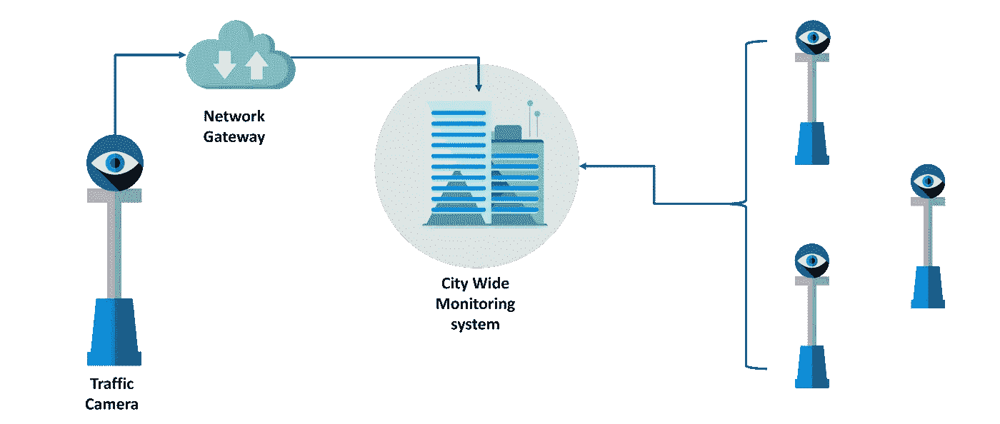
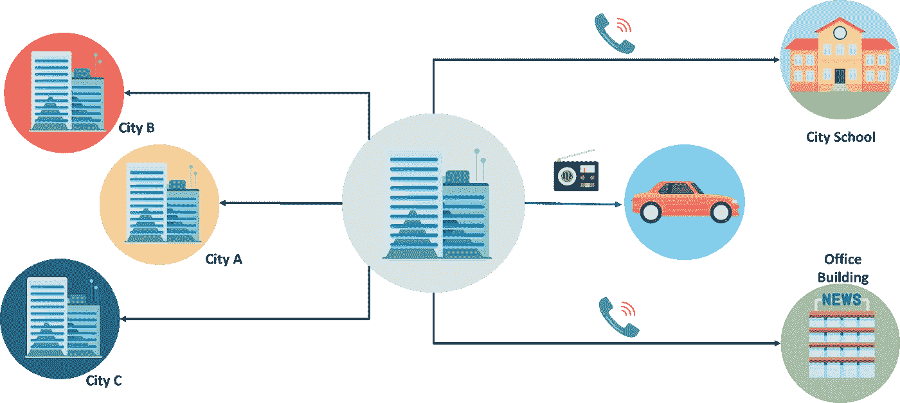
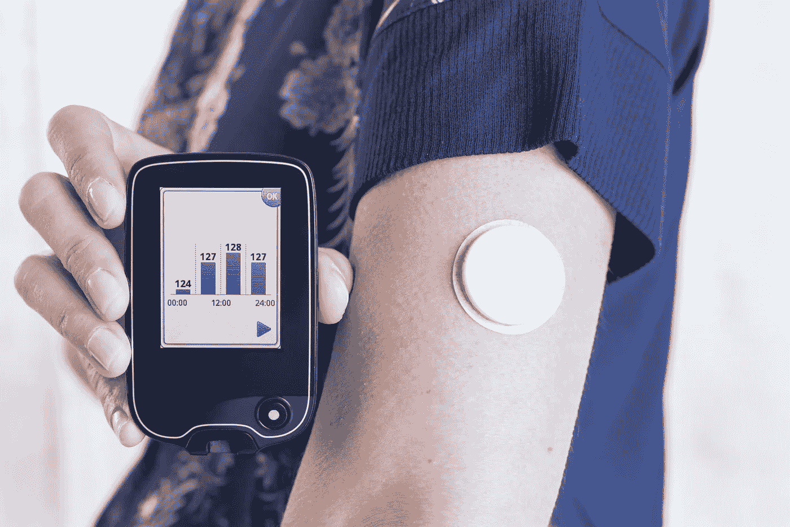
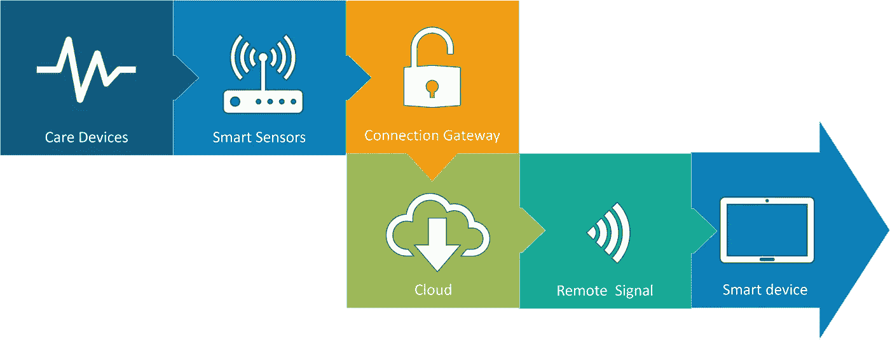
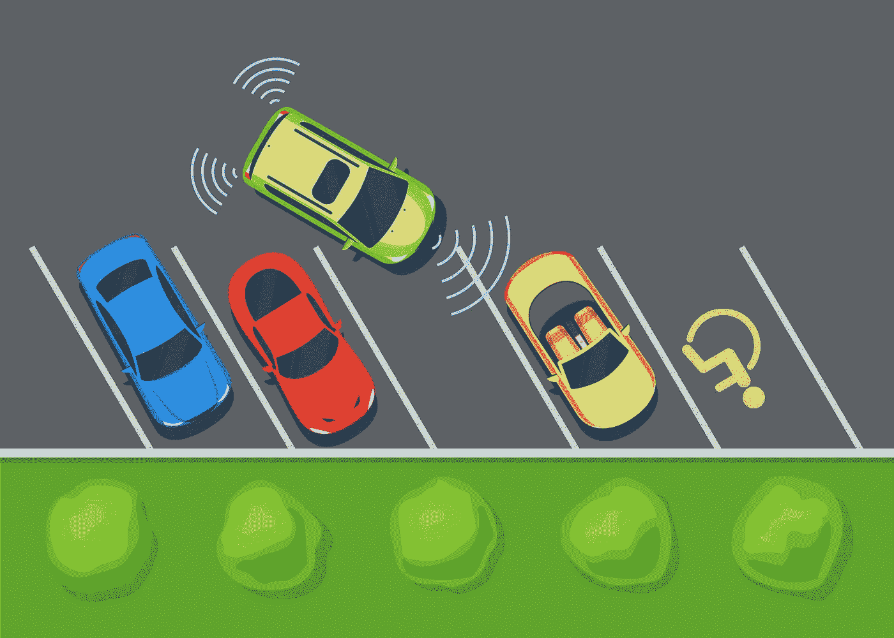
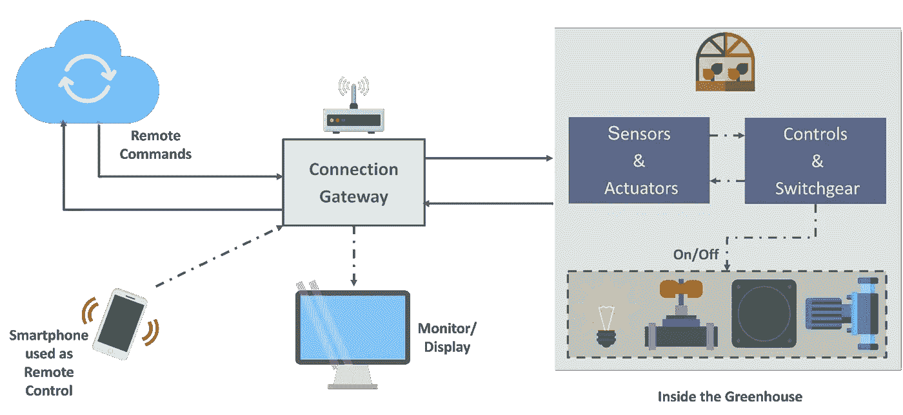
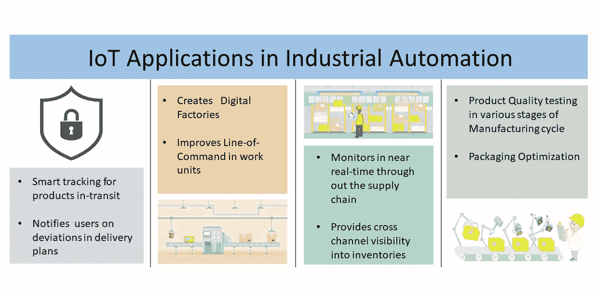

# 不同领域的真实物联网应用

> 原文：<https://medium.com/edureka/iot-applications-c62cd48b7363?source=collection_archive---------0----------------------->

IoT Applications — Edureka

物联网应用有望给我们的生活带来巨大价值。凭借更新的无线网络、卓越的传感器和革命性的计算能力，物联网可能成为争夺钱包份额的下一个前沿阵地。

不这么认为？好吧，我有个想法。

想象一个智能设备，比如交通摄像头。该摄像机可以监控街道的交通拥堵、事故、天气状况，并将这些数据传输到一个公共网关。该网关还接收来自其他此类摄像机的数据，并将信息进一步转发到全市交通监控系统。

现在，举个例子，市政公司决定修复某条道路。这可能会导致通往国道的路上交通拥堵。该洞察被发送到全市交通监控系统。

现在，考虑到这是一个智能交通系统，它可以利用机器学习快速学习和预测交通模式。因此，智能系统可以分析情况，预测其影响，并通过各自的智能系统将信息传递给连接到同一高速公路的其他城市。

交通管理系统可以分析获取的数据，并得出项目周围的路线，以避免瓶颈。该系统还可以通过智能设备和无线电频道向司机传达实时指令。与此同时，项目附近的城市学校和工作场所也可能被要求调整他们的时间表。

这就形成了一个利用实时控制的独立系统网络。这只是物联网应用的一个例子。

# 但是，什么是物联网呢？

物联网本质上是一个平台，嵌入式设备连接到互联网，因此它们可以相互收集和交换数据。它使设备能够像人类一样进行交互、协作和相互学习。

物联网应用有望为数十亿件日常物品配备连接性和智能。它已经在各个领域广泛部署，即:

*   衣服
*   智能家居应用
*   卫生保健
*   智能城市
*   农业
*   工业自动化

# 物联网应用——可穿戴设备

可穿戴技术是物联网应用的标志，可能是最早部署物联网服务的行业之一。如今，我们碰巧到处都能看到 Fit Bits、心率监测器和智能手表。

一种不太为人所知的可穿戴设备包括 Guardian 葡萄糖监测设备。该设备是为帮助糖尿病患者而开发的。它使用放置在皮肤下的称为葡萄糖传感器的微小电极来检测体内的葡萄糖水平，并通过无线电频率将信息传递给监控设备。

# 物联网应用——智能家居应用

当我们谈到物联网应用时，智能家居可能是我们首先想到的。我能想到的最好的例子是贾维斯，马克·扎克伯格雇佣的人工智能家庭自动化。还有艾伦·潘(Allen Pan)的家庭自动化系统，通过使用一串音符来启动房子里的功能。

# 物联网应用—医疗保健

物联网应用可以将被动的医疗系统转变为主动的健康系统。

当前医学研究使用的资源缺乏关键的真实世界信息。它主要使用剩余数据、受控环境和志愿者进行医学检查。物联网通过分析、实时现场数据和测试打开了通向大量有价值数据的途径。

物联网还提高了当前设备的功率、精度和可用性。物联网侧重于创建系统，而不仅仅是设备。

以下是支持物联网的医疗设备的工作原理。

# 物联网应用——智慧城市

我想，到现在为止，你们中的大多数人一定听说过“智能城市”这个词**。我前面提到的优化交通系统的假设是构成智慧城市的众多方面之一。**

**关于智慧城市的概念是，它是非常具体的一个城市。孟买面临的问题与德里截然不同。香港的问题与纽约不同。即使是全球性问题，如有限的清洁饮用水、不断恶化的空气质量和不断增加的城市密度，也会在各个城市以不同的强度出现。因此，它们对每个城市的影响是不同的。**

**政府和工程师可以使用物联网来分析每个城市特定的城镇规划的复杂因素。物联网应用的使用可以在水管理、废物控制和紧急情况等领域提供帮助。**

**让我们举一个智慧城市的实际例子——**帕洛阿尔托**。**

**旧金山的帕洛阿尔托是第一个采用全新交通方式的城市。他们意识到，街上的大多数汽车在同一个街区转来转去，寻找停车位。那是城市交通堵塞的主要原因。**

**因此，在城市的所有停车点都安装了传感器。这些传感器将每个景点的占用状态传递给云。任何数量的应用程序都可以使用这些数据。它可以引导司机通过最短的路线到达一个开阔的地方。**

****

**这里的解决方案包括使用反馈到点的*传感器阵列，点*聚集数据并将其用于各种目的。**

# **物联网应用—农业**

**统计数据估计，不断增长的世界人口到 2050 年将达到近 100 亿。为了养活如此庞大的人口，我们需要将农业与技术结合起来，并获得最佳效果。在这个领域有无数的可能性。其中之一就是**智能温室**。**

**温室农业技术通过控制环境参数来提高作物产量。然而，人工处理导致生产损失、能量损失和劳动力成本，使得该过程效率较低。**

**带有嵌入式设备的温室不仅更容易被监控，还能让我们控制温室内的气候。传感器根据工厂要求测量不同的参数，并将其发送到云端。然后，它处理数据并应用控制动作。**

****

# **物联网应用——工业自动化**

**这是一个快速发展和产品质量都是提高投资回报的关键因素的领域。借助物联网应用，人们甚至可以重新设计产品及其包装，以在成本和客户体验方面提供更好的性能。物联网凭借其武库中所有以下领域的解决方案，可以证明它正在改变游戏规则。**

*   ****工厂数字化****
*   ****产品流量监控****
*   ****库存管理****
*   ****安全保障****
*   ****质量控制****
*   ****包装优化****
*   ****物流和供应链优化****

****

**仅仅一年时间，联网设备就从 500 万增加到了数十亿。Business Insider Intelligence 估计，到 2020 年，将安装 240 亿台物联网设备，产生超过 3000 亿美元的收入。**

**物联网迭代，改进，不断建设。它的网络不是预先组装好的，而是随着时间的推移而增长。**物联网**将硬件和软件融合到互联网中，创造了一个更加智能的世界。它一直在以显著的速度增长，并为政府和企业提供了大量的机会。事实上，物联网专业人员的空缺数量正处于历史最高水平。**

**因此，现在是开始探索这项技术真正潜力的最佳时机。因为有了物联网，未来就在眼前！**

***这让我们结束了关于物联网应用的文章。我希望这篇文章对你有所帮助，并增加了你的知识价值。***

**如果你想查看更多关于人工智能、DevOps、道德黑客等市场最热门技术的文章，你可以参考 Edureka 的官方网站。**

**请留意本系列中的其他文章，它们将解释物联网的各个其他方面。**

> **1.[物联网教程](/edureka/iot-tutorial-7b204b7e1d98)**
> 
> **2.[树莓派教程](/edureka/raspberry-pi-tutorial-48ea09514fba)**

***原载于 2018 年 9 月 20 日*[*【www.edureka.co】*](https://www.edureka.co/blog/iot-applications/)*。***