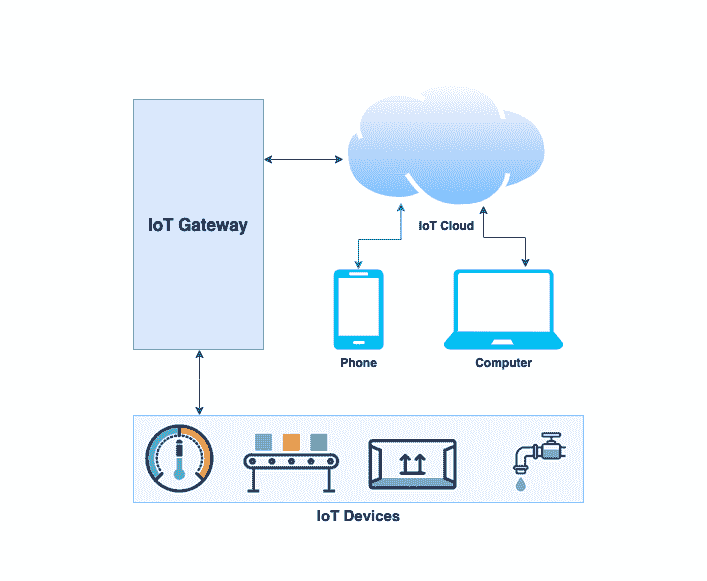
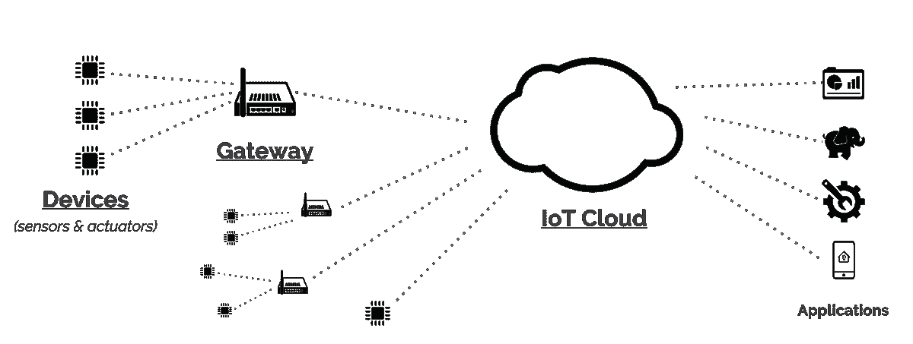
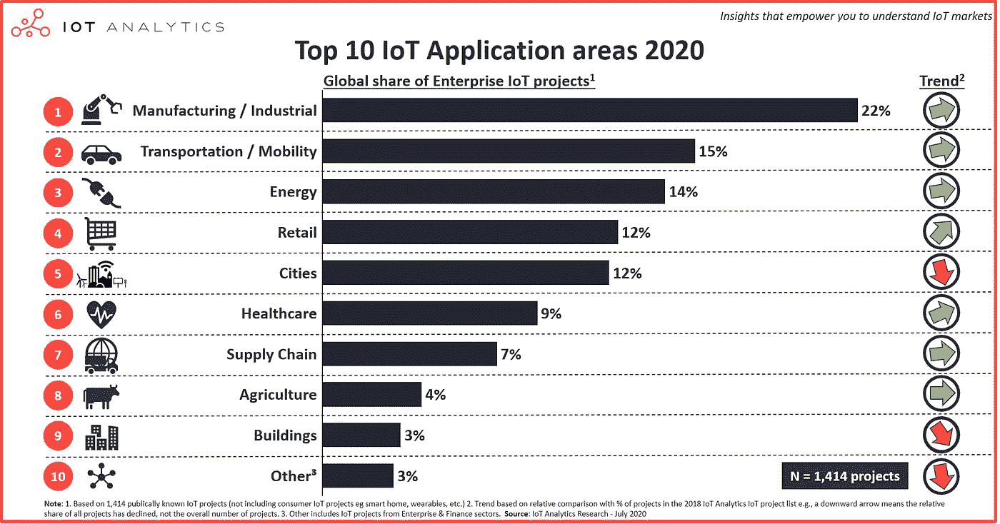

# 物联网(IoT)入门指南

> 原文：<https://medium.com/globant/iot-basics-and-its-presence-in-globant-ccc38aff3208?source=collection_archive---------1----------------------->

**作者** [**普拉萨德·古拉普**](https://medium.com/u/665ad25fe8d6?source=post_page-----ccc38aff3208--------------------------------) **&** [**维沙尔·盖卡尔**](https://medium.com/u/b9fe3cc9c858?source=post_page-----ccc38aff3208--------------------------------)

# 物联网简介

物联网是通过互联网连接的物理对象系统。它收集和传输数据，无需人工干预即可完成必要的工作。

你可以通过物联网操作从家用设备到商业设备的各种对象。例如，我们可以通过物联网自动开关家里的灯泡、风扇、空调和其他电器。

健身和医疗保健行业出现了物联网使用的最新趋势。此外，汽车行业利用物联网通知客户车辆发动机的健康状况。

该博客涵盖了物联网的工作原理。它涵盖了架构和通信协议以及云上的物联网。它列出了物联网的优势和挑战。它还涵盖了 10 大物联网应用领域以及如何开始应对物联网测试挑战。这个博客是为处于软件行业初级阶段的业务分析师和质量分析师准备的

# 物联网的工作原理

物联网设备从设备收集数据，并通过应用分析来共享有价值的信息。这些强大的物联网平台提供有用的信息，忽略不必要的细节。它会提出建议，并在问题发生前检测出可能的问题。

例如，在汽车行业，我很想知道哪些部件(例如，真皮座椅或合金车轮)最受欢迎。IoT 可以在以下方面帮助我:

*   使用传感器检测展厅中顾客最常逗留的区域
*   对销售数据进行分析，以确定正在销售的组件。
*   智能供应链物流确保热门商品不会缺货。

联网设备有助于做出明智的决策，决定哪些组件需要储备实时信息。它有助于节省时间和金钱。

借助高级分析提供的洞察力，可以提高流程效率。智能对象和系统可以自动执行重复、耗时的任务

让我们看一些例子，看看这在现实生活中是什么样子的。

你每天早上 7 点起床，准备去上班:

*   你的闹钟会在你设定的时间叫醒你
*   但是如果出了问题呢？假设你的火车现在取消了，你不得不开车去上班。
*   问题是，乘汽车旅行需要更多的时间，所以你必须在早上 6:45 起床，以便早点出发去旅行。
*   你也会知道外面正在下雨，所以你需要比平时开得慢一些。
*   联网或物联网闹钟会根据所有这些因素自动重置，以确保您准时上班。
*   它识别出火车没有运行。然后它会计算出你上班的替代路线的行驶距离和行驶时间。
*   然后，它会检查天气和旅行速度较慢的因素，并计算出你的起床时间，这样你就不会迟到。
*   它还会与您的物联网咖啡机同步，以确保您起床时咖啡因已经准备好。很聪明，对吧！！！！

# 物联网架构

物联网架构取决于物联网的不同应用领域，它按照设计工作。物联网没有标准定义的架构。这完全取决于它在不同部门的功能和实施情况。下图显示了物联网的基本流程。

Image 1: IoT Architecture

物联网系统结合了许多智能设备和它们都连接到的云平台。

物联网系统在几个层面上运行:

*   硬件可以是无线传感器或执行器。他们与环境发生反应，并使他们收集的数据可用于分析。例如，当太阳升起时，你可以用它们来关灯。
*   物联网网关连接到传感器和致动器，这些传感器和致动器编译它们的所有数据。然后，它将其转换成数字形式，并通过互联网网关在网络上路由。
*   云基础设施，负责存储和处理收到的数据。这是物联网实施中的首选存储方法。
*   该应用程序控制用户端的物联网设备(针对智能手机、平板电脑或 PC)。

# 物联网通信协议

物联网协议正被用于将数据从设备传输到其他物联网设备。物联网协议确保从一个设备发送的信息被连接环境中的下一个设备有效接收。

我们在此列出了物联网设备和应用中涉及的顶级物联网通信协议。

*   WiFi:无线保真( [WiFi](https://www.wi-fi.org/) )是最受欢迎的无线局域网。WiFi 支持互联设备之间的强大通信。它适用于室内应用和家庭自动化。(范围:100 至 250 英尺)
*   蓝牙:[蓝牙](https://www.bluetooth.com/)是最重要的物联网网络协议之一。如今，物联网公司正在将新型低能耗蓝牙(BLE)用于不同的消费产品市场。
    蓝牙可以用于智能手机、平板电脑、智能手表和媒体播放器。蓝牙在两个或更多彼此靠近的设备之间传输信息时更有用。
*   ZigBee: [Zigbee](https://zigbeealliance.org/solution/zigbee/) 是一个开放的无线技术全球标准。它将低功率数字无线电信号用于个人区域网络。Zigbee 功耗低，安全性高，通信范围更远。Zigbee 可以达到 200 米，而蓝牙可以达到 100 米。
*   [LoRa](https://lora-alliance.org/) :远程广域网(LoRaWAN)是一种远程无线电广域网，为物联网和工业应用提供低成本的移动安全。它能够以低功耗进行远程通信，并支持由数百万台设备组成的大型网络。
*   Z-Wave: [Z-Wave](https://www.z-wave.com/) 是一种基于射频的低功耗通信协议，与 Zigbee 一样，它基于 IEEE 802.15.4 标准。Z-Wave 通信协议的工作频率为 900 MHz，范围约为 30-100 米。
    这种低功耗射频通信协议专为家庭自动化系统和电子设备(如灯控制器和传感器)而设计。其数据速率范围约为 40kbps 至 100kbps。

# 物联网云

Image 2: IoT Cloud

物联网云是一个支持物联网设备和应用的巨大网络。这是一个存储和处理物联网数据的平台。物联网云消耗设备和传感器生成的大量数据，然后启动实时响应行动。

物联网系统的传感器/设备通过一些连接与云对话。软件开始处理数据并开始发送警报。它还可以根据应用程序中的设置打开和关闭设备。

物联网云为交付配置和服务提供了一种高效且可扩展的模式。资源有限的企业可以选择物联网云的按需解决方案。

# 物联网的优势

纵观物联网对任何企业的益处，组织可以预期的情况如下:

*   提高工作效率:通过互联设备提高自动化程度，在更短的时间内执行各种操作。这导致了更高的生产率
*   客户行为理解和分析:物联网有助于识别客户的行为模式。它有助于建立更好的客户关系和参与策略。
*   精确监控和警报生成:确保减少错误
*   实时分析和报告:有助于识别灰色区域，并针对解决方案采取正确的措施。
*   由于人工干预少，降低了系统故障的风险
*   改进质量控制机制:增加产品生命周期中的质量控制。
*   实时决策:客户行为模式有助于维持目标受众。它导致营销和建立品牌忠诚度。

# 物联网面临的挑战

尽管物联网有许多优势，但它也面临一些挑战。下面列出了一些挑战:

*   在组织内部营造技术文化是开始使用物联网的先决条件。
*   组织需要在以下方面进行投资，以有效利用物联网:
*   传感器投资——传感器成本高，还需要维护。
*   数据分析—需要数据分析工具来识别模式/序列以得出结论
*   网络投资——物联网网络建设成本高昂
*   系统集成—将物联网设备与系统集成涉及大量集成活动
*   安全性—安全性是保护客户数据需要考虑的最重要的方面之一
*   不同物联网系统的兼容性和互操作性也是需要考虑的因素。
*   将所有连接的设备放在一个平台上需要正规化
*   网络挑战将始终是一个至关重要的因素，因为互联网仍然无法以相同的速度在所有地方可用。
*   大数据本身非常庞大，因此将其与物联网相结合具有巨大的挑战。

# 十大物联网应用领域

在 1，414 家公共企业中，确定的物联网项目中，制造业/工业最常见(22%)，其次是交通/移动(15%)和能源物联网项目(14%)。

Image 3: IoT Application Areas <Ref: [IoT Analytics](https://iot-analytics.com/top-10-iot-applications-in-2020/)>

比如物联网用于家庭自动化。这是通过联网系统控制家用电器的能力。它可能包括控制你家所有的灯、运动传感器、接触传感器。

使用智能家居物联网解决方案，您可以获得对家庭的最佳控制。您可以远程打开和关闭电器，并使用移动或网络应用程序控制所有功能。

下面列出了开始物联网项目所需遵循的一些基本步骤。

*   项目团队需要了解客户安装物联网的问题
*   围绕连接性创建一个商业模式，这将证明经常性成本的合理性
*   我们需要了解预防性或预测性维护活动是否需要物联网。此外，无论是用于资产跟踪、环境监控、自动补充等。
*   我们需要研究能够帮助我们安装物联网产品的最佳物联网平台、工具和应用。
*   对于物联网产品的解决方案，我们应该检查以下事项:
    -硬件
    -设备管理
    -连接
    -连接方式
    -地理覆盖
    -服务类型
*   总而言之，在业务中包括物联网项目，我们需要了解技术是如何工作的，以及它能为您的业务做些什么。
*   一套独特的物联网应用和工具可以服务于特定的行业。物联网技术合作伙伴将通过定义我们的期望来帮助我们更好地确定特定需求。这将有助于避免试图自行部署物联网的公司面临的陷阱。

# 物联网测试挑战

以下是 QAs 在测试物联网产品时可能面临的一些常见挑战:

*   物联网中涉及的小工具可能不是每次都可用。
*   这需要很大的努力，并且很难复制实际的环境。
*   许多团队为获得正确的测试数据付出了巨大的努力。
*   由于设备碎片化，构建可以在各种设备上工作的物联网是一个挑战。存在不同的品牌、型号、操作系统、操作系统版本、屏幕尺寸、分辨率和其他元素。
*   市场上有许多物联网通信协议，用于测试与控制器以及控制器之间的交互。
*   兼容性因素
*   安全挑战
*   网络和云可用性:网络和云在物联网系统中发挥着重要作用。以更快的速度测试数据是一个挑战。在各种网络连接和速度上测试物联网架构至关重要。

对于测试人员来说，要克服上面的挑战，他们必须关注一个好的测试方法。遵循结构化的需求和全面的测试计划非常重要。

# 物联网测试策略

物联网测试验证物联网设备的功能、性能、安全性和连接的云。在将您的产品推向市场之前，验证您的物联网设备可以发送敏感信息非常重要。

各种类型的测试有助于确保正确的测试覆盖率:

*   物联网设备功能测试:在应用程序和硬件上完成，以确保设备按预期工作。
*   传感器协议兼容性测试:测试 WiFi、蓝牙等各种物联网协议的设备兼容性
*   设备安全测试:验证物联网设备没有任何威胁、漏洞或风险。这包括检查设备认证、数据收集、数据传输、设备软件等等。该测试将确保数据保护和加密
*   性能测试:收集关于产品特性的响应时间和可靠性的信息。测试人员可以使用市场上提供的各种物联网性能测试工具来检查设备的性能。它将确保物联网设备在正常情况下的预期性能。
*   网络连接测试:检查连接网络的连接是否高效、顺畅。这包括设备到设备的连接和设备到云的连接测试。
*   升级测试:升级测试是检查设备在固件升级、云更新

物联网设备在向市场发布产品之前，必须需要大量的测试。该团队可以通过将上述测试实践添加到您的开发周期中来简化物联网测试。

**总结**

本文涵盖了物联网项目的各个方面:架构和通信协议以及云上的物联网。它列出了物联网的优势和挑战，还涵盖了 10 大物联网应用领域以及如何应对物联网测试挑战。

最后，物联网的集成可以为各种业务领域的许多新机会打开大门。在未来几年，随着更多物联网提供商的出现，我们将看到激动人心的物联网应用和服务物联网客户的指数级增长。