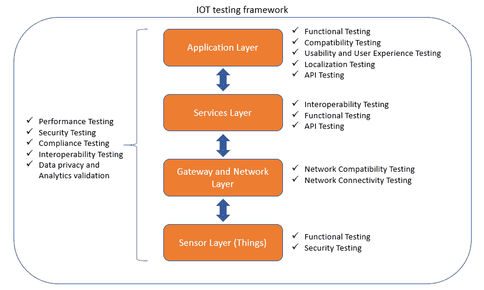

# 物联网测试策略

> 原文：<https://medium.com/globant/iot-testing-strategy-80e3112c46de?source=collection_archive---------0----------------------->

# 什么是物联网？

物联网通常被称为 IoT，是由设备、车辆、建筑物或任何其他连接的电子设备组成的网络。这种互连便利了数据的收集和交换。

物联网系统的 4 个常见组件是:

1.  传感器
2.  应用
3.  网络
4.  后端(数据中心)

# **物联网设备的例子是什么？**

如果可以连接到互联网进行控制或交流信息，任何物理对象都可以转变为物联网设备。

*   [可以使用智能手机应用打开的灯泡](https://www.zdnet.com/article/building-my-own-internet-of-things-ambient-experience-one-step-at-a-time/)是一种物联网设备，你办公室里的运动传感器或[智能恒温器](https://www.zdnet.com/article/johnson-controls-cortana-powered-thermostat-is-up-for-preorder-in-march/)或联网的路灯也是如此。
*   物联网设备可以像儿童玩具一样蓬松，也可以像无人驾驶卡车一样严肃。
*   一些较大的物体本身可能充满了许多较小的物联网组件，例如一个喷气式发动机，它现在充满了数千个传感器，收集和传输数据，以确保它有效运行。
*   在更大的范围内，[智能城市项目正在整个地区布满传感器](https://www.zdnet.com/article/las-vegas-announces-smart-city-plans-with-cisco/)来帮助我们理解和控制环境。

# 我们为什么需要物联网？

*   物联网帮助人们更智能地生活和工作，并完全控制他们的生活。除了提供智能设备来实现家庭自动化之外，物联网对于企业来说也是必不可少的。物联网为企业提供了对其公司系统实际工作方式的实时观察，提供了对从机器性能到供应链和物流运营等一切的洞察。
*   物联网使公司能够自动化流程并降低劳动力成本。它还减少了浪费，改善了服务交付，降低了生产和交付商品的成本，并提高了客户交易的透明度。
*   物联网触及每个行业，包括医疗保健、金融、零售和制造。[智慧城市](https://internetofthingsagenda.techtarget.com/definition/smart-city)帮助市民减少浪费和能源消耗。农业中使用连接的传感器来帮助监控作物和牲畜的产量，并预测生长模式。
*   因此，物联网是日常生活中最重要的技术之一，随着越来越多的企业意识到联网设备保持竞争力和易于操作的潜力，它将继续加速发展。

# 物联网项目的架构流程

*   物联网应用的底层和核心部分是能够连接到事物并从中获取数据的传感器和电子设备。
*   传感器收集数据，但数据需要转换为可理解的格式&使用我们需要在第二层配置的某种协议连接这些传感器设备，并过滤数据，即为您的数据设置一些阈值，以便做出明智的决策。
*   网络连接可以通过无线连接或互联网有线连接来实现。这种连接可以基于上下文和/或域来改变。
*   我们可以将这一层称为安全层、应用程序抽象层或数据抽象层，我们可以在其中将安全性应用于我们的产品。这一层的位置应该根据领域&我们希望如何将抽象应用到我们的应用程序来改变。
*   在这个阶段，我们将坚持我们的逻辑，使用这些数据作出明智的决定或用于报告目的。这是最重要的一层，在这一层，我们实际的产品和业务逻辑进入了画面。
*   我们也有一个新的层，我们可以说它的表示层或在那里作出决定。根据需求，我们可以显示报告或应用机器学习或一些自定义逻辑来做出明智的决定，并将信号发送回传感器。
*   这是我们为谁设计整个产品的地方。用户与该层进行交互。这是 UI 层。

# 物联网中使用的技术

以下是物联网中使用的一些技术:

*   **Wi-Fi** :这是物联网最常用的技术。局域网的主要优势在于无缝传输数据、文件和消息。
*   **蓝牙**:这是用在短距离通信足以解决问题的地方。这个多用于可穿戴技术。
*   Zigbee : ZigBee 类似于蓝牙，主要用于工业环境。它在复杂系统中具有一些显著优势，提供低功耗运行、高安全性、鲁棒性和高性能，并在[物联网应用](https://data-flair.training/blogs/iot-applications/)中充分利用无线控制和传感器网络。
*   Z-Wave :与 Zigbee 类似，Z-Wave 是一种主要用于家庭自动化的无线通信协议。它面向住宅控制和自动化市场。它在您的家中创建了一个网格，使设备能够轻松地相互通信以及与控制器通信。
*   **NFC** : NFC 用于实现电子设备之间的双向互动。主要用于智能手机和非接触式支付交易。另一个应用是在随后使用蓝牙或 Wi-Fi 操作的设备之间快速配对。
*   **蜂窝**:任何需要远距离操作的物联网应用都可以利用 GSM/3G/4G 蜂窝通信能力。虽然蜂窝显然能够发送大量数据，尤其是对于 4G，但对于许多应用来说，成本和功耗都太高了。但它可能是基于传感器的低带宽数据项目的理想选择，这些项目将通过互联网发送非常少量的数据。另一个应用是在没有硬连接的偏远地区。

# **物联网测试的 3 大优势**

1.  **提高参与度**:物联网测试可确保终端用户通过多种渠道(设备、网络、移动)获得最佳用户体验
2.  **面向未来的业务**:物联网测试提供了一种集成的方法来验证物联网解决方案的实际和非功能需求。它还通过确保互操作性、安全性和性能测试使业务经得起未来考验
3.  **加快上市时间**:物联网测试通过利用早期自动化确保更快的上市时间。

# 物联网测试框架

物联网设置使用我们常规 QA 实践中的各种软件测试方法。同等重视所有三个物联网核心组件(即设备、设备之间的通信以及计算需要处理和分析的数据量)非常重要。

建议在物联网生态系统中进行以下类型的测试:

1.  **性能测试**:包括通信网络模型的快速性，以及嵌入式软件系统的内部计算能力。物联网中的性能测试需要在网络和网关级别(MQTT、CoAP、HTTP 等协议)、系统级别(数据库、处理、分析)和应用程序级别进行。**示例**:在定义的连接条件下，根据基准时间验证响应时间。
2.  **安全测试**:包括数据保护、设备身份认证、加密/解密等安全方面。物联网框架中的安全测试包括保护设备本身及其连接的网络或云服务。专家承认，物联网将人们信息的隐私和保密性置于风险之中，因为没有任何规则可以有效地保护敏感数据免受可能的攻击，因此安全测试非常重要。传感器网络、实时数据收集应用、中间件、接口和 M2M 协议只是几个变量，它们可能会带来更多可注入点和新的安全威胁。设备和协议级别的安全测试是可以从源头检测问题的重要领域之一。
    **示例**:验证没有对设备的未授权访问，或者验证被入侵设备上的数据可以被远程擦除。
3.  **兼容性测试**设备版本、协议版本、移动设备和移动操作系统版本的可能组合。兼容性测试成为物联网框架的应用层和网络层的主要需求。这一切都是为了验证设备硬件、通信协议版本、软件版本和操作系统的可能工作组合。
    **示例**:验证物联网软件支持一组规定的设备，或确保设备到设备的通信协议兼容
4.  **最终用户应用测试**:包括物联网应用的所有功能用例的测试，也包括用户体验和可用性测试。
    **示例**:验证物联网应用是否具备规范要求的所有功能，或者验证用户体验(UX)是否良好。
5.  **设备互操作性测试**:这涉及评估跨不同标准和规范的协议和设备无缝互操作的能力。简而言之，它验证物联网设置中所有设备和协议的连通性。物联网框架的服务层中的互操作性测试变得非常重要，因为物联网需要标准来支持跨设备可通信、可操作和可编程的平台，而不管品牌、型号、制造商或行业。
    **示例**:如果用户同时使用 iPad 和 Mac 进行物联网应用，则通过 Mac 桌面访问时，交易已完成或保存在 iPad 上的数据“按原样”保存。

通过无限数量的事物、过程、软件、硬件和 SLA 展示的大量细节可能会导致监督和控制统一测试生命周期的全面测试策略。

测试是物联网中的变革代理，从技术和文化方面提供了开发和运营之间的天然联系。

# **测试工具&框架**

为了在试运行环境中执行上述广泛的物联网测试，使用正确的自动化、模拟、虚拟化和测量工具至关重要。下面列出了一些可以根据需要使用的工具:

*   **设备/协议模拟器**:符合标准的设备通常可以使用工具进行模拟。它们可以被大量模拟，也可以被配置成映射所需的真实状态。
*   **记录&播放工具**:无论是设备还是应用程序，系统和用户数据/动作都可以在模拟器和应用程序上记录和回放，作为自动化测试执行的一种手段。
*   **移动测试工具**:它们提供自动化的功能移动测试，复制最终用户体验，确保应用程序按预期运行。
*   **安全测试工具**:分为威胁建模、静态代码分析和运行时威胁诱导工具。诸如 Micro Focus Fortify on Demand、OWASP ZAP、VCG 和微软威胁建模工具之类的工具可以识别威胁，确定它们的优先级，并提供如何修复它们的建议。Acunetix 和 Netsparker 是两个开源安全工具，可以帮助发现漏洞。
*   **API 测试工具**:现在越来越多的解决方案是使用 REST APIs 和 Web 服务构建的。Postman、SoapUI、Progress、Telerik、Fiddler 等工具。测试它们的连接、响应和性能。
*   **虚拟化工具**:无需投资不同的硬件、操作系统、浏览器、数据库、平台服务等，即可经济、及时地执行兼容性测试。
*   **自动化部署工具**:它们用于以编程方式在本地或云中创建虚拟机，快速调试托管服务，以及配置和部署定制的服务和应用。
    Foreman、Ansible Tower 和 Katello 等工具可确保构建试运行设置，以便在连续构建、集成和部署环境中按时触发自动化和手动测试。
*   **其他工具**:以下是一些可以用于特定用途的工具/设备:
    1。Wireshark 和 Tcpdump 来监控网络流量，
    2。提琴手调试 HTTP 流量
    3。JTAG 加密狗和数字存储示波器来测试硬件和监控其参数。
*   此外，测试用例以及缺陷管理工具和专有工具可以提高质量控制执行的生产率、速度和有效性。

# 测试者的挑战:

*   **物联网平台太多** 每个物联网设备都有自己的硬件，依靠软件驱动。应用软件也将与物联网设备集成，向设备发出命令，并分析设备收集的数据。
    由于设备的软件和硬件种类繁多，固件和操作系统的版本也各不相同，因此不可能测试所有可能的硬件和软件组合。为了定义一个可以有效测试的合理子集，从您的最终用户那里收集信息以了解他们正在使用的设备和软件版本，并对其进行分析以确定最流行的组合。
    一旦你知道要测试哪些设备和操作系统，你就可以将大部分测试集中在这些组合上，并对不太常见的组合运行较小的健全性测试。
*   **如此多的物联网通信协议可供测试** 如今，物联网设备使用许多不同的通信协议与控制器以及彼此之间进行交互。诸如消息队列遥测传输(MQTT)、可扩展消息和存在协议(XMPP)以及受限应用协议(CoAP)等协议是常见的，并且每种协议都有其自身的[优点和缺点](http://www.infoworld.com/article/2972143/internet-of-things/real-time-protocols-for-iot-apps.html)。但是在高延迟和低带宽情况下表现良好的 MQTT 是最受欢迎的。
    通常基于 JavaScript Object Notation (JSON)或 XML 的 API 通常位于传输协议之上，以使开发人员更容易与设备交互。测试人员可以使用协议和 API 进行[自动化测试](http://techbeacon.com/introducing-automation-your-organization-strategic-move)，测试设计取决于正在使用的 API 和协议。为了有效，测试工具必须能够支持这些协议和 API。
*   **新的攻击表面和其他物联网安全威胁正在增加** 10 月，针对 Dyn 服务器的一次大规模分布式拒绝服务(DDOS)攻击[导致 PayPal、Twitter 和 Spotify 等](http://techbeacon.com/performance-killers-how-prep-election-day-black-friday)巨头(以及许多其他公司)陷入瘫痪。攻击者已经用恶意软件感染了数千台易受攻击的物联网设备，导致这些设备产生流量。
    目前有超过 [70%的物联网设备](http://www8.hp.com/us/en/hp-news/press-release.html?id=1744676#.VOs4hFPF8zQ%5C)易受安全问题的影响，安全漏洞测试是一项关键活动。物联网设备测试人员应特别注意设备的密码政策，确保设备内置最低密码要求，并强制执行。
    设备的推荐做法是要求首次访问时更改密码，在开发自动化测试时应考虑到这一点。
*   **物联网应用，设备多样性是一项挑战** 物联网设备和应用的类型如此多样，这一事实要求强大的测试能力。所有设备的性能必须始终保持较高水平，并超出用户预期。
    测试人员必须有强大的[测试策略](http://techbeacon.com/test-automation-basics-every-software-developer-should-know)，对架构有很好的理解，并确保被测设备和软件始终配置有正确的版本。如果系统依赖于第三方服务，当第三方服务改变时，测试可能会失败。作为连续测试管道的一部分运行的自动化测试将会非常快速地检测到这一点。
    如果第三方服务不可用，可以[虚拟化服务](http://techbeacon.com/how-service-virtualization-cuts-developer-wait-times)，解除对实际服务的依赖。如果服务关闭，您仍然可以使用虚拟化服务进行测试。可定制的服务虚拟化工具将允许您配置来自服务的预期响应，以便您可以在各种情况下测试应用程序的响应。
*   **快速移动的数据和增加的负载带来了损失** 联网的物联网设备依赖于快速通信。因此，网络状态会对设备性能产生重大影响。智能设备经常会遇到网络基础设施问题，例如 WiFi 信道负担过重、网络硬件不可靠以及互联网连接缓慢或不稳定。物联网设备和应用必须在这些不同的条件下进行测试，以确保它们在不丢失数据的情况下正确响应。
    创建一个具有所有不同条件的网络很难实现，因此许多团队使用[网络虚拟化](http://techbeacon.com/primer-service-network-virtualization)来编程模拟不同的网络条件和响应。在测试过程中，应该监控设备系统指标，如 CPU 和内存。
    例如，出现内存泄漏的物联网设备将运行缓慢，并且可能无法正确响应。台式机或笔记本电脑上的软件由用户通过敲击、点击或打字来激活和测试。但是物联网设备往往是被动的，所以测试人员必须了解正在使用什么设备，并知道它们的行为方式。这需要对性能测试工具和性能监控进行调整。
*   **物联网的复杂性带来了机遇** 虽然物联网将性能监控和测试的复杂性提升到了一个新的水平，但这些设备所带来的商机却提供了一个令人兴奋的新领域。
    测试人员必须适应新的平台和技术，以确保他们能够应对测试物联网设备和应用的挑战，从而为最终用户提供最佳体验。幸运的是，随着时间的推移，网络基础设施和测试工具的改进将继续使这一过程变得更加容易。

# 物联网测试计划:

一旦就测试策略达成一致，就用它来指导物联网软件测试计划。新的和历史悠久的物联网组织都应该考虑应该将哪些测试概念和环境添加到测试计划中，包括:

1.  基于风险的测试
2.  测试攻击[Whittaker，如何破解软件，Hagar，破解移动和嵌入式设备的软件测试攻击]以找到有风险的 bug
3.  探索性测试时间和工作量
4.  必需的脚本测试和文档
5.  需要测试工具和自动化
6.  测试实验室设置
7.  要执行的测试类型
8.  设计用于使用和
9.  要应用的测试技术

一个测试计划的 IoT 测试生命周期模式示例如下

*   战略
*   计划
*   考虑回归的设计
*   行为(测试)
*   报告和文件
*   重复(在资源界限内，例如测试团队技能、成本和进度)。
    这些活动可能需要数天或数小时，具体取决于项目环境。最后，使用这些清单将帮助我们完成规划。

# 结论:

物联网的未来将取决于消费者的信心，这使得公司推出高质量的物联网和软件至关重要。此外，毫无疑问，物联网解决方案得到了广泛应用，因为它们继续让人类生活变得更加轻松。这些物联网解决方案既复杂又具有挑战性，因为涉及到多个组件，并且它们之间通过互联网进行各种交互。

物联网和智能设备的兴起，无论最终被证明是革命性的还是进化性的，都需要一些测试实践来进化。项目开始时的规划和设计将继续被证明是成功的关键。各种物联网测试可以确保高质量的物联网解决方案。然而，执行它们需要一个良好的测试策略，并使用适当的测试工具。测试本身将被证明更加复杂，并将更加依赖于现场测试和测试对象的使用，但这一转变将为受测智能设备提供新鲜而有意义的见解。测试是物联网中的变革代理，从技术和文化方面提供了开发和运营之间的天然联系。

这一努力的关键是 QA 测试，以在产品上市前发现并纠正任何缺陷或错误。