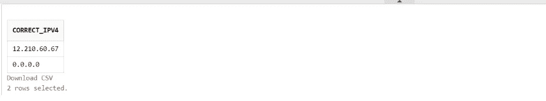

# RDBMS 中的 IP、MAC 和网络子网地址验证

> 原文：<https://medium.com/globant/ip-mac-and-network-subnet-address-validation-in-rdbms-3c1f9b7b07fb?source=collection_archive---------0----------------------->


Network Addresses

*本文由合著者 Kartik Garghate 先生提供。*

我们可能需要使用数据库脚本从后端验证 IPv4 地址、IPv6 地址、MAC 地址或网络子网地址。在一次作业中，我们必须通过编写数据库脚本来验证网络地址。我们需要通过创建 Azure 数据工厂管道来处理文件，在处理的同时，验证数据文件中提到的网络地址。如果网络地址的格式正确，将这些记录保存在数据库中；否则，丢弃网络地址不正确的记录。

在 API、UI 和 Oracle 数据库等编程领域中，可以使用 [REGEXP](https://en.wikipedia.org/wiki/Regular_expression) 快速完成网络地址验证，但在 SQL Server 中却不行。没有现成的实现可用于验证 SQL Server 中的网络地址；我们需要编写一个[用户定义函数(UDF)](https://docs.microsoft.com/en-us/sql/relational-databases/user-defined-functions/user-defined-functions?view=sql-server-ver16) 来实现这个解决方案。对于 Oracle 中的网络地址验证，我们需要修改 REGEXP。

在本文中，我们将了解如何在 SQL Server 中实现 UDF，以及如何在 Oracle 中修改 REGEXP 来验证 IPv4、IPv6、MAC 地址和网络子网。撰写本文时，考虑到您在数据库函数、IP 验证概念和复杂查询编写方面具有中级水平的专业知识。

# 地址格式

让我们从考虑所有可能的地址格式开始。

## [IPv4 地址](https://en.wikipedia.org/wiki/IPv4)

IP 代表互联网协议，v4 代表第四版(IPv4)。IPv4 地址有一种格式`x.x.x.x`，其中每个`x`称为一个八位字节，一个 0 到 255 之间的十进制值:例如，123.100.20.15 或 0.0.0.0。八位字节由句点分隔，IPv4 地址必须包含三个句点和四个八位字节。

## [IPv6 地址](https://en.wikipedia.org/wiki/IPv6)

IPv6 地址是一个 128 位的字母数字值，用于标识 IP 版本 6 (IPv6)网络中的端点设备。首选的 IPv6 地址表示是`x:x:x:x:x:x:x:x`，其中每个`x`是一个 16 位十六进制数。IPv6 地址范围从 0000:0000:0000:0000:0000:0000:0000:0000:0000 到 ffff:ffff:ffff:ffff:ffff:ffff:ffff:ffff。

除了这种首选格式之外，IPv6 地址还可以用另外两种缩写格式来指定:

*   **省略前导零:**我们可以通过省略前导零来指定 IPv6 地址。例如，IPv6 地址 1050:0000:0000:0000:0005:0600:300 c:326 b 可以写成 1050:0:0:0:5:600:300c:326b。
*   **双冒号:**我们可以使用双冒号(::)代替一系列零来指定 IPv6 地址。IPv6 地址中只允许出现一次双冒号。例如，IPv6 地址 ff06:0:0:0:0:0:0:0:C3 可以写成 ff06::c3。

## [MAC 地址](https://en.wikipedia.org/wiki/MAC_address)

媒体访问控制(MAC)地址是唯一标识给定网络中每台设备的物理地址。传统的 MAC 地址是 12 位(6 字节或 48 位)十六进制数，可以用以下方式书写:

*   [00-FF]:[00-FF]:[00-FF]:[00-FF]:[00-FF]:[00-FF]，如 96:FF:FE:12:34:56
*   [00-FF]-[00-FF]-[00-FF]-[00-FF]-[00-FF]，如 96-FF-FE-12–34–56 中所示
*   [0000-FFFF]。[0000-FFFF]。[0000-FFFF]，如在 96FF。FE12.3456
*   [0000000000000-ffffffffff]，如 96FFFE123456

## [IPv4 网络子网](https://en.wikipedia.org/wiki/Subnetwork)

IPv4 网络子网格式由 IPv4 地址和 0 到 32 之间的数字组成，用“/”分隔。子网有两种格式:

*   [IP v4]/[0–32]，如 10.10.10.10/11 所示
*   /[0–32]，如/10 所示

# 编写 UDF

在写我们的 UDF 之前，让我们看看为什么我们需要它们。

*   **模块化编程:**你可以一次创建一个函数，存储在数据库中，在你的程序中调用任意次。
*   **不支持 REGEXP:** SQL Server 不支持正则表达式，而其他语言支持正则表达式。以下 IPv6 验证规则适用于。但在 SQL Server 中不受支持。

```
(?:^|(?<=\s))
 (
  ([0–9a-fA-F]{1,4}:){7,7}[0–9a-fA-F]{1,4}|
  ([0–9a-fA-F]{1,4}:){1,7}:|
  ([0–9a-fA-F]{1,4}:){1,6}:[0–9a-fA-F]{1,4}|
  ([0–9a-fA-F]{1,4}:){1,5}(:[0–9a-fA-F]{1,4}){1,2}|
  ([0–9a-fA-F]{1,4}:){1,4}(:[0–9a-fA-F]{1,4}){1,3}|
  ([0–9a-fA-F]{1,4}:){1,3}(:[0–9a-fA-F]{1,4}){1,4}|
  ([0–9a-fA-F]{1,4}:){1,2}(:[0–9a-fA-F]{1,4}){1,5}|
  [0–9a-fA-F]{1,4}:((:[0–9a-fA-F]{1,4}){1,6})|
  :((:[0–9a-fA-F]{1,4}){1,7}|:)|
  fe80:(:[0–9a-fA-F]{0,4}){0,4}%[0–9a-zA-Z]{1,}|
  ::(ffff(:0{1,4}){0,1}:){0,1}((25[0–5]|
  (2[0–4]|1{0,1}[0–9]){0,1}[0–9])\.){3,3}(25[0–5]|(2[0–4]|1{0,1}[0–9]){0,1}[0–9])|
  ([0–9a-fA-F]{1,4}:){1,4}:((25[0–5]|(2[0–4]|1{0,1}[0–9]){0,1}[0–9])\.){3,3}(25[0–5]|(2[0–4]|1{0,1}[0–9]){0,1}[0–9])
 )
(?=\s|$)
```

*   **处理多种情况:**正如我们提到的，几个地址可能以两种或更多种等效的格式书写。
*   **跨平台:**我们不能调用任何用。NET 或 Java 编写的程序，但是用。NET 或 Java 可以调用和使用数据库中定义的函数。

让我们看 UDF 来逐个验证网络地址。

# 正在验证 IPv4 地址

在本节中，让我们编写函数来验证 IPv4 地址。

## IPv4 地址验证— SQL Server UDF

以下 UDF 验证 SQL Server 中的 IPv4 地址:

```
CREATE FUNCTION [dbo].[fn_ipv4_validation] 
(
   @p_ip_address NVARCHAR(300)
)
RETURNS BIT
AS
BEGIN
DECLARE @counter int = 0
/*
  RETURN 'FALSE' - Incorrect Format
  RETURN 'TRUE' - Correct Format
*/
-- Step 1
IF ( @p_ip_address LIKE '%[a-zA-Z]%' OR REPLACE(@p_ip_address,'.','') LIKE '%[^0-9]%' )
BEGIN
   SET @counter = 1
   RETURN 'FALSE'
END
-- Step 2
IF 
   @counter = 0  
   AND @p_ip_address = 
        ( SELECT 
            @p_ip_address 
          WHERE 
            (
              PARSENAME(@p_ip_address , 4) BETWEEN' 0' AND '255'
              AND PARSENAME(@p_ip_address , 3) BETWEEN '0' AND '255'
              AND PARSENAME(@p_ip_address , 2) BETWEEN '0' AND '255'
              AND PARSENAME(@p_ip_address , 1) BETWEEN '0' AND '255'
            )
        )
BEGIN
   RETURN 'TRUE'
END
-- Step 3
RETURN 'FALSE'
END
GO
```

编写 UDF `fn_ipv4_validation()`来验证 IPv4 地址格式，它接受 IPv4 地址作为参数`@p_ip_address`并返回`‘TRUE’`或`‘FALSE’`。UDF 遵循的步骤解释如下:

*   *步骤 1* :我们将检查字符串是否包含 a-z 或 A-Z 中的任何字符，以及除了点(.)，如果是，则将计数器变量值设置为 1，然后返回`‘FALSE’`并退出函数。该检查在`[LIKE](https://learn.microsoft.com/en-us/sql/t-sql/language-elements/like-transact-sql?view=sql-server-ver16)`操作器和`[REPLACE](https://learn.microsoft.com/en-us/sql/t-sql/functions/replace-transact-sql?view=sql-server-ver16)()`功能的帮助下完成。
*   *第二步*:如果 IPv4 地址变量不包含 a-z 或 A-Z 中的任何字符或除点(.)并且计数器变量为 0，那么将执行第二步。这里通过使用`[PARSENAME(](https://docs.microsoft.com/en-us/sql/t-sql/functions/parsename-transact-sql?view=sql-server-ver16))`函数，我们正在验证参数`@p_ip_address`是否在[0–255]范围内。[0–255].[0–255].[0–255]格式。如果`@p_ip_address`格式正确，将返回`‘TRUE’`并从函数中出来。
*   *第三步*:如果前面任何一步失败，函数返回`‘FALSE’`并退出。

以下示例显示了如何使用`fn_ipv4_validation()`来验证 IPv4 地址:

```
SELECT 
    '12.210.60.67' IPV4_Value, 
    [dbo].[fn_ipv4_validation] ('12.210.60.67') IPv4_result
UNION ALL
  SELECT 
    '0.0.0.0' IPV4_Value, 
    [dbo].[fn_ipv4_validation] ('0.0.0.0') IPv4_result
UNION ALL
  SELECT 
    '10.10.10.asdasd' IPV4_Value, 
    [dbo].[fn_ipv4_validation] ('10.10.10.asdasd') IPv4_result
UNION ALL
  SELECT 
    CAST('10.10.as.10' as Varchar ) IPV4_Value, 
    [dbo].[fn_ipv4_validation] ('10.10.as.10') IPv4_result
UNION ALL
  SELECT 
    '0.0.0.0.0' IPV4_Value, 
    [dbo].[fn_ipv4_validation] ('0.0.0.0.0') IPv4_result
UNION ALL
  SELECT 
    '10.10.10.890' IPV4_Value, 
    [dbo].[fn_ipv4_validation] ('10.10.10.890') IPv4_result;
```

以下是上述脚本的输出:


IPv4 Address Validation — SQL Server Implementation

## IPv4 地址验证— Oracle

使用`[REGEXP_LIKE](https://docs.oracle.com/cd/B12037_01/server.101/b10759/conditions018.htm)()`编写的以下表达式有助于在 Oracle 中验证 IPv4 地址:

```
REGEXP_LIKE(ipv4_address, '^((25[0-5]|2[0-4][0-9]|[01]?[0-9][0-9]?)\.){3}(25[0-5]|2[0-4][0-9]|[01]?[0-9][0-9]?)$')
```

以下示例显示了如何使用上述表达式找出正确的 IPv4 地址:

```
WITH 
  data
AS
(
    SELECT 
      '12.210.60.67' ipv4_address 
    FROM dual
  UNION ALL
    SELECT 
      '0.0.0.0' ipv4_address 
    FROM dual
  UNION ALL
    SELECT 
      '10.10.10.asdasd' ipv4_address 
    FROM dual
  UNION ALL
    SELECT 
      '10.10.as.10' ipv4_address 
    FROM dual
  UNION ALL
    SELECT 
      '0.0.0.0.0' ipv4_address 
    FROM dual
  UNION ALL
    SELECT 
      '10.10.10.890' ipv4_address 
    FROM dual
)
SELECT
  ipv4_address CORRECT_IPV4
FROM
  data
WHERE
  REGEXP(ip_address, '^((25[0-5]|2[0-4][0-9]|[01]?[0-9][0-9]?)\.){3}(25[0-5]|2[0-4][0-9]|[01]?[0-9][0-9]?)$');
```

下图显示了上述脚本的输出:



IPv4 Address Validation — Oracle Implementation

# 验证 IPv6 地址

在本节中，让我们编写函数来验证 IPv6 地址。

## 字符数— SQL Server UDF

SQL Server 没有内置的字符计数函数，该函数返回某个字符在给定字符串中出现的次数。在 IPv6 地址验证 UDF 中，我们需要基于字符数进行一些检查。因此，与其一次又一次地编写相同的逻辑，不如让我们创建一个 UDF，它接受一个字符串和一个字符，并返回字符数:

```
CREATE FUNCTION [dbo].[fn_count_char] 
( 
   @p_input_string VARCHAR(1000), 
   @p_search_char CHAR(1) 
)
RETURNS INT
BEGIN

-- Step 1
DECLARE @v_input_string_length INT
DECLARE @v_index INT
DECLARE @v_count INT

SET @v_count = 0
SET @v_index = 1
SET @v_input_string_length = LEN(@p_input_string)

-- Step 2

WHILE @v_index <= @v_input_string_length
   BEGIN
      IF SUBSTRING(@p_input_string, @v_index, 1) = @p_search_char
         SET @v_count = @v_count + 1
         SET @v_index = @v_index + 1
   END

RETURN @v_count

END
GO
```

UDF `fn_count_char()`将向我们展示一个特定的字符串/字符在传递的字符串中出现了多少次。UDF 遵循的步骤解释如下:

*   *步骤 1* :这里我们声明并初始化变量:`@v_input_string_length`存储传递的字符串长度，`@v_index`检查记录的索引并置 1，`@v_count`存储循环内的计数器。
*   *步骤 2* :我们将运行 while 循环，直到`@v_index`值小于或等于`@v_input_string_length`。在这个循环中，我们将首先使用 substring 函数检查`@p_search_char`是否出现在传递的字符串`@p_input_string`中，如果它匹配要搜索的字符串，那么我们将为`@v_count`和`@v_index`加 1。如上所述，这个循环将继续，直到`@v_index`值小于或等于`@v_input_string_length`，最后，我们将返回字符串/字符在所传递的字符串中出现的总次数。

下面的例子显示了如何使用`fn_count_char()`查看给定字符在字符串中出现的次数:

```
SELECT
  'Welcome Home' InputString, 
  [dbo].[fn_count_char]('Welcome Home', 'o') CharacterCount
UNION ALL
SELECT
  'Welcome Home' InputString, 
  [dbo].[fn_count_char]('Welcome Home', 'e') CharacterCount
UNION ALL
SELECT
  'Welcome Home' InputString, 
  [dbo].[fn_count_char]('Welcome Home', 'l') CharacterCount
```

下图显示了上述脚本的输出:


Character Count

## IPv6 地址验证— SQL Server UDF

以下 UDF 验证 SQL Server 中的 IPv4 地址格式:

```
CREATE FUNCTION [dbo].[fn_ipv6_validation] 
(
   @p_ip_address NVARCHAR(300)
)
RETURNS BIT
AS
BEGIN

/*
  RETURN 'FALSE' - Incorrect Format
  RETURN 'TRUE' - Correct Format
*/

-- Step 1
DECLARE @v_updated_p_ip_address NVARCHAR(100)
DECLARE @v_char_count INT

-- Step 2
SET @v_char_count = dbo.fn_count_char(@p_ip_address, ':')

-- Step 3
IF ( @v_char_count > 7 OR @p_ip_address LIKE '%:::%')
   RETURN 'FALSE'

-- Step 4
IF
 (
   SELECT
     COUNT(1)
   FROM
     STRING_SPLIT(@p_ip_address, ':')
   WHERE
     LEN(VALUE)>4
 ) > 0
   RETURN 'FALSE'

-- Step 5
IF
 (
   (@p_ip_address like '%:' AND @p_ip_address NOT like '%::')
   OR (@p_ip_address like ':%' AND @p_ip_address NOT like '::%')
 )
   RETURN 'FALSE'

-- Step 6
IF CHARINDEX('::', @p_ip_address) > 0
   BEGIN
     IF @v_char_count BETWEEN 2 AND 6
         SET @p_ip_address = REPLACE(@p_ip_address, '::', REPLICATE(':', 7-(@v_char_count-2)))
   END

-- Step 7
SET @v_updated_p_ip_address = 
      (
        SELECT 
           STRING_AGG( RIGHT( REPLICATE( '0', 4) + value, 4), ':')
        FROM
           STRING_SPLIT( @p_ip_address,':')
      )

-- Step 8
IF @v_updated_p_ip_address LIKE STUFF( REPLICATE( ':[0-9a-fA-F][0-9a-fA-F][0-9a-fA-F][0-9a-fA-F]', 8), 1, 1, '')
   RETURN 'TRUE'

-- Step 9
RETURN 'FALSE'
END
GO
```

编写 UDF `fn_ipv6_validation()`来验证 IPv6 地址格式，它接受 IPv6 地址作为参数`@p_ip_address`并返回`‘TRUE’`或`‘FALSE’`。UDF 遵循的步骤解释如下:

*   *步骤 1* :我们将声明两个变量`@v_updated_p_ip_address`和`@v_char_count`。`@v_char_count`用于保存`@p_ip_address`中字符冒号(:)的个数，`@v_updated_p_ip_address`用于保存修改后的`@p_ip_address`。
*   *步骤 2* :在步骤 2 中，我们计算参数`@p_ip_address`中的冒号(:)的数量，并使用函数`fn_count_char()`将其分配给变量`@v_char_count`。
*   *第 3 步*:这里我们检查在第 2 步中计算的`@v_char_count`是否大于 7，或者`@p_ip_address`是否包含多于两个冒号的组。如果满足任何一个条件，函数返回`‘FALSE’`并退出。
*   *第四步*:使用`[STRING_SPLIT](https://docs.microsoft.com/en-us/sql/t-sql/functions/string-split-transact-sql?view=sql-server-ver16)()`函数将`@p_ip_address`用冒号(:)分开。如果分割值字符串包含超过四个字符，则返回`‘FALSE’`并退出该功能。
*   *步骤 5* : IPv6 地址的开头或结尾不应包含单个或两个以上的冒号。这部分代码检查该条件，如果`@p_ip_address`通过该条件并退出函数，则返回`‘FALSE’`。
*   *步骤 6* :如果 IPv6 地址以双冒号格式书写，在步骤 6 我们将添加所需的冒号，因此 IPv6 地址中将有七个冒号，并将它分配给`@p_ip_address`。这可以通过使用代码中所示的`[REPLICATE](https://docs.microsoft.com/en-us/sql/t-sql/functions/replicate-transact-sql?view=sql-server-ver16)()`和`[REPLACE](https://docs.microsoft.com/en-us/sql/t-sql/functions/replace-transact-sql?view=sql-server-ver16)()`函数来实现。
*   *步骤 7* :这里我们将确保冒号之间的数字是四位数。如果 IPv6 地址参数`@p_ip_address`中省略了前导零，我们将按照以下步骤添加这些零，
    -使用`[STRING_SPLIT](https://docs.microsoft.com/en-us/sql/t-sql/functions/string-split-transact-sql?view=sql-server-ver16)()`内置函数根据冒号(:)拆分字符串。
    -通过使用`[STRING_AGG](https://learn.microsoft.com/en-us/sql/t-sql/functions/string-agg-transact-sql?view=sql-server-ver16)()`、`[RIGHT](https://learn.microsoft.com/en-us/sql/t-sql/functions/right-transact-sql?view=sql-server-ver16)()`和`[REPLICATE](https://learn.microsoft.com/en-us/sql/t-sql/functions/replicate-transact-sql?view=sql-server-ver16)()`，内置函数将使该 IPv6 地址成为完整格式。
    例如，如果参数`@p_ip_address`的值为 1050:0:0:0:5:600:300c:326b，那么会将其更新为 1050:0000:0000:0000:0000:0005:0600:300 c:326 b 格式，并将其赋给新变量`@v_updated_p_ip_address`。
*   *第 8 步*:我们将检查传递的 IPv6 地址格式是否正确，即值是否在 0–9 或 a-f 或 A-F 之间，如前所述。如果这个条件满足，我们将返回`‘TRUE’`并退出。
*   *第 9 步*:如果前面任何一步失败，函数返回`‘FALSE’`并退出。

以下示例显示了如何使用`fn_ipv6_validation()`来验证 IPv6 地址:

```
SELECT
  '2001:db8:3333:4444:5555:6666:7777:8888:6543' Ipv6_value,
  [dbo].[fn_ipv6_validation] ('2001:db8:3333:4444:5555:6666:7777:8888:6543') IPV_Result
UNION ALL
SELECT 
  '2001:db8:3333:4444:5555:6666:7777:8888' Ipv6_value, 
  [dbo].[fn_ipv6_validation] ('2001:db8:3333:4444:5555:6666:7777:8888') IPV_Result
UNION ALL
SELECT 
  '2001:db8:5555::7777:8888' Ipv6_value,
  [dbo].[fn_ipv6_validation] ('2001:db:5555::7777:8888') IPV_Result
UNION ALL
SELECT 
  '::7777:8888' Ipv6_value, 
  [dbo].[fn_ipv6_validation] ('::7777:8888') IPV_Result
UNION ALL
SELECT 
  ':2001:db8:5555:6666:7777:8888::' Ipv6_value, 
  [dbo].[fn_ipv6_validation] (':2001:db8:5555:6666:7777:8888::') IPV_Result
UNION ALL
SELECT 
  '2001:db8:3333:4444:5555:6666:7777:8888:' Ipv6_value, 
  [dbo].[fn_ipv6_validation] ('2001:db8:3333:4444:5555:6666:7777:8888:') IPV_Result
UNION ALL
SELECT 
  ':2001:db8:3333:4444:5555:6666:7777:8888' Ipv6_value, 
  [dbo].[fn_ipv6_validation] (':2001:db8:3333:4444:5555:6666:7777:8888') IPV_Result;
```

下图显示了上述脚本的输出:


IPv6 Address Validation — SQL Server Implementation

## IPv6 地址验证— Oracle

使用`[REGEXP_LIKE](https://docs.oracle.com/cd/B12037_01/server.101/b10759/conditions018.htm)()`编写的以下表达式有助于在 Oracle 中验证 IPv6 地址:

```
REGEXP_LIKE
 (ipv6_address, '(([0-9a-fA-F]{1,4}:){7,7}[0-9a-fA-F]{1,4}|
               ([0-9a-fA-F]{1,4}:){1,7}:|
               ([0-9a-fA-F]{1,4}:){1,6}:[0-9a-fA-F]{1,4}|
               ([0-9a-fA-F]{1,4}:){1,5}(:[0-9a-fA-F]{1,4}){1,2}|
               ([0-9a-fA-F]{1,4}:){1,4}(:[0-9a-fA-F]{1,4}){1,3}|
               ([0-9a-fA-F]{1,4}:){1,3}(:[0-9a-fA-F]{1,4}){1,4}|
               ([0-9a-fA-F]{1,4}:){1,2}(:[0-9a-fA-F]{1,4}){1,5}|
               [0-9a-fA-F]{1,4}:((:[0-9a-fA-F]{1,4}){1,6})|
               :((:[0-9a-fA-F]{1,4}){1,7}|:))'
 ) 
```

以下示例显示了如何使用上述表达式来验证 IPv6 地址:

```
WITH 
  data 
AS
(
    SELECT 
      '2001:db8:3333:4444:5555:6666:7777:8888:6543' ip_address 
    FROM 
      dual 
  UNION ALL
    SELECT 
      '2001:dc8:3333:4444:5555:6666:7777:8888' ip_address 
    FROM 
      dual 
  UNION ALL
    SELECT 
      '2001:d18:5555::7777:8888' ip_address 
    FROM 
      dual 
  UNION ALL
    SELECT 
      '::7777:8888' ip_address 
    FROM 
      dual 
  UNION ALL
    SELECT 
      ':2001:d18:5555:7777:8888::' ip_address 
    FROM 
      dual 
  UNION ALL
    SELECT 
      '2001:db8:3333:4444:5555:6666:7777:8888:' ip_address 
    FROM 
      dual 
  UNION ALL
    SELECT ':2001:db8:3333:4444:5555:6666:7777:8888' ip_address 
    FROM 
      dual
)
SELECT 
  ip_address
FROM 
  data
WHERE 
  REGEXP_LIKE
    (CASE 
        WHEN (ip_address LIKE '::%' AND ip_address NOT LIKE '%:') OR (ip_address LIKE '%::' AND ip_address NOT LIKE ':%')
          THEN ip_address
        WHEN ip_address LIKE ':%' OR ip_address LIKE '%:' 
          THEN '123'
        ELSE ip_address
      END, 
      '(([0-9a-fA-F]{1,4}:){7,7}[0-9a-fA-F]{1,4}|([0-9a-fA-F]{1,4}:){1,7}:|([0-9a-fA-F]{1,4}:){1,6}:[0-9a-fA-F]{1,4}|([0-9a-fA-F]{1,4}:){1,5}(:[0-9a-fA-F]{1,4}){1,2}|([0-9a-fA-F]{1,4}:){1,4}(:[0-9a-fA-F]{1,4}){1,3}|([0-9a-fA-F]{1,4}:){1,3}(:[0-9a-fA-F]{1,4}){1,4}|([0-9a-fA-F]{1,4}:){1,2}(:[0-9a-fA-F]{1,4}){1,5}|[0-9a-fA-F]{1,4}:((:[0-9a-fA-F]{1,4}){1,6})|:((:[0-9a-fA-F]{1,4}){1,7}|:))'
    )
AND ip_address NOT LIKE '%:::%'
AND REGEXP_COUNT(ip_address, ':') < 8
AND REGEXP_COUNT(ip_address, '::') < 2;
```

下图显示了上述脚本的输出:


IPv6 Address Validation — Oracle Implementation

# 验证 MAC 地址

## MAC 地址验证— SQL Server UDF

下面的 UDF 验证 SQL Server 中的 MAC 地址格式:

```
CREATE FUNCTION [dbo].[fn_mac_address_validation]
(
  @p_mac_address NVARCHAR(300)
)
RETURNS BIT
AS
BEGIN

/*
  RETURN 'FALSE' - Incorrect Format
  RETURN 'TRUE' - Correct Format
*/

-- Step 1
IF
(
  -- Format: [00-FF]:[00-FF]:[00-FF]:[00-FF]:[00-FF]:[00-FF]
  @p_mac_address LIKE STUFF(REPLICATE(':[0-9a-fA-F][0-9a-fA-F]',6),1,1,'')
  -- Format: [00-FF]-[00-FF]-[00-FF]-[00-FF]-[00-FF]-[00-FF]
  OR @p_mac_address LIKE STUFF(REPLICATE('-[0-9a-fA-F][0-9a-fA-F]',6),1,1,'')
  -- Format: [0000-FFFF]-[0000-FFFF]-[0000-FFFF]
  OR @p_mac_address LIKE STUFF(REPLICATE('.[0-9a-fA-F][0-9a-fA-F][0-9a-fA-F][0-9a-fA-F]',3),1,1,'')
  -- Format: [000000000000-FFFFFFFFFFFF]
  OR @p_mac_address LIKE REPLICATE('[0-9a-fA-F]',12)
)
  RETURN 'TRUE'

-- Step 2
RETURN 'FALSE'
END
GO
```

`fn_mac_address_validation()`是为验证 MAC 地址格式而编写的 UDF，它接受一个 MAC 地址作为参数`@p_mac_address`，并返回`‘TRUE’`或`‘FALSE’`。UDF 遵循的步骤解释如下:

*   *第一步* : MAC 地址可以写成四种不同的格式。因此，在第一步中，我们将验证所有格式，如果参数`@p_mac_address`通过任何一种格式，函数将返回`‘TRUE’`。
*   *第二步*:如果上一步失败，该功能返回`‘FALSE’`并退出

下面的例子展示了如何使用`fn_mac_address_validation()`来验证 MAC 地址:

```
SELECT 
  '01-23-45-67-89-AB' Mac_Value, 
  [dbo].[fn_mac_address_validation]('01-23-45-67-89-AB') MAC_Result
UNION ALL
SELECT 
  '01:23:45:67:-89:AB' Mac_Value, 
  [dbo].[fn_mac_address_validation]('01:23:45:67:-89:AB') MAC_Result
UNION ALL
SELECT 
  '01:23:45:67:89:AB' Mac_Value, 
  [dbo].[fn_mac_address_validation]('01:23:45:67:89:AB') MAC_Result
UNION ALL
SELECT 
  '01.23.45.67.89.AH' Mac_Value, 
  [dbo].[fn_mac_address_validation]('01.23.45.67.89.AH') MAC_Result
UNION ALL
SELECT 
  '0123.4567.89Aa' Mac_Value, 
  [dbo].[fn_mac_address_validation]('0123.4567.89Aa') MAC_Result
UNION ALL
SELECT 
  '0123456789Aa' Mac_Value, 
  [dbo].[fn_mac_address_validation]('0123456789Aa') MAC_Result;
```

下图显示了上述脚本的输出:


MAC Address Validation — SQL Server Implementation

## MAC 地址验证— Oracle

以下使用`[REGEXP_LIKE](https://docs.oracle.com/cd/B12037_01/server.101/b10759/conditions018.htm)()`的表达式有助于验证 Oracle 中的 MAC 地址:

```
-- For [00-FF]:[00-FF]:[00-FF]:[00-FF]:[00-FF]:[00-FF]
REGEXP_LIKE(mac_address, '^([0-9A-Fa-f]{2}[:]){5}([0-9A-Fa-f]{2})$')

-- For [00-FF]-[00-FF]-[00-FF]-[00-FF]-[00-FF]-[00-FF]
REGEXP_LIKE(mac_address, '^([0-9A-Fa-f]{2}[-]){5}([0-9A-Fa-f]{2})$')

-- For [0000-FFFF]-[0000-FFFF]-[0000-FFFF]
REGEXP_LIKE(mac_address, '^([0-9A-Fa-f]{4}[.]){2}([0-9A-Fa-f]{4})$')

-- For [000000000000-FFFFFFFFFFFF]
REGEXP_LIKE(mac_address, '^([0-9A-Fa-f]{12})$')
```

下面的例子显示了如何使用上述表达式找出正确的 MAC 地址:

```
WITH 
  data 
AS
(
    SELECT 
      '01-23-45-67-89-AB' mac_address 
    FROM 
      dual 
  UNION ALL
    SELECT 
      '01:23:45:67:-89:AB' mac_address 
    FROM 
      dual 
  UNION ALL
    SELECT 
      '01:23:45:67:89:AB' mac_address 
    FROM 
      dual 
  UNION ALL
    SELECT 
      '01.23.45.67.89.AH' mac_address 
    FROM 
      dual 
  UNION ALL
    SELECT 
      '0123.4567.89Aa' mac_address 
    FROM 
      dual 
  UNION ALL
    SELECT 
      '0123456789Aa' mac_address 
    FROM 
      dual
)
SELECT
  mac_address
FROM 
  data
WHERE
  (
    REGEXP_LIKE(mac_address, '^([0-9A-Fa-f]{2}[:]){5}([0-9A-Fa-f]{2})$')
    OR
    REGEXP_LIKE(mac_address, '^([0-9A-Fa-f]{2}[-]){5}([0-9A-Fa-f]{2})$')
    OR
    REGEXP_LIKE(mac_address, '^([0-9A-Fa-f]{4}[.]){2}([0-9A-Fa-f]{4})$')
    OR
    REGEXP_LIKE(mac_address, '^([0-9A-Fa-f]{12})$')
  );
```

下图显示了上述脚本的输出:


MAC Address Validation — Oracle Implementation

# 正在验证 IPv4 子网地址

在本节中，让我们编写函数来验证 IPv4 子网地址。

## IPv4 网络子网验证— SQL Server UDF

以下 UDF 验证 SQL Server 中的 IPv4 网络子网格式:

```
CREATE FUNCTION [dbo].[fn_network_subnet_validation]
(
  @p_network_subnet NVARCHAR(300)
)
RETURNS BIT
AS
BEGIN

/*
  RETURN 'FALSE' - Incorrect Format
  RETURN 'TRUE' - Correct Format
*/

-- Step 1
IF
  (
     SUBSTRING( @p_network_subnet, CHARINDEX( '/', @p_network_subnet) + 1, 10) LIKE '%[^0-9]%'
     OR LEN( SUBSTRING( @p_network_subnet, CHARINDEX( '/', @p_network_subnet) + 1, 10)) = 0
     OR LEN( SUBSTRING( @p_network_subnet, CHARINDEX( '/', @p_network_subnet) + 1, 10)) > 2
     OR SUBSTRING( @p_network_subnet, CHARINDEX( '/', @p_network_subnet) + 1, 10) LIKE '0_%'
     OR CHARINDEX( '/', @p_network_subnet) = 0
  )
    RETURN 'FALSE'

-- Step 2
IF
  (
     @p_network_subnet NOT LIKE '%[a-zA-Z]%'
     AND
       ( dbo.fn_ipv4_validation( SUBSTRING( @p_network_subnet, 1,
CASE WHEN CHARINDEX( '/', @p_network_subnet) = 0 THEN 
LEN(@p_network_subnet)
ELSE CHARINDEX( '/', @p_network_subnet) - 1
END )) = '1'                                             
         OR CHARINDEX( '/', @p_network_subnet) = '1'
       )
     AND 
       SUBSTRING( @p_network_subnet, CHARINDEX('/', @p_network_subnet) + 1, 10) BETWEEN '0' AND '32'
  )
    RETURN 'TRUE'

RETURN 'FALSE'
END
GO
```

`fn_network_subnet_validation()`编写 UDF 来验证网络子网格式，它接受网络子网作为参数`@p_network_subnet`并返回`‘TRUE’`或`‘FALSE’`。UDF 遵循的步骤解释如下:

*   *步骤 1* :如果`@p_network_subnet`满足以下任一条件，函数返回`‘FALSE’`并退出:
    ——检查“/”后的子串是否包含数字以外的字符。
    -检查“/”后的子字符串长度是否为零。
    -检查“/”后面的子字符串长度是否大于 2。
    -检查“/”后的子字符串是否以零开头。
    -检查字符“/”是否出现在`@p_network_subnet`中。
*   *步骤 2* :如果满足以下所有条件，则函数返回`‘TRUE’`，否则返回`‘FALSE’`并退出:
    - `@p_network_subnet`不包含 a-z 或 A-Z 中的任何字符。
    -`@p_network_subnet`中“/”前的子部分是有效的 IPv4 地址，或者`@p_network_subnet`的第一个字符是“/”。
    —“/”后的子字符串介于 0-32 之间。

以下示例显示了如何使用`fn_network_subnet_validation()`来验证 IPv4 网络子网地址:

```
SELECT 
   '10.10.10.10/' Network_value, 
   [dbo].[fn_network_subnet_validation] ('10.10.10.10/') Network_Result 
UNION ALL 
SELECT 
  '10.10.10.10' Network_value, 
  [dbo].[fn_network_subnet_validation] ('10.10.10.10') Network_Result 
UNION ALL 
SELECT 
  '10.10.10.asdasd/11' Network_value, 
  [dbo].[fn_network_subnet_validation] ('10.10.10.asdasd/11') Network_Result 
UNION ALL 
SELECT 
  '10.10.10.10/31' Network_value,
  [dbo].[fn_network_subnet_validation] ('10.10.10.10/31') Network_Result 
UNION ALL 
SELECT 
  '10.10.10.10/ac' Network_value,
  [dbo].[fn_network_subnet_validation] ('10.10.10.10/ac') Network_Result 
UNION ALL 
SELECT 
  '/22' Network_value,
  [dbo].[fn_network_subnet_validation] ('/22') Network_Result 
UNION ALL 
SELECT 
  '/44' Network_value, 
  [dbo].[fn_network_subnet_validation] ('/44') Network_Result 
UNION ALL 
SELECT 
  '/' Network_value, 
  [dbo].[fn_network_subnet_validation] ('/') Network_Result 
UNION ALL 
SELECT 
  '/as' Network_value, 
  [dbo].[fn_network_subnet_validation] ('/as') Network_Result 
UNION ALL 
SELECT 
  '10.10.10.890/12' Network_value,
  [dbo].[fn_network_subnet_validation] ('10.10.10.890/12') Network_Result 
UNION ALL 
SELECT 
  '/1b' Network_value, 
  [dbo].[fn_network_subnet_validation] ('/1b') Network_Result 
UNION ALL 
SELECT 
  '/1.2' Network_value, 
  [dbo].[fn_network_subnet_validation] ('/1.2') Network_Result;
```

下图显示了上述脚本的输出:


IPv4 Network Address Validation — SQL Server Implementation

## IPv4 网络子网验证— Oracle

使用`[REGEXP_LIKE](https://docs.oracle.com/cd/B12037_01/server.101/b10759/conditions018.htm)()`编写的以下表达式验证 Oracle 中的 IPv4 网络子网地址:

```
REGEXP_LIKE(network_subnet, '^.{0}$|^(([0-9]|[1-9][0-9]|1[0-9]{2}|2[0-4][0-9]|25[0-5])\.){3}([0-9]|[1-9][0-9]|1[0-9]{2}|2[0-4][0-9]|25[0-5])(\/(3[0-2]|[1-2][0-9]|[0-9]))$|^(\/(3[0-2]|[1-2][0-9]|[0-9]))$')
```

以下示例显示了如何使用上述表达式找出正确的 IPv4 网络子网地址:

```
WITH 
  data 
AS
(
  SELECT 
    '10.10.10.10/' network_subnet 
  FROM 
    dual 
UNION ALL
  SELECT 
    '10.10.10.10' network_subnet 
  FROM 
    dual 
UNION ALL
  SELECT 
    '10.10.10.asdasd/11' network_subnet 
  FROM 
    dual 
UNION ALL
  SELECT 
    '10.10.10.10/31' network_subnet 
  FROM 
    dual 
UNION ALL
  SELECT 
    '10.10.10.10/ac' network_subnet 
  FROM 
    dual 
UNION ALL
  SELECT 
    '/22' network_subnet 
  FROM 
    dual 
UNION ALL
  SELECT 
    '/44' network_subnet 
  FROM 
    dual 
UNION ALL
  SELECT 
    '/' network_subnet 
  FROM 
    dual 
UNION ALL
  SELECT 
    '/as' network_subnet 
  FROM 
    dual 
UNION ALL
  SELECT 
    '10.10.10.890/12' network_subnet 
  FROM 
    dual 
UNION ALL
  SELECT 
    '/1b' network_subnet 
  FROM 
    dual 
UNION ALL
  SELECT 
    '/1.2' network_subnet 
  FROM 
    dual
)
SELECT
  network_subnet
FROM 
  data
WHERE 
  REGEXP_LIKE(network_subnet, '^.{0}$|^(([0-9]|[1-9][0-9]|1[0-9]{2}|2[0-4][0-9]|25[0-5])\.){3}([0-9]|[1-9][0-9]|1[0-9]{2}|2[0-4][0-9]|25[0-5])(\/(3[0-2]|[1-2][0-9]|[0-9]))$|^(\/(3[0-2]|[1-2][0-9]|[0-9]))$');
```

下图显示了上述脚本的输出:


IPv4 Network Address Validation — Oracle Implementation

# 结论

本文为您提供了在 SQL Server 和 Oracle 中验证网络子网地址的数据库脚本，否则您很难做到这一点。