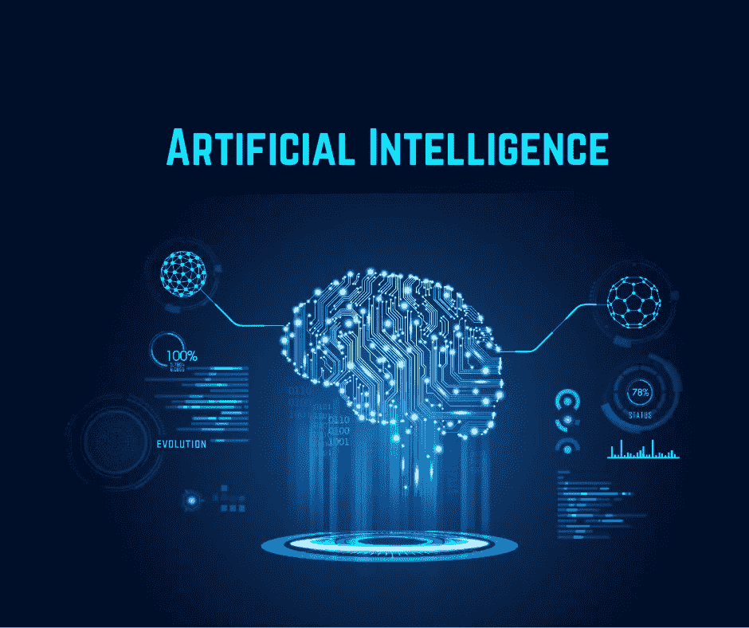

# 人工智能可能吗？

> 原文：<https://medium.com/quick-code/is-artificial-intelligence-possible-2ecfff5324c2?source=collection_archive---------0----------------------->

Artificial Intelligence

[“人工智能](https://www.mytectra.com/artificial-intelligence-training-in-bangalore.html)从上世纪 70 年代就已经脑死亡了。”世界著名的麻省理工学院人工智能实验室的联合创始人马文·明斯基发表的这一颇为炫耀的言论指的是这样一个事实，即研究人员主要关注机器智能的小方面，而不是从整体上看待问题。这篇文章考察了人工智能(AI)的当代问题，着眼于人工智能领域的现状以及领先专家提供的有力论据，以说明人工智能是否是一个不可能获得的概念。

由于范围和雄心，人工智能挑战简单的定义。最初，人工智能被定义为“让机器做一些如果由人来做则需要智能的事情的科学”。这个有点无意义的定义表明人工智能仍然是一个年轻的学科，类似的早期定义已经被该学科的技术和理论进步所塑造。因此，就目前而言，美国人工智能协会(AAAI)做出了一个说明人工智能领域未来挑战的良好通用定义，阐明人工智能是“对思想和智能行为及其在机器中的体现的机制的科学理解”。

“人工智能”一词是由约翰·麦卡锡在 1956 年新罕布什尔州达特茅斯学院的一次会议上首次提出的，但机器智能的概念实际上要古老得多。在古希腊神话中，铁匠之神赫菲斯托斯被认为创造了塔罗斯，一个“牛头”青铜人，他为弥诺斯国王守卫克里特岛，在岛上巡逻，吓退冒名顶替者。同样，在 13 世纪，据说创造了会说话的机械头来吓唬入侵者，据说阿尔伯特大帝和罗杰·培根都是它的主人。然而，直到最近 50 年，人工智能才真正开始渗透到流行文化中。我们对“思维机器”的迷恋是显而易见的，但却被文学、电影和电视中的科幻内涵错误地扭曲了。

事实上，人工智能领域远没有创造出媒体上看到的有知觉的生物，但这并不意味着没有取得成功的进展。50 年来，人工智能一直是一个丰富的研究分支，许多著名的理论家都对该领域做出了贡献，但一位计算机先驱从一开始就分享了他的思想，并且仍然及时地进行了评估和论证，他就是英国数学家艾伦·图灵。20 世纪 50 年代，图灵发表了一篇名为《计算机器与智能》的论文，他在论文中提出了一个经验测试，该测试“在机器生成的对话与智能人的对话之间没有明显差异时”识别智能行为图灵测试测量了一个所谓的智能机器相对于人类的性能，可以说是目前最好的评估实验之一。图灵测试，也称为“模仿游戏”，是通过让一个知识渊博的人类询问者与另外两个参与者进行自然语言对话来进行的，一个是人类，另一个是完全通过文本消息进行通信的“智能”机器。如果法官不能可靠地识别哪个是哪个，就说机器通过了，因此是智能的。尽管该测试有许多合理的批评，如不能测试感知技能或手的灵活性，但机器能像人一样交谈，并能让人类仅通过交谈就主观评价它是人类智能的，这是一项伟大的成就。

许多理论家质疑图灵测试是证明人工智能的一种可接受的方法，Jefferson Lister 教授提出的一个论点是，“直到机器能够因为感受到的思想和情感而不是符号的偶然掉落而写一首十四行诗或创作一首协奏曲，我们才能同意机器等于大脑”。图灵回答说“我们没有办法知道除了我们自己之外的任何个体经历情感，因此我们应该接受这个测试。”然而，李斯特提出了一个有效的观点，发展了一种人工意识。自主的智能机器已经存在；他们可以相互学习、交流和教学，但创造一种人工直觉，一种意识，“是人工智能的圣杯。”当在人类大脑上模拟人工智能时，许多不合逻辑的悖论浮出水面，你开始看到大脑的复杂性是如何被低估的，以及为什么模拟它不像专家们在 20 世纪 50 年代认为的那样简单。人类的问题在于，他们不是算法生物；他们更喜欢使用启发式的捷径和对众所周知的情况进行类比。然而，这是一个心理暗示，“这并不是说人们比显式算法更聪明，而是说他们很马虎，但在大多数情况下做得很好。”

有史以来，意识现象已经引起了许多哲学家和科学家的注意，无数的论文和书籍已经出版。然而，没有其他的生物奇点如此抗拒科学证据，并“持续陷入基本的哲学和语义混乱中”在正常情况下，我们很容易确定其他人何时失去或恢复意识，只要我们避免描述它，这种现象就保持直观清晰。大多数计算机科学家认为，意识是一种进化的“附加物”,因此可以用算法建模。然而，许多最近的主张反对这一理论。英国数学物理学家罗杰·彭罗斯爵士认为，人类思维的理性过程不完全是算法的，因此超越了计算和斯图尔特·哈梅罗夫教授的提议，即意识是从神经元内细胞骨架微管内和周围的量子级事件的临界相干水平作为宏观量子状态出现的。虽然这些都是没有太多或没有经验证据的理论，但考虑它们中的每一个仍然是重要的，因为在我们能够复制它之前，我们理解人类的思维是至关重要的。

复制人类思维的另一个关键问题是如何在一个新的范式中整合各种意识过渡状态，如快速眼动睡眠、催眠、药物影响和一些精神病理学状态。如果这些状态由于其复杂性或在计算机中的不相关性而从设计中删除，那么应该指出的是，也许意识不能被人工模仿，因为这些改变的状态对于心智的功能具有生物物理意义。

如果意识不是算法的，那么它是如何被创造出来的？显然，我们不知道。对主观意识感兴趣的科学家研究神经病学和行为的客观事实，并对我们的神经系统如何处理和辨别刺激给予了新的启发。但是，尽管这种感觉机制对意识来说是必要的，但它无助于解开认知思维的秘密，因为我们可以感知事物并对它们做出反应，而无需意识到它们。这方面的一个主要例子是梦游。当梦游发生时(梦游包括大约 25%的儿童和 7%的成人)，许多受害者执行危险或愚蠢的任务，然而一些人执行复杂的、明显类似人类的任务，例如驾驶汽车。人们可能会争论梦游者是否真的是无意识的，但如果事实上，个体确实不知道或不记得他们梦游期间发生了什么，那么这也许就是认知思维的关键。梦游暗示了至少两种与人类意识缺失相关的普遍行为缺陷。首先是社交技能的不足。梦游者通常会忽略他们遇到的人，而且“发生的罕见互动是敷衍和笨拙的，甚至是暴力的。”梦游行为的另一个主要缺陷是语言学。大多数梦游者对语言刺激只有咕哝或单音节词的反应，或者根本没有反应。这两个明显的缺陷可能很严重。梦游者对原始语言的使用；具有指称意义但缺乏句法的简短、无语法的话语可能说明意识是一种社会适应，其他动物并不缺乏理解或感觉，但它们缺乏语言技能，因此不能反映它们的感觉并变得有自我意识。原则上，双螺旋 DNA 结构的共同发现者弗朗西斯·克里克相信这个假说。在他和詹姆斯·沃森解决了遗传的机制后，克里克转向了神经科学，并用他的余生试图回答最大的生物学问题；意识是什么？他与克里斯托夫·科赫密切合作，在《伦敦皇家学会哲学汇刊》上发表了他的最后一篇论文，他在论文中提出，大脑中一个模糊的部分——克劳斯特鲁姆——的作用就像一个管弦乐队的指挥——将视觉、嗅觉、躯体感觉与杏仁核和其他神经元处理“结合”在一起，以实现思想和情感的统一。所有的哺乳动物都有一个 claustrum，这意味着其他动物也有可能有高智商。

那么，动物的思维与我们相比有多大的不同呢？他们的思维可以用算法模拟吗？许多科学家不愿意讨论动物的智力，因为它不是一个可观察的属性，没有任何东西是没有理由可以感知的，因此在这个问题上没有太多发表的研究。但是，通过避免将某些人类精神状态与其他动物进行比较，我们正在阻碍可能揭示认知思维秘密的比较方法的使用。然而，灵长类动物和鲸类动物被一些人认为是极其聪明的生物，仅次于人类。它们在动物王国的崇高地位导致它们参与了几乎所有发表的与动物智力有关的实验。这些实验再加上对灵长类动物和鲸类动物大脑结构的分析，必然会导致许多关于高等智力发展为一种特征的理论。虽然这些理论看似合理，但对于非人类研究在多大程度上可以用来推断人类智力的结构，还存在一些争议。

通过许多比较智力的物理方法，例如测量大脑大小与身体大小的比例，鲸类动物超过了非人类的灵长类动物，甚至是人类的对手。例如，“海豚的大脑皮层比人大 40%。他们的大脑皮层也和人类一样分层。海豚的额叶也发育到与人类相当的水平。此外，海豚的顶叶比人类的顶叶和额叶加起来还要大。相似之处不止于此；大多数鲸目动物都有大而发育良好的颞叶，其中包含相当于人类布罗卡区和韦尼克区的部分。

海豚表现出复杂的行为；它们有社会等级，它们表现出学习复杂技巧的能力，当在海底寻找食物时，有人看到一些海豚撕下一块海绵，裹在它们的“宽吻海豚”上，以防止擦伤；说明了另一个被认为仅限于类人猿的复杂认知过程，它们显然通过发出两种截然不同的声音信号进行交流，我们称之为口哨声和咔哒声，最后，海豚并不纯粹出于生殖目的使用性。一些海豚被记录有同性性行为，这表明它们一定有一些意识。海豚的大脑结构与人类不同，也许可以用算法模拟。他们不同的大脑结构和智力的一个例子是他们的睡眠技巧。虽然大多数哺乳动物和鸟类都有快速快速眼动(快速动眼期)睡眠的迹象，但爬行动物和冷血动物却没有。快速眼动睡眠刺激用于学习的大脑区域，通常与做梦有关。冷血动物没有快速眼动睡眠的事实足以证明它们没有意识，因此它们的大脑肯定可以被模仿。此外，温血生物表现出快速眼动睡眠的迹象，因此会做梦，因此必须有一些环境意识。然而，海豚的睡眠是单半球的，它们是“有意识的”呼吸者，如果睡着了，它们可能会淹死。进化通过每次让大脑的一半睡眠解决了这个问题。当海豚利用这种技术时，它们缺乏快速眼动睡眠，因此智力很高，也许意识可能不包含前面提到的过渡状态。

动物意识的证据是间接的。但大爆炸、中微子或人类进化的证据也是如此。在任何情况下，这种不寻常的断言必须经过严格的科学程序，才能被接受为甚至是模糊的可能性。耐人寻味，但需要更多的证据。然而，仅仅因为我们不理解某事并不意味着它是错误的——或者不是。研究其他动物的思维是一种有用的比较方法，甚至可能导致人工智能的创造(不包括人工实体的无关过渡状态)，其基础是一个不像我们自己的模型那样复杂的模型。尽管如此，被说明的中心点是我们对人类大脑或任何其他大脑的理解是多么无知，以及有一天一个具体的理论会如何由于启发性的发现而改变。

此外，1847 年发生了一个类似的事件，说明了这一论点。当时，一名爱尔兰工人菲尼亚斯·凯奇(Phineas Cage)在一次岩石爆破事故中用一根铁棒穿过了他的大脑前区，这给神经科学领域带来了新的曙光。奇迹般地，他在事故中幸存了下来，但更令当时科学界震惊的是，在道路刺穿他的大脑后，凯奇的性格发生了显著变化。根据波士顿医生哈洛在 1868 年的说法，凯奇以前的特点是性情温和，现在变得咄咄逼人，粗鲁无礼，“沉溺于最粗俗的亵渎行为，这不是他以前的习惯，表现出对同伴的尊重，当约束或建议与他的愿望冲突时，他不耐烦”。然而，凯奇的智力和记忆没有受到损害。

菲尼亚斯·凯奇事件的意外发现证明了大脑的结构在建筑上是多么的坚固，相比之下，计算机是多么的僵硬。如果一根铁棒刺穿了所有的机械系统和算法，它们就会停止正确或完全地运行，但人工神经系统及其分布式并行结构除外。在过去十年中，由于人工神经系统的前景看好，人工智能已经开始复兴。

人工神经系统或简单的神经网络是基于人脑的逻辑关联建模的，它们基于积累数据或“知识”的数学模型，基于管理员设置的参数。一旦网络被“训练”识别这些参数，它就可以做出评估，得出结论并采取行动。在 20 世纪 80 年代，神经网络与反向传播算法一起被广泛使用，该算法由 Paul John Werbos 在 1974 年首次描述。20 世纪 90 年代标志着人工智能许多领域的重大成就和各种应用的示范。最引人注目的是 1997 年，IBM 的深蓝超级计算机击败了国际象棋世界冠军加里·卡斯帕罗夫。赛后，卡斯帕罗夫被引述说，电脑发挥“像上帝一样。”

那场国际象棋比赛及其所有的影响提出了关于神经网络的深刻问题。许多人认为这是真正的人工智能最终实现的证据。毕竟“一个人在斗智游戏中被电脑打败了。”但是给计算机编程来解决象棋中的复杂数学问题是一回事。对计算机来说，自己进行逻辑推理和决策完全是另一回事。

使用神经网络来模拟大脑功能提供了许多积极的特性，包括并行功能、相对快速地实现复杂任务、分布式信息、由于网络损坏而导致的微弱计算变化(Phineas Cage)以及学习能力，即适应环境变化和基于经验的改进。神经网络的这些有益特性激发了许多科学家提出将它们作为大多数问题的解决方案，因此通过足够大的网络和足够的训练，网络可以完成许多任意任务，而不需要知道问题的详细数学算法。目前，神经网络的非凡能力由本田的 Asimo 人形机器人的能力得到了最好的证明，该机器人不仅能走路和跳舞，甚至能骑自行车。Asimo 是创新机动性高级步骤的首字母缩写，有 16 个柔性关节，需要一台四处理器计算机来控制其运动和平衡。它非凡的类似人类的机动性之所以成为可能，是因为连接到机器人运动和位置传感器并控制其“肌肉”致动器的神经网络能够被“教会”做特定的活动。

这种机器人运动控制的意义在于，程序员实际上不可能为行走或骑自行车创建一套详细的指令，这些指令可以构建到控制程序中。神经网络的学习能力克服了精确定义这些指令的需要。然而，尽管神经网络的性能令人印象深刻，但 Asimo 仍然无法独立思考，其行为仍然牢牢地固定在智能光谱的低端，如反应和调节。

神经网络正慢慢进入商业世界。最近，西门子推出了一种新的火灾探测器，它使用许多不同的传感器和一个神经网络来确定传感器读数的组合是来自火灾还是只是正常室内环境的一部分，如灰尘。超过 50%的火警呼叫是错误的，其中超过一半是由于火灾探测器是由日常活动而不是实际火灾触发的，因此这显然是该范例的有益使用。

但是神经网络的能力有限制吗，或者它们将是创造强人工智能的解决方案吗？人工神经网络受到生物学的启发，但这并不意味着它们在生物学上一定是合理的。许多科学家发表了他们对使用神经网络的内在局限性的想法；1969 年，Minsky 和 Papert 所著的《感知机》一书在计算机科学家群体中受到高度关注。感知器使神经网络的局限性变得清晰，尽管许多科学家意识到不复杂的感知器对模式进行分类的能力有限，Minsky 和 Papert 发现“神经网络有什么好处？”说明了是什么阻碍了神经网络的未来发展。在其时期内，感知器非常具有建设性，其可识别的内容为后来的研究提供了动力，克服了限制模型的一些描述的计算问题。一个例子是异或问题。异或问题包含四种模式，每种模式有两个输入；如果任一输入位为 on，但不是两个都为 on，则模式是集合的正成员。因此，将输入模式改变一位会改变模式的分类。这是线性不可分问题的最简单的例子。使用线性阈值函数的感知器需要一层内部单元来解决这个问题，并且由于输入和内部单元之间的连接不能被训练，感知器不能学习这种分类。最终，通过合并额外的“隐藏”层解决了这一限制。尽管神经网络研究的进展已经解决了 Minsky 和 Papert 所确定的许多限制，但是仍然存在许多限制，例如当面对线性不可分的问题时，使用线性阈值单元的网络仍然违反有限的顺序约束。此外，随着问题空间大小的增加，权重的缩放仍然是一个问题。

很明显，Minsky，Papert 和许多其他计算机科学家传播的关于神经网络的不屑一顾的观点有一些证据支持，但仍然有许多研究人员忽视了他们的说法，并拒绝放弃这个受生物学启发的系统。

人工神经网络最近取得了一些进展，通过将其他专业理论集成到多层结构中，试图改善系统方法，并向创建强人工智能迈进一步。一个有希望的领域是模糊逻辑的集成。由洛特菲·扎德教授发明。其他令人钦佩的算法思想包括量子启发神经网络(QUINNs)和 S.L.Thaler 提出的“网络空化”

人工智能的历史充满了理论和失败的尝试。这门学科不可避免地会随着技术和科学发现而进步，但是它们会到达最后的障碍吗？

*最初发表于*[T5【www.mytectra.com】](https://www.mytectra.com/blog/artificial-intelligence-possible/)*。*