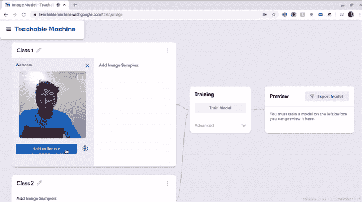
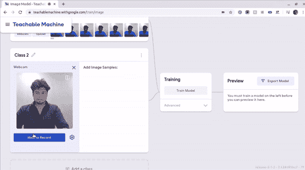
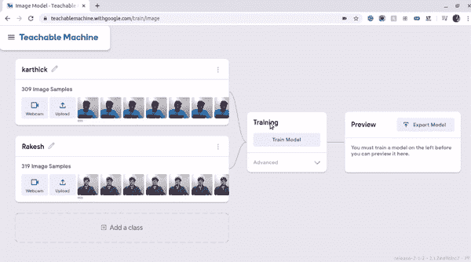
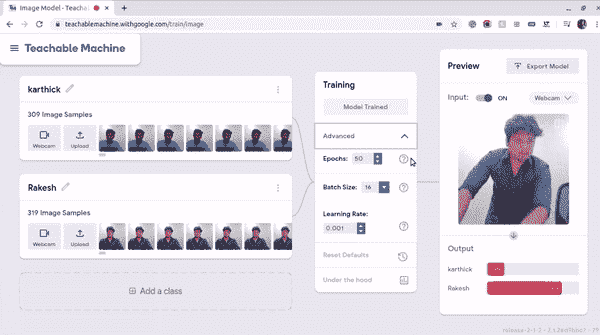
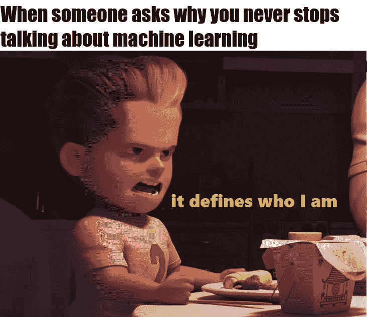

# 有没有可能不用代码就能进行人脸识别？

> 原文：<https://medium.com/quick-code/is-it-possible-to-make-face-recognition-without-code-7a1bea198f61?source=collection_archive---------0----------------------->

## 是的，可教机器让 AI 对每个人来说都更容易！

**Image source from** [**www.spritle.com**](https://www.spritle.com/blogs/2020/06/30/machine-learning-with-zero-line-of-code/)

嗨！各位，这是另一种简单的机器学习方法。这次[可教的机器。](https://teachablemachine.withgoogle.com/)相对于其他东西来说是非常酷非常特别的一个。

> 现在，每个人都想尝试机器学习！但是大多数人认为只有程序员才能做机器学习。
> 
> 因为他们认为他们不知道算法和代码等等…这里我想出了最简单的方法来开始机器学习。
> 
> 不分职业，大家都可以试一试！

你觉得呢？有没有可能不用一行代码就能让机器学习？**是的，我们可以**。甚至我们在训练一个模型的时候也不需要准备任何数据集。这个过程同样适用于对象检测和人脸识别。在这里，我将向你展示如何不用一行代码就能进行人脸识别。

# 什么是可教机器？

嗨！这里的每个人都是机器学习的另一种简单方法。这次[可教机。](https://teachablemachine.withgoogle.com/)相对于其他东西来说，它是一个很酷很特别的东西。

这是一个基于网络的工具，使创建机器学习模型变得快速、简单，并且每个人都可以访问。不用一行代码和数据集，我们就可以进行机器学习。我已经玩过这个东西了，这里我就来分享一下我的经验。

> 可示教机器有两个版本

*   [可示教机器 1.0](https://teachablemachine.withgoogle.com/v1/)
*   [可示教机器 2.0](http://teachablemachine.withgoogle.com/)

可教机器让任何人教他们的计算机使用网络摄像头识别图像。让您只需点击一个按钮即可训练您的机器学习模型，无需编码，并将其导出到网站、应用程序和物理机器。**可教机器**还能识别**声音**和**姿势**，比如你是站着还是坐着。

# 怎么用？

它的过程简单明了，对所有级别的程序员开放。他们已经在主页上提供了一个演示。所以，我们没有那么多混乱可以用。首先，只需打开浏览器，导航至[http://teachablemachine.withgoogle.com/](http://teachablemachine.withgoogle.com/)→开始。现在你可以看到 3 个选项，

1.  **图像项目**→基于文件或网络摄像头中的图像进行教学。
2.  **音频项目** →根据来自文件或麦克风的一秒钟长的声音进行教学。
3.  **Pose Project**→根据文件或网络摄像头中的图像进行教学。

我们需要选择与**人脸识别**和**物体检测**相关的**图像项目**。

还有一件更重要的事情是，我们需要允许这个网站的**网络摄像头**。这对于准备数据集和测试您的训练模型非常有帮助。

# 如何准备数据集？

我们不需要为您的培训模型准备数据集，只需点击一个按钮即可获得数据集。您可以看到一个名为**的按钮，按住它进行录制。**如果您点击按钮，它将拍摄您的面部图像或网络摄像头前面显示的任何图像。您可以长按以拍摄连续图像。

根据下图，我们可以很容易地获得训练模型的数据集

Dataset for Person 1

Dataset for Person 1

一旦你从网络摄像头获得图像，你就可以更改类名，比如 **Karthick** 我的和 **Rakesh** 我的朋友

就是这样。我们已经成功地为训练模型准备了数据集。

# 如何训练自己的定制模型？

这里我使用了两个类**。**现在我们准备训练我们的定制模型。在**训练**部分，我们可以看到一个叫做训练的按钮。一旦你点击**训练**，训练过程就会开始。

几分钟后，您的训练模型将准备就绪，训练时间将取决于您的数据集。

Train a model

# 测试您的预训练模型

完成培训部分后，我们可以开始测试已培训的模型。一旦您训练了您的定制模型，它就自动准备好测试您训练的模型了！

我的意思是，你的网络摄像头会自动打开，它会检测你的脸，并与训练好的模型相匹配。

# 如何使用你训练好的模型？

您创建的模型由 Tensorflow.js 提供支持，这是一个来自 Google 的用于机器学习的开源库。您可以导出它以在网站、应用程序等上使用。你也可以将你的项目保存到 Google Drive，这样你就可以从你离开的地方重新开始。

> 感谢您花时间阅读我的帖子！

~ Karthick Nagarajan

***原载于***[**www.spritle.com**](https://www.spritle.com/blogs/2020/06/30/machine-learning-with-zero-line-of-code/)