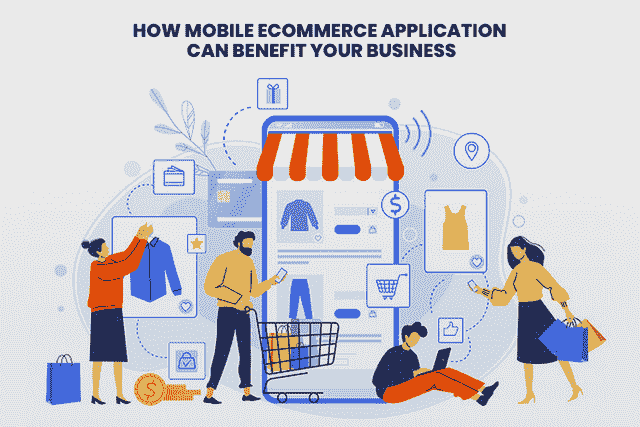
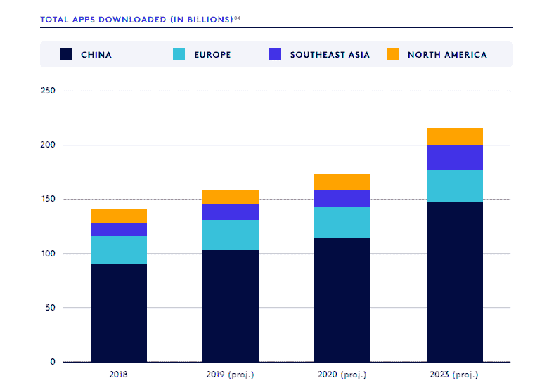
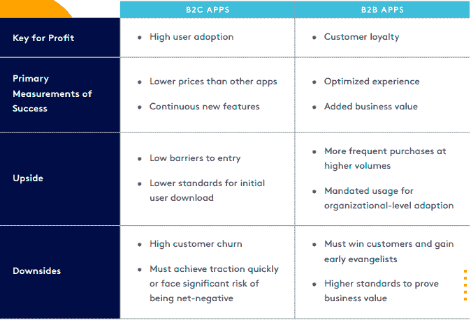
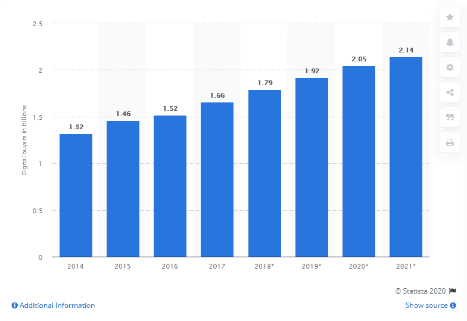
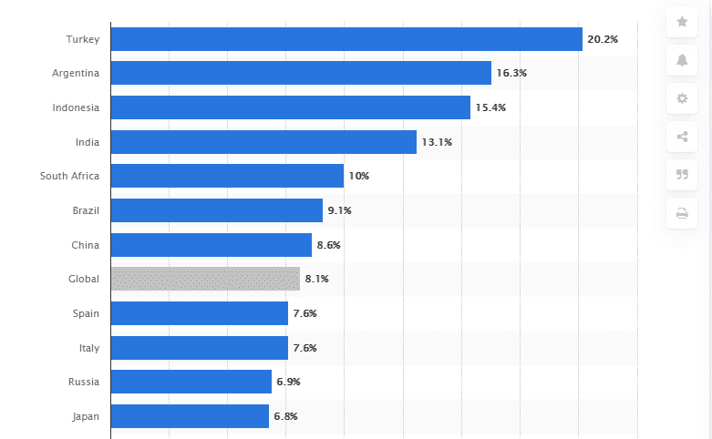
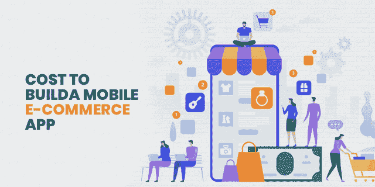

# 投资移动电子商务应用是否值得:收益与挑战

> 原文：<https://medium.com/quick-code/is-it-worth-to-invest-in-mobile-e-commerce-application-benefits-and-challenges-3bc2d869864e?source=collection_archive---------0----------------------->

不可否认的事实是，移动应用程序开发技术已经彻底改变了我们生活和处理业务的方式。随着移动应用程序的发展趋势及其越来越受欢迎，为您的企业开发一个电子商务移动应用程序已成为一个小时的迫切需要。

90%的移动时间花费在移动应用上，每月使用大约 30 个移动应用，可以肯定地说，消费者的行为在过去几年已经发生了巨大的变化。此外，移动应用不仅让一切触手可及，还通过集成语音搜索命令让一切变得更加简单。要购买任何东西，从购物杂货到衣服，从预订电影到机票，你需要的只是移动应用程序。事实上，随着此类技术在执行各种任务中的使用迅速增加，预计到 2021 年，移动商务将占全球电子商务市场份额的 [73%。](https://www.statista.com/statistics/806336/mobile-retail-commerce-share-worldwide/)

然而，如果你仍然相信投资电子商务移动应用程序只是你企业的财务负担，那么你需要首先了解电子商务移动应用程序的概念及其为什么企业需要电子商务移动应用程序的原因？

> **让我们进入本帖的深层:**

# 什么是电子商务移动应用？

电子商务移动应用程序是所有规模企业的潜在平台，使他们能够推广、销售和购买产品，并让他们与新客户建立联系。由于它极大地方便了购物，因此，越来越多的人通过手机应用程序进行在线购物。

然而，在你决定建立一个电子商务移动应用程序之前，有必要了解常用的令人信服的电子商务应用程序模型，如下所述:

*   **企业对企业(B2B)** 移动电子商务应用旨在向企业销售产品和服务。这种互动是在移动应用程序的帮助下在两家公司之间进行的，这为你创造了一个通过 B2B 应用程序赚取潜在收入的大好机会。

**例如:**如果你制造并想推广你的产品或服务范围，那么 B2B 应用可以为你提供一个平台，向那些对你的服务感兴趣的企业推销。

此外，对 B2B 应用不断增长的需求预计将推动市场到 2023 年达到 1400 亿美元，预计 2020 年 70%的 B2B 查询将是智能手机。

[Image Source](https://global-uploads.webflow.com/5c741219fd0819aad790e78b/5e457bf7b17c5789eee5b69c_b2b-mobile-app-market-report-2020-bugsnag.pdf)

*   **企业对客户(B2C)** 是最受欢迎的应用模式之一，因为它有助于在某些公司(如亚马逊、易贝、Flipkart 等在线商店)和愿意进行最终购买的最终客户之间进行互动。此外，大多数企业选择这种类型的应用程序模式，因为它使您能够直接向最终客户销售产品和服务，添加各种产品，并在此门户上集成无限的在线商店。

[Image Source](https://global-uploads.webflow.com/5c741219fd0819aad790e78b/5e457bf7b17c5789eee5b69c_b2b-mobile-app-market-report-2020-bugsnag.pdf)

# **用统计数据和事实来理解拥有电子商务移动应用的重要性**

在你决定采用哪种电子商务移动应用模式之前，分析市场以获得最佳投资回报是很重要的。此外，了解电子商务市场的现状不仅对在线企业主很重要，对仍以店内为基础的企业也很重要。

> **让我们来看看电子商务统计的现状，以了解世界电子商务如何继续以稳定的速度发展。**

*   根据 Statista 的报告，全球数字买家的数量将从 13.2 亿跃升至 2021 年的 21.4 亿。

[Image Source](https://www.statista.com/statistics/251666/number-of-digital-buyers-worldwide/)

*   根据最新的市场报告，电子商务市场的收入预计将在 2020 年达到 24.11638 亿美元。到 2024 年，电子商务市场的用户数量预计将达到 46.58 亿。
*   在 2020 年至 2024 年期间，受诸多因素的影响，包括更便宜的智能手机、互联网订阅计划、不断增长的消费能力等，土耳其、阿根廷、印度尼西亚和印度预计将成为零售电子商务销售额最高的国家，CAGR 预测分别为 20.2%、16.3%、15.4%和 13.1%。

[Image Source](https://www.statista.com/statistics/220177/b2c-e-commerce-sales-cagr-forecast-for-selected-countries/)

*   根据调查报告，[到 2040 年，95%的零售](https://www.nasdaq.com/articles/uk-online-shopping-and-e-commerce-statistics-2017-2017-03-14)将发生在网上，并对零售经济产生巨大价值。

**简而言之:**希望通过这些统计数据和事实，你已经理解了 2021 年对 [**电子商务移动应用开发解决方案**](https://www.xicom.biz/industries/retail/) 日益增长的需求。此外，上述数字和调查报告清楚地表明，与网上商店相比，实体店的受欢迎程度正在下降。

> 那么，现在让我们假设你准备雇用一名移动应用程序开发人员，但你可能仍然在挠头，你会从电子商务移动应用程序中得到什么？

**下面我们来找答案……**

# **您的企业将从电子商务移动应用程序中获得什么？**

如果你看看过去几年的市场趋势，你会发现一个不可否认的事实，移动应用程序已经给市场带来了巨大的变化。人们手里拿着商品清单去当地商店的日子已经一去不复返了，因为移动电子商务应用程序已经接管了那些当地商店，只需轻轻一点就可以订购商品。

> 除此之外，以下是你需要投资电子商务移动应用开发的原因？

## **1。移动应用是购物的首选**

不可否认的事实是，使用手机应用远比浏览网站容易。因为现在每个人都使用手机，这使得客户只需下载电子商务移动应用程序就可以很容易地访问在线购物商店。

事实上， [75%的 app](https://fortune.com/2016/05/19/app-economy/)下载后使用一次。原因是用户不需要记住复杂的网址，也不需要每次访问你的网站都要登录。此外，浏览应用程序的速度远远快于浏览电子商务网站。更快的应用程序加载时间总能提供更好的用户体验，让您的客户获得满意的购物体验。

## **2。全天候可访问性可以提高客户参与度**

随着每个业务领域的竞争日益激烈，移动应用程序可以帮助您全天候与客户保持联系。研究显示，全球大多数消费者 90%的时间都花在手机和应用程序上。因此，拥有您的电子商务移动应用程序不仅能帮助您拓展业务，还能确保您对客户的全天候可用性，最终提高与客户的互动。

## **3。增加服务的透明度**

网站被认为是你品牌的代言人的日子已经一去不复返了。如今，随着移动应用程序的使用越来越多，这些应用程序已经开始在互联网上充当你的业务的展示面。电子商务移动应用程序提供的透明性在许多方面为客户提供了一个很好的缓解点。

## **4。巨大的收入来源**

无论你选择在 2021 年开发哪种移动应用模式，移动电子商务应用都可以成为唯一的额外收入来源。由于电子商务移动应用程序只需轻轻一点就能提供广泛的产品和服务选择，因此客户会发现在您的电子商店购物要容易得多。

## **5。提高客户忠诚度**

当客户访问网站时，他们通常会查看公司的业务详情。但是，当一个客户下载了你的 app，就意味着一个客户已经对你的产品和服务感兴趣了。所以你需要做的就是采取正确的忠诚度计划，把你的访客变成潜在客户。64%的零售商表示，他们的忠诚度/奖励计划是联系消费者的最佳方式。

## **6。提供新的营销机会**

你可能提供世界一流的服务和产品线，但如果它没有买家呢？这就是一家知名的 [**移动应用开发公司**](https://www.xicom.biz/offerings/mobile-app-development/) 可以帮助你建立一个完美的电子商店的地方，它不仅能让你与新客户建立联系，还能提升你的品牌。此外，仔细监测和分析你的应用程序的流量，你可以很容易地优化消费者的行为，并能够确定他们何时不太可能购买你的产品。

## **7。与客户建立牢固的关系**

这是一个很有挑战性的网站。当然，你可以通过电子邮件让你的客户了解你的新产品或季节性销售，但这种渠道缺乏与用户建立强有力的联系，因为移动应用程序可以通过推送通知建立联系。

推送通知既能即时访问，又能不断提醒用户你的品牌。此外，这种提醒可以作为你的品牌和客户之间的个人沟通工具，当购物者在适当的时候收到应用程序提醒时，它会自动引起他们的注意。

> **简而言之:**毫无疑问，电子商务移动应用程序可以帮助您将业务拓展到下一个层次，并使您能够接触到广泛的客户。有各种各样的移动应用程序开发公司可以帮助你为你的企业建立一个高功能和高效率的应用程序。然而，现在的问题是，是什么让这些应用变得非常有用、吸引人和有影响力？

# **在 2021 年，有哪些共同特征会让电子商务变得非常吃香？**

亚马逊、Flipkart、易贝等电子商务应用已经成为行业的大鲨鱼。这不仅仅是因为它们提供了通过智能手机购买所需产品的极大舒适度，而且这些应用程序集成了大量功能，使其成为 2021 年购物的绝佳选择。

> **让我们来看看电子商务应用的必备功能:**

*   **购物车**，买家无需离开购物页面，只需轻轻一点，即可同时购买多件商品。你需要做的就是确保你的应用程序构建得非常漂亮，并允许客户访问这些功能，而不会面临任何复杂性。
*   **推送通知**在通过应用吸引顾客并鼓励他们在合适的时间购物方面发挥着至关重要的作用。通过利用这一功能，您可以通知您的用户有关销售、新产品和优惠的信息，以帮助他们关注您的应用程序。
*   **电子商务应用的社交整合**将帮助客户在他们的社交媒体账户之间轻松分享评论和产品，并提高您的品牌在其他平台上的知名度。
*   **产品目录**对 app 流量有很大影响。高质量的产品和丰富的商品选择可以让你的用户更长时间地使用你的应用程序，并可能提供最佳的购物体验。
*   **搜索过滤器**使用户能够在短时间内对所需商品进行分类，并允许用户购买他们正在寻找的商品。
*   **订单历史**可以帮助用户跟踪他们过去订购的产品，并允许他们从历史中重新订购产品，而无需再次浏览庞大的目录。
*   **多种支付方式**使客户能够通过信用卡、借记卡、PayPal 等方式进行支付。

# **电子商务移动应用的一些附加功能**

## **-基于人工智能的聊天机器人和语音助手**

人工智能聊天机器人和语音助手的出现可以通过提供 24*7 客户支持和使用语音命令搜索应用程序上任何内容的特权，将您的用户体验提升到一个新的水平。你可以 [**雇佣手机应用开发者**](https://www.xicom.biz/offerings/hire-mobile-developers/) 来构建这个功能，为用户在网上购买任何产品时提供高度互动的指导。

## **-增强现实(AR)的出现**

网上购物者最关心的是购买后你穿什么样的产品。但是随着 AR 技术的集成，你可以虚拟地尝试珠宝、壁纸、眼镜、美容产品等产品。这项技术实际上创建了不同产品的 3D 渲染图像，为您带来真实的购物体验。如果你觉得理解起来很复杂，那么最好把这个任务留给软件开发公司。

## **- 24 小时送货和退货政策**

这是你可以赢得买家信任的地方，如果他们不喜欢产品，你可以确保他们得到全额退款。通过简单的订单替换、即时支付、便捷的订单退货，用户可以放心大胆地从你的应用程序购买任何产品。

# **2021 年开发一个电子商务移动应用需要多少成本？**

> 最后一点，开发一个电子商务移动应用程序需要多少成本？我敢肯定，在确定了使用电子商务移动应用程序的所有市场统计数据、功能和优势之后，你一定很想知道应用程序开发的成本。

这个问题没有简单的答案，但平均来说，开发一个功能丰富的移动商务应用程序的起始价格可以在 15，000 美元到 25，000 美元之间，根据您的应用程序开发需求、功能、应用程序的复杂性、移动应用程序开发团队的选择、他们的位置和操作平台的选择，它可以是任何昂贵的价格。

# **结论**

如果你是一名零售商，仍然与实体零售店合作，并正在考虑迁移到数字平台，那么电子商务移动应用程序可能是你克服市场挑战的最终解决方案。你在移动应用上的存在不仅能帮助你与用户即时联系，还能让你发现新的商业机会，帮助你将业务拓展到下一个层次。

我在这篇博客中总结了一切，帮助你理解为什么你需要一个电子商务移动应用程序，什么功能可以使它成功，以及开发它需要多少成本。尽管如此，如果你有疑问，那么还是值得雇佣一家 [**移动应用程序开发公司**](https://www.xicom.biz/offerings/mobile-app-development/) 来亲自讨论你的业务需求。