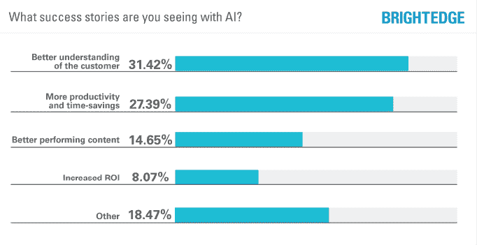

# 机器学习会接管 SEO 专业人士吗？

> 原文：<https://medium.com/globant/is-machine-learning-going-to-take-over-seo-professionals-32616439c49?source=collection_archive---------1----------------------->

*by* [*贾比尔·托马斯·德尔·里奥*](https://www.linkedin.com/in/jabir-tomas/) *&* [*曼努埃尔·安杜奎亚*](https://www.linkedin.com/in/manuelanduquia/)

在过去的几年中，搜索引擎一直在使用机器学习(ML)算法来提高它们对内容的理解以及它们向用户提供的结果。我们说搜索引擎是复数，因为随着不同应用和软件中搜索框的集成，像 Bing、Yahoo 或 DuckDuckGo 这样的引擎越来越受欢迎。所以你需要针对每一个方面优化你的网站。

请记住，关于机器学习和自动化的观点在 SEO 专业人士中存在分歧。一些人肯定机器学习的进步将逐步消除 SEO 的角色，而另一些人则相反，认为这是一个提高我们工作质量的机会。

那么，在这篇文章中，我们将解释为什么这些技术可以使你的工作更容易，并提高你的洞察力的质量。

# 为什么机器学习是 SEO 专业人士的盟友？

为了说明问题，我们需要了解一下谷歌的历史。2015 年，该引擎发布了一个新系统，以更好地理解名为 [RankBrain](https://moz.com/learn/seo/google-rankbrain) 的搜索查询的用户意图。

RankBrain 是一个系统，通过它谷歌可以更好地理解用户搜索查询的可能意图。其核心是从“字符串”到“事物”理解的更新，算法开始读取字符及其上下文，而不仅仅是看到代码中的文本字符串。

# 提前开始并保持领先

在营销和 SEO 中，我们一直在创建和分析数据，以了解用户行为和趋势，并确定最佳的行动方式。使用的数据量每周、每月、每年都呈指数级增长。如果你等着看客户怎么想，然后才准备好回应，那么你已经落后了。

这就是为什么人工智能(AI)必须被视为营销人员的盟友，特别是 SEO 角色。今天的人工智能和人工智能工具支持实时洞察，以个性化和优化内容，满足每个用户的个人需求。根据 Brightedge 的一项研究，在 31%的情况下，工具有助于更好地理解客户的需求，27%有助于提高生产率。

Future of Marketing and AI Survey (2018). [Brightedge](https://videos.brightedge.com/research-report/brightedge-2018-future-of-marketing-and-ai-survey.pdf)

考虑到平台正在使用人工智能和人工智能技术来增强其能力，是时候重新思考营销人员的角色了。有了这些技术，数据分析和预测等重复性任务可以实现自动化，让专业人员有更多时间来产生高价值和对业务有影响的高质量见解。

# 搜索和排名中的 ML:你能预测有机流量吗？

通常，SEO 角色的主要目标之一是基于相关关键字定义策略，帮助生成和定位优质内容。这通常是传统的和细致的使用工具来完成的，这些工具让我们看到如何用近似的搜索量、竞争/难度和 CPC 等来做关键词研究。

值得一提的是，集成了[商业智能](https://www.iberdrola.com/innovation/what-is-business-intelligence)和大数据的颠覆性技术生态系统为 [ML 在排名](https://www.searchenginejournal.com/organic-traffic-prediction-methods/311675/)中的预测能力增加了更多价值，因为数据湖可以提供关键词和搜索词的趋势和特定行为。可以对这些数据进行分析，以便在生成有助于有机定位的高质量和有价值的内容方面做出更好的决策。

但是，如果通过人工智能和人工智能，你可以随着时间的推移改善、自动化甚至预测某个特定关键词的排名，会怎么样呢？让我们看看 ML 今天为我们提供了哪些与关键字排名位置的估计或预测相关的内容。

预测有机交通的方法可能有很多，但让我们特别关注两种:

## **1。霍尔特-温特斯法**

[Holt-Winters](https://orangematter.solarwinds.com/2019/12/15/holt-winters-forecasting-simplified/#:~:text=What%20Is%20the%20Holt%2DWinters,cyclical%20repeating%20pattern%20(seasonality).) 是一个基于时间序列行为的模型。预测数据通常需要一个模型，Holt-Winters 是一种对时间序列的三个方面进行建模的方法:典型值(平均值)、随时间变化的斜率(趋势)和周期性重复模式(季节性)。

R 语言和 R Studio 是用统计方法处理 ML 的最流行的工具之一。也就是说，您可以使用 R 以及 Google Analytics 视图 id 和日期范围来获得您想要了解其预测的有机会话的数据。

## **2。使用搜索控制台的 CTR 方法**

[CTR 方法](https://www.beacondigitalmarketing.com/blog/improve-organic-ctr-using-google-search-console#:~:text=Go%20to%20Search%20Analytics%20in,on%20a%20variety%20of%20factors.)在预测未来 12 个月的关键词时采用了更短的分析方法。然而，它的优势在于能够根据额外的定制标准来定位特定的 URL。

我们将需要爬行软件，如 [OnCrawl](https://www.oncrawl.com/) 、 [SEMrush](https://www.semrush.com/) 或[搜索控制台](https://search.google.com/search-console/about)，可以连接到其他数据源和任何其他工具提供关键字数据。有了这个，我们就可以根据点击率高于或低于整个网站平均点击率的页面来创建正负投影。

# 结论

这些只是人工智能和人工智能工具如何改善营销领域中重复性任务和数据分析的几种方法。就 SEO 而言，考虑如何将这种技术与现有工具结合起来，以基于验证的关键字自动实现网站功能(如标题和描述)是一件有趣的事情。

或者，举例来说，既然关键词的 SEO 分析是一个基于数据的任务，为什么不编程和训练一个能够预测关键词对我们业务的价值的 ML 算法呢？

使用 ML 来预测可能的场景，例如印象或流量影响，以及内容规划，将有助于通过数据更好地做出决策

所有这些数据处理和任务自动化将是一个强大的工具，可以充分利用 SEO 输入及其结果的价值。不过，需要注意的是，没有上下文的数据也可能导致错误的决策。在这一点上，专家的观点对于释放这些技术的力量至关重要。