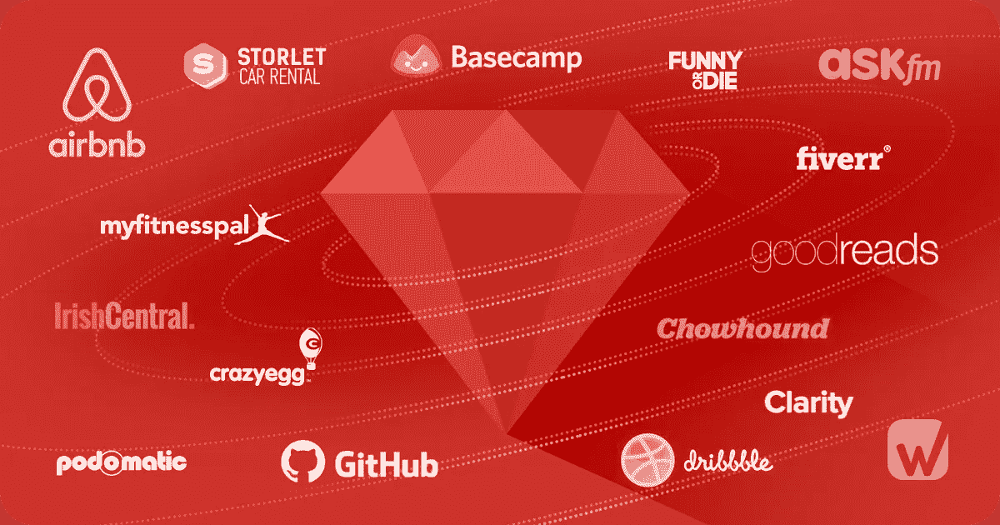

# 2020 年的 Ruby On Rails 还值得学习吗？

> 原文：<https://medium.com/quick-code/is-ruby-on-rails-still-worth-learning-in-2020-c82e180e9253?source=collection_archive---------2----------------------->

在这篇文章中，我想说的是 Ruby On Rails 在 2020 年仍然值得学习吗？

***Ruby on Rails*** 是在 *MIT lisense* 下用 Ruby 编写的 web 应用框架。Rails 基于 MVC(模型视图控制器)结构，为数据库和网页提供默认结构。

Ruby on rails 的首次发布是在 2005 年 12 月 13 日，在最初的几年里，它通过一些新特性极大地影响了 web 应用程序的开发，这些新特性包括无缝的数据库表创建，一个支持快速应用程序开发的视图支架。

***ROR 或******Ruby on Rails***是使用起来比较老的成熟技术，但在过去几年里，随着许多新技术接管这个领域，它一直面临着困难时期。有些人说 **Rails 已经死了**不值得学习，但在这里我们将看到为什么它在 2020 年值得学习。欲了解更多信息，请访问 [**Ruby On Rails 在线培训**](https://onlineitguru.com/ruby-on-rails-online-training-placement.html)

# ROR 在哪里表现最好

***Rails*** *已经成为镇上的热门话题，这是一种相当古老的语言。有几个原因使得 Rails 成为最好的，并且很难竞争。所以，我们会寻找这些原因。*

**更简单的业务逻辑执行:-** ROR 对于复杂的业务逻辑有一个简单快速的实现过程。例如，您最早需要应用程序的 API，这样您就可以询问开发人员。Rails 开发者可以非常快速地开发它。你必须把前端框架像 React 和 Vue，你就完成了。

巨大的宝石收藏:- Ruby 拥有由它的开发者创造的巨大的宝石收藏。它们充当了一座桥梁，填补了网络应用及其服务留下的空白。最棒的是，它们可以免费用于商业用途。而开发团队可能遗留下来的小事情，都可以在这些的帮助下清理掉。

Ruby collection 让开发人员更容易使用它。对于开发人员来说，这就像一个现成的宝石，当他们陷入开发一些功能时，他们可以用宝石对其进行分类。

有很多公司在他们的产品和应用中使用 Ruby on Rails，我们将在后面讨论。

# 快速开发过程

Rails 或 ROR 以其快速的开发过程而闻名。开发人员利用 Ruby on Rails 的快速特性来开发项目，用 Rails 创建项目非常容易。

 [## 为什么 Ruby on Rails 是 Web 应用开发的理想选择

### 如果今天没有您最喜爱的 web 应用程序，您会怎样？想象一下，你不再有能力使用相同的…

ruby-programminglanguage.blogspot.com](https://ruby-programminglanguage.blogspot.com/2019/12/why-ruby-on-rails-is-ideal-for-web-app.html) 

用 ROR 而不是 Stacks 创建一个项目在速度上有 40 到 45**的差别。通俗地说，如果一个开发者使用栈来开发一个项目，那么它将比 Rails 多花 40%的时间。**

# **使用 Ruby on Rails 开发的各种类型的应用程序**

****

**我们将提到 6 个用 ROR 开发的著名应用程序。这些广为人知，你可能每天都在使用。**

****Basecamp:-** 这是一种商业组织者，由 Ruby on Rails 的创始人 David Hansson 和他的团队成员策划。我们使用 Slack 和 Asana 等其他应用，它们是 Basecamp 的强劲竞争对手。最近，Basecamp 拥有*250 万*用户，是一个很好的替代 app，通过 ROR 开发。**

****Shopify:-** Shopify 是一个*电子商务平台*，给有潜力的创业者一个创业的平台。有了它，你就可以使用支付集成方法、管理内容、域名生成器以及你开展在线业务所需的一切。**超过 50 万**商家正在使用 Shopify 平台，它能够在 GMV 创造**400 亿**美元的收入。Shopify 是在 2 个月后通过 Ruby on Rails 开发并推出的。对于潜在的企业家来说，Shopify 是一个很好的创业资源，因为它提供了创业所需的一切。**

****Airbnb:-** Airbnb，Inc .是一个安排或提供住宿的在线市场，主要是寄宿家庭或旅游体验。使用 Airbnb 进行旅行住宿的人数正在迅速增加。它总共有 1.5 亿多用户，其中 50 万人用它来过夜。Airbnb 也是由 ruby on rails 创建的，是使用该框架的最好和最受欢迎的服务之一。**

> **要深入了解 Ruby，请注册参加 [**Ruby On Rails 课程**](https://onlineitguru.com/ruby-on-rails-online-training-placement.html) 的现场免费演示**

**几乎每个自由职业者都知道这个网站，但只有少数人知道它也是在 ruby on rails 上创建的。你可以获得服务或雇人，或者你也可以提供从 5 美元到 200 美元的服务。你可以得到各种类型的服务，从图形到标志到网页设计。它几乎涵盖了一切。它也是使用这个框架的流行服务之一。如果你是一个远程开发者，你也可以在我们的网站注册。**

**Github:- Github 是一个受欢迎的服务，有大约**2600 万人使用**。这是一个在 ruby on rails 上创建的应用程序，用于开发人员的错误跟踪、任务管理和其他功能。**

****彭博:-** 它是在 ruby on rails 上开发的，专门提供数据分析、交易服务和新闻。这些服务是彭博重要的创收服务。和其他服务一样，它也是一个使用这个框架的受欢迎的服务。**

**感谢阅读。在我的下一篇文章中，我将讨论 2020 年 ROR 的好处。**