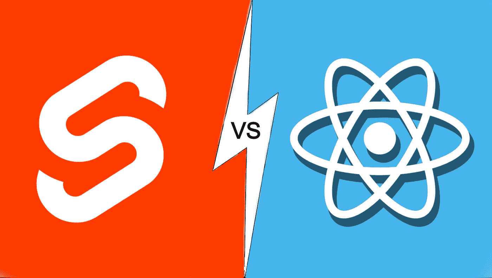

# 苗条比反应高吗？？

> 原文：<https://medium.com/globant/is-svelte-a-cut-above-react-aa1e4f76b170?source=collection_archive---------0----------------------->

Svelte VS React

你大概是在看标题，点头“再来一个框架？不会吧！!"我们已经有一场已经存在的战争了。为什么我还需要一个？

但是坚持住，在你离开之前。如果我告诉你这不是一个实际的框架，而是一个编译器。世界林业人员协会(Woodmen of the World)..真的吗？？😲

是的，那么什么是苗条呢？它和其他 JS 框架有什么不同？