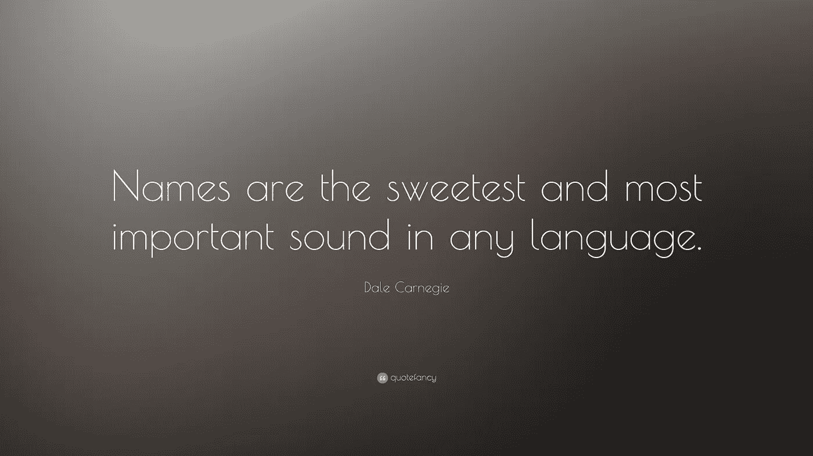
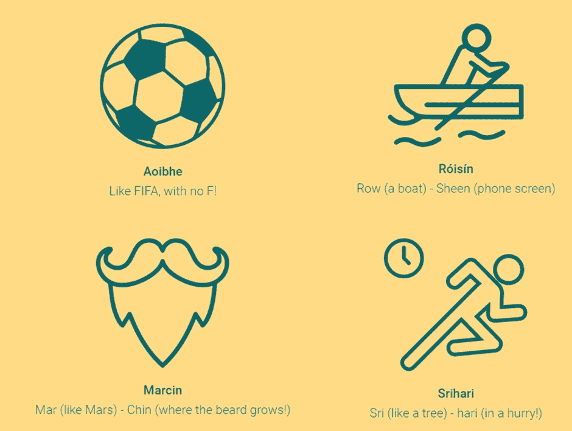

# 这一切都始于一个名字…

> 原文：<https://medium.com/version-1/it-all-starts-with-a-name-6ef0496e666a?source=collection_archive---------8----------------------->

克洛伊，花点时间想象一下我回到 2010 年代中期的样子。我是一个 23 岁的白人女性，身体健壮，面容清新，尽管来自北爱尔兰，但看起来和我走进的房间里被我包围的其他年轻白人女性一模一样。我即将迎来我在美国新工作的第一次市政厅会议。房间里大约有 200 人，各种年龄，性别，种族，民族，宗教，能力。

这一刻到来了。所有新员工都是由他们团队的一名资深成员介绍的，我和我的老板一起站了起来，被介绍为“请击鼓”,“Chloe Mc-something”紧接着是“嗯，我不会念你的姓，所以 Chloe Mc-something 也行”(暗示那个人笑了，暗示我尴尬)。

我的姓并不太难念，但在那一刻，我有一种强烈的羞耻感，我让这个人感到尴尬，他们不会念我的名字，好像这是我的错。但是现在，回顾那个时刻，作为“从名字开始”运动的一员，我意识到我的名字就是我的名字，它是我身份的一部分，不是由我来为它的发音道歉的。

但是，我们是否读错了某人的名字有什么关系呢？毕竟，大多数发音错误通常是无意的错误。

虽然这可能是真的，但组织心理学家和领导力专家乔伊斯·e·a·拉塞尔说:

*“一个人的名字是与他自己的身份和个性最大的联系。有些人可能会说，对那个人来说，这是世界上最重要的一个词……这是礼貌的表现……当有人在见过我们之后还记得我们的名字，我们会感到受到尊重，变得更加重要。”*

**简而言之，它有助于创造归属感。**

这是**版本 1 的 SWAN #StartsWithAName** 运动的前提。2019 年，版本 1 的多样性、包容性和归属感(DIBs)团队要求员工做一些简单的事情:将他们名字的语音发音放在他们的电子邮件签名上。2020 年，第 1 版的客户和合作伙伴非常感兴趣地看到我们的签名中有我们的名字，然后我们意识到是时候帮助天鹅飞行了！

[归属# starts with aname——天鹅运动——音乐视频——YouTube](https://www.youtube.com/watch?v=vz9V04Uu4BA)

你可能会想，问题出在哪里，或者成本是多少？不像现在世界上的大多数东西，这是完全免费注册的！为什么？因为我们已经看到了这个简单的手势对创造一种归属感和人与人之间的联系的影响。

创建一个包容性的工作场所始于了解你的同事和交往对象，而这通常始于了解他们的名字。当人们想到多样性、包容性和归属工作时，他们通常会将其与改变世界的重大举措联系起来；是的，那些引发系统性变革的计划是必要的，事实上，DIB 工作可以通过日常的、微小的和有意的行为来实现。我们相信，走向包容和归属感的旅程可以从我们的名字开始。

# **如果你想参与，我们只要求你做三件事:**

1.**确定一名或多名 SWAN 大使**——找到你自己的内部大使，帮助 SWAN 起飞，并确保员工“身体力行”。

2.接下来，我们欢迎您来到 [**签署**](https://www.startswithaname.net/startswithaname-sign-the-charter/) 包机，助力天鹅环球飞行。成为表明立场的组织和个人中的一员，确保你同事的名字发音正确，增加他们的归属感。

3.使用#StartsWithAName 标签将你的 **#SWAN 证书发布到社交媒体**上，以传播消息并提高对名字重要性的认识。

就这么简单。归属可以也应该从一个名字开始。

想了解更多，查看[天鹅网站](https://www.startswithaname.net/startswithaname-sign-the-charter/)。

**关于作者:**
克洛伊·吉拉德(Chloe Gillard)是第一版的多元化、包容性和归属感经理。